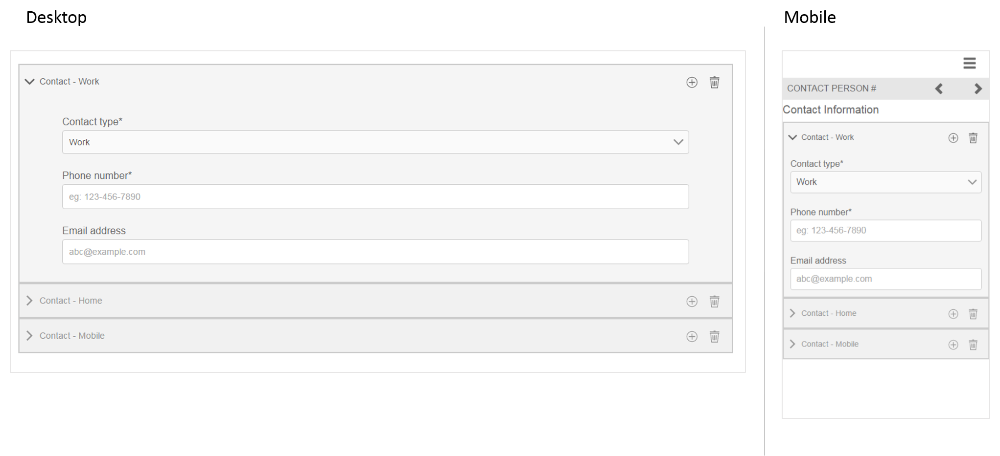

# 參考最適化表單片段 {#reference-adaptive-form-fragments}

[最適化表單片段](/help/forms/using/adaptive-form-fragments.md) ，是一組欄位，或是包含一組欄位的面板，當您建立表單時，可使用這些欄位。 它可讓您輕鬆快速地建立表格。 您可以使用側邊欄中的資產瀏覽器將最適化表單片段拖放至表單中，並可在表單編輯器中編輯。

針對最適化表單作者，AEM Forms套件 [AEM-FORMS.-6.3-REFERENCE-FRAGMENTS中提供參考片段](https://www.adobeaemcloud.com/content/marketplace/marketplaceProxy.html?packagePath=/content/companies/public/adobe/packages/cq630/fd/AEM-FORMS-6.3-REFERENCE-FRAGMENTS)。 它包含下列片段：

* 地址
* 連絡人資訊
* 信用卡資訊
* 當前就業
* 依存對象資訊
* 就業歷史
* 收入與支出
* 名稱
* 條款與條件
* 使用Scribble的條款與條件

當您安裝此套件時，會在「表單與檔案」下建立包含參考片段的「參考片段」檔案夾。 有關安裝軟體包的資訊，請 [參見How to Work With Packages](/help/sites-administering/package-manager.md)。

## 地址 {#address}

包含用於指定郵寄地址的欄位。 可用欄位包括街道地址、郵遞區號、城市、州和國家。 它也包含預先設定的Web服務，可填入指定美國郵遞區號的城市和州。

[按一下放大](assets/address.png)

## 連絡人資訊 {#contact-information}

包含擷取電話號碼和電子郵件地址的欄位。

[按一下放大](assets/contact-info-1.png)

## 信用卡資訊 {#credit-card-information}

包含欄位，以擷取可用於處理付款的信用卡資訊。

## 當前就業 {#current-employment}

包括用於獲取當前雇傭詳細資訊的欄位，如雇傭狀態、雇傭欄位、指定、組織和加入日期。

[按一下放大](assets/current-emp-1.png)

## 依存對象資訊 {#dependents-information}

包含欄位，以指定一或多個依存對象的相關資訊，例如其名稱、關係和年齡等表格格式。

[按一下放大](assets/dependents-info-1.png)

## 就業歷史 {#employment-history}

包含擷取就業歷史記錄的欄位。 它允許添加多個組織。

[按一下放大](assets/emp-history-1.png)

## 收入與支出 {#income-expenditure}

包含用於擷取每月現金流和費用的欄位。 需要使用者提供財務詳細資訊的表單可使用此片段擷取收入和支出。

[按一下放大](assets/income-1.png)

## 名稱 {#name}

包含欄位以指定標題、名字、中間名字和姓氏。

[按一下放大](assets/name-1.png)

## 條款與條件 {#terms-conditions}

指定使用者在提交表格前接受的條款與條件。

[按一下放大](assets/tnc-1.png)

## 使用Scribble的條款與條件 {#terms-conditions-with-scribble}

指定使用者在提交表單前接受和簽署的條款與條件。

[按一下放大](assets/tnc-scribble-1.png)