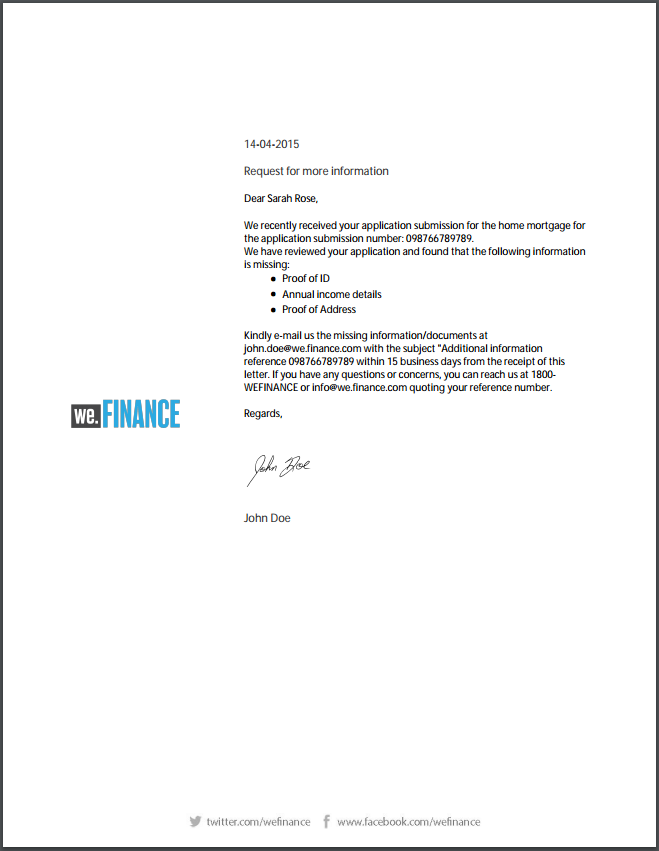

# 參考信函範本 {#reference-letter-templates}

>[!CAUTION]
>
>AEM 6.4已結束延伸支援，本檔案不再更新。 如需詳細資訊，請參閱 [技術支援期](https://helpx.adobe.com//tw/support/programs/eol-matrix.html). 尋找支援的版本 [此處](https://experienceleague.adobe.com/docs/).

在「通信管理」中，信函範本包含一般表單欄位、頁首和頁尾等版面功能，以及內容放置的空「目標區域」。

通信管理在AEM Forms套件中提供信函範本 [AEM Forms附加元件套件](https://experienceleague.adobe.com/docs/experience-manager-release-information/aem-release-updates/forms-updates/aem-forms-releases.html). 如需安裝套件，請參閱 [如何使用套件](/help/sites-administering/package-manager.md). 您可以根據品牌和業務需求在設計工具中自訂範本。 套件包含下列範本：

* Classic
* 經典簡單
* 平衡左
* 平衡右
* 視覺左側
* 視覺頂端
* Visual Top - Classic

安裝套件後，版面範本(XDP)會列在範本資料夾中的下列位置：

`https://[server]:[port]/[context-root]/aem/forms.html/content/dam/formsanddocuments/templates-folder`

以下是此包中所有模板中的常用欄位：

* 日期
* 致敬
* 結尾文字
* 簽名文本

安裝AEM-FORMS.-6.3-REFERENCE-LAYOUT-TEMPLATES套件後，範本會列在templates-folder中

## Classic {#classic}

Classic模板的頂部帶有徽標，適合用於普通專業信函。

PDF預覽使用傳統範本建立的信函

## 經典簡單 {#classic-simple}

包括用於捕獲電話號碼和電子郵件地址的欄位。 傳統簡單模板與傳統模板類似，只是它沒有可以輸入收件人地址的欄位。

PDF預覽使用傳統簡單範本建立的信函

## 平衡左 {#balanced-left}

「平衡左側」模板在字母左側包含徽標。

PDF預覽使用「平衡左」模板建立的信函

## 平衡右 {#balanced-right}

「平衡右側」模板左側有公司徽標，並為在信函本身輸入收件人地址提供了空間。 「平衡右側」範本也包含當信函有多頁時會重複顯示的頁尾。

PDF預覽使用「平衡右側」模板建立的信函

## 視覺左側 {#visual-left}

「可視化左側」模板的左側有一個側頭，側頭上放有公司徽標。 「可視左側」模板有主題欄位，但沒有頁尾。

PDF預覽使用「可視左側」模板建立的信函

## 視覺頂端 {#visual-top}

「視覺色頂端」範本的頂端有視覺色邊界。 「視覺頂端」範本有一個欄位，可在頁面本身輸入收件者的地址。 「視覺色頂端」範本有主旨欄位和頁尾，可針對延伸至多個頁面的信函重新傳送。

PDF預覽使用「視覺色頂端」範本建立的信函

## Visual Top - Classic {#visual-top-classic}

Visual Top - Classic範本的頁面頂端有標題，且有公司標誌。 Visual Top - Classic範本有一個欄位可輸入主題，但沒有頁尾。

PDF預覽使用「視覺色頂端 — 傳統版」範本建立的信函
