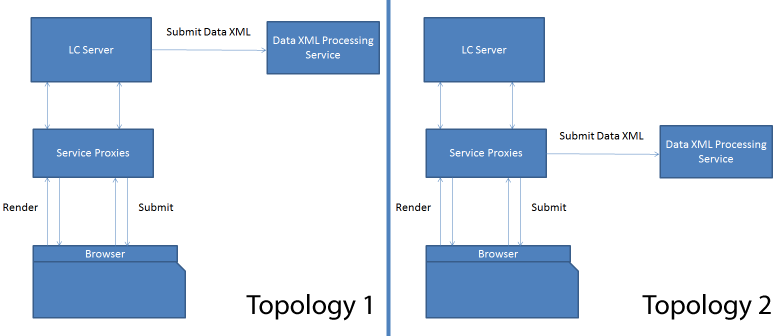

# HTML5 Forms服務代理 {#html-forms-service-proxy}

HTML5 Forms Service proxy是一種設定，可註冊提交服務的Proxy。 若要設定「服務代理」，請透過request參數submissionServiceProxy指定提交服務 *的URL*。

## 服務代理的優點 {#benefits-of-service-proxy-br}

服務代理消除了以下問題：

* HTML5表單工作流程需要為HTML5表單使用者開啟提交服務「/content/xfaforms/submission/default」。 它讓AEM伺服器面向更廣的非預期觀眾。
* 服務URL內嵌在表單的執行階段模型中。 無法變更服務URL路徑。
* 提交過程分為兩步。 若要提交表單資料，提交至少需要兩次伺服器歷程。 因此，會增加伺服器的負載。
* HTML5表格會在POST要求中傳送資料，而非PDF要求。 對於同時包含PDF和HTML5表單的工作流程，需要兩種不同的提交處理方法。

## 拓撲 {#topologies-br}

HTML5表格可使用下列拓撲來連線至AEM伺服器。

* AEM server或HTML5表單透過POST傳送資料至伺服器的拓撲。
* 代理伺服器向伺服器發送POST資料的拓撲。

HTML5表單服務代理拓撲

HTML5表格會連線至AEM伺服器，以執行伺服器端的指令碼、web-services和提交。 HTML5表單的XFA執行時期會使用「/bin/xfaforms/submitaction」端點上的Ajax呼叫，以及各種參數，以連線至AEM伺服器。 HTML5表格會連接AEM伺服器，以執行下列作業：

### 執行伺服器端指令碼和網站服務 {#execute-server-sided-scripts-and-web-services}

標籤為在伺服器上運行的指令碼稱為伺服器端指令碼。 下表列出伺服器端指令碼和網站服務中使用的所有參數。

<table> 
 <tbody> 
  <tr> 
   <td>
<strong>參數</strong>
 </td> 
   <td>
<strong>說明</strong>
 </td> 
  </tr> 
  <tr> 
   <td>
活動
 </td> 
   <td>
活動包含觸發請求的事件。 例如點按、退出或變更
 </td> 
  </tr> 
  <tr> 
   <td>
contextSom
 </td> 
   <td>
contextSom包含執行事件之物件的SOM運算式。
 </td> 
  </tr> 
  <tr> 
   <td>
範本
 </td> 
   <td>
範本包含用於轉換表單的範本。
 </td> 
  </tr> 
  <tr> 
   <td>
contentRoot
 </td> 
   <td>
contentRoot包含用於呈現表單的模板根目錄。
 </td> 
  </tr> 
  <tr> 
   <td>
資料
 </td> 
   <td>
資料包含用於轉換表單的位元組。
 </td> 
  </tr> 
  <tr> 
   <td>
formDom
 </td> 
   <td>
formDom包含JSON格式之HTML5表單的DOM。
 </td> 
  </tr> 
  <tr> 
   <td>
分組
 </td> 
   <td>
包指定為表單。
 </td> 
  </tr> 
  <tr> 
   <td>
debugDir
 </td> 
   <td>
debugDir包含用於呈現表單的調試目錄。
 </td> 
  </tr> 
 </tbody> 
</table>

### 提交資料 {#submit-data}

按一下提交按鈕後，HTML5表格會傳送資料至伺服器。 下表列出HTML5表單傳送至伺服器的所有參數。

<table> 
 <tbody> 
  <tr> 
   <td>
<strong>參數</strong>
 </td> 
   <td>
<strong>說明</strong>
 </td> 
  </tr> 
  <tr> 
   <td>
範本
 </td> 
   <td>
用於呈現表單的範本。
 </td> 
  </tr> 
  <tr> 
   <td>
contentRoot
 </td> 
   <td>
用於呈現表單的模板根目錄。
 </td> 
  </tr> 
  <tr> 
   <td>
資料
 </td> 
   <td>
用於轉換表單的bata位元組。
 </td> 
  </tr> 
  <tr> 
   <td>
formDom
 </td> 
   <td>
JSON格式的HTML5表單DOM。
 </td> 
  </tr> 
  <tr> 
   <td>
提交url
 </td> 
   <td>
發佈資料XML的URL。
 </td> 
  </tr> 
  <tr> 
   <td>
debugDir
 </td> 
   <td>
用於呈現表單的調試目錄。
 </td> 
  </tr> 
 </tbody> 
</table>

### 提交代理的運作方式？ {#how-nbsp-the-nbsp-submit-proxy-works}

如果提交URL不存在於請求參數中，則提交服務代理將充當傳遞。 它起到傳遞作用。 它將請求發送到/bin/xfaforms/submitaction端點，並將響應發送到XFA運行時。

如果提交URL存在於請求參數中，則提交服務代理會選擇拓撲。

* 如果AEM伺服器張貼資料，代理服務會當成傳遞。 它將請求發送到/bin/xfaforms/submitaction端點，並將響應發送到XFA運行時。
* 如果Proxy發佈資料，則proxy服務會將submitUrl以外的所有參數傳遞至 */bin/xfaforms/submitaction端點* ，並接收回應串流中的xml位元組。 然後，代理服務會將資料xml位元組發佈至submitUrl以進行處理。

* 在傳送資料（POST要求）至伺服器之前，HTML5表格會確認伺服器的連線性與可用性。 為了驗證連線性和可用性，HTML表格會傳送空標頭要求至伺服器。 如果伺服器可用，HTML5表單會傳送資料（POST要求）至伺服器。 如果伺服器不可用，則會顯示錯 *誤訊息「無法連線至伺服器* 」。 進階偵測可避免使用者重新填寫表格的麻煩。 代理servlet處理頭請求且不拋出異常。

**[聯絡支援](https://www.adobe.com/account/sign-in.supportportal.html)**
