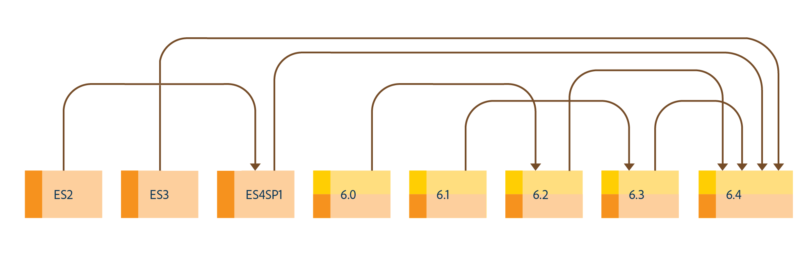

# 升級至 AEM 6.4 Forms{#upgrade-to-aem-forms}

AEM 6.4 Forms包含數項新功能和增強功能，可簡化使用表單和通信的建立、管理和使用者體驗。 若要了解AEM 6.4 Forms的所有新功能和增強功能，請參閱[新功能摘要檔案](/help/forms/using/whats-new.md)。

您可以升級現有的LiveCycle或AEM Forms安裝，以取得AEM 6.4 Forms中提供的新功能和增強功能，同時保留現有資料、程式和資產不變。 升級時，也會保留程式的中繼資料和狀態。 您可以選擇升級路徑，以開始進行升級。

下圖顯示OSGi上AEM Forms的可用升級路徑：

您可以從以下位置執行直接升級：

* AEM 6.2 Forms on OSGi
* AEM 6.3 Forms on OSGi

您也可以從

* AEM 6.0 Forms on OSGi
* AEM 6.1 Forms on OSGi

下圖顯示JEE上AEM Forms的可用升級路徑：

您可以從以下位置執行直接升級：

* LiveCycleES3
* LiveCycleES4 SP1
* AEM 6.2 JEE上的Forms
* AEM 6.3 JEE上的Forms

您也可以從

* LiveCycleES2
* AEM 6.0 Forms on JEE
* AEM 6.1 JEE上的Forms
