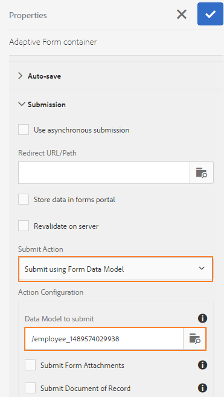

# 使用表單資料模型 {#use-form-data-model}

AEM Forms資料整合可讓您使用分散的後端資料來源來建立表單資料模型，以便在各種調適性表單和互動式通訊工作流程中當做架構使用。 它需要設定資料來源，並根據資料來源中可用的資料模型物件和服務來建立表單資料模型。 如需詳細資訊，請參閱下列：

* [AEM Forms資料整合](/help/forms/using/data-integration.md)
* [設定資料來源](/help/forms/using/configure-data-sources.md)
* [建立表單資料模型](/help/forms/using/create-form-data-models.md)
* [使用表單資料模型](/help/forms/using/work-with-form-data-model.md)

表單資料模型是JSON結構描述的擴充功能，您可用來：

* [建立最適化表單和片段](#create-af)
* [建立互動式通訊和建立區塊，例如文字、清單和條件片段](#create-ic)
* [使用範例資料預覽互動式通訊](#preview-ic)
* [預先填寫最適化表單和互動式通訊](#prefill)
* [將提交的自適應表單資料寫回資料來源](#write-af)
* [使用自適應表單規則叫用服務](#invoke-services)

## 建立最適化表單和片段 {#create-af}

您可以根據 [表單資料](/help/forms/using/creating-adaptive-form.md) ，建 [立最適化表單和最適化表單片段](/help/forms/using/adaptive-form-fragments.md) 。 在建立自適應表單或自適應表單片段時，請執行以下操作以使用表單資料模型：

1. 在「添加屬性」螢幕的「表單模型」頁籤中， **[!UICONTROL 從「從中選擇」下]** 拉清單中選擇「表 **[!UICONTROL 單資料模型]** 」。

   

1. 點選以展開「 **[!UICONTROL 選取表單資料模型」]**。 列出所有可用的表單資料模型。

   從資料模型中選擇。

   

1. (僅&#x200B;**限最適化表單片段**)您可以根據表單資料模型中只有一個資料模型物件來建立最適化表單片段。 展開 **[!UICONTROL 「表單資料模型定義]** 」下拉式清單。 它列出指定表單資料模型中的所有資料模型對象。 從清單中選擇一個資料模型對象。

   

在基於表單資料模型建立自適應表單或自適應表單片段後，表單資料模型對象將以自適應表單編輯器顯示在內容瀏覽器的「資料模型對象」( **[!UICONTROL Data Model Objects]** )頁籤中。

>[!NOTE]
>
>對於自適應表單片段，只有在編寫時選擇的資料模型對象及其關聯的資料模型對象才會顯示在「資料模型對象」頁籤中。

您可以將資料模型物件拖放至最適化表單或片段上，以新增表單欄位。 新增的表格欄位會保留中繼資料屬性，並與資料模型物件屬性系結。 此系結可確保在表單提交時，欄位值會在對應的資料來源中更新，並在轉譯表單時預先填入。

## 建立互動式通訊 {#create-ic}

您可以根據表單資料模型建立互動式通訊，您可使用已設定資料來源的資料來預先填寫互動式通訊。 此外，諸如文本、清單和條件文檔片段等互動式通信的構建塊可以基於表單資料模型。

在建立互動式通訊或檔案片段時，您可以選擇表單資料模型。 下圖顯示了「建立互動式通信」對話框的「常規」頁籤。

「建立互動式通信」對話框的「常規」頁籤

如需詳細資訊，請參閱：

[建立互動式通訊](/help/forms/using/create-interactive-communication.md)

[互動式通訊中的文字](/help/forms/using/texts-interactive-communications.md)

[互動式通訊的條件](/help/forms/using/conditions-interactive-communications.md)

[清單片段](/help/forms/using/lists.md)

## 使用範例資料預覽 {#preview-ic}

表單資料模型編輯器允許您為表單資料模型中的資料模型對象生成和編輯示例資料。 您可以使用這些資料來預覽和測試互動式通訊和調適性表單。 在預覽之前，您必須先產生範例資料，如「使用表單資 [料模型」中所述](/help/forms/using/work-with-form-data-model.md#sample)。

若要預覽具有範例表單資料模型資料的互動式通訊：

1. 在AEM作者例項上，導覽至「表 **[!UICONTROL 單>表單與檔案」]**。
1. 選擇互動式通訊，並點選工 **[!UICONTROL 具列中的]** 「預覽」，以選擇「 **[!UICONTROL Web Channel]**」、「 **[!UICONTROL Print Channel]**」或「Both Channels **** 」來預覽互動式通訊。
1. 在「預覽 [*頻道*] 」對話方塊中，請確定已選取「 **[!UICONTROL 測試表單資料模型的資料]** 」並點選「 **[!UICONTROL 預覽]**」。

互動式通訊會開啟，並預先填入範例資料。

同樣地，若要預覽具有範例資料的最適化表單，請在作者模式中開啟最適化表單，然後點選「預 **[!UICONTROL 覽」]**。

## 使用表單資料模型服務預先填寫 {#prefill}

AEM Forms提供現成可用的表單資料模型預填服務，您可以啟用以表單資料模型為基礎的最適化表單和互動式通訊。 預填充服務以自適應形式和互動式通信查詢資料模型對象的資料源，並相應地在呈現表單或通信的同時預填充資料。

若要啟用最適化表單的表單資料模型預填服務，請開啟「最適化表單容器」屬性，並從「基本」收合式面板的「預填服務 ******** 」下拉式清單中選取「表單資料模型預填」服務。 然後，儲存屬性。

若要在互動式通訊中設定表單資料模型預填服務，您可以在建立表單資料模型預填服務時，在「預填服務」下拉式清單中選取「表單資料模型預填服務」(Form Data Model Prefill Service)，或在稍後修改屬性。

編輯互動式通訊的屬性對話方塊

## 將提交的自適應表單資料寫入資料來源 {#write-af}

當使用者根據表單資料模型提交表單時，您可以設定表單，將資料模型物件的提交資料寫入其資料來源。 為了達成此使用案例，AEM Forms提供「表單資料模型」提交動作 ，現成可用於根據表單資料模型建立的最適化表單。 它將資料模型對象的提交資料寫入其資料源中。

若要設定「表單資料模型」提交動作，請開啟「最適化表單容器」屬性，並從「提交」accordion下的「提交動作」下拉式清單中選取「使用表單資料模型提交」。 **** 然後，從要提交的資料模型對象的 **[!UICONTROL 「名稱」(Name]** )下拉式清單中瀏覽並選擇資料模型對象。 儲存屬性。

在表單提交時，將配置的資料模型對象的資料寫入到各個資料源。

您也可以使用二進位資料模型物件屬性，將表單附件提交至資料來源。 執行以下操作以向JDBC資料源提交附件：

1. 將包含二進位屬性的資料模型物件新增至表單資料模型。
1. 在最適化表單中，將「檔案附 **[!UICONTROL 件]** 」元件從「元件」瀏覽器拖放至最適化表單。
1. 點選以選取新增的元件，並點選  ，以開啟元件的「屬性」瀏覽器。
1. 在「系結參考」欄位中，點選  ，然後導覽以選取您在表單資料模型中新增的二進位屬性。 視需要設定其他屬性。

   點選  ，以儲存屬性。 附件欄位現在綁定到表單資料模型的二進位屬性。

1. 在「最適化表單容器」屬性的「提交」區段中，啟用「 **[!UICONTROL 提交表單附件」]**。 它會在表單提交時，將二進位屬性欄位中的附件提交給資料來源。

## 使用規則調用自適應表單中的服務 {#invoke-services}

在基於表單資料模型的自適應表單中，可以創 [建規則](/help/forms/using/rule-editor.md) ，以調用在表單資料模型中配置的服務。 規則 **[!UICONTROL 中的「叫用服務]** 」操作會列出表單資料模型中的所有可用服務，並允許您為服務選擇輸入和輸出欄位。 您也可以使用「設 **定值** 」規則類型來叫用表單資料模型服務，並將欄位值設定為服務傳回的輸出。

例如，下列規則會叫用以員工ID為輸入的get服務，而傳回的值會填入表單中對應的「相依ID」、「姓」、「名字」和「性別」欄位。

此外，您也可以使用 `guidelib.dataIntegrationUtils.executeOperation` API在規則編輯器的程式碼編輯器中編寫JavaScript。 如需API詳細資訊，請 [參閱API以叫用表單資料模型服務](/help/forms/using/invoke-form-data-model-services.md)。
