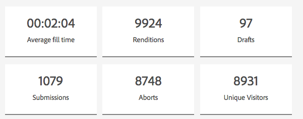

# 檢視並了解AEM Forms分析報表{#view-and-understand-aem-forms-analytics-reports}

Adobe Experience Manager Forms與Adobe Analytics整合，可讓您擷取及追蹤已發佈表單和檔案的效能量度。 分析這些量度的目的，是根據讓表單或檔案更實用所需的變更資料，做出明智的決策。

## 設定分析{#setting-up-analytics}

AEM Forms中的分析功能屬於AEM Forms附加套件的一部分。 有關安裝附加軟體包的資訊，請參閱[安裝和配置AEM Forms](/help/forms/using/installing-configuring-aem-forms-osgi.md)。

除了附加套件之外，您還需要Adobe Analytics帳戶。 如需解決方案的相關資訊，請參閱[Adobe Analytics](https://www.adobe.com/solutions/digital-analytics.html)。

取得AEM Forms附加元件套件和Adobe Analytics帳戶後，請整合Adobe Analytics帳戶與AEM Forms，並啟用對表單或檔案的追蹤，如[設定分析和報表](/help/forms/using/configure-analytics-forms-documents.md)所述。

## 如何記錄用戶交互資訊{#how-user-interaction-information-is-recorded}

使用者與表單互動時，會記錄互動內容並傳送至Analytics伺服器。 下列清單指出各種使用者活動的伺服器呼叫：

* 每次瀏覽每個欄位2次呼叫
* 1個小組訪問
* 儲存1
* 2份
* 儲存2
* 1個幫助
* 每個驗證錯誤1個
* 表單轉譯1個+預設面板造訪1個+預設第1個欄位造訪1個
* 2表示放棄表單

>[!NOTE]
>
>這份清單並非詳盡無遺。

## 檢視分析報表{#summary-report}

執行下列步驟來檢視分析報表：

1. 在`https://[hostname]:[port]`登入AEM入口網站
1. 按一下「**Forms > Forms與檔案**」。

1. 選取您要檢視分析報表的表單。
1. 選取&#x200B;**更多> Analytics報表**。

**A.** Analytics報表命令

AEM Forms會針對表單和表單中每個面板顯示analytics報表，如下所示。

**A.** 轉 **換B.** 表單層級摘 **要C.** 面板層級摘要 **D.** 訪客的瀏覽器 — 篩選 **E.** 訪客的OS — 篩選 **F.** 訪客的語言 — 篩選

依預設，會顯示最近7天的分析報表。 您可以檢視最近15天、最近1個月等的報表，或指定日期範圍。

>[!NOTE]
>
>「最近7天」和「最近15天」等選項不包含您產生分析報表的當天的資料。 若要納入當天的資料，您必須指定包含當天的日期範圍，然後執行報表。

## 適用性和HTML5表單的轉換圖表{#conversions-graph-for-adaptive-and-html-forms}

表單層級轉換圖表可讓您深入分析表單在下列關鍵績效指標(KPI)上的表現情形：

* **轉譯**:表單開啟的次數
* **訪客**:表單的訪客數
* **提交**:提交表單的次數

## 適用性表單和HTML5表單的Analytics報表{#analytics-report-for-adaptive-and-html-forms}

表單層級摘要區段可讓您深入分析表單在下列關鍵績效指標(KPI)上的表現情形：

* **平均填充時間**:填寫表單的平均逗留時間。當使用者花時間在表單上但未提交時，該時間不會納入此計算中。
* **轉譯**:表單呈現或開啟的次數

* **草稿**:表單已儲存為草稿的次數
* **提交**:提交表單的次數
* **中止**:使用者開始填寫表單後未填妥表單而離開的次數
* **不重複訪客**:不重複訪客呈現表單的次數。如需獨特訪客的詳細資訊，請參閱[獨特訪客、造訪和客戶行為](https://helpx.adobe.com/analytics/kb/unique-visitors-visitor-behavior.html)。

## 面板報告{#bottom-summary-report}

面板層級摘要區段提供表單中每個面板的下列資訊：

* **平均填充時間**:面板平均逗留時間，無論是否提交表單

* **遇到錯誤**:使用者在面板欄位上遇到的平均錯誤數。「遇到的錯誤」是透過將欄位中的總錯誤除以表單的轉譯次數而得。

* **存取的說明**:使用者存取面板中欄位之內容內說明的平均次數。「已存取幫助」的到達方式是將欄位的「幫助」被存取的總次數除以表單的轉譯次數。

### 詳細面板報告{#detailed-panel-report}

您也可以按一下「面板報表」中面板的名稱，以檢視每個面板的詳細資訊。

詳細報表會顯示面板中所有欄位的值。

「面板報表」有三個標籤：

* **時間報表** （預設）:顯示填寫面板中每個欄位所花費的秒數
* **錯誤報告**:顯示使用者在填入欄位時遇到的錯誤數
* **說明報告**:存取特定欄位的說明次數

如果有多個面板，您可以在這些面板之間導覽。

### 篩選器：瀏覽器、作業系統和語言{#filters-browser-os-and-language}

「瀏覽器分送」、「作業系統分送」和「語言分送」表格會依照表單使用者的瀏覽器、作業系統和語言，顯示轉譯、訪客和提交內容。 預設情況下，這些表最多顯示5個條目。 您可以按一下「顯示更多」來顯示更多項目，按一下「顯示更少」來返回一般的五個或更少項目。

若要進一步篩選分析資料，您可以按一下任何表格中的項目。 例如，如果您在「瀏覽器分送」表格中按一下Google Chrome，則報表會再次呈現，並包含與Google Chrome瀏覽器相關的資料，如下所示：

如果您在套用篩選器後檢視面板報表，則面板報表資料也會根據套用的篩選器顯示。

套用篩選器後：

* 分發表變為只讀，因為一次只能應用一個篩選器。
* 套用的篩選器的表格會消失。
* 您可以按一下「關閉」按鈕（以下突出顯示）以移除套用的篩選。

## A/B測試{#a-b-testing}

如果您已啟用A/B測試並為表單進行設定，報表頁面會有一個下拉式清單，您可以用來顯示A/B測試報表。 A/B測試報表會依照您的設定，顯示兩個表單版本的比較效能。

如需A/B測試的詳細資訊，請參閱[建立和管理適用性表單的A/B測試](/help/forms/using/ab-testing-adaptive-forms.md)。
