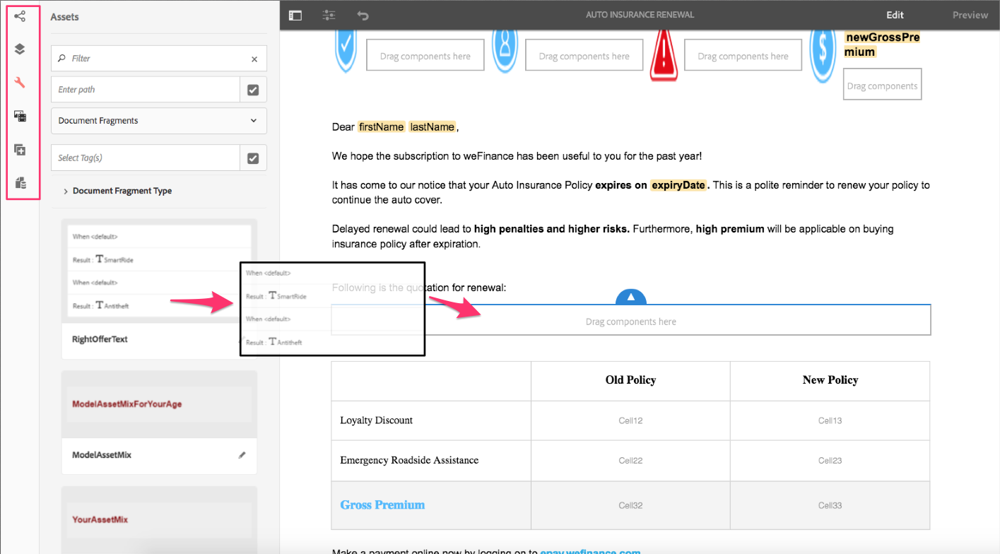

# 新功能摘要 | AEM 6.4 Forms {#new-features-summary-aem-forms}

AEM 6.4 Forms中新功能和增強功能的摘要。

AEM Forms包含數種新功能和增強功能，可透過最適化表單和互動式通訊進一步簡化建立、管理和使用者體驗。

閱讀以快速簡介新功能和增強功能。 請造訪檔案以取得資源方案的詳細資訊。 另請參閱AEM 6.4 Forms版 [本說明](/help/release-notes/forms.md)。 如需完整的AEM 6.4 Forms檔案，請造 [訪AEM 6.4 Forms使用指南](/help/forms/home.md)。

## 互動式通訊 {#interactive-communications}

互動式通訊集中管理安全、個人化及互動式通訊的建立、匯整和傳遞，例如商業通訊、信件、檔案、陳述、利益通知、財富管理招股說明書、行銷郵件、帳單和歡迎套件。

互動式通訊使用與自適應表單相同的基礎技術、流程和元件，來建立回應式多頻道通訊，就像回應式自適應表單。

互動式通訊提供顯著的優勢：

* 提供與表單資料模型整合的OOTB，讓後端資料庫和其他CRM系統（例如MS Dynamics）能輕鬆且簡化的存取
* 為印刷和網頁通道提供整合的製作介面
* 針對列印和網頁通道提供拖放式製作介面，類似於最適化表單製作。

互動式通訊是建立客戶通訊的預設和建議方式。 若要繼續使用AEM 6.3 Forms和AEM 6.2 Forms中的字母，您必須安裝相容性套件。

### 多頻道互動式通訊製作 {#multi-channel-interactive-communication-authoring}

使用互動式通訊，您可以透過單一檔案編輯器來製作和編輯平面和網頁檔案。 借由使用相同的檔案片段來建立兩個通道的轉譯，您就可以消除工作重複。

如需詳細資訊，請參閱互 [動式通訊概觀](/help/forms/using/interactive-communications-overview.md)。

### WYSIWYG檔案編輯器 {#wysiwyg-document-editor}

WYSIWYG拖放檔案編輯器對商業友好。 資產的直覺式介面、拖放功能、標準元件、資料模型和整合式儲存庫，可協助您快速輕鬆地製作互動式通訊。

若要建立互動式通訊或編輯現有的通訊，商業使用者可使用下列建置區塊： 頻道、內容、屬性、資產、元件和資料來源。

如需詳細資訊，請參 [閱製作互動式通訊簡介](/help/forms/using/introduction-interactive-communication-authoring.md)。

### 在互動式通訊中，從列印內容自動產生網頁版本 {#auto-generate-web-version-from-print-content-in-interactive-communication}

作者可以從列印檔案自動產生網頁檔案內容，以便在相同的編輯器中製作、預覽和編輯列印檔案和網頁檔案。 互動式通訊作者只需建立一次，就可發佈至所有通道。 互動式通訊作者可以在印刷和網路通道中使用相同的檔案片段，以避免重複工作。

如需詳細資訊，請參 [閱列印頻道和網頁頻道](/help/forms/using/web-channel-print-channel.md)。

### 使用主題來設定互動式通訊的網路通道樣式 {#use-themes-to-style-web-channel-of-interactive-communication}

互動式通訊支援主題。 您可以建立主題並將它們套用至互動式通訊。 主題包含元件和面板的樣式詳細資訊。 您可以在不同的互動式通訊中重複使用主題，讓主題具有共同且一致的外觀和品牌。

AEM Forms包含互動式通訊的立即可用主題。 使用主題，您也可以自訂互動式通訊在裝置上的外觀。

如需詳細資訊，請參 [閱「AEM Forms中的主題」](/help/forms/using/themes.md)。

### 增強的Agent介面 {#enhanced-agent-interface}

代理用戶介面現在支援互動式通信的打印和Web預覽。 從相同的Agent使用者介面，您可以選擇編輯列印頻道並預覽多頻道互動通訊的Web頻道。 打印通道中的欄位、變數、FDM元素和文檔片段可以配置為由代理用戶介面中的代理修改。 表單資料模型支援可讓您使用預先填入的範例資料產生預覽。

如需詳細資訊，請參 [閱使用Agent UI準備和傳送互動式通訊](/help/forms/using/prepare-send-interactive-communication.md)。

### 在圖表中呈現資訊 {#present-information-in-charts}

互動式通訊支援網頁和列印頻道中的圖表，以提供更豐富的通訊方式。 使用圓形圖、環圈圖、長條圖和柱圖等圖表，您可以濃縮並以視覺化方式呈現大量資訊，以方便解讀和分析。

 圖 

如需詳細資訊，請參 [閱在互動式通訊中使用圖表](/help/forms/using/chart-component-interactive-communications.md)。

### 立即可用的資料連接器，可預先填寫檔案 {#out-of-the-box-data-connectors-to-prefill-documents}

互動式通訊提供與商業工具的資料整合，以連接多個商業系統（包括CRM系統），並將資料個人化為檔案。

如需詳細資訊，請參 [閱使用表單資料模型](/help/forms/using/using-form-data-model.md)。

### 增強的檔案片段編輯器 {#enhanced-document-fragment-editor}

您現在可以在互動式通訊的檔案片段中使用FDM元素和規則。

* 支援表單資料模型元素
* 使用規則顯示或隱藏資產／文字片段
* 驗證元素／變數的值
* 執行函式以計算數學表達式的值

如需詳細資訊，請參閱：

* [互動式通訊中的文字](/help/forms/using/texts-interactive-communications.md)
* [互動式通訊的條件](/help/forms/using/conditions-interactive-communications.md)

### 現有資產的相容性套件 {#compatibility-package-for-existing-assets}

依預設，此發行不支援舊版AEM Forms的字母資產。 如果您要繼續使用AEM 6.3 Forms和AEM 6.2 Forms的字母，則需要安裝「相容性」套件。

## 資料整合 {#data-integration}

[AEM Forms資料整合可讓您](/help/forms/using/data-integration.md) 設定不同的資料來源； 例如資料庫、RESTful或基於SOAP的web services和OData服務； 以建立表單資料模型，您可用來系結資料、預填和叫用最適化表單和檔案中的服務。

此發行包含數項資料整合的新功能和增強功能。

### 建立沒有資料來源的表單資料模型 {#create-form-data-model-without-data-source}

商業使用者和表單製作者現在可以建立表單資料模型，包括其實體和屬性，毋需設定資料來源，並可用來製作最適化表單和檔案。 您稍後可以將表單資料模型系結至資料來源。 它消除了使用表單資料模型製作表單和檔案時對資料來源的依賴。

同樣地，您可以在現有表單資料模型中建立實體和子屬性，並將它們綁定到資料源中的相應實體和屬性。

如需詳細資訊，請參 [閱建立表單資料模型](/help/forms/using/create-form-data-models.md)。

### 建立計算屬性 {#create-computed-properties}

表單作者和開發人員可以建立表單資料模型的計算屬性。 它們可讓您針對已設定資料來源中可用的資料建立規則或邏輯，以計算屬性的值。 規則是當資料載入表單資料模型或表達式中屬性值更改時評估的表達式。 例如，名為「分期付款」的計算屬性會根據資料來源中指定的利率以及使用者在表單中指定的貸款金額和期限計算貸款的月付金額。

計算屬性駐留在表單資料模型中本地，且不存在於資料源中。 您可以在自適應表單和互動式通訊中使用計算屬性。

如需詳細資訊，請參 [閱使用表單資料模型](/help/forms/using/work-with-form-data-model.md)。

### 使用範例資料預覽表單和檔案 {#preview-forms-and-documents-with-sample-data}

表單資料模型可讓您針對表單資料模型中所有實體的屬性產生範例資料。 生成的資料與為屬性配置的資料類型相對應。 當您預覽與表單資料模型相關聯的最適化表單或檔案時，會以預先填入的範例資料呈現。

範例資料是一組隨機值，每次您產生時都會變更。 不過，您可以編輯並儲存即使重新產生仍持續存在的範例資料。 例如，如果編輯和保存「名字」和「姓氏」屬性的示例資料，並稍後在表單資料模型中添加另一個屬性或實體並重新生成示例資料，則「名字」和「姓氏」屬性將在重新生成其他屬性的值時顯示保存的值。

如需詳細資訊，請參 [閱使用表單資料模型](/help/forms/using/using-form-data-model.md)。

### Refresh data source definitions {#refresh-data-source-definitions}

資料來源實體或屬性中的任何更新不會自動反映在相關表單資料模型中。 表單資料模型編輯器現在具備  （重新整理資料來源定義）功能，可讓伺服器快取失效，並從資料來源擷取更新的架構，以立即反映在表單資料模型中。

### 使用Touch使用者介面設定資料來源 {#configure-data-sources-using-touch-user-interface}

在此版本中，Touch使用者介面中提供資料來源的雲端服務設定。 此外，設定雲端服務的位置已變更為「工 **[!UICONTROL 具>雲端服務>資料來源」]**。 請參 [閱設定資料來源](/help/forms/using/configure-data-sources.md)。

## 適用性表單 {#adaptive-forms}

### 使用增強的延遲載入來改善自適應表單的效能 {#improve-performance-of-adaptive-forms-with-enhanced-lazy-loading}

自適應表單中的延遲載入功能會延遲表單片段的初始化，直到需要為止。 它可將轉譯表單所需的時間減至最少，進而改善大型表單的效能，進而提供更佳的使用者體驗。

此發行中有數項增強的延遲載入功能：

* 啟用延遲載入的表單片段支援檔案附件和條款與條件元件。
* 可重複面板支援啟用延遲載入的可調式表單片段。
* AEM Forms應用程式支援具有啟用延遲載入片段的最適化表單。

## 以表單為中心的AEM工作流程 {#forms-centric-aem-workflows}

有了Forms-Centric AEM Workflows功能，您就可以針對OSGi堆疊上的各種工作快速建立和部署工作流程。 您不再需要在JEE堆棧上安裝流程管理功能，從而簡化部署並免除應用伺服器和基礎架構的成本。 如需詳細資訊，請參 [閱OSGi的表單導向工作流程](/help/forms/using/aem-forms-workflow.md)。

以下是Forms-Centric AEM Workflows的增強功能：·

* Touch使用者介面中提供工作流程模型編輯器。 它可協助您縮短建立表單導向AEM工作流程所需的時間。
* 傳送電子郵件的工作流程步驟。 例如，您可以使用電子郵件步驟在完成工作流程時傳送記錄檔案。
* 工作流步驟，用於在工作流模型中使用表單資料模型服務。 此步驟可讓您叫用資料整合服務，毋需編寫任何自訂程式碼。 例如，您可以叫用GET服務，從資料庫封存中取得員工詳細資料，而不需撰寫任何自訂程式碼。

## AEM Forms應用程式 {#aem-forms-app}

AEM Forms應用程式可讓現場工作者將行動裝置與AEM Forms伺服器同步化，並處理其表格。 當裝置離線時，應用程式會在裝置上本機儲存資料，並在裝置重新連線時與伺服器同步化資料，以順暢地運作。 如需詳細資訊，請參 [閱AEM Forms應用程式](/help/forms/using/aem-forms-app.md)。

以下是AEM Forms應用程式的改進：

* AEM Forms應用程式支援具有啟用延遲載入片段的最適化表單。
* AEM Forms應用程式支援具有表單資料模型的最適化表單。

## Document Security {#document-security}

使用檔案安全性，您可以安全地散布您儲存為支援格式的任何資訊。 檔案安全性可確保只有授權的使用者才能使用您的檔案。 以下是檔案安全性的主要變更：

* 檔案安全性提 [供可攜式保護程式庫(PPL)](/help/forms/using/document-security-offerings.md) ，可在本機保護檔案，而不需將檔案傳送至AEM Forms伺服器。 只有安全性認證和原則詳細資訊會透過網路傳送至AEM Forms伺服器。 AEM 6.4 Forms已推出OSGi套件格式的可攜式保護程式庫(PPL)。 現在，您可以直接在AEM Forms伺服器上安裝PPL程式庫，並搭配使用AEM和PPL的功能。
* 檔案安全性C++ SDK和C++ PPL程式庫可使用Microsoft Visual Studio 2013編譯。 之前支援的版本是Microsoft Visual Studio 2010。

## 支援的平台 {#supported-platforms}

AEM Forms可使用支援的作業系統、應用程式伺服器、資料庫、資料庫驅動程式、JDK、LDAP伺服器和電子郵件伺服器的任何組合來設定。 以下是支援平台的主要變更：

<table> 
 <tbody> 
  <tr> 
   <td>元件</td> 
   <td>新增支援</td> 
   <td>已移除支援</td> 
  </tr> 
  <tr> 
   <td>作業系統</td> 
   <td> 
    <ul> 
     <li>Microsoft Windows Server 2016</li> 
     <li>Oracle Linux 7更新3</li> 
    </ul> </td> 
   <td> 
    <ul> 
     <li>IBM AIX 7.2 [1]  </li> 
     <li>Solaris 11 [1]</li> 
    </ul> </td> 
  </tr> 
  <tr> 
   <td>應用程式伺服器  </td> 
   <td> 
    <ul> 
     <li>Red Hat JBoss EAP 7</li> 
    </ul> </td> 
   <td> 
    <ul> 
     <li>IBM Weblogic 12.1.3</li> 
     <li>IBM WebSphere 8.5.5</li> 
     <li>Red Hat JBoss EAP 6</li> 
    </ul> </td> 
  </tr> 
  <tr> 
   <td>資料庫</td> 
   <td> 
    <ul> 
     <li>Microsoft SQL Server 2016</li> 
     <li>MySQL 5.7.19及更新版本</li> 
     <li>IBM DB2 11.1</li> 
     <li>Oracle多租用戶體系結構</li> 
    </ul> </td> 
   <td> 
    <ul> 
     <li>Microsoft SQL Server 2012  </li> 
     <li>Microsoft SQL Server 2014</li> 
     <li>MySQL 5.5</li> 
     <li>IBM DB2 10.5  </li> 
    </ul> </td> 
  </tr> 
  <tr> 
   <td>LDAP伺服器</td> 
   <td> 
    <ul> 
     <li>Microsoft Active Directory 2016</li> 
     <li>IBM Tivoli Directory Server 6.4</li> 
    </ul> </td> 
   <td> 
    <ul> 
     <li>Microsoft Active Directory 2008</li> 
     <li>IBM Tivoli Directory Server 6.3</li> 
     <li>Oracle Directory Server Enterprise Edition 7.0</li> 
    </ul> </td> 
  </tr> 
  <tr> 
   <td>電子郵件伺服器</td> 
   <td> 
    <ul> 
     <li>Microsoft Office 365</li> 
    </ul> </td> 
   <td> 
    <ul> 
     <li>Novell Groupwise 7</li> 
    </ul> </td> 
  </tr> 
  <tr> 
   <td>連接器</td> 
   <td> 
    <ul> 
     <li>Microsoft Sharepoint 2016的連接器</li> 
     <li>EMC Documentum 7.3的連接器</li> 
    </ul> </td> 
   <td> 
    <ul> 
     <li>Microsoft Sharepoint 2007的連接器</li> 
     <li>Microsoft Sharepoint 2010的連接器</li> 
     <li>IBM Filenet 5.0的連接器</li> 
     <li>EMC Documentum 6.7的連接器</li> 
    </ul> </td> 
  </tr> 
  <tr> 
   <td>瀏覽器</td> 
   <td> 
    <ul> 
     <li>macOS版Apple Safari 11.x</li> 
     <li>iOS上的Apple Safari 11.x</li> 
    </ul> </td> 
   <td> 
    <ul> 
     <li>適用於Blackberry Z30和Q10裝置的Blackberry瀏覽器</li> 
    </ul> </td> 
  </tr> 
  <tr> 
   <td>AEM Forms應用程式  </td> 
   <td> 
    <ul> 
     <li>Android 4.4或更高版本</li> 
     <li>Apple iOS 10或更新版本</li> 
    </ul> </td> 
   <td> </td> 
  </tr> 
 </tbody> 
</table>

1. AIX和Solaris作業系統僅適用於升級客戶。
