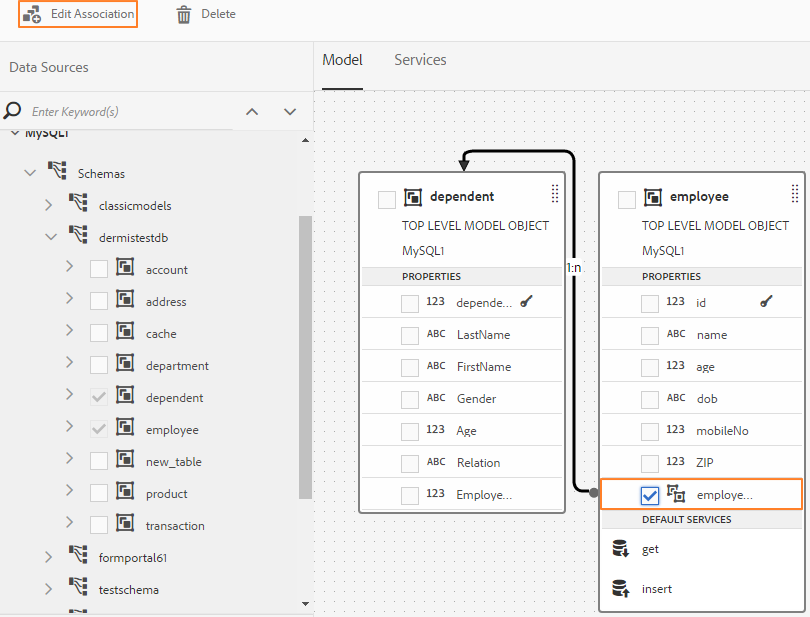
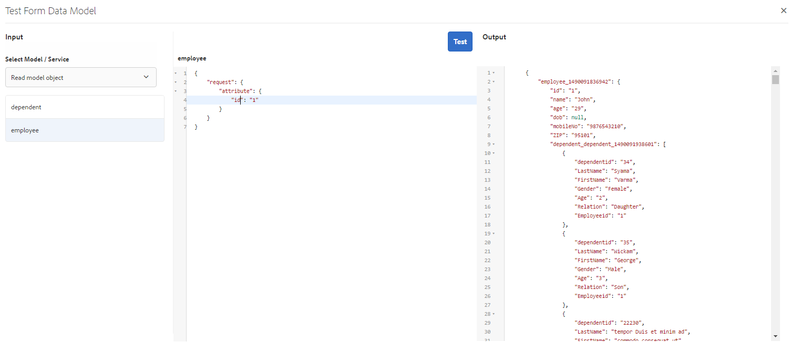

# 使用表單資料模型{#work-with-form-data-model}

資料整合提供表單資料模型編輯器，可設定及使用表單資料模型。


表單資料模型編輯器提供直覺式使用者介面和工具，可用於編輯和設定表單資料模型。 使用編輯器，可以在表單資料模型中，從關聯的資料源添加和配置資料模型對象、屬性和服務。 此外，它還允許您建立資料模型對象和屬性，而不使用資料源，並以後將它們與相應的資料模型對象和屬性綁定。 您也可以為資料模型物件屬性產生和編輯範例資料，以便在預覽時預填最適化表單和互動式通訊。 您可以測試在表單資料模型中設定的資料模型物件和服務，以確保其與資料來源正確整合。

如果您是初次使用Forms資料整合，且尚未設定資料來源或建立表單資料模型，請參閱下列主題：

* [AEM Forms資料整合](/help/forms/using/data-integration.md)
* [設定資料來源](/help/forms/using/configure-data-sources.md)
* [建立表單資料模型](/help/forms/using/create-form-data-models.md)

請閱讀，了解使用表單資料模型編輯器可執行的各種任務和設定的詳細資訊。

>[!NOTE]
>
>您必須同時是&#x200B;**fdm-author**&#x200B;和&#x200B;**forms-user**&#x200B;群組的成員，才能建立及使用表單資料模型。 請連絡您的AEM管理員以成為群組的成員。

## 添加資料模型對象和服務{#add-data-model-objects-and-services}

如果您使用資料源建立了表單資料模型，則可以使用表單資料模型編輯器來添加資料模型對象和服務、配置其屬性、在資料模型對象之間建立關聯，以及測試表單資料模型和服務。

您可以在表單資料模型中，從可用的資料來源新增資料模型物件和服務。 新增的資料模型物件顯示在「模型」標籤中時，新增的服務會顯示在「服務」標籤中。

要添加資料模型對象和服務，請執行以下操作：

1. 登入AEM製作例項，導覽至&#x200B;**[!UICONTROL Forms >資料整合]**，然後開啟您要新增資料模型物件的表單資料模型。
1. 在「資料來源」窗格中，展開資料來源以檢視可用的資料模型物件和服務。
1. 選擇要添加到表單資料模型的資料模型對象和服務，然後點選&#x200B;**[!UICONTROL 添加選定項]**。

   

   「模型」(Model)頁簽顯示所有資料模型對象及其屬性的圖形表示，這些對象及其屬性添加到表單資料模型中。 每個資料模型物件由表單資料模型中的方塊表示。

   

   >[!NOTE]
   >
   >您可以按住並拖曳資料模型物件方塊四周，以在內容區域中組織這些物件。 在表單資料模型中新增的所有資料模型物件在「資料來源」窗格中會呈現灰色。

   「服務」索引標籤會列出新增的服務。

   

   >[!NOTE]
   >
   >除了資料模型對象和服務之外，OData服務元資料文檔還包括定義兩個資料模型對象之間關聯的導航屬性。 有關詳細資訊，請參閱[使用OData服務的導航屬性](#work-with-navigation-properties-of-odata-services)。

1. 點選&#x200B;**[!UICONTROL 儲存]**&#x200B;以儲存表單模型物件。

   >[!NOTE]
   >
   >您可以使用最適化表單規則，叫用表單資料模型的「服務」索引標籤中設定的服務。 規則編輯器的「調用服務」操作中提供了已配置的服務。有關在適用性表單規則中使用這些服務的詳細資訊，請參閱[規則編輯器](/help/forms/using/rule-editor.md)中的調用服務和設定規則的值。

## 建立資料模型對象和子屬性{#create-data-model-objects-and-child-properties}

### 建立資料模型對象{#create-data-model-objects}

雖然可以從配置的資料源添加資料模型對象，但也可以建立沒有資料源的資料模型對象或實體。 如果您尚未在表單資料模型中設定資料來源，則此功能特別實用。

要建立不使用資料源的資料模型對象，請執行以下操作：

1. 登入AEM製作例項，導覽至&#x200B;**[!UICONTROL Forms >資料整合]**，然後開啟您要在其中建立資料模型物件或實體的表單資料模型。
1. 點選&#x200B;**[!UICONTROL 建立實體]**。
1. 在「建立資料模型」對話框中，指定資料模型對象的名稱，然後點選&#x200B;**[!UICONTROL Add]**。 資料模型物件會新增至表單資料模型。 請注意，新新增的資料模型物件未系結至資料來源，且沒有任何屬性，如下圖所示。

   

接下來，可以在未綁定的資料模型對象中添加子屬性。

### 添加子屬性{#child-properties}

表單資料模型編輯器可讓您在資料模型物件中建立子屬性。 建立時的屬性不會綁定到資料源中的任何屬性。 您稍後可以將子屬性與包含資料模型物件中的其他屬性捆綁。

要建立子屬性，請執行以下操作：

1. 在表單資料模型中，選取資料模型物件，然後點選&#x200B;**[!UICONTROL 建立子屬性]**。
1. 在&#x200B;**[!UICONTROL 建立子屬性]**&#x200B;對話框中，分別在&#x200B;**[!UICONTROL 名稱]**&#x200B;和&#x200B;**[!UICONTROL 類型]**&#x200B;欄位中指定屬性的名稱和資料類型。 您可以選擇指定屬性的標題和說明。
1. 如果屬性是計算屬性，則啟用計算。 根據規則或運算式來評估計算屬性的值。 如需詳細資訊，請參閱[編輯屬性](#edit-properties)。
1. 如果資料模型對象綁定到資料源，則添加的子屬性將自動綁定到具有相同名稱和資料類型的父資料模型對象的屬性。

   要使用資料模型對象屬性手動綁定子屬性，請點選&#x200B;**[!UICONTROL Bind Reference]**&#x200B;欄位旁的瀏覽表徵圖。 **[!UICONTROL 選擇對象]**&#x200B;對話框列出父資料模型對象的所有屬性。 選取要系結的屬性，並點選勾號圖示。 請注意，您只能選取與子屬性資料類型相同的屬性。

1. 點選&#x200B;**[!UICONTROL Done]**&#x200B;以儲存子屬性，並點選&#x200B;**[!UICONTROL Save]**&#x200B;以儲存表單資料模型。 子屬性現在已新增至資料模型物件。

建立資料模型物件和屬性後，您可以繼續根據表單資料模型建立最適化表單和互動式通訊。 稍後，當您有可用的資料來源並加以設定時，您就可以將表單資料模型與資料來源系結。 系結會自動在相關的最適化表單和互動式通訊中更新。 如需使用表單資料模型建立最適化表單和互動式通訊的詳細資訊，請參閱[使用表單資料模型](/help/forms/using/using-form-data-model.md)。

### 綁定資料模型對象和屬性{#bind-data-model-objects-and-properties}

當您要與表單資料模型整合的資料來源可用時，可以將其新增至表單資料模型，如[更新資料來源](/help/forms/using/create-form-data-models.md#update)所述。 然後，執行以下操作來綁定未綁定的資料模型對象和屬性：

1. 在表單資料模型中，選擇要與資料源綁定的未綁定資料源。
1. 點選&#x200B;**[!UICONTROL 編輯屬性]**。
1. 在&#x200B;**[!UICONTROL 編輯屬性]**&#x200B;窗格中，點選&#x200B;**[!UICONTROL 綁定]**&#x200B;欄位旁的瀏覽表徵圖。 它會開啟&#x200B;**[!UICONTROL 選取物件]**&#x200B;對話方塊，列出在表單資料模型中新增的資料來源。

   

1. 展開資料來源樹狀結構，並選取要以系結的資料模型物件，然後點選勾號圖示。
1. 點選&#x200B;**[!UICONTROL Done]**&#x200B;以儲存屬性，然後點選&#x200B;**[!UICONTROL Save]**&#x200B;以儲存表單資料模型。 資料模型物件現在與資料來源系結。 請注意，資料模型物件不再標示為「未系結」。

   

## 配置服務{#configure-services}

要讀取和寫入資料模型對象的資料，請執行以下操作來配置讀取和寫入服務：

1. 選取資料模型物件頂端的核取方塊以加以選取，然後點選&#x200B;**[!UICONTROL 編輯屬性]**。

   

   編輯屬性以配置資料模型對象的讀寫服務

   將開啟「編輯屬性」對話框。

   

   編輯屬性對話方塊

   >[!NOTE]
   >
   >除了資料模型對象和服務之外，OData服務元資料文檔還包括定義兩個資料模型對象之間關聯的導航屬性。 將OData服務資料源添加到表單資料模型時，表單資料模型中有一個服務可用於資料模型對象中的所有導航屬性。 您可以使用此服務讀取相應資料模型對象的導航屬性。
   >
   >有關使用服務的詳細資訊，請參閱[使用OData服務的導航屬性](#work-with-navigation-properties-of-odata-services)。

1. 切換&#x200B;**[!UICONTROL 頂級對象]**&#x200B;以指定資料模型對象是否為頂級模型對象。

   在表單資料模型中配置的資料模型對象可用於基於表單資料模型的適用性表單的「內容」瀏覽器的「資料模型對象」頁簽中。 在兩個資料模型對象之間添加關聯時，要關聯的資料模型對象在「資料模型對象」(Data Model Objects)頁簽中要關聯的資料模型對象下嵌套。 如果嵌套資料模型是頂層對象，它也將單獨顯示在「資料模型對象」頁簽中。 因此，您會看到其中兩個項目，一個在巢狀階層內，另一個在巢狀階層外，這可能會混淆表單作者。 要使關聯的資料模型對象僅顯示在嵌套層次結構中，請禁用「頂級對象」屬性。

1. 為所選資料模型對象選擇讀和寫服務。 服務的引數隨即顯示。

   

   為員工資料源配置的讀寫服務

1. 點選以取得讀取服務引數，將引數系結至使用者設定檔屬性、請求屬性或常值，並指定系結值。 它將服務參數綁定到指定的綁定屬性或常值，該值作為參數傳遞給服務，以從資料源獲取與指定值關聯的詳細資訊。

   在此示例中， `id`參數將採用用戶配置檔案的`empid`屬性的值，並將其作為參數傳遞給讀取服務。 它將從指定`empid`的`employee`資料模型對象中讀取並返回關聯屬性的值。 因此，如果您在表單的`empid`欄位中指定00250，則讀取服務將讀取具有00250僱員id的僱員的詳細資訊。

   此外，您可以將引數設為強制或選用。

   

   將id引數系結至AEM使用者設定檔的empid屬性

1. 點選&#x200B;**[!UICONTROL Done]**&#x200B;以儲存引數，點選&#x200B;**[!UICONTROL Done]**&#x200B;以儲存屬性，然後點選&#x200B;**[!UICONTROL Save]**&#x200B;以儲存表單資料模型。

## 添加關聯{#add-associations}

通常，資料源中的資料模型對象之間會建立關聯。 關聯可以是一對一或一對多。 例如，可以有多個與員工相關聯的家屬。 它稱為一對多關聯，由`1:n`在連接相關資料模型對象的線上描述。 但是，如果關聯為指定的員工ID返回唯一的員工名稱，則稱為一對一關聯。

將資料源中的關聯資料模型對象添加到表單資料模型時，它們的關聯將被保留並顯示為通過箭頭線連接。 您可以在表單資料模型中，跨不同資料來源新增資料模型物件之間的關聯。

>[!NOTE]
>
>JDBC資料源中的預定義關聯不會保留在表單資料模型中。 您必須手動建立。

添加關聯：

1. 選取資料模型物件頂端的核取方塊以加以選取，然後點選&#x200B;**[!UICONTROL 新增關聯]**。 將開啟「添加關聯」對話框。

   

   >[!NOTE]
   >
   >除了資料模型對象和服務之外，OData服務元資料文檔還包括定義兩個資料模型對象之間關聯的導航屬性。 在表單資料模型中新增關聯時，可以使用這些導覽屬性。 有關詳細資訊，請參閱[使用OData服務的導航屬性](#work-with-navigation-properties-of-odata-services)。

   將開啟「添加關聯」對話框。

   

   添加關聯對話框

1. 在「添加關聯」窗格中：

   * 指定關聯的標題。
   * 選擇關聯類型 — 一對一或一對多。
   * 選擇要關聯的資料模型對象。
   * 選擇讀取服務以從所選模型對象讀取資料。 讀取服務參數隨即出現。 編輯以變更引數（如有必要），並將其系結至要關聯的資料模型物件的屬性。

   在以下示例中，Dependents資料模型對象的讀取服務的預設參數為`dependentid`。

   

   Dependents讀取服務的預設參數為dependited

   但引數必須是關聯資料模型對象之間的公用屬性，在此示例中為`Employeeid`。 因此，`Employeeid`參數必須綁定到Employee資料模型對象的`id`屬性，才能從Dependents資料模型對象中獲取關聯的依存項詳細資訊。

   

   更新引數和系結

   點選&#x200B;**[!UICONTROL Done]**&#x200B;以儲存引數。

1. 點選&#x200B;**[!UICONTROL Done]**&#x200B;以儲存關聯，然後點選&#x200B;**[!UICONTROL Save]**&#x200B;以儲存表單資料模型。
1. 重複步驟，視需要建立更多關聯。

>[!NOTE]
>
>添加的關聯將顯示在資料模型對象框中，具有指定的標題和一條連接關聯資料模型對象的線。
>
>您可以選取相關的核取方塊，然後點選「**[!UICONTROL 編輯關聯]**」以編輯關聯。



## 編輯屬性 {#properties}

您可以編輯資料模型對象的屬性、其屬性以及在表單資料模型中添加的服務。

要編輯屬性：

1. 選取表單資料模型中資料模型物件、屬性或服務旁的核取方塊。
1. 點選&#x200B;**[!UICONTROL 編輯屬性]**。 將開啟所選模型對象、屬性或服務的&#x200B;**[!UICONTROL 編輯屬性]**&#x200B;窗格。

   * **資料模型物件**:指定讀和寫服務和編輯參數。
   * **屬性**:指定屬性的類型、子類型和格式。也可以指定所選屬性是否為資料模型對象的主鍵。
   * **服務**:指定服務的輸入模型對象、輸出類型和參數。對於Get服務，可以指定它是否應返回陣列。

   

   獲取服務的編輯屬性對話框

1. 點選&#x200B;**[!UICONTROL Done]**&#x200B;以儲存屬性，然後點選&#x200B;**[!UICONTROL Save]**&#x200B;以儲存表單資料模型。

### 建立計算屬性 {#computed}

計算屬性是根據規則或表達式計算其值的屬性。 使用規則，可以將計算屬性的值設定為文本字串、數字、數學表達式的結果或窗體資料模型中其他屬性的值。

例如，可以建立計算屬性&#x200B;**FullName**，其值是現有&#x200B;**FirstName**&#x200B;和&#x200B;**LastName**&#x200B;屬性串連的結果。 若要這麼做：

1. 建立資料類型為String的名稱為`FullName`的新屬性。
1. 啟用&#x200B;**[!UICONTROL Computed]**&#x200B;並點選&#x200B;**[!UICONTROL Done]**&#x200B;以建立屬性。

   

   將建立FullName計算屬性。 請注意屬性旁的圖示，以描繪計算屬性。

   

1. 選擇FullName屬性，然後點選&#x200B;**[!UICONTROL Edit Rule]**。 規則編輯器視窗隨即開啟。
1. 在規則編輯器視窗中，點選&#x200B;**[!UICONTROL 建立]**。 將開啟「**[!UICONTROL 設定值]**」規則窗口。

   從「選擇選項」下拉清單中，選擇&#x200B;**[!UICONTROL 數學表達式]**。 其他可用選項為&#x200B;**[!UICONTROL 表單資料模型物件]**&#x200B;和&#x200B;**[!UICONTROL 字串]**。

1. 在數學表達式中，分別在第一和第二對象中選擇&#x200B;**[!UICONTROL FirstName]**&#x200B;和&#x200B;**[!UICONTROL LastName]**。 選擇&#x200B;**[!UICONTROL plus]**&#x200B;作為運算子。

   點選&#x200B;**[!UICONTROL Done]**，然後點選&#x200B;**[!UICONTROL Close]**&#x200B;以關閉規則編輯器視窗。 規則看起來類似下列。

   

1. 在表單資料模型上，點選&#x200B;**[!UICONTROL 儲存]**。 已配置計算屬性。

## 使用OData服務{#work-with-navigation-properties-of-odata-services}的導航屬性

在OData服務中，導航屬性用於定義兩個資料模型對象之間的關聯。 這些屬性是在實體類型或複雜類型上定義的。 例如，在從示例[TripPin](https://www.odata.org/blog/trippin-new-odata-v4-sample-service/) OData示例服務的元資料檔案的以下提取中，人員實體包含三個導航屬性：朋友、BestFriend和Trips。

有關導航屬性的詳細資訊，請參閱[OData文檔](https://docs.oasis-open.org/odata/odata/v4.0/errata03/os/complete/part3-csdl/odata-v4.0-errata03-os-part3-csdl-complete.html#_Toc453752536)。

```xml
<edmx:Edmx xmlns:edmx="https://docs.oasis-open.org/odata/ns/edmx" Version="4.0">
<script/>
<edmx:DataServices>
<Schema xmlns="https://docs.oasis-open.org/odata/ns/edm" Namespace="Microsoft.OData.Service.Sample.TrippinInMemory.Models">
<EntityType Name="Person">
<Key>
<PropertyRef Name="UserName"/>
</Key>
<Property Name="UserName" Type="Edm.String" Nullable="false"/>
<Property Name="FirstName" Type="Edm.String" Nullable="false"/>
<Property Name="LastName" Type="Edm.String"/>
<Property Name="MiddleName" Type="Edm.String"/>
<Property Name="Gender" Type="Microsoft.OData.Service.Sample.TrippinInMemory.Models.PersonGender" Nullable="false"/>
<Property Name="Age" Type="Edm.Int64"/>
<Property Name="Emails" Type="Collection(Edm.String)"/>
<Property Name="AddressInfo" Type="Collection(Microsoft.OData.Service.Sample.TrippinInMemory.Models.Location)"/>
<Property Name="HomeAddress" Type="Microsoft.OData.Service.Sample.TrippinInMemory.Models.Location"/>
<Property Name="FavoriteFeature" Type="Microsoft.OData.Service.Sample.TrippinInMemory.Models.Feature" Nullable="false"/>
<Property Name="Features" Type="Collection(Microsoft.OData.Service.Sample.TrippinInMemory.Models.Feature)" Nullable="false"/>
<NavigationProperty Name="Friends" Type="Collection(Microsoft.OData.Service.Sample.TrippinInMemory.Models.Person)"/>
<NavigationProperty Name="BestFriend" Type="Microsoft.OData.Service.Sample.TrippinInMemory.Models.Person"/>
<NavigationProperty Name="Trips" Type="Collection(Microsoft.OData.Service.Sample.TrippinInMemory.Models.Trip)"/>
</EntityType>
```

在表單資料模型中配置OData服務時，實體容器中的所有導航屬性都可通過表單資料模型中的服務提供。 在此TripPin OData服務示例中，可以使用表單資料模型中的一個`GET LINK`服務讀取`Person`實體容器中的三個導航屬性。

以下將突出顯示「表單資料模型」中的`GET LINK of Person /People`服務，該服務是TripPin OData服務的`Person`實體中三個導航屬性的組合服務。


將`GET LINK`服務添加到「表單資料模型」的「服務」頁簽後，可以編輯屬性以選擇要在服務中使用的輸出模型對象和導航屬性。 例如，以下示例中的以下`GET LINK of Person /People`服務使用Trip作為輸出模型對象，使用導航屬性作為Trips。


>[!NOTE]
>
>**NavigationPropertyName**&#x200B;引數的&#x200B;**[!UICONTROL 預設值]**&#x200B;欄位中可用的值取決於&#x200B;**[!UICONTROL Return陣列的狀態？]** 切換按鈕。啟用後，將顯示「集合」類型的導航屬性。

在此示例中，您還可以選擇輸出模型對象作為Person，選擇導航屬性參數作為Friends或BestFriend(取決於&#x200B;**[!UICONTROL Return陣列？]** 啟用或停用)。


同樣地，在表單資料模型中新增關聯時，您可以選擇`GET LINK`服務並配置其導覽屬性。 但是，要能夠選擇導航屬性，請確保將&#x200B;**[!UICONTROL 綁定到欄位]**&#x200B;設定為&#x200B;**[!UICONTROL 常值]**。


## 產生和編輯範例資料 {#sample}

表單資料模型編輯器可讓您為表單資料模型中的所有資料模型物件屬性產生範例資料，包括計算屬性。 這是一組符合為每個屬性設定的資料類型的隨機值。 您也可以編輯和儲存資料，即使重新產生範例資料，資料也會保留。

執行下列操作以生成和編輯示例資料：

1. 開啟表單資料模型，然後點選&#x200B;**[!UICONTROL 編輯範例資料]**。 它會在「編輯範例資料」視窗中產生並顯示範例資料。

   

1. 在「**[!UICONTROL 編輯示例資料]**」窗口中，根據需要編輯資料，然後點選「**[!UICONTROL 保存]**」。

接下來，您可以使用範例資料，根據表單資料模型預先填寫及測試互動式通訊。 如需詳細資訊，請參閱[使用表單資料模型](/help/forms/using/using-form-data-model.md)。

## 測試資料模型對象和服務{#test-data-model-objects-and-services}

您的表單資料模型已設定，但在使用前，您可能想要測試已設定的資料模型物件和服務是否如預期般運作。 要測試資料模型對象和服務，請執行以下操作：

1. 在表單資料模型中選擇資料模型對象或服務，並分別點選&#x200B;**[!UICONTROL 測試模型對象]**&#x200B;或&#x200B;**[!UICONTROL 測試服務]**。

   將開啟「測試表單資料模型」窗口。

   

1. 在「測試表單資料模型」窗口中，從「輸入」窗格中選擇要測試的資料模型對象或服務。

1. 在測試程式碼中指定引數值，然後點選&#x200B;**[!UICONTROL Test]**。 成功的測試會在「輸出」窗格中返回輸出。

   

同樣地，您可以測試表單資料模型中的其他資料模型物件和服務。

## 後續步驟 {#next-steps}

您有可運作的表單資料模型，現在已可在最適化表單和互動式通訊工作流程中使用。 如需詳細資訊，請參閱[使用表單資料模型](/help/forms/using/using-form-data-model.md)。
