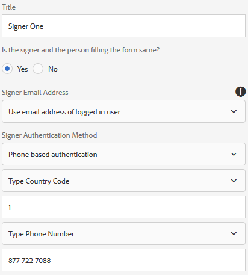

# 在最適化表單中使用Acrobat Sign {#using-adobe-sign-in-an-adaptive-form}

啟用最適化表單的電子簽名(Acrobat Sign)工作流程，以自動化簽署工作流程、簡化單一和多簽名流程，以及從行動裝置以電子方式簽署表單。

Acrobat Sign可啟用最適化表單的電子簽名工作流程。 電子簽名改進了處理法律、銷售、工資、人力資源管理等領域的文檔的工作流。

在典型的Acrobat Sign和最適化表單案例中，使用者會填入最適化表單以申請服務。 例如，抵押貸款和信用卡申請要求所有借款人和共同申請人簽名。 若要針對類似案例啟用電子簽名工作流程，您可以整合Acrobat Sign與AEM Forms。 您可以使用Acrobat Sign執行下列作業：

* 通過完全自動化的計畫書、報價和合同流程從任何設備處理交易。
* 更快完成人力資源流程，並為員工提供數位體驗。
* 縮短合約週期時間，並加快供應商的上線速度。
* 建立可自動化常見流程的數位工作流程。

Acrobat Sign與AEM Forms的整合支援：

* 單一和多使用者簽署工作流程
* 循序和同時簽署工作流程
* 表單內和表單外簽署體驗
* 以匿名或登入的使用者身分簽署表單
* 動態簽署程式(與AEM Forms工作流程整合)
* 通過知識庫、電話和社交配置檔案進行身份驗證

了解 [搭配最適化表單使用Acrobat Sign的最佳作法](https://medium.com/adobetech/using-adobe-sign-to-e-sign-an-adaptive-form-heres-the-best-way-to-do-it-dc3e15f9b684) 以建立更好的簽署體驗。

## 必備條件 {#prerequisites}

在最適化表單中使用Acrobat Sign之前：

* 確保已將AEM Forms雲端服務設定為使用Acrobat Sign。 如需詳細資訊，請參閱 [整合Acrobat Sign與AEM Forms](/help/forms/using/adobe-sign-integration-adaptive-forms.md).
* 讓簽署者清單保持就緒。 您至少需要每個簽署者的電子郵件地址。

## 設定最適化表單的Acrobat Sign {#configure-adobe-sign-for-an-adaptive-form}

執行下列步驟來設定最適化表單的Acrobat Sign:

1. [編輯Acrobat Sign的最適化表單屬性](#enableadobesign)
1. [將Acrobat Sign欄位新增至最適化表單](#addadobesignfieldstoanadaptiveform)
1. [啟用Acrobat Sign以建立最適化表單](#enableadobsignforanadaptiveform)
1. [為最適化表單選取Acrobat SignCloud Service](#selectadobesigncloudserviceforanadaptiveform)

1. [將Acrobat Sign簽署者新增至最適化表單](#addsignerstoanadaptiveform)
1. [為最適化表單選取「提交動作」](#selectsubmitactionforanadaptiveform)

### 編輯Acrobat Sign的最適化表單屬性 {#enableadobesign}

為現有或新的最適化表單設定Acrobat Sign的最適化表單屬性。

[建立適用於Acrobat Sign的最適化表單](/help/forms/using/working-with-adobe-sign.md#create-an-adaptive-form-for-adobe-sign) 說明建立基本最適化表單的步驟。 請參閱 [建立最適化表單](/help/forms/using/creating-adaptive-form.md) 以取得建立最適化表單時可用的其他選項。

#### 建立適用於Acrobat Sign的最適化表單 {#create-an-adaptive-form-for-adobe-sign}

執行下列步驟以建立適用於Acrobat Sign的最適化表單：

1. 導覽至 **[!UICONTROL Adobe Experience Manager]** > **[!UICONTROL Forms]** > **[!UICONTROL Forms與檔案]**.
1. 點選 **[!UICONTROL 建立]** 選取 **[!UICONTROL 適用性表單]**. 隨即顯示範本清單。 選取範本並點選 **[!UICONTROL 下一個]**.
1. 在 **[!UICONTROL 基本]** 標籤：

   1. 指定 **名稱** 和 **標題** （適用於最適化表單）。
   1. 選取 [組態容器](/help/forms/using/adobe-sign-integration-adaptive-forms.md#configure-adobe-sign-with-aem-forms) 在使用AEM Forms設定Acrobat Sign時建立。

      >[!NOTE]
      >
      >此 **[!UICONTROL Acrobat SignCloud Service]** 下拉式清單會顯示您在此欄位中選取之設定容器中所設定的雲端服務。 此 **[!UICONTROL Acrobat SignCloud Service]** 下拉式清單可在 **[!UICONTROL 電子簽名]** 區段(當您選取 **[!UICONTROL 啟用Acrobat Sign]** 選項。

1. 在 **[!UICONTROL 表單模型]** 頁簽，選擇以下選項之一：

   * 選取 **[!UICONTROL 將表單模板與記錄文檔模板關聯]** 選項並選擇「記錄文檔」模板。 如果您使用基於表單模板的最適化表單，則為簽名而發送的文檔將僅顯示基於關聯表單模板的那些欄位。 它不會顯示最適化表單的所有欄位。
   * 選取 **[!UICONTROL 生成記錄文檔]** 選項。 如果您使用已啟用「記錄檔案」選項的適用性表單，則為簽署而傳送的檔案會顯示適用性表單的所有欄位。

1. 點選 **[!UICONTROL 建立。]** 已建立已啟用符號的最適化表單，可用於新增Acrobat Sign欄位。

#### 編輯適用於Acrobat Sign的最適化表單 {#editafsign}

執行下列步驟以在現有適用性表單中使用Acrobat Sign:

1. 導覽至 **[!UICONTROL Adobe Experience Manager]** > **[!UICONTROL Forms]**> **[!UICONTROL Forms與檔案]**.
1. 選取最適化表單並點選 **[!UICONTROL 屬性]**.
1. 在 **[!UICONTROL 基本]** 頁簽，選擇 [組態容器](/help/forms/using/adobe-sign-integration-adaptive-forms.md#configure-adobe-sign-with-aem-forms) 在使用AEM Forms設定Acrobat Sign時建立。
1. 在 **[!UICONTROL 表單模型]** 頁簽，選擇以下選項之一：

   * 選取 **[!UICONTROL 將表單模板與記錄文檔模板關聯]** 選項並選擇「記錄文檔」模板。 如果您使用基於表單模板的最適化表單，則為簽名而發送的文檔將僅顯示基於關聯表單模板的那些欄位。 它不會顯示最適化表單的所有欄位。
   * 選取 **[!UICONTROL 生成記錄文檔]** 選項。 如果您使用已啟用「記錄檔案」選項的適用性表單，則為簽署而傳送的檔案會顯示適用性表單的所有欄位。

1. 點選 **[!UICONTROL 儲存並關閉]**. 適用性表單已針對Acrobat Sign啟用。

### 將Acrobat Sign欄位新增至最適化表單 {#addadobesignfieldstoanadaptiveform}

Acrobat Sign有各種欄位可放置在最適化表單上。 這些欄位接受各種類型的資料，如簽名、縮寫、公司或標題，並幫助在簽名期間收集額外資訊以及簽名。 您可以使用Acrobat Sign區塊元件，將Acrobat Sign欄位置於最適化表單的不同位置。

執行下列步驟，將欄位新增至最適化表單，並自訂與這些欄位相關的各種選項：

1. 拖放 **Acrobat Sign區塊** 元件從元件瀏覽器移至最適化表單。 Acrobat Sign區塊元件包含所有支援的Acrobat Sign欄位。 依預設，會新增 **簽名** 欄位至最適化表單。

   

   依預設，已發佈的適用性表單中不會顯示Acrobat Sign區塊。 它只會顯示在簽署檔案中。 您可以從Acrobat Sign區塊元件的屬性變更Acrobat Sign區塊的可見性。

   >[!NOTE]
   >
   >* 若要在最適化表單中使用Acrobat Sign，不必使用Acrobat Sign區塊。 如果您沒有使用Acrobat Sign區塊並為簽署者新增欄位，則預設簽名欄位會顯示在簽署檔案的底部。
   >* 僅對自動產生記錄檔案的適用表單使用Acrobat Sign區塊。 如果您使用自訂XDP來產生記錄檔案或表單範本型最適化表單，則不需要Acrobat Sign區塊。

1. 選取 **Acrobat Sign區塊** 元件並點選 **編輯**  表徵圖。 它顯示添加欄位和格式欄位外觀的選項。

   

   **答：** 選取並新增Acrobat Sign欄位。 **B.** 將Acrobat Sign區塊展開為全螢幕檢視

1. 點選 **Acrobat Sign欄位**  表徵圖。 它會顯示選取和新增Acrobat Sign欄位的選項。

   展開 **類型** 下拉式欄位以選取Acrobat Sign欄位，然後點選「完成」  圖示將選取的欄位新增至Acrobat Sign區塊。 此 **類型** 下拉欄位包括簽名、簽名者資訊和資料欄位類型。 Acrobat Sign與「類型」下拉式方塊中所列AEM Forms支援欄位的整合。 如需Acrobat Sign欄位的詳細資訊，請參閱 [Acrobat Sign檔案](https://helpx.adobe.com/sign/help/field-types.html).

   

   必須為欄位提供唯一名稱。 您也可以選取必要選項，將欄位標示為必填欄位。 除了 **名稱** 和 **必填** 選項，則某些Acrobat Sign欄位會有更多選項。 例如，遮色片和多行。 此外，無論欄位位於相同或不同的Acrobat Sign區塊，都可為每個Acrobat Sign欄位指定唯一的名稱。

### 啟用Acrobat Sign以建立最適化表單 {#enableadobsignforanadaptiveform}

現成可用的Acrobat Sign不會啟用最適化表單。 執行下列步驟以啟用：

1. 在內容瀏覽器中，點選 **表單容器**，然後點選 **設定**  表徵圖。 它會開啟屬性瀏覽器並顯示適用性表單容器屬性。
1. 在屬性瀏覽器中，展開 **電子簽名** 折疊式功能表，然後選取 **啟用Acrobat Sign** 選項。 它可啟用Acrobat Sign的最適化表單。

### 選取Acrobat SignCloud Service和簽署順序 {#selectadobesigncloudserviceforanadaptiveform}

您可以為AEM Forms例項設定多個Acrobat Sign服務。 建議為每個功能（人力資源、財務等）分別提供一套服務。 它讓追蹤和報告已簽署的檔案更輕鬆。 例如，銀行有多個部門。 您可以為每個部門分別設定以更好地跟蹤文檔。

文檔還可以有多個簽名者。 例如，信用卡申請可以有多個申請人。 銀行在開始處理申請前要求所有申請人簽名。 對於多簽署者方案，您可以選擇按順序或同時順序對文檔進行簽名。

執行下列步驟以選取雲端服務和簽署順序：

1. 在內容瀏覽器中，點選 **表單容器**，然後點選 **設定**  表徵圖。 它會開啟屬性瀏覽器並顯示適用性表單容器屬性。
1. 在屬性瀏覽器中，展開 **電子簽名** 折疊式功能表，然後選取 **啟用Acrobat Sign** 選項。 它可啟用Acrobat Sign的最適化表單。
1. 從已設定的Acrobat SignCloud Services清單中選取雲端服務。

   若 **Acrobat SignCloud Service** 清單空白，請遵循 [使用AEM Forms設定Acrobat Sign](/help/forms/using/adobe-sign-integration-adaptive-forms.md) 文章來設定服務。

   下拉式清單列出 `global` 「工具」> **[!UICONTROL Cloud Services]** > **[!UICONTROL Acrobat Sign]**. 此外，下拉式清單也會列出您在 **[!UICONTROL 組態容器]** 欄位。

1. 從 **簽署者可簽署** 對話框。 Acrobat Sign歌手可以簽署最適化表格 **循序**  — 一個接一個的簽署者，或 **同時**  — 無論如何。

   依序，一個簽署者一次會收到要簽署的表單。 簽署者完成對檔案的簽署後，表單會傳送給下一個簽署者，以此類推。

   同時，多位簽署者一次可簽署表單。

1. [將簽署者新增至最適化表單](#addsignerstoanadaptiveform) 並點選「完成」圖示以儲存變更。

### 將簽署者新增至最適化表單 {#addsignerstoanadaptiveform}

最適化表單只能有一名或多名簽署者。 添加簽名者時，還可以配置簽名者的驗證詳細資訊。 您也可以選取表單填寫者和歌手是否為同一人。 執行下列步驟來新增及提供與簽署者相關的各種詳細資訊：

1. 在內容瀏覽器中，點選 **表單容器**，然後點選 **設定**  表徵圖。 它會開啟屬性瀏覽器，其中包含適用性表單容器屬性。
1. 在屬性瀏覽器中，展開 **電子簽名** 折疊式功能表，然後選取 **啟用Acrobat Sign** 選項。 它可啟用Acrobat Sign的最適化表單。
1. 點選 **添加簽名者** 在 **簽名者配置。** 它會將簽署者新增至最適化表單。 您可以將多個Acrobat Sign簽署者新增至最適化表單。
1. 

   按一下 **編輯**  表徵圖，以指定與簽署者有關的以下資訊：

   * **標題：** 指定標題以唯一識別簽署者。
   * **簽署者與填寫表單的人是否相同？** 選擇 **是**，如果表單填寫者和第一個簽署者是同一人。 如果選項設為 **不，** 然後，請勿在最適化表單中使用簽名步驟元件。 如果表單包含簽名步驟元件，則欄位將自動設定為是。
   * **簽署者電子郵件地址：** 指定簽署者的電子郵件地址。 簽署者會在指定的電子郵件地址上收到要簽署的檔案/表單。 您可以選擇使用表單欄位中、登入使用者的AEM使用者設定檔中提供的電子郵件地址，或手動輸入電子郵件地址。 這是必要的步驟。 另請注意，如果您只設定了一個簽署者，請確認簽署者的電子郵件地址與用來設定AEM雲端服務的Acrobat Sign帳戶不同。
   * **簽名者身份驗證方法：** 指定在開啟要簽名的表單之前驗證用戶的方法。 您可以在電話、知識庫和社交身份驗證之間進行選擇。

   >[!NOTE]
   >
   >* 依預設，社交身分驗證提供使用Facebook、Google和LinkedIn進行驗證的選項。 您可以聯絡Acrobat Sign支援，以啟用其他社交驗證提供者。

   * **Acrobat Sign欄位填寫或簽署：** 為簽署者選取Acrobat Sign欄位。 適用性表單可以有多個Acrobat Sign欄位。 您可以選擇為簽署者啟用特定欄位。 欄位會顯示所有可用的Acrobat Sign區塊。 選取區塊時，會選取區塊的所有欄位。 您可以使用X圖示來取消選取欄位。

   

   上圖有兩個範例Acrobat Sign區塊：個人資訊和辦公室詳細資訊

   點選完成  表徵圖。 已添加並配置簽名者。

### 為最適化表單選取「提交動作」 {#selectsubmitactionforanadaptiveform}

在您新增Acrobat Sign欄位至最適化表單、從表單容器啟用Acrobat Sign、選取Acrobat SignCloud Service並新增Acrobat Sign簽署者後，請為最適化表單選取適當的提交動作。 如需適用性表單提交動作的詳細資訊，請參閱 [設定提交動作](/help/forms/using/configuring-submit-actions.md).

此外，只有在所有簽署者簽署表單後，才會提交已啟用Acrobat Sign的最適化表單。 您可以在表單入口網站的「待簽署」區段中找到部分簽署的表單。 Acrobat Sign設定服務會持續輪詢Acrobat Sign伺服器(位於 [規則間隔](/help/forms/using/adobe-sign-integration-adaptive-forms.md) 驗證簽名狀態。 如果所有簽署者都完成表單的簽署，則會啟動提交動作服務並提交表單。 如果您使用自訂提交動作，且表單使用Acrobat Sign，請更新您的自訂提交動作，以使用提交動作服務。

>[!NOTE]
>
>最適化表單的資料會暫時儲存在Forms Portal。 建議使用 [Forms Portal的自訂儲存空間](/help/forms/using/configuring-draft-submission-storage.md). 這可確保PII（個人識別資訊）資料不會儲存在AEM伺服器上。

您的表單簽署體驗已就緒。 您可以預覽表單以驗證簽署體驗。 簽署者收到透過電子郵件簽署的表單時，會在已發佈的表單上顯示「Acrobat Sign區塊」欄位。 此體驗也稱為表單外簽署體驗。 您也可以為第一個簽署者設定表單內簽署體驗，詳細步驟請參閱 [建立表單內簽署體驗](/help/forms/using/working-with-adobe-sign.md#create-in-form-signing-experience).

## 為最適化表單配置雲端簽名 {#configure-cloud-signatures-for-an-adaptive-form}

雲端數位簽名或遠程簽名是新一代的數位簽名，可跨案頭、移動和網路運行，並滿足簽名者驗證的最高級合規性和保證。 您可以使用雲端數位簽名來簽署最適化表單。

之後 [編輯Acrobat Sign的最適化表單屬性](#enableadobesign)，請執行下列步驟，將雲端簽名欄位新增至最適化表單：

1. 拖放 **Acrobat Sign區塊** 元件從元件瀏覽器移至最適化表單。 Acrobat Sign區塊元件包含所有支援的Acrobat Sign欄位。 依預設，會新增 **簽名** 欄位至最適化表單。

   

1. 選取 **Acrobat Sign區塊** 元件並點選 **編輯**  表徵圖。 它顯示添加欄位和格式欄位外觀的選項。

   

   **答：** 選取並新增Acrobat Sign欄位。 **B.** 將Acrobat Sign區塊展開為全螢幕檢視

1. 點選 **Acrobat Sign欄位**  表徵圖。 它會顯示選取和新增Acrobat Sign欄位的選項。

   展開 **類型** 要選擇的下拉欄位 **數位簽名** 並點選「完成」  圖示將選取的欄位新增至Acrobat Sign區塊。

   

   必須為欄位提供唯一名稱。

   使用下列方式將數位簽名套用至最適化表單：

   * 雲簽名：使用 [數位識別碼](https://helpx.adobe.com/sign/kb/digital-certificate-providers.html) 由信任服務提供商托管。
   * Adobe Acrobat或Reader:下載並開啟包含Adobe Acrobat或Reader的檔案，以使用智慧卡、USB令牌或基於檔案的數字ID進行簽名。

   將雲端簽名欄位新增至最適化表單後，請執行下列步驟以完成設定程式：

   * [啟用Acrobat Sign以建立最適化表單](#enableadobsignforanadaptiveform)
   * [為最適化表單選取Acrobat SignCloud Service](#selectadobesigncloudserviceforanadaptiveform)
   * [將Acrobat Sign簽署者新增至最適化表單](#addsignerstoanadaptiveform)
   * [為最適化表單選取「提交動作」](#selectsubmitactionforanadaptiveform)

## 建立表單內簽署體驗 {#create-in-form-signing-experience}

使用者也可以在填寫表單時簽署最適化表單。 此體驗也稱為表單內簽署體驗。 表單內簽署體驗僅適用於多個簽署者環境中的第一位歌手。 執行下列步驟，為最適化表單建立表單內簽署體驗：

1. [添加和配置簽名步驟元件](#add-and-configure-the-signature-step-component).
1. [新增摘要步驟元件](#configure-the-thank-you-page-or-summary-step-component).

### 添加和配置簽名步驟元件 {#add-and-configure-the-signature-step-component}

使用「簽名步驟」元件提供一個區域，以電子方式對填寫的表單進行簽名。 呈現包含簽名步驟元件的部分時，它顯示可簽名的填充表單的PDF版本。 簽名步驟元件佔用表單可用的全寬。 建議在包含簽名步驟元件的區段上不要有任何其他元件。

執行以下步驟配置簽名步驟元件：

1. 拖放 **簽名步驟** 元件（從元件瀏覽器到表單）。
1. 選取新新增的簽章步驟元件，然後點選 **設定**  表徵圖。 它會開啟屬性瀏覽器並顯示簽名步驟屬性。 設定下列屬性：

   * **元素名稱**:指定元件的名稱。
   * **標題：** 指定元件的唯一標題。
   * **範本訊息：** 指定在載入簽名PDF時要顯示的消息。 Acrobat Sign服務需要一些時間來準備和載入簽名PDF。
   * **簽名服務：** 選取 **Acrobat Sign** 選項。
   * **使用舊版電子簽名元件**:如果您在 [AEM Forms Workspace](/help/forms/using/introduction-html-workspace.md)、 AEM Forms應用程式或基礎適用性表單有舊版電子簽名元件，請選取 **使用舊版電子簽名元件** 選項。
   * **設定**:選取設定(Acrobat SignCloud Service)。 下拉式方塊僅在 **使用舊版電子簽名元件** 選項。

   點選完成  圖示以儲存變更。

   

   >[!NOTE]
   >
   >* 拖放 **[!UICONTROL 簽名步驟]** 元件， **[!UICONTROL 簽署者和填寫表單的人是否相同？]** 選項自動設為 **是**. 必須讓表單持續運作。
   >* Acrobat Sign啟用的適用性表單不支援使用「簽名步驟」元件，在區段或面板上使用「提交」按鈕。 您可以在手動提交的「簽名」步驟之後新增摘要步驟，或在使用 [Acrobat Sign設定服務](/help/forms/using/adobe-sign-integration-adaptive-forms.md#configure-adobe-sign-scheduler-to-sync-the-signing-status).

### 設定感謝頁面或摘要步驟元件 {#configure-the-thank-you-page-or-summary-step-component}

此 **摘要步驟** 元件會自動提交表單、填入自訂「摘要」頁面中的資訊，並顯示已提交表單的摘要。 它也會在傳回地圖中取得所需資訊。 摘要步驟元件會取用表單可用的全寬度。 建議在包含摘要步驟元件的區段上不要有任何其他元件。

現在，表單中的簽署體驗已就緒。 您可以預覽表單以驗證簽署體驗。

## 常見問題 {#frequently-asked-questions}

**問：您可以將適用性表單嵌入另一個適用性表單。 內嵌適用性表單是否可啟用Acrobat Sign?**

**答：** 否，AEM Forms不支援使用內嵌Acrobat Sign啟用的最適化表單來簽署。

**問：當我使用進階範本建立最適化表單並將其開啟以進行編輯時，會出現「電子簽名或簽署者未正確設定」錯誤訊息。 框。 如何解決錯誤訊息？**

**答：** 使用進階範本建立的最適化表單已設定為使用Acrobat Sign。 若要解決錯誤，請建立並選取Acrobat Sign雲端設定，以及為最適化表單設定Acrobat Sign簽署者。

**問：我可以在最適化表單的靜態文字元件中使用Acrobat Sign文字標籤嗎？**

**答：** 可以，您可以在文字元件中使用文字標籤，將Acrobat Sign欄位新增至 [記錄檔案](/help/forms/using/generate-document-of-record-for-non-xfa-based-adaptive-forms.md) （僅限自動生成記錄文檔選項）啟用的最適化表單。 若要了解建立文字標籤的程式和規則，請參閱 [Acrobat Sign檔案](https://experienceleague.adobe.com/docs/document-cloud-learn/sign-learning-hub/admin-set-up/advanced-tasks-admins/adobe-sign-text-tagging.html). 另請注意，適用性表單對文字標籤的支援有限。 您可以使用文字標籤，僅建立Acrobat Sign區塊支援的欄位。

**問：AEM Forms同時提供Acrobat Sign區塊和簽名步驟元件。 可在最適化表單中同時使用嗎？**

**答：** 您可以在表單中同時使用這兩個元件。 以下是使用這些元件的幾項建議：

**Acrobat Sign區塊：** 您可以使用Acrobat Sign區塊，將Acrobat Sign欄位新增至最適化表單上的任何位置。 也會有助於為簽署者指派特定欄位。 預設情況下，預覽適用性表單或發佈的Acrobat Sign區塊不會顯示。 這些區塊僅在簽署檔案中啟用。 在簽名文檔中，僅啟用分配給簽名者的欄位。 Acrobat Sign區塊可與第一個和後續簽署者搭配使用。

**簽名步驟元件：** 您可以使用簽名步驟元件來建立表單內簽名體驗。 填入表單時，僅允許第一個簽署者簽署。 呈現包含簽名步驟元件的部分時，它顯示表單的可簽名PDF版本。 通常是表單的最後一個或倒數第二個區段，後面接著摘要元件。
