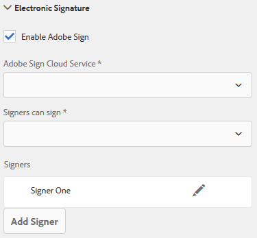

# 以{#using-adobe-sign-in-an-adaptive-form}的最適化形式使用Adobe Sign

啟用電子簽名(Adobe Sign)工作流程，以自動化簽名工作流程、簡化單一和多重簽名程式，以及從行動裝置電子簽署表格。

Adobe Sign為調適性表單提供電子簽名工作流程。 電子簽名可改善處理法律、銷售、薪資、人力資源管理等領域檔案的工作流程。

在典型的Adobe Sign和適應性表單場景中，用戶填充適應性表單以申請服務。 例如，房貸和信用卡申請需要所有借款人和共同申請人的合法簽名。 若要針對類似情況啟用電子簽名工作流程，您可以將Adobe Sign與AEM Forms整合。 還有幾個例子，您可以使用Adobe Sign:

* 透過完全自動化的提案、報價和合約流程，從任何裝置完成交易。
* 更快完成人力資源流程，為您的員工提供數位體驗。
* 縮短合約週期時間，並加快廠商上線速度。
* 建立可自動化一般程式的數位工作流程。

Adobe Sign與AEM Forms的整合支援：

* 單一和多使用者簽署工作流程
* 循序和同步簽署工作流程
* 表單內和表單外簽署體驗
* 以匿名或登入使用者身分簽署表格
* 動態簽署流程(與AEM Forms工作流程整合)
* 透過知識庫、電話和社交個人檔案進行驗證

瞭解使用Adobe Sign與最適化表單](https://medium.com/adobetech/using-adobe-sign-to-e-sign-an-adaptive-form-heres-the-best-way-to-do-it-dc3e15f9b684)建立更佳簽署體驗的最佳範例。[

## 必備條件 {#prerequisites}

在以最適化形式使用Adobe Sign之前：

* 確保將AEM Forms雲服務配置為使用Adobe Sign。 如需詳細資訊，請參閱[將Adobe Sign與AEM Forms整合。](/help/forms/using/adobe-sign-integration-adaptive-forms.md)
* 讓簽署者的清單準備好。 您至少需要每個簽署者的電子郵件地址。

## 為自適應表單{#configure-adobe-sign-for-an-adaptive-form}配置Adobe Sign

執行以下步驟來為自適應表單配置Adobe Sign:

1. [編輯Adobe符號的最適化表單屬性](#enableadobesign)
1. [將Adobe Sign欄位新增至最適化表單](#addadobesignfieldstoanadaptiveform)
1. [啟用Adobe Sign的最適化表單](#enableadobsignforanadaptiveform)
1. [選擇Adobe SignCloud Service以適應形式](#selectadobesigncloudserviceforanadaptiveform)

1. [將Adobe Sign簽署者加入最適化表單](#addsignerstoanadaptiveform)
1. [為最適化表單選擇提交動作](#selectsubmitactionforanadaptiveform)

### 編輯Adobe Sign{#enableadobesign}的最適化表單屬性

為現有或新的自適應表單配置Adobe Sign的自適應表單屬性。

[建立Adobe的最適化表](/help/forms/using/working-with-adobe-sign.md#create-an-adaptive-form-for-adobe-sign) 單說明建立基本最適化表單的步驟。有關建立自適應表單時可用的其它選項，請參見[建立自適應表單](/help/forms/using/creating-adaptive-form.md)。

#### 為Adobe Sign建立自適應表單{#create-an-adaptive-form-for-adobe-sign}

執行以下步驟以建立適合Adobe Sign的表單：

1. 導覽至&#x200B;**[!UICONTROL Adobe Experience Manager]** > **[!UICONTROL Forms]** > **[!UICONTROL Forms與檔案]**。
1. 點選「**[!UICONTROL 建立]**」並選取「最適化表單」。 ****&#x200B;此時會顯示範本清單。 選擇模板並點選&#x200B;**[!UICONTROL Next]**。
1. 在&#x200B;**[!UICONTROL Basic]**&#x200B;標籤中：

   1. 指定最適化表單的&#x200B;**名稱**&#x200B;和&#x200B;**標題**。
   1. 選擇在使用AEM Forms配置Adobe Sign時建立的[配置容器](/help/forms/using/adobe-sign-integration-adaptive-forms.md#configure-adobe-sign-with-aem-forms)。

      >[!NOTE]
      >
      >**[!UICONTROL Adobe SignCloud Service]**&#x200B;下拉式清單會顯示您在此欄位中選取之組態容器中設定的雲端服務。 當您選擇「啟用Adobe Sign」選項時，**[!UICONTROL Adobe SignCloud Service]**&#x200B;下拉清單可在自適應表單屬性的&#x200B;**[!UICONTROL 電子簽名]**&#x200B;部分中找到。****

1. 在&#x200B;**[!UICONTROL 表單模型]**&#x200B;標籤中，選擇以下選項之一：

   * 選擇&#x200B;**[!UICONTROL 將表單模板關聯為記錄文檔模板]**&#x200B;選項，然後選擇記錄文檔模板。 如果您使用以表單範本為基礎的最適化表單，則傳送以進行簽署的檔案只會顯示以關聯表單範本為基礎的欄位。 它不會顯示最適化表單的所有欄位。
   * 選擇&#x200B;**[!UICONTROL 生成記錄文檔]**&#x200B;選項。 如果您使用啟用「記錄檔案」選項的最適化表單，則傳送供簽署的檔案會顯示最適化表單的所有欄位。

1. 點選&#x200B;**[!UICONTROL 建立。]** 會建立可簽署的最適化表單，可用來新增Adobe Sign欄位。

#### 編輯Adobe Sign的最適化表單{#editafsign}

執行以下步驟，在現有的自適應表單中使用Adobe Sign:

1. 導覽至&#x200B;**[!UICONTROL Adobe Experience Manager]** > **[!UICONTROL Forms]****[!UICONTROL Forms與檔案]**。
1. 選擇最適化表單，然後點選&#x200B;**[!UICONTROL 屬性]**。
1. 在&#x200B;**[!UICONTROL Basic]**&#x200B;標籤中，選擇在配置Adobe Sign與AEM Forms時建立的[配置容器](/help/forms/using/adobe-sign-integration-adaptive-forms.md#configure-adobe-sign-with-aem-forms)。
1. 在&#x200B;**[!UICONTROL 表單模型]**&#x200B;標籤中，選擇以下選項之一：

   * 選擇&#x200B;**[!UICONTROL 將表單模板關聯為記錄文檔模板]**&#x200B;選項，然後選擇記錄文檔模板。 如果您使用以表單範本為基礎的最適化表單，則傳送以進行簽署的檔案只會顯示以關聯表單範本為基礎的欄位。 它不會顯示最適化表單的所有欄位。
   * 選擇&#x200B;**[!UICONTROL 生成記錄文檔]**&#x200B;選項。 如果您使用啟用「記錄檔案」選項的最適化表單，則傳送供簽署的檔案會顯示最適化表單的所有欄位。

1. 點選&#x200B;**[!UICONTROL 儲存並關閉]**。 最適化表格已啟用給Adobe Sign。

### 將Adobe Sign欄位添加到最適化表單{#addadobesignfieldstoanadaptiveform}

Adobe Sign有各種欄位，可以放在適應性表格上。 這些欄位接受各種資料類型，例如簽名、縮寫簽名、公司或標題，並協助在簽署時收集額外資訊以及簽名。 您可以使用「Adobe Sign塊」元件以自適應形式將Adobe Sign欄位放在不同位置。

執行以下步驟，將欄位添加到自適應表單中並自定義與這些欄位相關的各種選項：

1. 將&#x200B;**Adobe Sign塊**&#x200B;元件從元件瀏覽器拖放到自適應表單。 Adobe Sign塊元件具有所有支援的Adobe Sign欄位。 預設情況下，它將&#x200B;**Signature**&#x200B;欄位添加到最適化表單中。

   

   依預設，已發佈的最適化表單中不會顯示Adobe Sign區塊。 只有簽署檔案才會顯示。 可以從「Adobe Sign塊」元件的屬性中更改「Adobe Sign塊」的可見性。

   >[!NOTE]
   >
   >* 使用Adobe Sign塊不是強制以自適應形式使用Adobe Sign的。 如果您不使用Adobe Sign區塊並新增簽署者的欄位，則會在簽署檔案底部顯示預設簽名欄位。
   >* 僅針對自動產生記錄檔案的適用表單使用Adobe Sign區塊。 如果您使用自訂XDP來產生記錄檔案或以表單範本為基礎的最適化表單，則不需要Adobe Sign區塊。

1. 選擇&#x200B;**Adobe Sign塊**&#x200B;元件並按一下&#x200B;**編輯** 表徵圖。 它顯示添加欄位和欄位格式外觀的選項。

   

   **A.選** 擇並添加Adobe Sign欄位。**B.將** Adobe Sign區塊展開為全螢幕檢視

1. 點選「**Adobe Sign欄位** 」圖示。 它顯示選擇和添加Adobe Sign欄位的選項。

   展開&#x200B;**Type**&#x200B;下拉式欄位以選取Adobe Sign欄位，並點選「完成」圖示，將選取的欄位新增至Adobe Sign區塊。 **Type**&#x200B;下拉式欄位包含「簽名」、「簽署者資訊」和「資料」欄位類型。 Adobe Sign與「類型」(Type)下拉式方塊中所列的AEM Forms支援欄位整合。 有關Adobe Sign欄位的詳細資訊，請參閱[Adobe Sign文檔](https://helpx.adobe.com/sign/help/field-types.html)。

   

   必須為欄位提供唯一名稱。 您也可以選取必要選項，將欄位標示為必填欄位。 除了&#x200B;**Name**&#x200B;和&#x200B;**Required**&#x200B;選項外，有些Adobe Sign欄位還有更多選項。 例如，遮色片和多行。 此外，請為每個Adobe Sign欄位指定唯一的名稱，無論這些欄位位於相同還是不同的Adobe Sign塊中。

### 啟用Adobe Sign的最適化表單{#enableadobsignforanadaptiveform}

現成可用，Adobe Sign無法啟用最適化表單。 執行下列步驟以啟用它：

1. 在「內容」瀏覽器中，點選「表單容器」**，然後點選「設定****」圖示。**&#x200B;它會開啟屬性瀏覽器並顯示最適化表單容器屬性。
1. 在屬性瀏覽器中，展開&#x200B;**電子簽名** accordion，然後選擇&#x200B;**啟用Adobe Sign**&#x200B;選項。 它讓Adobe Sign能夠適應形式。

### 選擇Adobe SignCloud Service和簽署順序{#selectadobesigncloudserviceforanadaptiveform}

您可以為一個Adobe Sign實例配置多個AEM Forms服務。 建議為每個功能（人力資源、財務等）分別提供一組服務。 它讓追蹤和報告已簽署的檔案變得更輕鬆。 例如，銀行有多個部門。 您可以為每個部門分別設定一個設定，以便更好地追蹤檔案。

檔案也可以有多個簽署者。 例如，信用卡申請可以有多個申請人。 銀行在開始處理申請之前要求所有申請人的簽名。 對於多重簽署者案例，您可以選擇依循序或同時順序簽署檔案。

執行下列步驟以選擇雲端服務和簽署順序：

1. 在「內容」瀏覽器中，點選「表單容器」**，然後點選「設定****」圖示。**&#x200B;它會開啟屬性瀏覽器並顯示最適化表單容器屬性。
1. 在屬性瀏覽器中，展開&#x200B;**電子簽名** accordion，然後選擇&#x200B;**啟用Adobe Sign**&#x200B;選項。 它讓Adobe Sign能夠適應形式。
1. 從已配置的Adobe SignCloud Services清單中選擇雲服務。

   如果&#x200B;**Adobe SignCloud Service**&#x200B;清單為空，請遵循[使用AEM Forms](/help/forms/using/adobe-sign-integration-adaptive-forms.md)文章配置Adobe Sign以配置服務。

   此下拉式清單列出「工具> **[!UICONTROL Cloud Services]** > **[!UICONTROL Adobe Sign]**」中`global`資料夾中存在的雲端服務。 此外，下拉式清單也會列出您在建立最適化表單時，在&#x200B;**[!UICONTROL 設定容器]**&#x200B;欄位中選取之資料夾中存在的雲端服務。

1. 從&#x200B;**「簽署者可以簽署**」對話方塊中選取簽署順序。 Adobe Sign歌手可依任何順序簽署最適化表單&#x200B;**Colluny** —— 接一個又一個簽署者，或&#x200B;**Montible** -。

   依循序序列，一次會有一個簽署者收到要簽署的表格。 簽署者完成簽署檔案後，表格會傳送給下一個簽署者，依此類推。

   同時，多位簽署者一次可以簽署表格。

1. [將「簽署者」新增至最適化](#addsignerstoanadaptiveform) 格式，並點選「完成」圖示以儲存變更。

### 將簽署者新增至最適化表單{#addsignerstoanadaptiveform}

最適化表單只能有一位或多位簽署者。 當您新增簽署者時，您也可以設定簽署者的驗證詳細資訊。 您也可以選取填表人和歌手是否是同一個人。 執行下列步驟以新增及提供簽署者的各種詳細資訊：

1. 在「內容」瀏覽器中，點選「表單容器」**，然後點選「設定****」圖示。**&#x200B;它會開啟具有最適化表單容器屬性的屬性瀏覽器。
1. 在屬性瀏覽器中，展開&#x200B;**電子簽名** accordion，然後選擇&#x200B;**啟用Adobe Sign**&#x200B;選項。 它讓Adobe Sign能夠適應形式。
1. 在「簽署者設定」下點選「新增簽署者&#x200B;****」。**** 它會將簽署者新增至最適化表單。您可以將多個Adobe Sign簽署者新增至最適化表單。
1. 

   按一下&#x200B;**Edit** 圖示，以指定與簽署者相關的下列資訊：

   * **標題：指** 定標題以唯一識別簽署者。
   * **簽署者和填寫表格的人員是否相同？：如果表** 格填 **寫者和第一個簽署者是同一人，請選取「是**」。如果選項設定為&#x200B;**No，則**&#x200B;請勿在最適化表單中使用簽名步驟元件。 如果表單包含「簽名步驟」元件，則欄位會自動設為「是」。
   * **簽署者電子郵件地址：** 指定簽署者的電子郵件地址。簽署者會收到指定電子郵件地址上的已簽署檔案／表格。 您可以選擇使用表單欄位、登入使用者的使用AEM者設定檔中提供的電子郵件地址，或手動輸入電子郵件地址。 這是必要的步驟。 另請注意，如果您只設定了一個簽署者，請確定簽署者的電子郵件地址與用來設定AEM雲端服務的Adobe Sign帳戶不相同。
   * **簽署者驗證方** 法：指定在開啟表單進行簽署前驗證使用者的方法。您可以選擇電話、知識庫和社交身分驗證。

   >[!NOTE]
   >
   >* 依預設，社交身分驗證提供使用Facebook、Google和LinkedIn進行驗證的選項。 您可以聯絡Adobe Sign支援，以啟用其他社交驗證提供者。

   * **Adobe Sign欄位以填寫或簽署：** 為簽署者選取Adobe Sign欄位。最適化表單可以有多個Adobe Sign欄位。 您可以選擇為簽署者啟用特定欄位。 該欄位顯示所有可用的Adobe Sign塊。 選擇塊時，將選擇塊的所有欄位。 您可以使用X圖示來取消選取欄位。

   

   上圖包含兩個範例Adobe Sign區塊：個人資訊和辦公室詳細資訊

   點選「完成」圖示。 簽章者已新增並設定。

### 選擇最適化表單{#selectsubmitactionforanadaptiveform}的提交操作

在您新增Adobe Sign欄位至最適化表單、從表單容器啟用Adobe Sign、選取Adobe SignCloud Service並新增Adobe Sign簽署者後，請為最適化表單選取適當的提交動作。 有關自適應表單提交操作的詳細資訊，請參閱[配置提交操作](/help/forms/using/configuring-submit-actions.md)。

此外，只有在所有簽署者簽署表格後，才會提交具備Adobe Sign功能的最適化表格。 您可以在表單入口網站的「待簽」區段中找到部分簽署的表單。 Adobe Sign配置服務會以[定期間隔](/help/forms/using/adobe-sign-integration-adaptive-forms.md)輪詢Adobe Sign伺服器以驗證簽名狀態。 如果所有簽署者都完成表單簽署，則會啟動提交動作服務並提交表單。 如果您使用自訂提交動作，而表單使用Adobe Sign，請更新自訂提交動作以使用提交動作服務。

>[!NOTE]
>
>最適化表單的資料會暫時儲存在Forms入口網站。 建議對FormsPortal](/help/forms/using/configuring-draft-submission-storage.md)使用[自訂儲存。 它可確保PII（個人識別資訊）資料不會儲存在伺服器AEM上。

您的表單簽署體驗已就緒。 您可以預覽表單以驗證簽署體驗。 在發佈的表格上，當簽署者透過電子郵件收到表格進行簽署時，會顯示「Adobe Sign區塊」欄位。 這種體驗也稱為表單外簽署體驗。 您也可以為第一個簽署者設定表單內簽署體驗，如需詳細步驟，請參閱[建立表單內簽署體驗](/help/forms/using/working-with-adobe-sign.md#create-in-form-signing-experience)。

## 為最適化表單{#configure-cloud-signatures-for-an-adaptive-form}設定雲端簽名

雲端數位簽名或遠端簽名是新一代的數位簽名，可跨桌上型電腦、行動裝置和網路運作。 並符合簽署者驗證的最高等級合規性與保證。 您可以使用雲端數位簽名來簽署調適性表格。

在[編輯Adobe符號的最適化表單屬性](#enableadobesign)後，請執行下列步驟，將雲端簽名欄位新增至最適化表單：

1. 將&#x200B;**Adobe Sign塊**&#x200B;元件從元件瀏覽器拖放到自適應表單。 Adobe Sign塊元件具有所有支援的Adobe Sign欄位。 預設情況下，它將&#x200B;**Signature**&#x200B;欄位添加到最適化表單中。

   

1. 選擇&#x200B;**Adobe Sign塊**&#x200B;元件並按一下&#x200B;**編輯** 表徵圖。 它顯示添加欄位和欄位格式外觀的選項。

   

   **A.選** 擇並添加Adobe Sign欄位。**B.將** Adobe Sign區塊展開為全螢幕檢視

1. 點選「**Adobe Sign欄位** 」圖示。 它顯示選擇和添加Adobe Sign欄位的選項。

   展開&#x200B;**Type**&#x200B;下拉式欄位以選取&#x200B;**數位簽章**，並點選「完成」圖示，將選取的欄位新增至Adobe Sign區塊。

   

   必須為欄位提供唯一名稱。

   使用下列功能，將數位簽名套用至最適化表單：

   * 雲端簽名：使用信任服務提供者托管的[數位ID](https://helpx.adobe.com/sign/kb/digital-certificate-providers.html)進行簽署。
   * Adobe Acrobat或Reader:下載並開啟含Adobe Acrobat或Reader的檔案，以使用智慧卡、USB Token或以檔案為基礎的數位ID進行簽署。

   將雲端簽名欄位新增至最適化表單後，請執行下列步驟以完成設定程式：

   * [啟用Adobe Sign的最適化表單](#enableadobsignforanadaptiveform)
   * [選擇Adobe SignCloud Service以適應形式](#selectadobesigncloudserviceforanadaptiveform)
   * [將Adobe Sign簽署者加入最適化表單](#addsignerstoanadaptiveform)
   * [為最適化表單選擇提交動作](#selectsubmitactionforanadaptiveform)

## 建立表單內簽署體驗{#create-in-form-signing-experience}

使用者也可以在填寫表單時簽署最適化表單。 此體驗也稱為表單簽署體驗。 表單簽署體驗僅適用於多重簽署者環境中的第一位歌手。 執行下列步驟，為最適化表單建立表單內簽署體驗：

1. [新增及設定「簽名步驟」元件](#add-and-configure-the-signature-step-component)。
1. [添加摘要步驟元件](#configure-the-thank-you-page-or-summary-step-component)。

### 添加和配置「簽名步驟」元件{#add-and-configure-the-signature-step-component}

使用「簽名步驟」元件提供電子簽署填寫表單的區域。 當轉譯包含「簽名步驟」元件的區段時，會顯示可簽名的PDF版本填寫表單。 「簽名步驟」元件會佔用表單的全寬。 建議在包含「簽名步驟」元件的部分上不使用任何其他元件。

執行以下步驟以配置「簽名步驟」元件：

1. 將&#x200B;**簽名步驟**&#x200B;元件從元件瀏覽器拖放到表單中。
1. 選擇新添加的「簽名」步驟元件，並點選「配置&#x200B;**** 」表徵圖。 它會開啟屬性瀏覽器並顯示「簽名」步驟屬性。 設定下列屬性：

   * **元素名稱**:指定元件的名稱。
   * **標題：** 指定元件的唯一標題。
   * **範本訊息：** 指定在載入簽名PDF時要顯示的訊息。Adobe Sign服務需要一些時間來準備和載入簽名PDF。
   * **簽署服務：** 選取 **Adobe** 簽名。
   * **使用舊版電子簽名元件**:如果您在 [AEM Forms工作區、AEM Forms應用程式或底層最適化表單具有舊版電子簽名元件，請選取](/help/forms/using/introduction-html-workspace.md)使用舊版電子簽名元 **** 件。
   * **配置**:選擇配置(Adobe SignCloud Service)。只有啟用了&#x200B;**使用舊版電子簽名元件**&#x200B;選項時，下拉框才可用。

   點選「完成」圖示以儲存變更。

   

   >[!NOTE]
   >
   >* 當您將&#x200B;**[!UICONTROL 簽名步驟]**&#x200B;元件拖放至表單時，**[!UICONTROL 簽署者與填寫表單的人員是否相同？]** 選項自動設定為「 **是」**。必須讓表單繼續運作。
   >* Adobe Sign啟用的最適化表單不支援使用「簽名步驟」元件之區段或面板上的「提交」按鈕。 您可以在手動提交的「簽名」步驟後添加摘要步驟，或在使用[Adobe Sign配置服務](/help/forms/using/adobe-sign-integration-adaptive-forms.md#configure-adobe-sign-scheduler-to-sync-the-signing-status)設定的時間間隔後觸發自動提交。

### 設定感謝頁面或摘要步驟元件{#configure-the-thank-you-page-or-summary-step-component}

**摘要步驟**&#x200B;元件會自動提交表單，在自定義的「摘要」頁中填入資訊，並顯示提交表單的摘要。 它也會在回訪地圖中取得所需資訊。 「摘要步驟」元件佔用表單的全寬。 建議在包含「摘要步驟」元件的部分上不使用任何其他元件。

現在，表單簽署體驗已就緒。 您可以預覽表單以驗證簽署體驗。

## 常見問題 {#frequently-asked-questions}

**問：您可以將最適化表單嵌入另一個最適化表單。嵌入式自適應表單是否可啟用Adobe Sign?**

**Ans:** 不，AEM Forms不支援使用可內嵌Adobe Sign式可調式簽署表單的可調式表單。

**問：當我使用進階範本建立最適化表單並開啟它進行編輯時，會出現錯誤訊息「電子簽名或簽署者未正確設定」。的雙曲餘切值。 如何解決錯誤資訊？**

**Ans：使用** 進階範本建立的最適化表單已設定為使用Adobe Sign。若要解決錯誤，請建立並選取Adobe Sign雲端組態，並為最適化表單設定Adobe Sign簽署者。

**問：我是否可在最適化表單的靜態文字元件中使用Adobe Sign文字標籤？**

**Ans:** 是的，您可以在文本元件中使用文本標籤，將Adobe Sign欄位添加到支援自適應表單的「記錄文檔  」（僅「自動生成記錄文檔」選項）中。要瞭解建立文本標籤的過程和規則，請參閱[Adobe Sign文檔](https://helpx.adobe.com/sign/help/text-tags.html)。 另請注意，最適化表單對文字標籤的支援有限。 您只能使用文字標籤來建立Adobe Sign區塊支援的欄位。

**問：AEM Forms提供Adobe Sign區塊和簽名步驟元件。這些功能是否可同時以自適應形式使用？**

**Ans:** 您可以在表單中同時使用這兩個元件。以下是使用這些元件的一些建議：

**Adobe Sign塊：** 您可以使用Adobe Sign塊在最適化表單的任意位置添加Adobe Sign欄位。此外，也有助於為簽署者指派特定欄位。 預覽最適化表單或發佈的Adobe Sign區塊時，預設不會顯示。 這些區塊僅在簽署檔案中啟用。 在簽署檔案中，只會啟用指派給簽署者的欄位。 Adobe Sign區塊可用於第一名及後續的簽署者。

**簽章步驟元件：** 您可以使用簽章步驟元件來建立表單簽署體驗。它只允許第一個簽署者在填寫表單時簽名。 當轉譯包含「簽名步驟」元件的區段時，會顯示可簽名的表單PDF版本。 通常是表單的最後一個或倒數第二個部分，後面接著是摘要元件。

