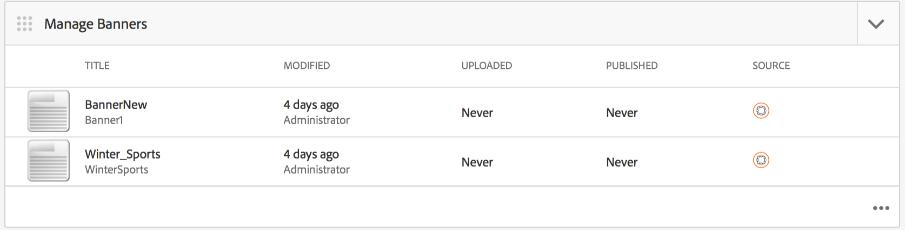

# AEM Mobile應用程式儀表板 {#aem-mobile-application-dashboard}

>[!NOTE]
>
>Adobe建議針對需要單頁應用程式架構用戶端轉換的專案使用SPA編輯器（例如React）。 [了解更多](/help/sites-developing/spa-overview.md).

您可以從AEM Mobile Application Dashboard或Control Center管理您的應用程式和行動應用程式內容。

You can drill into each tile in the Control Center to view or edit details by clicking the &#39;...&#39; in the bottom right corner.

>[!NOTE]
>
>You can rearrange the order of the tiles by clicking the tile&#39;s grabber icon (top left 9 dots). 訂單變更是使用者專屬的——個別使用者不同。

管理應用程式內容需要開發人員、內容製作者和管理員共同努力。 作者會控制頁面，而頁面則會以應用程式開發人員產生的範本和元件為基礎。

最後，管理員策略性地發佈更新的應用程式內容。

## 管理應用程式圖格 {#the-manage-app-tile}

The **Manage App** Tile displays available application information:

* 標題
* 說明
* 圖示
* 上次修改時間
* 上次修改者:

## The Manage Connection Tile {#the-manage-connection-tile}

「管 **理連線** 」方塊會顯示AEM Mobile On-Demand Services連線資訊：

* 庫配置名稱
* 專案名稱和ID
* 連接狀態

>[!NOTE]
>
>按一下右上方的齒輪，以設定Mobile On-Demand Cloud設定。
>
>See [Configuring Mobile On-Demand Services](/help/mobile/mobile-on-demand-associating-an-on-demand-app-to-cloud-configuration.md) for details.

## 管理實體 {#managing-entities}

這3個圖格提供應用程式內容狀態的概述：

* **橫幅**
* **文章**
* **集合**

每個圖格都可展開，按一下右下角的省略號(...)，提供更詳細的清單檢視。 這些清單檢視提供存取常用「行動隨選」動作（例如刪除、上傳和編輯屬性）的替代方式。

### The Manage Banners Tile {#the-manage-banners-tile}

The **Manage Banners** tile allows you to manage the content for a banner. The following information is displayed for a banner:

* 影像
* **TITLE**: name of the banner
* **已修改**: 上次在AEM中修改
* **已上傳**: 上次從AEM上傳
* **PUBLISHED**: last published request form AEM
* **SOURCE**: source (AEM local or remote from Mobile On Demand)

下列影像顯示「AEM Mobile應 **用程式儀表板** 」中的「管理橫幅」圖格：

>[!NOTE]
>
>See **[Managing Banners](/help/mobile/mobile-on-demand-managing-banners.md)**for creating, deleting, or updating the banners.

### The Manage Articles Tile {#the-manage-articles-tile}

The **Manage Articles** tile allows you to manage the content for an article. 文章會顯示下列資訊：

* 影像
* **標題**: 文章的名稱
* **已修改**: 上次在AEM中修改
* **已上傳**: 上次從AEM上傳
* **PUBLISHED**: last published request form AEM
* **SOURCE**: source (AEM local or remote from Mobile On-Demand)

The following image shows the **Manage Articles** tile in AEM Mobile Application Dashboard:

>[!NOTE]
>
>See [**Managing Articles **](/help/mobile/mobile-on-demand-managing-articles.md)for creating, deleting, or updating the articles.

### The Manage Collections Tile {#the-manage-collections-tile}

The **Manage Collections** tile allows you to manage the content for a collection. The following information is displayed for a collection:

* 影像
* **TITLE**: name of the collection
* **已修改**: 上次在AEM中修改
* **已上傳**: 上次從AEM上傳
* **PUBLISHED**: last published request form AEM
* **SOURCE**: source (AEM local or remote from Mobile On-Demand)

The following image shows the **Manage Collections** tile in AEM Mobile Application Dashboard:

>[!NOTE]
>
>See **[Managing Collections](/help/mobile/mobile-on-demand-managing-collections.md)**for creating, deleting, or updating the collections.

### 後續步驟 {#the-next-steps}

Once you are familiar with the application dashboard, see the following resources to create a mobile app:

* [應用程式建立和配置操作](/help/mobile/mobile-apps-ondemand-application-create-configure-action.md)
* [Associating an On-Demand App to a Cloud Configuration](/help/mobile/mobile-on-demand-associating-an-on-demand-app-to-cloud-configuration.md)
* [Content Management Actions](/help/mobile/mobile-apps-ondemand-manage-content-ondemand.md)

### 其他資源 {#additional-resources}

要瞭解管理員和開發人員的角色和責任，請參閱以下資源：

* [針對AEM Mobile隨選服務開發AEM內容](/help/mobile/aem-mobile-on-demand.md)
* [管理內容以使用AEM Mobile隨選服務](/help/mobile/aem-mobile.md)

