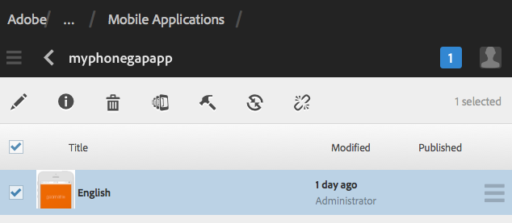
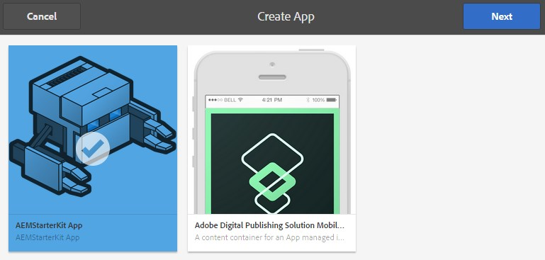

# 使用Apps Console{#creating-and-editing-apps-using-the-apps-console}建立和編輯應用程式

>[!NOTE]
>
>Adobe建議針對需要單頁應用程式架構用戶端轉譯（例如React）的專案使用SPA編輯器。 [了解更多](/help/sites-developing/spa-overview.md).

AEM行動應用程式開發程式認可擁有不同專業知識的使用者對行動應用程式的開發有所貢獻。 以下程式圖說明內容作者和應用程式開發人員執行工作的一般順序。

有關如何執行行銷人員工作的資訊會顯示在本頁面上。 有關開發人員任務的資訊，請參閱構建PhoneGap應用程式。

## 移動應用程式的結構{#the-structure-of-mobile-applications}

AEM Mobile提供建立行動應用程式的Phonegap應用程式藍圖。 藍圖定義您建立的應用程式結構。 應用程式包含以下項目：

* 根頁面。
* 應用程式的語言變化。
* 語言變異的首頁。

### Phonegap應用程式的根{#the-root-of-a-phonegap-app}

您在AEM中建立之行動應用程式的根頁面會顯示在應用程式主控台中。

根頁面儲存在建立應用程式時指定之應用程式的Destination Path屬性下方（預設路徑為/content/phonegap/apps）。 頁面名稱是應用程式的Name屬性。 例如，名為`myphonegapapp`的網站根頁面的預設URL為`http://localhost:4502/content/phonegap/apps/myphonegapapp.html`。

### PhoneGap應用程式的語言變異{#the-language-variation-of-a-phonegap-app}

根頁面的第一個子頁面是應用程式的語言變體。 每個頁面的名稱是建立應用程式的語言。 例如，英文是應用程式的英文變體名稱。

**注意：** 預設的PhoneGap Blueprint僅會建立英文應用程式。您的開發人員可修改Blueprint，以便建立更多語言變體。

語言頁面有兩個用途：

* 頁面內容是應用程式語言變異的快速頁面。
* 頁面屬性可控制應用程式的數個設計層面，例如用於要求內容更新的URL，以及關於連線至雲端組建和Adobe Analytics服務整合的資訊。

### 首頁{#the-home-page}

在開啟應用程式時，將顯示應用程式語言變化的首頁或index.html頁。首頁為用戶提供了指向應用程式中各頁的連結菜單。 段落系統可讓您將元件新增至頁面以建立內容。

## 建立行動應用程式{#creating-a-mobile-application}

行動應用程式以定義頁面結構和屬性的藍圖為基礎。 您可以配置以下應用程式屬性：

* **標題：** 應用程式標題。
* **目標路徑：** 儲存應用程式的存放庫位置。保留預設值，以根據應用程式名稱建立路徑。
* **名稱：** 預設值為已移除空格字元之Title屬性的值。CQ中會使用名稱來參照應用程式，例如代表應用程式的存放庫節點。
* **說明：** 應用程式的說明。
* **伺服器URL:** 為應用程式提供無線(OTA)內容更新的URL。預設值是用於建立應用程式（從外部化程式服務取用）的執行個體的發佈伺服器URL。 請注意，這必須是發佈伺服器例項，而非需要驗證的作者。

您也可以提供影像檔案作為應用程式縮圖、選取要使用的PhoneGap Build設定，然後選取要使用的行動應用程式分析設定。 此影像只會作為縮圖，在Experience Manager的行動應用程式主控台內呈現您的行動應用程式。

建置雲端服務及將AdobeMobile Services SDK外掛程式整合至您的應用程式中，已有其他（及選用）標籤。

* 建置：按一下「管理設定」，然後在這裡設定您的build.phonegap.com組建服務。 然後，您將可從下拉式清單中選取新建立的PhoneGap組建雲端服務。
* Analytics:按一下「管理設定」並設定您的[AdobeMobile Services SDK](https://docs.adobe.com/content/help/en/mobile-services/using/manage-app-settings-ug/configuring-app/download-sdk.html)雲端服務。 然後，您將可從下拉式清單中選取新建立的Mobile Service，以整合至您的行動應用程式。

>[!NOTE]
>
>開發人員可使用AEM PhoneGap Starter Kit建立應用程式並將其新增至主控台。

下列程式使用觸控式UI來建立行動應用程式。

1. 在邊欄上，按一下「應用程式」。
1. 按一下或點選「建立」圖示。

   

1. （可選）在「進階」標籤上，提供應用程式的說明，並視需要變更伺服器URL。
1. （可選）如果您正使用PhoneGap Build來編譯應用程式，請在「生成」頁簽上，選擇要使用的配置。

   若要建立PhoneGap組建設定，請按一下管理設定。

1. （選用）如果您使用SiteCatalyst來追蹤應用程式活動，請在Analytics標籤上選取要使用的設定。

   若要建立行動應用程式設定，請按一下管理設定。

1. （可選）要提供應用程式表徵圖，請按一下「瀏覽」按鈕，從檔案系統中選擇影像檔案，然後按一下「開啟」。
1. 按一下建立。

### 更改移動應用程式的屬性{#changing-the-properties-of-a-mobile-application}

建立行動應用程式後，您可以變更屬性。

#### 更改標題、說明和表徵圖{#change-the-title-description-and-icon}

1. 在導軌上，按一下或點選「應用程式」。
1. 選取要設定的應用程式，然後按一下「檢視頁面屬性」圖示。

   

1. 若要變更屬性值，請按一下或點選「編輯」圖示。

   

1. 設定基本和進階屬性，然後按一下或點選完成圖示。

   

#### 配置應用程式的語言變化{#configure-a-language-variation-of-the-application}

1. 在導軌上，按一下或點選「應用程式」。
1. 按一下，深入到您要在應用程式管理控制台中編輯的行動應用程式。 選擇要配置的應用程式的語言版本，然後按一下「查看應用程式屬性」表徵圖。

   

1. 若要變更屬性值，請按一下或點選「編輯」圖示。

   

1. 在「基本」、「進階」、「建置」和「分析」標籤上設定屬性，然後按一下或點選「完成」圖示。

   

### 編寫行動應用程式的內容{#authoring-the-content-of-a-mobile-application}

建立行動應用程式後，新增用作應用程式UI的內容。

1. 在導軌上，按一下或點選「應用程式」。
1. 按一下或點選應用程式，然後按一下或點選「英文」。
1. 編輯首頁，或根據需要添加子頁。

### 將內容移至行動應用程式{#moving-content-to-mobile-applications}

AEM發佈例項上的內容同步快取會作為行動應用程式的內容存放庫：

* 開發人員編譯應用程式時，應用程式中包含內容同步快取中的內容。
* 快取中的內容可用於安裝的移動應用程式，以更新應用程式內容。

行動應用程式包含「更新」命令，可下載及安裝更新的應用程式內容。 當應用程式實例發送更新請求時，內容同步確定自上次更新或安裝應用程式後更改的內容，並提供新內容。

要使更新的內容可供應用程式使用，請更新「內容同步」快取。 第一次更新快取時，會新增所有已發佈的內容。 後續更新只會新增自上次更新以來已變更的已發佈內容。

「內容同步」也會追蹤更新發生的時間。 透過此資訊，內容同步可決定要傳送至行動應用程式的快取更新。

在要更新快取的實例上執行以下過程。 例如，如果您的應用程式從發佈例項請求更新，請在發佈例項上執行程式。

1. 在導軌上，按一下或點選「應用程式」，然後按一下或點選您的應用程式。
1. 選擇閃屏頁面，然後按一下或點選「更新快取」表徵圖。

   

### 使用應用程式範本{#using-app-templates}

這項功能可與應用程式6.1 Feature Pack 2搭配使用，可讓您輕鬆運用現有應用程式範本，在AEM中建立新應用程式。

什麼是應用程式範本？ 將其想像為頁面範本和元件的集合，這些範本和元件代表應用程式的基準或基礎。
根據其他應用程式的範本建立新應用程式時，您會看到某個應用程式的起始點代表，該應用程式即為建立該應用程式的來源。

您必須有現有的行動應用程式範本（或已安裝應用程式範本的應用程式）才能使用此功能。

最新的AEM應用程式6.1範例套件包含更新版本的Geometrixx應用程式，內含應用程式範本。 或者，您也可以安裝StarterKit，該StarterKit還提供模板。

根據應用程式範本建立新應用程式的步驟：

1. 確定您已安裝最新AEM Apps 6.1功能套件和參考範例套件
1. 按一下左側邊欄中的「應用程式」 。

1. 按一下頂端的+建立按鈕，然後選取建立應用程式。
1. 顯示應用程式範本清單後，請選取一個：

1. 按一下下一步。
1. 提供應用程式ID和標題，但您可能也想加入名稱和說明。

   1. 此外，您也可以瀏覽AEM資產，將PNG（支援的PhoneGap圖示格式）提供為圖示。
   1. 回想一下，在「管理應用程式」方塊中建立應用程式後，您可以編輯這些欄位。 除了應用程式ID外，一旦設定了應用程式ID，您便無法加以變更。

1. 按一下「建立」按鈕，畫面會顯示2個選項，分別是「完成」（返回「應用程式目錄檢視」）或「管理應用程式」（開啟應用程式控制面板）。
1. 建立後，您應該會在應用程式目錄中看到列出的新應用程式：

1. 按一下應用程式以開啟，表示您已根據現有應用程式的範本成功建立新應用程式。

>[!NOTE]
>
>如果您從AEM解除安裝Geometrixx Outdoors參考應用程式套件，並根據其範本建立應用程式，該應用程式將無法繼續運作。 Geometrixx Outdoors應用程式可移除，但如果其他行動應用程式使用應用程式範本，則必須保留該應用程式範本。

## 探索範例Geometrixx Outdoors應用程式{#exploring-the-sample-geometrixx-outdoors-app}

Geometrixx Outdoors應用程式是示範預設PhoneGap應用程式藍圖和行動元件範例功能的範例PhoneGap應用程式。

若要開啟應用程式，請在邊欄按一下「行動應用程式」，然後選取「Geometrixx Outdoors應用程式」。

### 常見頁面功能 — Geometrixx行動應用程式{#common-page-features-geometrixx-mobile-app}

行動應用程式的每個頁面都包含下列功能：

* 返回上層頁面的返回按鈕。 請注意，首頁上不會顯示上一步按鈕。
* 可展開的邊欄，提供命令和連結的功能表：

   * 開啟「位置」頁面。
   * 開啟購物車。
   * 登入。
   * 更新應用程式。

* 段落系統，用於添加元件和建立內容。

### 首頁 — Geometrixx行動應用程式{#the-home-page-geometrixx-mobile-app}

首頁的內容由以下導航工具組成：

* 功能表清單元件，提供「齒輪」、「評論」、「新聞」和「關於美國」子頁面的連結。
* 滑動轉盤元件可展示子頁面。

### 齒輪頁面 — Geometrixx行動應用程式{#the-gear-page-geometrixx-mobile-app}

齒輪頁面可讓使用者存取產品頁面。 菜單清單元件提供對齒輪頁子頁的訪問。 子頁面是網站所特有的產品類別。

* 季數
* 服裝
* 性別
* 活動

每個類別頁面使用與齒輪頁面相同的內容結構。 轉盤可讓您存取屬於產品子類別的子頁面。 子類別頁面包含提供產品頁面連結的產品清單。

### 產品頁面 — Geometrixx行動應用程式{#the-products-page-geometrixx-mobile-app}

「產品」頁面及其子頁面的階層，為產品頁面實作分類系統。 階層的每個分支中的最低頁面都是包含ng產品元件的產品頁面。

「產品」頁面不適用於應用程式使用者。 齒輪頁面提供每個產品頁面的存取權。

### 檢閱頁面 — Geometrixx行動應用程式{#the-reviews-page-geometrixx-mobile-app}

包含返回按鈕。 段落系統允許您添加元件。

使用應用程式時，可從英文頁面的輪播中取得「檢閱」頁面。

### 新聞頁面 — Geometrixx行動應用程式{#the-news-page-geometrixx-mobile-app}

包含返回按鈕。 段落系統允許您添加元件。

使用應用程式時，可從英文頁面的輪播中取得「新聞」頁面。

### 關於使用者頁面 — Geometrixx行動應用程式{#the-about-us-page-geometrixx-mobile-app}

「關於us」頁包含多個兩列行元件。 每欄都包含影像或文字元件。 元件是可編輯的，段落系統允許您添加元件。

使用應用程式時，可從英文頁面的輪播取得「關於使用中」頁面。

### 位置頁面 — Geometrixx行動應用程式{#the-locations-page-geometrixx-mobile-app}

「位置」頁包含「位置」元件。

使用應用程式時，「位置」頁可從英文頁的菜單清單中使用。

## 行動元件範例{#sample-mobile-components}

編寫行動應用程式的頁面時，Sidekick會立即提供數個元件。 這些元件屬於PhoneGap元件組。

### 滑動轉盤{#swipe-carousel}

「滑動轉盤」元件是用於顯示及導覽網站頁面的工具。 元件包含輪播，可在頁面連結清單上方的頁面中循環瀏覽影像。 編輯元件以指定要公開的頁面以及輪播的行為。

請注意，影像會以特定方式顯示在與影像相關聯的頁面的輪播中。 當頁面未與影像關聯時，只會顯示連結清單。

**轉盤屬性索引標籤**

設定輪播的行為：

* 播放速度：每個影像在顯示下一個影像之前的顯示時間（毫秒）。
* 轉換時間：影像轉變的動畫持續時間（毫秒）。
* 控制項樣式：用於在影像之間移動的控制項的類型。

**「清單屬性」頁簽**

指定頁面清單的產生方式：

* 使用：用來指定要包含在輪播中的頁面的方法。 請參閱建立頁面清單。
* 訂購者：選取用於排序頁面清單的頁面屬性。 例如，選取jcr:title ，依標題字母排序頁面。
* 限制：要包含的頁數上限。 此屬性適用於以搜尋為基礎來建立頁面清單的方法。

#### 建立頁面清單{#building-the-page-list}

「滑動轉盤」元件為「使用建立清單」屬性提供下列值。 編輯對話方塊會根據您選取的值而變更：

**子頁面**

元件會列出特定頁面的所有子頁面。 選取此值後，請在「子頁」(Child Pages)頁簽上選擇該頁，或指定不要列出當前頁的子頁的值。

**固定清單**

指定包含的頁面清單。 選擇此值後，在選擇「固定清單」時顯示的「固定清單」頁簽上配置清單：

* 若要新增頁面，請按一下「新增項目」 ，然後瀏覽該頁面。
* 使用上箭頭和下箭頭表徵圖將頁面移到清單中。
* 按一下移除按鈕，從清單中移除頁面。

Order By屬性不會影響固定清單的順序。

**搜尋**

使用關鍵字搜尋的結果填入清單。 搜尋會在您指定之頁面的子項中執行：

1. 要指定搜索的根頁面，請使用「開始於」屬性選擇頁面路徑。 指定當前頁面下方沒有要搜索的路徑。
1. 在「搜索查詢」屬性中，輸入搜索關鍵字。

**進階搜尋**

使用[Querybuilder](/help/sites-developing/querybuilder-api.md)查詢填入清單。

### 影像 {#image}

將影像新增至您的應用程式內容。

### 文字 {#text}

將RTF新增至您的應用程式內容。

### 商店位置 {#store-locations}

「商店位置」元件為用戶提供查找商店的工具：

* 搜尋
* 接近或遠離設備的GPS座標的位置清單。

元件要求儲存庫包含每個儲存庫的位置資訊。 範例位置會安裝在/etc/commerce/locations/adobe節點。 

### 兩列行{#two-column-row}

可讓您將並排元件新增至頁面。

