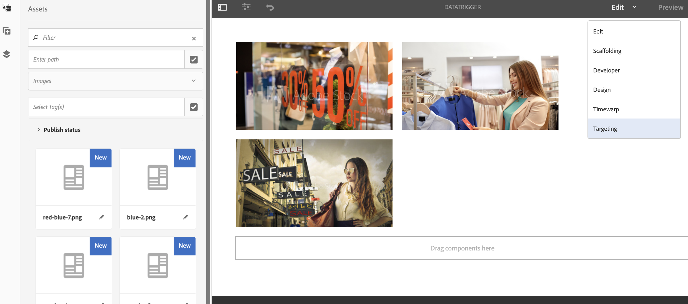

# 資料觸發的資產變更{#data-triggered-asset-change}

## 使用案例說明 {#use-case-description}

此使用案例範例說明如何根據您所在位置的天氣，達成個人化內容。

下列AEM Screens專案運用AEM個人化，其中包含ContextHub、區段引擎和內容定位UI。

此使用案例可根據每個地點的當前天氣(如果天氣為：

* *陽光明媚，它展示夏裝*
* *寒冷，它顯示冬衣*

>[!NOTE]
>
>為了展示，此使用案例會擷取您的地理位置，以展示內容更新。 您可以在不同藍本中手動更新地理位置檢視輸出。

### 先決條件 {#preconditions}

開始此使用案例之前，請務必瞭解：

* [個性化](/help/sites-administering/personalization.md)
* [設定ContextHub](/help/sites-administering/contexthub-config.md)
* [使用ContextHub設定區段](/help/sites-administering/segmentation.md)
* [使用定位模式製作目標內容](/help/sites-authoring/content-targeting-touch.md)

### 主要操作者 {#primary-actors}

內容作者

## 基本流：設定專案 {#basic-flow-setting-up-the-project}

請依照下列步驟來設定展示資料觸發的資產變更的專案：

1. 建立名為 **DataTriggerAsset的AEM Screens專案**，如下所示。

   

1. **建立序列渠道**

   1. 選取「 **Channels** 」檔案夾，然後按 **一下「建立** 」以開啟精靈以建立渠道。
   1. 從精 **靈中選取「序列渠道** 」，並建立標題為 **DataTrigger的渠道**。
   

1. **新增內容至序列頻道**

   1. 選取頻道 **DataTrigger**。
   1. 按一 **下動作列** 中的「編輯」以開啟編輯器。 將幾個資產拖放至您的渠道。
   

   >[!NOTE]
   >
   >您只能將預設影像新增至編輯器。 在步驟(6)中切換至定位模式時，您要取代的影像必須新增至編輯器。

1. **設定ContextHub和定位組態**

   1. 導覽至 **DataTriggerAsset** —> **Channels** —> **DataTrigger** ，然後從操作欄 **** 中按一下Properties。
   1. 按一 **下「個人化** 」標籤。
   

1. **新增ContextHub和定位組態**

   1. 為進行示範，請下載以下內容套件。
   1. 將套件下載到AEM例項後，您必須設定ContextHub和區段路徑：
   * 對於 **ContextHub**，請將路徑設定為： ***/libs/settings/cloudsettings/legacy/contexthub***
   * 對於 **區段路徑**，請將路徑設定為： ***/conf/data-triggers/settings/wcm/segments***
   資料觸發器

   [取得檔案](assets/data-triggers-1_00.zip)

   >[!NOTE]
   >
   >若要瞭解如何設定ContextHub和區段，請參閱：
   >
   >* [設定ContextHub](/help/sites-administering/contexthub-config.md)
   >* [使用ContextHub設定區段](/help/sites-administering/segmentation.md)

   

   按一 **下儲存並關閉**。

1. **切換至定位模式**

   1. 導覽至「 **DataTriggerAsset** >渠道 **>** DataTrigger **」，然後從動作列****** 按一下「編輯EditTrigger」。
   1. 從「編 **輯** 」下方的選單列選取「 **定位」**。
   

1. **新增目標內容**

   1. 在 **BRAND** 中選取「資料觸發器 **」，在ACTIVITY中選取「**季節性資料觸發器」** * ****。
   1. 按一下「開 **始定位」**
   

1. **定義目標元件**

   1. 選擇您要具有目標內容的元件。
   1. 按一下 **Target** 按鈕，以啟用該元件的定位。
   1. 選取側欄「觀眾」中的變更，並視需要調整內容，以定義每 **個變** 更的內容。
   >[!NOTE]
   >
   >若要在編輯 **器中隱藏** 「資產」面板，您必須按一下右側面板上的左箭頭，如下圖所示。

   

## 查看結果 {#viewing-the-results}

完成上述步驟後，請進一步預覽並檢視結果：

1. 從編輯 **器按一下** 「預覽」。

   

1. 若要展示影像會如何變更，視您所在區域的位置和溫度而定，您可以手動按一下ContextHub圖示，如下所示。

   一旦您更新位置，就會擷取該區域的溫度，影像會以冬季選取範圍更新，並取代夏季選取範圍影像。

   

