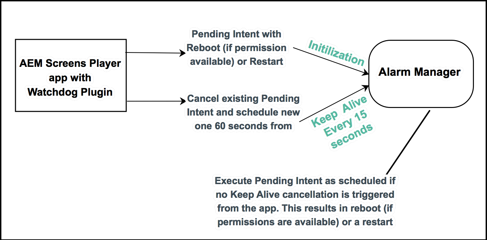

# 實作Android Player {#implementing-android-player}

Watchdog ****** （監視程式）是從當機中恢復播放器的解決方案。 應用程式需要向監視程式服務註冊，然後定期向其處於活動狀態的服務發送消息。 如果監視程式服務未在規定時間內收到保持活動消息，則服務會嘗試重新啟動設備以進行乾淨的恢復（如果它具有足夠的權限）或重新啟動應用程式。

## 實作Android Watchdog {#implementing-android-watchdog}

由於Android的架構，重新啟動裝置需要應用程式具備系統權限。 為此，您需要使用製造商的簽名密鑰來簽署應用程式，否則看門狗會重新啟動播放器應用程式，而不會重新啟動裝置。

### 使用製造商金鑰的Android標誌 {#signage-of-android-apks-using-manufacturer-keys}

若要存取Android的某些特權API，例如 *PowerManager* 或 *HDMIControlServices*，您必須使用製造商的金鑰簽署android apk。

>[!CAUTION]
>
>先決條件：
>
>您應先安裝Android SDK，然後再執行下列步驟。

請依照下列步驟，使用製造商的金鑰簽署Android應用程式：

1. 從Google play或 [AEM Screens Player下載頁面下載應用程式](https://download.macromedia.com/screens/) 。
1. 從製造商取得平台金鑰以取得 *pk8* 和 *pem* 檔案

1. 使用尋找~/Library/Android/sdk/build-tools -name &quot;apksigner&quot;，在android sdk中找到apksigner工具
1. &lt;pathto> /apksigner sign —key platform.pk8 —cert platform.x509.pem aemscreensplayer.apk
1. 在Android sdk中尋找郵遞區號對齊工具的路徑
1. &lt;pathto> /zipalign -fv 4 aemscreensplayer.apk aemscreensalfixed.apk
1. 使用 ***adb安裝將aemscreensaldium*** .apk安裝到設備

## Android Watchdog實作 {#android-watchdog-implementation}

跨Android監視程式服務是使用 *AlarmManager以cordova增效模組實作*。

下圖顯示了監視程式服務的實現：

**1. 初始化** ：在初始化cordova增效模組時，會檢查權限，以查看我們是否擁有系統權限，進而查看重新啟動權限。 如果滿足這兩個條件，則會建立「待重新啟動的意圖」，否則會建立「待重新啟動的意圖」（基於其「啟動活動」）。

**2. Keep Alive Timer** A keep alive timer用於每15秒觸發一個事件。 在此情況下，您必須取消現有的待定意圖（以重新啟動或重新啟動應用程式），並在相同的60秒內註冊新的待定意圖（實際上是延遲重新啟動）。

>[!NOTE]
>
>在Android中， *AlarmManager* 用於註冊 *pendingIntents* ，即使應用程式當機且其警報傳送不精確於API 19(Kitkat)，仍可執行。 在計時器的間隔和 *AlarmManager的pendingIntent的警報之間**保持一定間隔* 。

**3. 應用程式當機** —在發生當機時，註冊於AlarmManager的「待重新啟動的pendingIntent for Reboot」不再重設，因此會執行應用程式的重新啟動或重新啟動（視cordova增效模組初始化時的可用權限而定）。
