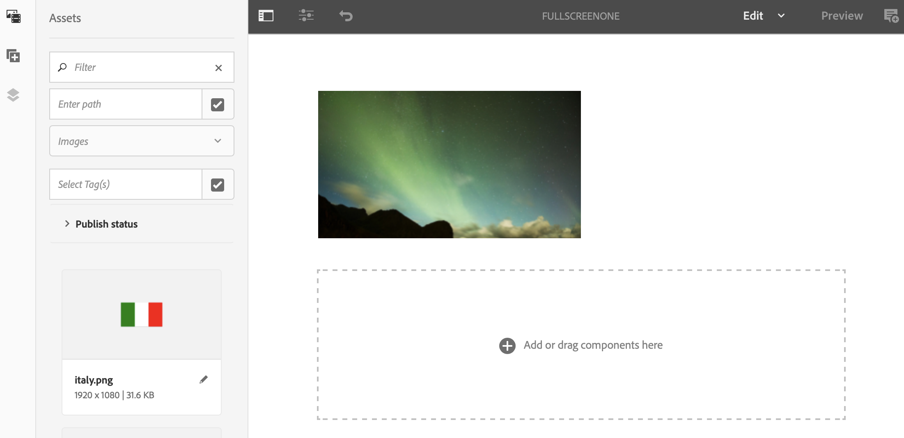
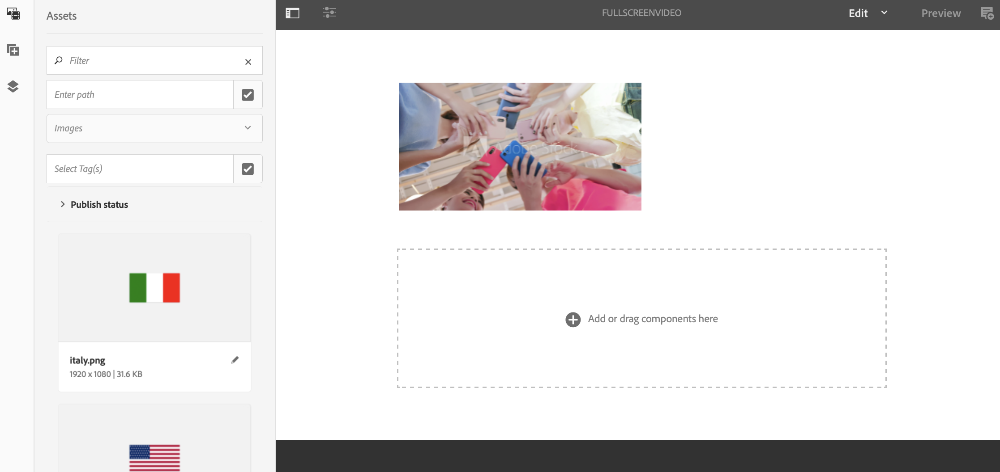

# 多區域到單區域接管環路{#single-zoneto-multizone}

## 使用案例說明 {#use-case-description}

本節說明如何設定與單一區域佈局通道交替的多區域佈局通道的使用案例示例。 每個頻道都有順序排列的影像／視訊資產。

### 先決條件 {#preconditions}

開始此使用案例之前，請務必瞭解如何：

* **[建立和管理渠道](/help/screens/managing-channels.md)**
* **[建立和管理位置](/help/screens/managing-locations.md)**
* **[建立和管理計畫](/help/screens/managing-schedules.md)**
* **[裝置註冊](/help/screens/device-registration.md)**

### 主要操作者 {#primary-actors}

內容作者

## 設定專案 {#setting-up-the-project}

請依照下列步驟設定專案：

1. 建立名為 **TakeoverLoop的AEM Screens專案**，如下所示。

   >[!NOTE]
   >
   >若要進一步瞭解如何在AEM畫面中建立和管理專案，請參閱「 [建立專案」](/help/screens/creating-a-screens-project.md)。

   

1. **建立分割畫面頻道**

   1. 選取「 **Channels** 」檔案夾，然後按 **一下動作列中的「建立** 」，以開啟精靈以建立渠道。
   1. 從 **精靈中選取「左側列分割螢幕色版** 」，並建立名為「多區域 **配置」的色版**。

      

   1. 選取「 **MultiZoneLayout** 」頻道，然後從動作列按 **一下「編輯** 」以開啟編輯器。 將資產拖放至每個區域。 下列範例顯示頻道中的視訊、影像和文字橫幅，如下所示。
      

1. **建立包含4張影像的2X2頻道**

   1. 選取「 **Channels** 」檔案夾，然後按 **一下動作列中的「建立** 」，以開啟精靈以建立渠道。

   1. 從 **精靈中選取「2X2分割畫面頻道** 」範本，並建立名為 **TwobyTwoChannel的頻道**。

      
   1. 選取色版，然後從動 **作列按一下「編輯** 」，以開啟編輯器，並將四個影像（四個不同區域）拖放至該色版，如下所示。
      

1. **建立1X2分割螢幕色版及兩張影像**

   1. 選取「 **Channels** 」檔案夾，然後按 **一下動作列中的「建立** 」，以開啟精靈以建立渠道。

   1. 從 **精靈中選取1X2分割畫面頻道範本** ，並建立名為 **OnebyTwoChannel的頻道**。

      
   1. 選取色版，然後從動 **作列按一下「編輯** 」，以開啟編輯器，並將兩個影像（兩個不同的區域）拖放至該色版，如下所示。
      

1. **使用全螢幕影片建立頻道**

   1. 選取「 **Channels** 」檔案夾，然後按 **一下動作列中的「建立** 」，以開啟精靈以建立渠道。

   1. 從精 **靈中選取「序列頻道** 」範本，並建立標題為「全螢幕 **視訊」的頻道**。

      
   1. 選取頻道，然後從動 **作列按一下「編輯** 」，以開啟編輯器，並將視訊元件拖放至該頻道，然後新增所要的視訊，如下所示。
      