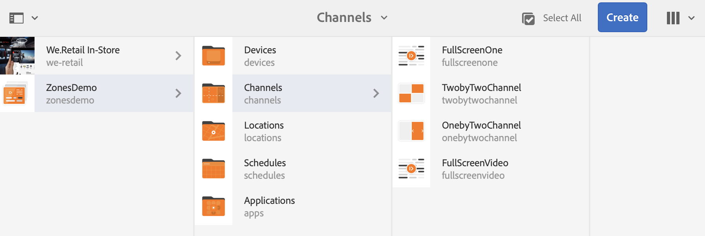

# 單區域到多區域接管 {#single-zoneto-multizone}

## 使用案例說明 {#use-case-description}

本節說明如何設定與單一區域佈局通道交替的多區域佈局通道的使用案例示例。 每個頻道都有順序排列的影像／視訊資產。

### 先決條件 {#preconditions}

開始此使用案例之前，請務必瞭解如何：

* **[建立和管理渠道](/help/screens/managing-channels.md)**
* **[建立和管理位置](/help/screens/managing-locations.md)**
* **[建立和管理計畫](/help/screens/managing-schedules.md)**
* **[裝置註冊](/help/screens/device-registration.md)**

### 主要操作者 {#primary-actors}

內容作者

## 設定專案 {#setting-up-the-project}

請依照下列步驟設定專案：

1. 建立名為 **ZonesDemo的AEM Screens專案**，如下所示。

   >[!NOTE]
   >
   >若要進一步瞭解如何在AEM畫面中建立和管理專案，請參閱「 [建立專案」](/help/screens/creating-a-screens-project.md)。

   

1. **使用一個影像建立序列色版**

   1. 選取「 **Channels** 」檔案夾，然後按 **一下動作列中的「建立** 」，以開啟精靈以建立渠道。
   1. 從精靈 **中選取「順序渠道** 」，並建立標題為 **FullScreenOne的渠道**。

      
   1. 選取色版，然後從 **動作列按一下** 「編輯」，以開啟編輯器，並拖放影像至該色版，如下所示。
      

1. **建立包含4張影像的2X2頻道**

   1. 選取「 **Channels** 」檔案夾，然後按 **一下動作列中的「建立** 」，以開啟精靈以建立渠道。

   1. 從 **精靈中選取「2X2分割畫面頻道** 」範本，並建立名為 **TwobyTwoChannel的頻道**。

      
   1. 選取色版，然後從動 **作列按一下「編輯** 」，以開啟編輯器，並將四個影像（四個不同區域）拖放至該色版，如下所示。
      

1. **建立1X2分割螢幕色版及兩張影像**

   1. 選取「 **Channels** 」檔案夾，然後按 **一下動作列中的「建立** 」，以開啟精靈以建立渠道。

   1. 從 **精靈中選取1X2分割畫面頻道範本** ，並建立名為 **OnebyTwoChannel的頻道**。

      
   1. 選取色版，然後從動 **作列按一下「編輯** 」，以開啟編輯器，並拖放兩個影像（兩個不同的區域）至該色版，如下所示。
      

1. **使用全螢幕影片建立頻道**

   1. 選取「 **Channels** 」檔案夾，然後按 **一下動作列中的「建立** 」，以開啟精靈以建立渠道。

   1. 從精 **靈中選取「序列頻道** 」範本，並建立標題為「全螢幕 **視訊」的頻道**。

      
   1. 選取頻道，然後從動 **作列按一下「編輯** 」，以開啟編輯器，並將視訊元件拖放至該頻道，然後新增所要的視訊，如下所示。
      

## 設定接管通道以從單區域過渡到多區域 {#takeover-channel-setup}

1. **編輯單區域通道進行多區域接管**

   1. 選取您在步&#x200B;**驟1中建立的頻道(FullScreenOne)** 。
   1. 從動 **作列按一下** 「編輯」以開啟編輯器。 將兩個頻道元件和一個視訊元件拖放至編輯器。
   

1. **填入新增至FullScreenOne頻道的元件**

   1. 從 **FullScreenOne的編輯器中選擇第一個渠道元件** ，然後按一下 **Configure** （配置）以指向在前面步驟中建立的渠道。 將「頻道路徑」中的頻道路徑 **新增至頻道元件** ，並將視訊拖放至視訊元件，如下所示。
   

1. **在轉換時設定頻道的持續時間**

   >[!NOTE]
   >
   >依預設，資產會在每8秒後轉換，但如果您想要資產在特定時間段後轉換，請遵循下列步驟。

   1. 從 **FullScreenOne的編輯器中選取第二個頻道元件** ，然後按一下「 **設定** 」，以設定此頻道的持續時間。 同樣地，請設定頻道2的持續時間，如下所示。
在此範例中，時間設定為3秒。
   

## 預覽結果 {#previewing-result}

您可以按一下編輯 **器中的** 「預覽」，並檢查資產將如何從單一區域轉換為多區域。

