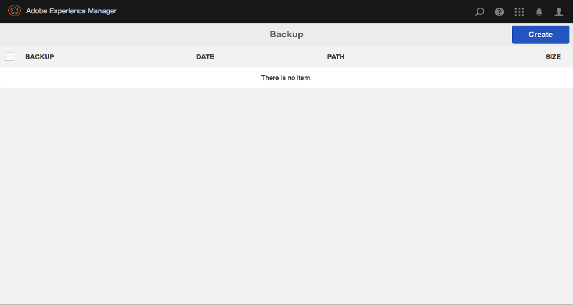

# 備份和還原{#backup-and-restore}

備份和還原AEM中的儲存庫內容有兩種方式：

* 您可以建立存放庫的外部備份，並將其儲存在安全位置。 如果儲存庫出現故障，您可以將其還原為上一個狀態。
* 您可以建立內部版本的存放庫內容。 這些版本與內容一起儲存在儲存庫中，因此您可以快速還原已更改或刪除的節點和樹。

## 一般 {#general}

此處介紹的方法適用於系統備份和恢復。

如果您需要備份和/或恢復丟失的少量內容，則不一定需要恢復系統：

* 您可以透過套件從其他系統擷取資料
* 或者，在臨時系統上恢復備份，建立內容包，然後在缺少此內容的系統上部署它。

有關詳細資訊，請參閱下面的[包備份](/help/sites-administering/backup-and-restore.md#package-backup)。

## 計時 {#timing}

請勿與資料存放區垃圾收集並行執行備份，因為這可能會損害兩個程式的結果。

## 離線備份{#offline-backup}

您始終可以執行離線備份。 這需要AEM停機，但與線上備份相比，在所需時間方面會相當有效。

在大多數情況下，您將使用檔案系統快照建立當時儲存的只讀副本。 要建立離線備份，請執行以下步驟：

* 停止應用程式
* 建立快照備份
* 啟動應用程式

由於快照備份通常只需幾秒鐘，因此整個停機時間不到幾分鐘。

## 聯機備份{#online-backup}

此備份方法可建立整個儲存庫的備份，包括其下部署的任何應用程式，如AEM。 備份包括內容、版本歷史記錄、配置、軟體、Hotfix、自定義應用程式、日誌檔案、搜索索引等。 如果使用群集，並且共用資料夾是`crx-quickstart`的子目錄（物理上或使用軟連結），則還備份共用目錄。

您可以在以後恢復整個儲存庫（以及任何應用程式）。

此方法以「熱」或「線上」備份的形式運行，以便在儲存庫運行時執行。 因此，在備份運行時，該儲存庫可用。 此方法適用於預設的Tar儲存型存放庫例項。

建立備份時，您有以下選項：

* 使用AEM整合備份工具備份到目錄。
* 使用檔案系統快照備份到目錄

在任何情況下，備份都會建立儲存庫的映像（或快照）。 然後，系統備份代理應注意將此映像實際傳輸到專用備份系統（磁帶機）。

>[!NOTE]
>
>如果在具有自定義Blobstore配置的AEM實例上使用AEM Online Backup功能，建議將資料儲存的路徑配置為「 `crx-quickstart`」目錄之外，並單獨備份資料儲存。

>[!CAUTION]
>
>聯機備份只備份檔案系統。 如果將儲存庫內容和/或儲存庫檔案儲存在資料庫中，則該資料庫需要單獨備份。 如果您正在將AEM與MongoDB搭配使用，請參閱有關如何使用[MongoDB本機備份工具](https://docs.mongodb.org/manual/tutorial/backup-with-mongodump/)的文檔。

### AEM線上備份{#aem-online-backup}

儲存庫的線上備份可讓您建立、下載和刪除備份檔案。 它是「熱」或「線上」備份功能，因此可以在儲存庫正常以讀寫模式使用時執行。

>[!CAUTION]
>
>請勿與[資料存放區垃圾收集](/help/sites-administering/data-store-garbage-collection.md)或[修訂清理](/help/sites-deploying/revision-cleanup.md#how-to-run-offline-revision-cleanup)同時執行AEM線上備份。 這將對系統效能產生負面影響。

啟動備份時，可以指定&#x200B;**目標路徑**&#x200B;和/或&#x200B;**延遲**。

**目** 標路徑備份檔案通常保存在存放Quickstart Jar檔案(.jar)的資料夾的父資料夾中。例如，如果AEM jar檔案位於/InstallationKits/AEM下，則備份將在/InstallationKits下生成。 您也可以將目標指定到您選擇的位置。

如果&#x200B;**TargetPath**&#x200B;是目錄，則會在此目錄中建立儲存庫的映像。 如果同一目錄被多次（或始終）用於儲存備份，

* 儲存庫中修改的檔案在TargetPath中會相應修改
* 儲存庫中已刪除的檔案會在TargetPath中刪除
* 在儲存庫中建立的檔案是在TargetPath中建立的

>[!NOTE]
>
>如果將&#x200B;**TargetPath**&#x200B;設定為副檔名&#x200B;**.zip**&#x200B;的檔案名，則將儲存庫備份到臨時目錄，然後將此臨時目錄的內容壓縮並儲存在ZIP檔案中。
>
>這種方法不行，因為
>
>* 在備份過程中，它需要額外的磁碟儲存（臨時目錄加zip檔案）
>* 壓縮過程由儲存庫完成，可能會影響其效能。
>* 它會延遲備份過程。
>* 最多Java 1.6 Java只能建立大小高達4 GB的ZIP檔案。

>
>
如果您需要建立ZIP作為備份格式，則應備份到目錄，然後使用壓縮程式建立ZIP檔案。

**** DelayIderations（延遲）表示時間延遲（以毫秒為單位），因此不影響儲存庫效能。依預設，存放庫備份會以全速執行。 您可以減慢建立線上備份的速度，以便不會減慢其他任務的速度。

使用非常大的延遲時，請確保線上備份不要超過24小時。 如果有，請放棄此備份，因為它可能不包含所有二進位檔。\
1毫秒的延遲通常導致10%的CPU使用，而10毫秒的延遲通常導致3%的CPU使用。 總延遲（秒）的估計如下：儲存庫大小(MB)、延遲（毫秒）乘以2（如果使用了zip選項）或4（備份到目錄時）。 這意味著備份到200 MB儲存庫的目錄，延遲1毫秒，備份時間將增加約50秒。

>[!NOTE]
>
>有關該過程的內部詳細資訊，請參閱[AEM Online Backup Works](#how-aem-online-backup-works)。

要建立備份，請執行以下操作：

1. 以管理員身分登入AEM。

1. 轉至&#x200B;**工具 — 操作 — 備份。**
1. 按一下&#x200B;**建立**。備份控制台將開啟。

   

1. 在備份控制台上，指定&#x200B;**[目標路徑](#aem-online-backup)**&#x200B;和&#x200B;**[延遲](#aem-online-backup)**。

   

   >[!NOTE]
   >
   >備份控制台也可使用：
   >
   >
   >` https://<*hostname*>:<*port-number*>/libs/granite/backup/content/admin.html`

1. 按一下&#x200B;**Save**，進度欄將指示備份的進度。

   >[!NOTE]
   >
   >您可以隨時&#x200B;**取消**&#x200B;正在運行的備份。

1. 備份完成後，zip檔案將列在備份窗口中。

   

   >[!NOTE]
   >
   >可以使用控制台刪除不再需要的備份檔案。 在左窗格中選擇備份檔案，然後按一下&#x200B;**Delete**。

   >[!NOTE]
   >
   >如果已備份到目錄：備份過程完成後，AEM將不會寫入目標目錄。

### 自動化AEM線上備份{#automating-aem-online-backup}

如果可能，線上備份應在系統負載很小時（例如在上午）運行。

可以使用`wget`或`curl` HTTP客戶端自動執行備份。 以下示範如何使用curl自動備份的範例。

#### 備份到預設目標目錄{#backing-up-to-the-default-target-directory}

>[!CAUTION]
>
>在以下範例中，可能需要為您的執行個體設定`curl`命令中的各種參數；例如，主機名(`localhost`)、埠(`4502`)、管理密碼(`xyz`)和檔案名(`backup.zip`)。

```shell
curl -u admin:admin -X POST http://localhost:4502/system/console/jmx/com.adobe.granite:type=Repository/op/startBackup/java.lang.String?target=backup.zip
```

備份檔案/目錄在包含`crx-quickstart`資料夾的資料夾的父資料夾的伺服器上建立（與使用瀏覽器建立備份時相同）。 例如，如果已在`/InstallationKits/crx-quickstart/`目錄中安裝AEM，則會在`/InstallationKits`目錄中建立備份。

curl命令會立即傳回，因此您必須監視此目錄，才能查看zip檔案何時準備就緒。 在建立臨時目錄時（名稱以最終zip檔案的名稱為基礎），最後會壓縮此目錄。 例如：

* 產生的zip檔案名稱：`backup.zip`
* 臨時目錄的名稱：`backup.f4d5.temp`

#### 備份到非預設目標目錄{#backing-up-to-a-non-default-target-directory}

備份檔案/目錄通常建立在包含`crx-quickstart`資料夾的資料夾的父資料夾的伺服器上。

如果要將備份（按任意排序）保存到不同的位置，可以在`curl`命令中將絕對路徑&quot;設定為`target`參數。

例如，要在`/Backups/2012`目錄中生成`backupJune.zip`:

```shell
curl -u admin:admin -X POST http://localhost:4502/system/console/jmx/com.adobe.granite:type=Repository/op/startBackup/java.lang.String?target=/Backups/2012/backupJune.zip"
```

>[!CAUTION]
>
>使用其他應用程式伺服器時（如JBoss），線上備份可能無法如預期運作，因為目標目錄不可寫。 在此情況下，請聯繫支援。

>[!NOTE]
>
>也可以使用AEM](/help/sites-administering/jmx-console.md)提供的MBean觸發[備份。

### 檔案系統快照備份{#filesystem-snapshot-backup}

此處描述的程式特別適用於大型存放庫。

>[!NOTE]
>
>如果要使用此備份方法，您的系統必須支援檔案系統快照。 例如，對於Linux，這意味著您的檔案系統應放置在邏輯卷上。

1. 在上部署檔案系統AEM的快照。

1. 裝載檔案系統快照。
1. 執行備份並卸載快照。

### AEM Online Backup如何工作{#how-aem-online-backup-works}

AEM Online Backup由一系列內部操作組成，以確保備份的資料和正在建立的備份檔案的完整性。 以下列出感興趣的人。

線上備份使用以下算法：

1. 建立zip檔案時，第一步是建立或尋找目標目錄。

   * 如果備份到zip檔案，則會建立臨時目錄。 目錄名稱以`backup.`開頭，以`.temp`結尾；例如`backup.f4d3.temp`。
   * 如果備份到目錄，則使用目標路徑中指定的名稱。 可以使用現有目錄，否則將建立新目錄。

      備份啟動時，目標目錄中會建立名為`backupInProgress.txt`的空檔案。 備份完成時，將刪除此檔案。

1. 檔案將從源目錄複製到目標目錄（或建立zip檔案時的臨時目錄）。 區段存放區會在資料存放區之前複製，以避免存放庫損毀。 建立備份時，會忽略索引和快取資料。 因此，備份中不包括來自`crx-quickstart/repository/cache`和`crx-quickstart/repository/index`的資料。 建立zip檔案時，進度列指標介於0%到70%之間，若未建立zip檔案，則為0%到100%。

1. 如果備份到預先存在的目錄，則目標目錄中的「舊」檔案將被刪除。 舊檔案是源目錄中不存在的檔案。

檔案將分四個階段複製到目標目錄：

1. 在第一個複製階段（建立zip檔案時的進度指標0% - 63%；若未建立zip檔案，則為0% - 90%），所有檔案都會在存放庫正常運作時複製。 該過程分為兩個階段：

   * 階段A — 除了資料存放區（有延遲）外，所有項目都會複製。
   * 階段B — 僅複製資料存放區（延遲）。

1. 在第二個複製階段（建立zip檔案時的進度指標63% - 65.8%；如果沒有建立zip檔案，則為90% - 94%），僅複製在源目錄中建立或修改的自第一個複製階段開始的檔案。 根據儲存庫的活動，這可能範圍從完全沒有檔案，到大量檔案（因為第一個檔案複製階段通常需要很長時間）。 複製過程與第一階段（具有延遲的階段A和階段B）類似。
1. 在第三個複製階段（建立zip檔案時的進度指標65.8% - 68.6%；如果沒有建立zip檔案，則為94% - 98%），僅複製在源目錄中自啟動第二個複製階段以來建立或修改的檔案。 根據儲存庫的活動，可能沒有要複製的檔案，或者檔案數量非常少（因為第二個檔案複製階段通常很快）。 複製過程與第二階段類似 — 階段A和階段B，但沒有延遲。
1. 檔案複製階段1到3在儲存庫運行時都並行完成。 僅複製自啟動第三個複製階段以來在源目錄中建立或修改的檔案。 根據儲存庫的活動，可能沒有要複製的檔案，或者只有非常、非常少的檔案（因為第二個檔案複製階段通常非常快）。 建立zip檔案時的進度指標68.6% - 70%；若未建立zip檔案，則進度指標98% - 100%。 複製過程類似於第三階段。
1. 視目標而定：

   * 如果指定了zip檔案，則現在會從臨時目錄建立此檔案。 進度指標70%-100%。 然後將刪除臨時目錄。
   * 如果目標為目錄，則刪除名為`backupInProgress.txt`的空檔案以指示備份已完成。

## 還原備份{#restoring-the-backup}

您可以按如下方式還原備份：

* 如果執行了檔案系統快照備份，則只需恢復系統的映像即可。
* 如果您將備份建立為zip檔案，只需將新資料夾中的內容解壓縮，然後從該位置啟動AEM即可。

## 包備份{#package-backup}

要備份和還原內容，可以使用其中一個包管理器，該管理器使用內容包格式來備份和還原內容。 包管理器在定義和管理包方面提供了更大的靈活性。

有關這些單獨內容包格式的功能和權衡的詳細資訊，請參閱[如何使用包](/help/sites-administering/package-manager.md)。

### 備份範圍{#scope-of-backup}

當您使用封裝管理器或內容拉鍊來備份節點時，CRX會儲存下列資訊：

* 所選樹下的儲存庫內容。
* 用於備份內容的節點類型定義。
* 用於您備份的內容的命名空間定義。

備份時，AEM會遺失下列資訊：

* 版本記錄。
