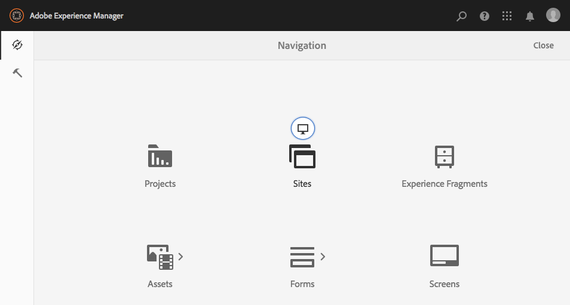

# Admin Console{#admin-consoles}

依預設，已停用透過管理控制台切換至傳統UI的功能。 因此，將滑鼠游標移至特定控制台圖示上時會顯示的快顯圖示（可存取傳統UI）將不再顯示。

`/libs/cq/core/content/nav`中具有傳統UI版本的每個控制台都可以單獨重新啟用，這樣&#x200B;**傳統UI**&#x200B;選項就會在將滑鼠移到控制台表徵圖上時再次彈出。

在此範例中，我們將重新啟用Sites主控台的傳統UI。

1. 使用CRXDE Lite，尋找與要重新啟用傳統UI之Admin Console對應的節點。 可在下方找到：

   `/libs/cq/core/content/nav`

   例如

   [ `http://localhost:4502/crx/de/index.jsp#/libs/cq/core/content/nav`](http://localhost:4502/crx/de/index.jsp#/libs/cq/core/content/nav)

1. 選取與要重新啟用傳統UI之主控台相對應的節點。 例如，我們將重新啟用Sites主控台的傳統UI。

   `/libs/cq/core/content/nav/sites`

1. 使用&#x200B;**覆蓋節點**&#x200B;選項建立覆蓋；例如：

   * **路徑**:  `/apps/cq/core/content/nav/sites`
   * **重疊位置**: `/apps/`
   * **匹配節點類型**:活動（選取核取方塊）

1. 將下列布林屬性新增至覆蓋節點：

   `enableDesktopOnly = {Boolean}true`

1. 在管理控制台中，「**傳統UI**」選項會再次顯示為彈出式選項。

   

對您要重新啟用傳統UI版本存取權的每個主控台重複這些步驟。
