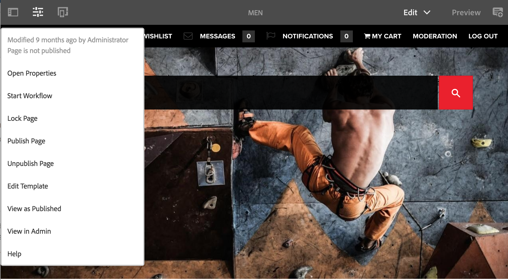

# 編輯者{#editor}

>[!CAUTION]
>
>AEM 6.4已結束延伸支援，本檔案不再更新。 如需詳細資訊，請參閱 [技術支援期](https://helpx.adobe.com//tw/support/programs/eol-matrix.html). 尋找支援的版本 [此處](https://experienceleague.adobe.com/docs/).

依預設，已停用從編輯器切換至傳統UI的功能。

重新啟用選項 **在傳統UI中開啟** 在 **頁面資訊** 功能表，請依照下列步驟操作。

1. 使用CRXDE Lite，查找以下節點：

   `/libs/wcm/core/content/editor/jcr:content/content/items/content/header/items/headerbar/items/pageinfopopover/items/list/items/classicui`

   例如

   `http://localhost:4502/crx/de/index.jsp#/libs/wcm/core/content/editor/jcr%3Acontent/content/items/content/header/items/headerbar/items/pageinfopopover/items/list/items/classicui](http://localhost:4502/crx/de/index.jsp#/libs/wcm/core/content/editor/jcr%3Acontent/content/items/content/header/items/headerbar/items/pageinfopopover/items/list/items/classicui`

1. 使用 **覆蓋節點** 選項；例如：

   * **路徑**: `/apps/wcm/core/content/editor/jcr:content/content/items/content/header/items/headerbar/items/pageinfopopover/items/list/items/classicui`
   * **重疊位置**: `/apps/`
   * **匹配節點類型**:活動（選取核取方塊）

1. 將下列多值文字屬性新增至覆蓋節點：

   `sling:hideProperties = ["granite:hidden"]`

1. 此 **在傳統UI中開啟** 選項 **頁面資訊** 的雙曲正切值。

   
