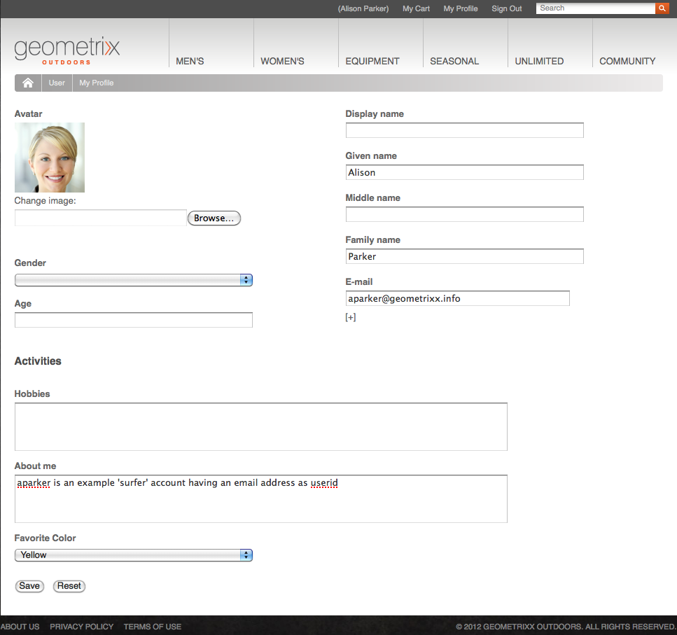

# Identity Management{#identity-management}

只有在您提供登入功能時，才能識別您網站的個別訪客。 您可能想提供登入功能的原因有多種：

* [AEM ](/help/communities/overview.md)CommunitiesSite訪客必須登入才能將內容張貼至社群。
* [已關閉的用戶組](/help/sites-administering/cug.md)

   您可能需要限制特定訪客對您網站（或其區段）的存取。

* [](/help/sites-administering/personalization.md) 個人化允許訪客設定存取您網站的特定方面。

登入（和登出）功能由[帳戶提供，其中&#x200B;**設定檔**](#profiles-and-user-accounts)&#x200B;包含有關已註冊訪客（使用者）的其他資訊。 註冊和授權的實際過程可能不同：

* 從網站自行註冊

   [社群網站](/help/communities/sites-console.md)可設定為允許訪客自行註冊或以其Facebook或Twitter帳戶登入。

* 從網站申請註冊

   對於封閉的使用者群組，您可以允許訪客要求註冊，但透過工作流程強制授權。

* 從製作環境註冊每個帳戶

   如果您有少量設定檔，無論如何都需要授權，您可以決定直接註冊每個設定檔。

為了讓訪客註冊，您可以使用一系列元件和表單來收集所需的識別資訊，然後收集其他（通常為選用）的設定檔資訊。 註冊後，還應能檢查並更新已提交的詳細資訊。

可以配置或開發其他功能：

* 配置所需的任何反向複製。
* 透過與工作流程一起開發表單，允許使用者移除其設定檔。

>[!NOTE]
>
>設定檔中指定的資訊也可用來透過[Segments](/help/sites-administering/campaign-segmentation.md)和[Campaigns](/help/sites-authoring/personalization.md)為使用者提供目標內容。

## 註冊Forms {#registration-forms}

表單可用來收集註冊資訊，然後產生新帳戶和設定檔。

例如，使用者可以使用「Geometrixx」頁面來請求新的設定檔\
`http://localhost:4502/content/geometrixx-outdoors/en/user/register.html`


提交請求時，設定檔頁面會開啟，使用者可在其中提供個人詳細資訊。


新帳戶也會顯示在[使用者主控台](/help/sites-administering/security.md)中。

## 登入 {#login}

登入元件可用來收集登入資訊，然後啟動登入程式。

這可為訪客提供標準欄位&#x200B;**使用者名稱**&#x200B;和&#x200B;**密碼**，以及&#x200B;**登入**&#x200B;按鈕，以在輸入憑證時啟動登入程式。

例如，使用者可以使用Geometrixx工具列上的&#x200B;**登入**&#x200B;選項（使用頁面）登入或建立新帳戶：

`http://localhost:4502/content/geometrixx-outdoors/en/user/sign-in.html`


## 註銷{#logging-out}

由於存在登錄機制，因此也需要註銷機制。 這在Geometrixx中是&#x200B;**登出**&#x200B;選項。

## 查看和更新配置檔案{#viewing-and-updating-a-profile}

視您的註冊表而定，訪客的設定檔中可能有註冊資訊。 他們應該能在稍後階段檢視和/或更新此項目。 這可以用類似的形式完成；例如，在Geometrixx中：

```
http://localhost:4502/content/geometrixx-outdoors/en/user/profile.html
```

若要查看配置檔案的詳細資訊，請按一下任何頁面右上角的&#x200B;**My Profile**;例如，使用`admin`帳戶：\
`http://localhost:4502/home/users/a/admin/profile.form.html/content/geometrixx-outdoors/en/user/profile.html.`

您可以使用[用戶端內容](/help/sites-administering/client-context.md)檢視其他設定檔（在製作環境上，且具有足夠的權限）:

1. 開啟頁面；例如「Geometrixx」頁面：

   `http://localhost:4502/cf#/content/geometrixx/en.html`

1. 按一下右上角的&#x200B;**我的配置檔案**。 您會看到您經常帳戶的設定檔；例如管理員。
1. 按&#x200B;**control-alt-C**&#x200B;以開啟用戶端內容。
1. 在客戶端上下文的左上角，按一下&#x200B;**載入配置檔案**&#x200B;按鈕。

   

1. 從對話框窗口的下拉清單中選擇另一個配置檔案；例如， **Alison Parker**。
1. 按一下&#x200B;**「確定」**。
1. 再次按一下&#x200B;**我的配置檔案**。 表單將更新Alison的詳細資訊。

   

1. 您現在可以使用&#x200B;**編輯設定檔**&#x200B;或&#x200B;**變更密碼**&#x200B;來更新詳細資訊。

## 將欄位添加到配置檔案定義{#adding-fields-to-the-profile-definition}

您可以新增欄位至設定檔定義。 例如，若要將「最喜愛的顏色」欄位新增至Geometrixx設定檔：

1. 從網站控制台導覽至Geometrixx Outdoors網站>英文>使用者>我的設定檔。

1. 按兩下&#x200B;**我的配置檔案**&#x200B;頁面以開啟它進行編輯。

1. 在sidekick的&#x200B;**Components**&#x200B;標籤中，展開&#x200B;**Form**&#x200B;區段。

1. 將&#x200B;**下拉式清單**&#x200B;從sidekick拖曳至表單，緊接在&#x200B;**關於me**&#x200B;欄位下方。

1. 按兩下&#x200B;**下拉清單**&#x200B;元件以開啟配置對話框並輸入：

   * **元素名稱** - `favoriteColor`
   * **標題** - `Favorite Color`
   * **項目**  — 新增數種顏色作為項目

   按一下&#x200B;**OK**&#x200B;以儲存。

1. 關閉頁面並返回&#x200B;**Websites**&#x200B;控制台並激活「我的配置檔案」頁。

   下次檢視設定檔時，您可以選取最喜愛的顏色：

   

   欄位將儲存在相關使用者帳戶的&#x200B;**profile**&#x200B;區段下：

   

## 配置檔案狀態{#profile-states}

有許多使用案例需要知道使用者（或其設定檔）是否處於&#x200B;*特定狀態*。

這包括在使用者設定檔中定義適當的屬性，其方式為：

* 可供使用者檢視和存取
* 為每個屬性定義兩個狀態
* 允許在定義的兩種狀態之間切換

這是透過：

* [狀態提供程式](#state-providers)

   管理特定屬性的兩種狀態，以及兩者之間的轉變。

* [工作流程](#workflows)

   管理與狀態相關的動作。

可定義多個狀態；例如，在Geometrixx中，這些包括：

* 訂閱（或取消訂閱）電子報或評論執行緒上的通知
* 添加和刪除與好友的連接

### 狀態提供程式{#state-providers}

狀態提供者會管理相關屬性的目前狀態，以及兩個可能狀態之間的轉變。

狀態提供者會實作為元件，因此可針對您的專案自訂。 在Geometrixx中，這些包括：

* 取消訂閱/訂閱論壇主題
* 添加/刪除好友

### 工作流程 {#workflows}

狀態提供者會管理設定檔屬性及其狀態。

需要工作流程來實施與狀態相關的動作。 例如，訂閱通知時，工作流程將處理實際的訂閱動作；從通知取消訂閱時，工作流程將處理從訂閱清單中移除使用者的作業。

## 設定檔和使用者帳戶{#profiles-and-user-accounts}

設定檔會儲存在內容存放庫中，作為[使用者帳戶](/help/sites-administering/user-group-ac-admin.md)的一部分。

可在`/home/users/geometrixx`下找到配置檔案：


在標準安裝（製作或發佈）上，每個人都可讀取所有使用者的整個設定檔資訊。 每個人都是「*內建群組，會自動包含所有現有使用者和群組。 無法編輯成員清單*&quot;。

這些訪問權限由以下通配符ACL定義：

/home每個人都允許jcr:read rep:glob = &amp;ast;/profile&amp;ast

這可以：

* 論壇、留言或部落格貼文，以顯示適當設定檔中的資訊（例如圖示或全名）
* geometrixx設定檔頁面的連結

如果此類訪問權限不適合您的安裝，您可以更改這些預設設定。

您可以使用&#x200B;**[存取控制](/help/sites-administering/user-group-ac-admin.md#access-right-management)**&#x200B;標籤來完成此操作：


## 配置檔案元件{#profile-components}

定義您網站的設定檔需求時，也可使用一系列設定檔元件。

### 已檢查密碼欄位 {#checked-password-field}

此元件提供下列兩個欄位：

* 密碼的輸入
* 檢查以確認密碼已正確輸入。

使用預設設定時，元件將顯示如下：


### 設定檔頭像相片 {#profile-avatar-photo}

此元件提供使用者選取和上傳頭像像片檔案的機制。


### 設定檔詳細名稱 {#profile-detailed-name}

此元件可讓使用者輸入詳細名稱。


### 設定檔性別 {#profile-gender}

此元件可讓使用者輸入其性別。


