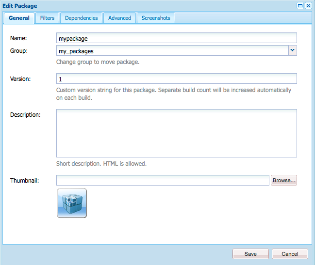

# 如何使用套件{#how-to-work-with-packages}

>[!CAUTION]
>
>AEM 6.4已結束延伸支援，本檔案不再更新。 如需詳細資訊，請參閱 [技術支援期](https://helpx.adobe.com//tw/support/programs/eol-matrix.html). 尋找支援的版本 [此處](https://experienceleague.adobe.com/docs/).

軟體包允許導入和導出儲存庫內容。 例如，您可以使用包來安裝新功能、在實例之間傳輸內容以及備份儲存庫內容。

可從下列頁面存取和/或維護套件：

* [封裝管理員](#package-manager)，您可使用此來管理本機AEM例項中的套件。

* [封裝共用](#package-share)，此伺服器既包含公開可用的套件，又包含貴公司私有的套件。 公用套件可包含Hotfix、新功能、檔案等。

您可以在包管理器、包共用和檔案系統之間傳輸包。

## 什麼是包？ {#what-are-packages}

套件是郵遞區號檔案，以檔案系統序列化（稱為「保管庫」序列化）的形式儲存存放庫內容。 這提供了檔案和資料夾的易於使用和編輯的表示法。

套件包含使用篩選條件選取的頁面內容和專案相關內容。

包中還包含保管庫元資訊，包括篩選器定義和導入配置資訊。 套件中可包含其他內容屬性（不用於套件擷取），例如說明、視覺影像或圖示；這些屬性僅供內容套件使用者使用，僅供參考之用。

>[!NOTE]
>
>套件代表建置套件時的內容目前版本。 其中不包含AEM保留在存放庫中的任何舊版內容。

您可以對套件或搭配套件執行下列動作：

* 建立新包；根據需要定義包設定和篩選器
* 預覽套件內容（建置前）
* 建置套件
* 查看包資訊
* 檢視套件內容（建置後）
* 修改現有包的定義
* 重建現有包
* 重新包裝套件
* 從AEM下載套件至您的檔案系統
* 將套件從您的檔案系統上傳至本機AEM執行個體
* 安裝前驗證套件內容
* 執行乾式運行安裝
* 安裝套件(AEM上傳後不會自動安裝套件)
* 刪除包
* 從套件共用程式庫下載套件（例如Hotfix）
* 將套件上傳至套件共用程式庫的公司內部區段

## 包資訊 {#package-information}

包定義由各種類型的資訊組成：

* [套件設定](#package-settings)
* [封裝篩選器](#package-filters)
* [包螢幕截圖](#package-screenshots)
* [包表徵圖](#package-icons)

### 套件設定 {#package-settings}

您可以編輯各種包設定來定義包說明、相關錯誤、依賴項和提供程式資訊等方面。

此 **套件設定** 對話方塊可透過 **編輯** 按鈕 [建立](#creating-a-new-package) 或 [編輯](#viewing-and-editing-package-information) 套件，並提供三個索引標籤以進行設定。 進行任何變更後，按一下 **確定** 來保存這些。



| **欄位** | **說明** |
|---|---|
| 名稱 | 包的名稱。 |
| 群組 | 要添加包的組的名稱，用於組織包。 鍵入新組的名稱，或選擇現有組。 |
| 版本 | 用於自訂版本的文字。 |
| 說明 | 套件的簡短說明。 HTML標籤可用於格式化。 |
| 縮圖 | 隨包清單一起顯示的表徵圖。 按一下「瀏覽」以選取本機檔案。 |


<table> 
 <tbody> 
  <tr> 
   <th><strong>欄位</strong></th> 
   <th><strong>說明</strong></th> 
   <th><strong>格式/範例</strong></th> 
  </tr> 
  <tr> 
   <td>名稱</td> 
   <td>提供程式的名稱。</td> 
   <td><em>AEMGeometrixx<br /> </em></td> 
  </tr> 
  <tr> 
   <td>URL</td> 
   <td>提供程式的URL。</td> 
   <td><em>https://www.aem-geometrixx.com</em></td> 
  </tr> 
  <tr> 
   <td>連結</td> 
   <td>提供程式頁面的包特定連結。</td> 
   <td><em>https://www.aem-geometrixx.com/mypackage.html</em></td> 
  </tr> 
  <tr> 
   <td>需要<br /> </td> 
   <td> 
    <ul> 
     <li>管理員：選擇何時只有具有管理員權限的帳戶才能安裝該包。</li> 
     <li>重新啟動：選擇安裝軟體包後需要重新啟動伺服器的時間。</li> 
    </ul> </td> 
   <td> </td> 
  </tr> 
  <tr> 
   <td>AC 處理</td> 
   <td><p>指定導入包時如何處理包中定義的訪問控制資訊：</p> 
    <ul> 
     <li><strong>忽略</strong></li> 
     <li><strong>覆寫</strong></li> 
     <li><strong>合併</strong></li> 
     <li><strong>清除</strong></li> 
     <li><strong>MergePreserve</strong></li> 
    </ul> <p>預設值為 <strong>忽略</strong>.</p> </td> 
   <td> 
    <ul> 
     <li><strong>忽略</strong>  — 保留儲存庫中的ACL</li> 
     <li><strong>覆寫</strong>  — 覆寫儲存庫中的ACL</li> 
     <li><strong>合併</strong>  — 合併兩組ACL</li> 
     <li><strong>清除</strong>  — 清除ACL</li> 
     <li><strong>MergePreserve</strong>  — 通過添加內容中不存在的主體的訪問控制條目，將內容中的訪問控制與包隨附的訪問控制合併</li> 
    </ul> </td> 
  </tr> 
 </tbody> 
</table>


| **欄位** | **說明** | **格式/範例** |
|---|---|---|
| 已測試 | 此套件的目標產品名稱和版本為或相容。 | *AEM6* |
| 修正錯誤/問題 | 一個文本欄位，用於列出此包修正的錯誤的詳細資訊。 請在另一行列出每個錯誤。 | bug-nr摘要 |
| 取決於 | 列出當需要其他包時需要遵守的依賴項資訊，以便當前包按預期運行。 使用Hotfix時，此欄位很重要。 | groupId:name:版本 |
| 取代 | 此包替換的已棄用包的清單。 安裝之前，請檢查此套件是否包含過時套件中的所有必要內容，以免覆寫任何內容。 | groupId:name:版本 |

### 封裝篩選器 {#package-filters}

篩選器可識別要包含在套件中的存放庫節點。 A **篩選器定義** 指定下列資訊：

* 此 **根路徑** 包含的內容。
* **規則** 包含或排除根路徑下的特定節點。

篩選器可以包含零個或多個規則。 未定義規則時，套件會包含根路徑下方的所有內容。

您可以為套件定義一或多個篩選器定義。 使用多個篩選器來包含來自多個根路徑的內容。


下表說明這些規則並提供範例：

<table> 
 <tbody> 
  <tr> 
   <th> 規則類型</th> 
   <th>說明 </th> 
   <th>範例 </th> 
  </tr> 
  <tr> 
   <td> include</td> 
   <td>您可以定義路徑，或使用規則運算式來指定要包含的所有節點。<br /> <br /> 包含目錄將： 
    <ul> 
     <li>包括目錄 <i>和</i> 該目錄中的所有檔案和資料夾（即整個子樹）</li> 
     <li><strong>not</strong> 包括指定根路徑下的其他檔案或資料夾</li> 
    </ul> </td> 
   <td>/libs/sling/install(/)*)? </td> 
  </tr> 
  <tr> 
   <td> 排除</td> 
   <td>您可以指定路徑或使用規則運算式來指定要排除的所有節點。<br /> <br /> 排除目錄將排除該目錄 <i>和</i> 該目錄中的所有檔案和資料夾（即整個子樹）。<br /> </td> 
   <td>/libs/wcm/foundation/components(/)*)?</td> 
  </tr> 
 </tbody> 
</table>

>[!NOTE]
>
>一個包可以包含多個篩選器定義，因此來自不同位置的節點可以輕鬆地組合為一個包。

封裝篩選器最常在您首次 [建立套件](#creating-a-new-package)，但稍後也可以編輯（之後應重建套件）。

### 包螢幕截圖 {#package-screenshots}

您可以將螢幕擷取畫面附加至套件，以視覺化呈現內容外觀；例如，提供新功能的螢幕擷取畫面。

### 包表徵圖 {#package-icons}

您也可以將圖示附加至套件，以提供套件所含內容的快速參考視覺表示。 然後，這會顯示在包清單中，可幫助您輕鬆識別包或包的類。

由於套件可包含圖示，因此官方套件會使用下列慣例：

>[!NOTE]
>
>若要避免混淆，請為套件使用描述性圖示，而不要使用其中一個官方圖示。

官方Hotfix套件：


官方AEM安裝或擴充功能套件：

官方功能套件：


## 封裝管理員 {#package-manager}

套件管理器會管理您本機AEM安裝上的套件。 在您 [已指派必要的權限](#permissions-needed-for-using-the-package-manager) 您可以使用套件管理器執行各種動作，包括設定、建立、下載和安裝您的套件。 要設定的關鍵元素為：

* [套件設定](#package-settings)
* [封裝篩選器](#package-filters)

### 使用套件管理器所需的權限 {#permissions-needed-for-using-the-package-manager}

若要授予使用者建立、修改、上傳和安裝套件的權利，您必須在下列位置為他們提供適當的權限：

* **/etc/packages** （完整權利排除刪除）
* 包含包內容的節點

請參閱 [設定權限](/help/sites-administering/security.md) 以取得變更權限的指示。

### 建立新套件 {#creating-a-new-package}

要建立新包定義，請執行以下操作：

1. 在AEM歡迎畫面上，按一下 **套件** (或來自 **工具** 控制台按兩下 **套件**)。

1. 然後選取 **封裝管理員**.
1. 按一下 **建立套件**.

   >[!NOTE]
   >
   >如果您的執行個體有許多套件，則可能會有一個資料夾結構，因此您可以在建立新套件之前導覽至所需的目標資料夾。

1. 在對話方塊中：

   

   輸入：

   * **群組名稱**

      目標組（或資料夾）名稱。 群組的用途是協助您組織套件。

      如果組尚未存在，則會為其建立資料夾。 如果將組名留空，則它將在主包清單（首頁>包）中建立包。

   * **封裝名稱**

      新包的名稱。 選取描述性名稱，以協助您（和其他人）輕鬆識別套件的內容。

   * **版本**

      用於指示版本的文本欄位。 這會附加至套件名稱，以形成zip檔案的名稱。
   按一下 **確定** 來建立套件。

1. AEM會在適當的群組資料夾中列出新套件。

   

   按一下圖示或封裝名稱以開啟。

   

   >[!NOTE]
   >
   >您可以在稍後階段視需要返回此頁面。

1. 按一下 **編輯** 編輯 [套件設定](#package-settings).

   您可以在此新增資訊及/或定義特定設定；例如，這些包括說明、 [圖示](#package-icons)、相關錯誤以及新增提供者詳細資訊。

   按一下 **確定** 編輯完設定後。

1. 新增 **[螢幕截圖](#package-screenshots)** 視需要新增至套件。 建立套件時有一個例項可用，如有需要，可使用新增更多例項 **套件螢幕擷圖** 來自sidekick。

   按兩下 **螢幕截圖** 區域，添加影像，然後按一下 **確定**.

1. 定義 **[封裝篩選器](#package-filters)** 拖曳例項 **篩選器定義** 在sidekick中，按兩下以開啟以進行編輯：

   

   指定下列設定：

   * **根路徑**
要包裝的內容；這可以是子樹的根。
   * **規則**
規則為選用；對於簡單的套件定義，不需要指定包含或排除規則。

      如有需要，您可以定義 [**包括** 或 **排除** 規則](#package-filters) 來精確定義套件內容。

      使用 **+** 符號，或者使用 **-** 符號。 系統會根據規則的順序套用規則，以便視需要使用 **向上** 和 **向下** 按鈕。
   然後按一下 **確定** 來儲存篩選器。

   >[!NOTE]
   >
   >您可以視需要使用任意數量的篩選器定義，但請務必小心，以確保它們不會衝突。 使用 **預覽** 確認套件內容。

1. 若要確認套件會保留什麼，您可以使用 **預覽**. 這會執行建置程式的乾式執行，並列出實際建置套件時要新增到套件的所有項目。
1. 您現在可以 [建置](#building-a-package) 你的包裹。

   >[!NOTE]
   >
   >此時不強制建置套件，可在稍後時間點完成。

### 建立套件 {#building-a-package}

通常會在您同時建立套件 [建立套件定義](#creating-a-new-package)，但您稍後可以返回，以建置或重建套件。 如果儲存庫內的內容已變更，這個功能會很實用。

>[!NOTE]
>
>在建立套件之前，預覽套件內容會很實用。 要執行此操作，請按一下 **預覽**.

1. 從以下位置開啟包定義： **封裝管理員** （按一下套件圖示或名稱）。

1. 按一下 **建置**. 對話方塊會要求確認您確實要建立套件。

   >[!NOTE]
   >
   >當您重建包時，當包內容將被覆蓋時，這尤其重要。

1. 按一下&#x200B;**「確定」**。AEM會建立套件，並列出新增至套件的所有內容。 完成AEM後，會顯示已建置套件的確認，並（當您關閉對話方塊時）會更新套件清單資訊。

### 重新包裝套件 {#rewrapping-a-package}

套件建置完成後，如有需要，可重新包裝。

重新包裝變更套件資訊 —  *無* 變更套件內容。 套件資訊是縮圖、說明等，換言之，您可使用 **套件設定** 對話框(開啟此按一下 **編輯**)。

重新包裝的主要使用案例是準備套件共用的套件時。 例如，您可能有現有的套件，並決定與其他人共用。 您想要新增縮圖並新增說明。 您不必使用其所有功能重新建立整個包（這可能需要一些時間，並承擔包不再與原始包相同的風險），而是可以重新包裝，只添加縮圖和說明。

1. 從以下位置開啟包定義： **封裝管理員** （按一下套件圖示或名稱）。

1. 按一下 **編輯** 並更新 **[套件設定](#package-settings)** 視需要。 按一下 **確定** 儲存。

1. 按一下 **重新包裝**，對話方塊會要求確認。

### 查看和編輯包資訊 {#viewing-and-editing-package-information}

要查看或編輯包定義的資訊，請執行以下操作：

1. 在套件管理器中，導覽至您要檢視的套件。
1. 按一下您要檢視之套件的套件圖示。 這會開啟套件頁面，列出套件定義的相關資訊：

   

   >[!NOTE]
   >
   >您也可以從此頁面編輯及執行套件上的特定動作。
   >
   >可用的按鈕將取決於包是否已構建。

1. 如果包已建置，請按一下 **內容**，會開啟一個視窗，並列出套件的整個內容：

### 查看包內容和測試安裝 {#viewing-package-contents-and-testing-installation}

建置套件後，您可以檢視內容：

1. 在套件管理器中，導覽至您要檢視的套件。
1. 按一下您要檢視之套件的套件圖示。 這會開啟套件頁面，列出套件定義的相關資訊。

1. 要查看內容，請按一下 **內容**，會開啟一個視窗，並列出套件的整個內容：

   

1. 要執行乾式運行安裝，請按一下 **測試安裝**. 確認動作後，視窗會開啟，並列出結果，就像執行安裝一樣：

   

### 將包下載到檔案系統 {#downloading-packages-to-your-file-system}

本節說明如何使用將套件從AEM下載至您的檔案系統 **封裝管理員**.

>[!NOTE]
>
>請參閱 [封裝共用](#package-share) 如需從公共區域和您公司內部的套件共用區域下載Hotfix、功能套件和套件的相關資訊。
>
>從包共用，您可以：
>
>* 下載包 [封裝直接共用至您的本機AEM執行個體](#downloading-and-installing-packages-from-package-share).\
   >  下載套件時，會匯入您的存放庫，之後您就可以使用 **封裝管理員**. 這些套件包括Hotfix和其他共用套件。
>
>* 下載包 [將共用包包到您的檔案系統](#downloading-packages-to-your-file-system-from-package-share).
>


1. 在AEM歡迎畫面上，按一下 **套件**，然後選取 **封裝管理員**.
1. 導覽至您要下載的套件。

   

1. 按一下您要下載的包的zip檔案名稱（帶下划線）形成的連結；例如 `export-for-offline.zip`.

   AEM會將套件下載至您的電腦（使用標準瀏覽器下載對話方塊）。

### 從檔案系統上傳套件 {#uploading-packages-from-your-file-system}

套件上傳可讓您將套件從檔案系統上傳至AEM套件管理器。

>[!NOTE]
>
>請參閱 [上傳套件至公司內部套件共用](#uploading-a-package) 上傳套件至您公司的「套件共用」私人區域。

上傳套件：

1. 導覽至 **封裝管理員**. 接著，前往您要上傳套件的群組資料夾。

   

1. 按一下 **上傳套件**.

   

   * **檔案**

      您可以直接輸入檔案名稱，或使用 **瀏覽……** 對話框，從本地檔案系統中選擇所需的包(選擇後，按一下 **確定**)。

   * **強制上傳**

      如果已存在具有此名稱的包，您可以按一下此名稱以強制上載（並覆蓋現有包）。
   按一下 **確定** 以便新包被上載並列在包管理器清單中。

   >[!NOTE]
   >
   >若要讓內容可供AEM使用，請務必 [安裝套件](#installing-packages).

### 驗證套件 {#validating-packages}

安裝套件之前，您可能想驗證其內容。 因為封裝可以修改 `/apps` 和/或添加、修改和刪除ACL時，在安裝前驗證這些更改通常很有用。

#### 驗證選項 {#validation-options}

驗證機制可檢查套件的下列特性：

* OSGi套件匯入
* 覆蓋
* ACL

以下詳細說明這些選項。

* **驗證 OSGi 封裝匯入**

   **已核取的項目**

   此驗證會檢查所有JAR檔案（OSGi套件組合）的套件，提取其 `manifest.xml` （包含所述OSGi套件所依賴的版本化相依性），並驗證AEM執行個體將所述相依性匯出為正確版本。

   **報告方式**

   AEM例項無法滿足的任何版本化相依性會列在 **活動記錄** 封裝管理器。

   **錯誤狀態**

   如果不滿足相依性，則包中包含這些相依性的OSGi套件組合將不會啟動。 這會導致應用程式部署中斷，因為任何依賴未啟動的OSGi套件組合的程式，都會無法正常運作。

   **錯誤解決方法**

   要解決由於未滿足要求的OSGi套件組合而導致的錯誤，需要調整套件中具有未滿足要求的導入的依賴項版本。

* **驗證覆蓋**

   **已核取的項目**

   此驗證會判斷所安裝的套件是否包含已覆蓋在目標AEM例項中的檔案。

   例如，在 `/apps/sling/servlet/errorhandler/404.jsp`，包含 `/libs/sling/servlet/errorhandler/404.jsp`，以便變更現有檔案(位於 `/libs/sling/servlet/errorhandler/404.jsp`.

   **報告方式**

   任何此類覆蓋圖皆於 **活動記錄** 封裝管理器。

   **錯誤狀態**

   錯誤狀態表示套件嘗試部署已覆蓋的檔案，因此套件中的變更將被覆蓋覆蓋（因此「隱藏」），而不會生效。

   **錯誤解決方法**

   若要解決此問題，請在 `/apps` 必須在 `/libs` 並視需要將變更併入覆蓋圖( `/apps`)，並重新部署重疊的檔案。

   >[!NOTE]
   >
   >請注意，如果覆蓋內容已正確整合至覆蓋檔案，驗證機制便無法調解。 因此，即使進行了必要的變更，此驗證仍會繼續報告衝突。

* **驗證 ACL**

   **已核取的項目**

   此驗證會檢查要新增哪些權限、處理方式（合併/取代），以及目前權限是否會受到影響。

   **報告方式**

   權限在 **活動記錄** 封裝管理器。

   **錯誤狀態**

   無法提供明確錯誤。 驗證只會指出安裝套件是否會新增或影響任何新ACL權限。

   **錯誤解決方法**

   使用驗證提供的資訊，您可以在CRXDE中查看受影響的節點，並視需要在套件中調整ACL。

   >[!CAUTION]
   >
   >作為最佳實務，建議軟體包不要影響AEM提供的ACL，因為這可能會導致意外的產品行為。

#### 執行驗證 {#performing-validation}

可透過兩種不同方式驗證套件：

* 透過套件管理程式UI
* 透過HTTPPOST要求（例如搭配cURL）

>[!NOTE]
>
>上傳套件後但安裝之前，一律應進行驗證。

**透過套件管理器進行套件驗證**

1. 在開啟套件管理器 `https://<server>:<port>/crx/packmgr`
1. 在清單中選取套件，然後選取 **更多** 從標題下拉式清單，然後 **驗證** 從下拉式功能表。

   >[!NOTE]
   >
   >這應在上傳內容套件之後，但在安裝套件之前完成。

1. 在隨後出現的強制回應對話方塊中，使用核取方塊來選取驗證的類型，並按一下以開始驗證 **驗證**. 或者，按一下 **取消**.

1. 選取的驗證會/會執行。 結果會顯示在套件管理器的活動記錄中。

**透過HTTPPOST要求進行套件驗證**

POST請求會採用下清單單。

```
https://<host>:<port>/crx/packmgr/service.jsp?cmd=validate&type=osgiPackageImports,overlays,acls
```

>[!NOTE]
>
>此 `type` 參數可以是任何以逗號分隔的無序清單，包含：
>
>* `osgiPackageImports`
>* `overlays`
>* `acls`
>
>的值 `type` 預設為 `osgiPackageImports` 若未通過。

以下是使用cURL執行套件驗證的範例。

1. 如果使用cURL，則執行類似以下的語句：

   ```shell
   curl -v -X POST --user admin:admin -F file=@/Users/SomeGuy/Desktop/core.wcm.components.all-1.1.0.zip 'http://localhost:4502/crx/packmgr/service.jsp?cmd=validate&type=osgiPackageImports,overlays,acls'
   ```

1. 請求的驗證會執行，並以JSON物件傳回回應。

>[!NOTE]
>
>驗證HTTPPOST要求的回應將是具有驗證結果的JSON物件。

### 安裝套件 {#installing-packages}

上傳套件後，您需要安裝內容。 若要安裝套件內容並使其正常運作，必須同時具備下列兩項功能：

* 已載入AEM [從檔案系統上傳](#uploading-packages-from-your-file-system) 或 [從包共用下載](#downloading-and-installing-packages-from-package-share))

* 已安裝

>[!CAUTION]
>
>安裝套件可能會覆寫或刪除現有內容。 只有在您確定套件不會刪除或覆寫您需要的內容時，才上傳套件。
>
>若要查看套件的內容或影響，您可以：
>
>* 執行軟體包的測試安裝，而不修改任何內容：\
   >  開啟套件（按一下套件圖示或名稱），然後按一下 **測試安裝**.
>
>* 請參閱套件內容清單：\
   >  開啟套件，然後按一下 **內容**.
>


>[!NOTE]
>
>在安裝軟體包之前，將立即建立一個快照軟體包，以包含將被覆蓋的內容。
>
>如果/當卸載軟體包時，將重新安裝此快照。

>[!CAUTION]
>
>如果您要安裝數位資產，您必須：
>
>* 首先，停用WorkflowLauncher。\
   >  使用OSGi控制台的「元件」菜單選項來停用 `com.day.cq.workflow.launcher.impl.WorkflowLauncherImpl`.
>
>* 接下來，安裝完成後，重新激活WorkflowLauncher。
>
>停用WorkflowLauncher可確保資產匯入工具架構在安裝時不會（無意中）操控資產。

1. 在套件管理器中，導覽至您要安裝的套件。

   安 **安裝** 按鈕顯示在尚未安裝的包的一側。

   >[!NOTE]
   >
   >或者，您也可以按一下套件圖示以開啟套件，以存取 **安裝** 按鈕。

1. 按一下 **安裝** 以開始安裝。 對話方塊會要求確認，並列出所有正在進行的變更。 完成後，按一下 **關閉** 對話框。

   這個詞 **已安裝** 安裝後，該程式包會顯示在旁邊。

### 基於檔案系統的上傳和安裝 {#file-system-based-upload-and-installation}

您可以透過其他方式將套件上傳並安裝至執行個體。 在您的檔案系統中，您有 `crx-quicksart` 與jar和 `license.properties` 檔案。 您需要建立名為 `install` 在 `crx-quickstart`. 之後您會有類似的項目： `<aem_home>/crx-quickstart/install`

在此安裝中，可以直接添加包。 這些檔案會自動上傳並安裝在您的執行個體上。 完成後，您可以在套件管理器中看到套件。

如果執行個體執行中，請將套件新增至 `install` 資料夾會直接啟動上傳，以及在執行個體上安裝。 如果您的執行個體未執行，則您放入的套件 `install` 資料夾將按字母順序在啟動時安裝。

>[!NOTE]
>
>您也可以在首次啟動執行個體之前執行此操作。 若要這麼做，您需要建立 `crx-quickstart` 手動建立資料夾 `install` 資料夾下面，把包放在那裡。 然後，當您首次啟動執行個體時，套件會依字母順序安裝。

### 卸載軟體包 {#uninstalling-packages}

AEM可讓您解除安裝套件。 此操作會還原受到在軟體包安裝前立即生成的快照影響的儲存庫內容。

>[!NOTE]
>
>安裝時，將建立包含將被覆蓋內容的快照包。
>
>卸載該包時，將重新安裝該包。

1. 在「套件管理器」中，導覽至您要解除安裝的套件。
1. 按一下要卸載的包的包表徵圖。
1. 按一下 **解除安裝** 從儲存庫中刪除此包的內容。 對話方塊會要求確認，並列出所有正在進行的變更。 完成後，按一下 **關閉** 對話框。

### 刪除包 {#deleting-packages}

要從包管理器清單中刪除包：

>[!NOTE]
>
>軟體包中安裝的檔案/節點為 **not** 已刪除。

1. 在 **工具** 主控台，展開 **套件** 資料夾，在右側窗格中顯示您的包。

1. 按一下您要刪除的套件，以反白顯示該套件，然後：

   * 按一下 **刪除** 的子母體。
   * 按一下滑鼠右鍵並選取 **刪除**.

   

1. AEM要求確認您要刪除套件。 按一下 **確定** 以確認刪除。

>[!CAUTION]
>
>若此套件已安裝，則 *已安裝* 內容將 **not** 被刪除。

### 複製包 {#replicating-packages}

複製套件的內容以將其安裝至發佈執行個體：

1. 在 **封裝管理員**，導覽至您要復寫的套件。

1. 按一下要複製的包的表徵圖或名稱以展開它。
1. 在 **更多** 工具列上的下拉式選單，選取 **複製**.

## 套件共用 {#package-share}

Package Share是一個集中的伺服器，可公開用於共用內容包。

已取代為 [軟體分發。](#software-distribution)

## Software Distribution {#software-distribution}

[Software Distribution](https://downloads.experiencecloud.adobe.com) 是新的使用者介面，用來簡化AEM Packages的搜尋和下載。

如需詳細資訊，請參閱 [Software Distribution檔案。](https://experienceleague.adobe.com/docs/experience-cloud/software-distribution/home.html)

>[!CAUTION]
>
>AEM套件管理器目前無法用於Software Distribution。 您將軟體包下載到本地磁碟。
