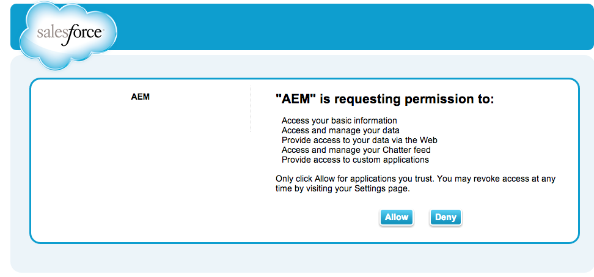
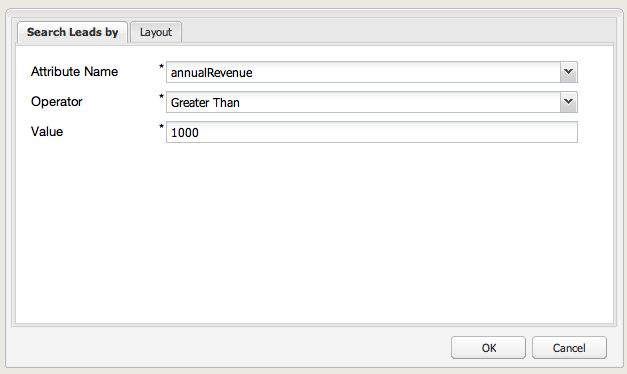

# 與Salesforce整合{#integrating-with-salesforce}

將Salesforce與AEM整合提供銷售機會管理功能，並運用Salesforce現成提供的功能。 您可以設定AEM以將銷售機會張貼至Salesforce，並建立可直接從Salesforce存取資料的元件。

AEM與Salesforce之間雙向且可擴充的整合可讓：

* 組織可充分使用和更新資料以增強客戶體驗。
* 從行銷到銷售活動的參與。
* 從Salesforce資料存放區自動傳送和接收資料的組織。

本檔案說明下列項目：

* 如何配置SalesforceCloud Services(配置AEM以與Salesforce整合)。
* 如何在「客戶內容」和「個人化」中使用Salesforce銷售機會/聯絡資訊。
* 如何使用Salesforce工作流程模型將AEM使用者作為銷售人員。
* 如何建立顯示來自Salesforce資料的元件。

## 配置AEM以與Salesforce {#configuring-aem-to-integrate-with-salesforce}整合

要配置AEM以與Salesforce整合，您需要先在Salesforce中配置遠程訪問應用程式。 然後，您將salesforce雲服務配置為指向此遠程訪問應用程式。

>[!NOTE]
>
>您可以在Salesforce中建立免費的開發人員帳戶。

要配置AEM以與Salesforce整合，請執行以下操作：

1. 在AEM中，導覽至&#x200B;**Cloud Services**。 在第三方服務中，按一下&#x200B;**Salesforce**&#x200B;中的&#x200B;**Configure Now**。

   

1. 建立新配置，例如&#x200B;**developer**。

   >[!NOTE]
   >
   >新設定會重新導向至新頁面：**http://localhost:4502/etc/cloudservices/salesforce/developer.html**。 這與您在Salesforce中建立遠端存取應用程式時，需要在回呼URL中指定的值完全相同。 這些值必須符合。

1. 登入您的salesforce帳戶(或者如果您沒有，請在[https://developer.force.com](https://developer.force.com)建立帳戶)。
1. 在Salesforce中，導覽至&#x200B;**Create** > **Apps**&#x200B;以取得&#x200B;**Connected Apps**（在舊版Salesforce中，工作流程為&#x200B;**Deploy** > **Remote Access**）。
1. 按一下&#x200B;**New**&#x200B;以連接AEM與Salesforce。

   

1. 輸入&#x200B;**連線的應用程式名稱**、**API名稱**&#x200B;和&#x200B;**連絡電子郵件**。 選取「**啟用OAuth設定**」核取方塊，然後輸入&#x200B;**回呼URL**&#x200B;並新增OAuth範圍（例如完整存取）。 回呼URL看起來類似以下：`http://localhost:4502/etc/cloudservices/salesforce/developer.html`

   更改伺服器名稱/埠號和頁名以匹配您的配置。

   

1. 按一下&#x200B;**Save**&#x200B;以保存salesforce配置。 Salesforce會建立&#x200B;**使用者金鑰**&#x200B;和&#x200B;**使用者密碼**，您需要進行AEM設定。

   

   >[!NOTE]
   >
   >您可能需要等待幾分鐘（最多15分鐘），才能激活Salesforce中的遠程訪問應用程式。

1. 在AEM中，導覽至&#x200B;**Cloud Services**，並導覽至您先前建立的salesforce設定（例如&#x200B;**developer**）。 按一下&#x200B;**編輯**，然後從salesforce.com輸入客戶密鑰和客戶密碼。

   

   | 登入 URL | 這是Salesforce授權端點。 其值會預先填入，且適用於大部分的情況。 |
   |---|---|
   | 客戶金鑰 | 輸入從salesforce.com的「遠程訪問應用程式註冊」頁獲取的值 |
   | 客戶密碼 | 輸入從salesforce.com的「遠程訪問應用程式註冊」頁獲取的值 |

1. 按一下&#x200B;**連接到Salesforce**&#x200B;以連接。 Salesforce請求允許配置連接到salesforce。

   

   在AEM中，會開啟確認對話方塊，告訴您連線成功。

1. 導覽至您網站的根頁面，然後按一下「頁面屬性&#x200B;**」。**&#x200B;然後，選擇&#x200B;**Cloud Services**&#x200B;並添加&#x200B;**Salesforce**&#x200B;並選擇正確的配置（例如&#x200B;**developer**）。

   

   現在，您可以使用工作流模型將銷售機會張貼到Salesforce，並建立可從Salesforce存取資料的元件。

## 將AEM使用者匯出為Salesforce銷售機會{#exporting-aem-users-as-salesforce-leads}

如果要將AEM使用者匯出為salesforce銷售機會，您需要設定工作流程以將銷售機會張貼至salesforce。

要將AEM用戶導出為Salesforce銷售線索，請執行以下操作：

1. 按一下右鍵工作流&#x200B;**Salesforce.com Export**&#x200B;並按一下&#x200B;**Start**，導覽至`http://localhost:4502/workflow`的Salesforce工作流。

   

1. 選取您要建立作為銷售機會的AEM使用者，作為此工作流程的&#x200B;**裝載**（首頁 — >使用者）。 請務必選擇用戶的配置檔案節點，因為它包含映射到Salesforce銷售線索&#x200B;**FirstName**&#x200B;和&#x200B;**LastName**&#x200B;欄位的&#x200B;**、** familyName **等資訊。**

   

   >[!NOTE]
   >
   >開始此工作流程之前，AEM中的銷售機會節點在發佈至Salesforce之前必須具備某些必要欄位。 這些是&#x200B;**givenName**、**familyName**、**company**&#x200B;和&#x200B;**email**。 要查看AEM用戶與Salesforce銷售線索之間的映射的完整清單，請參閱[AEM用戶與Slaesforce銷售線索之間的映射配置。](#mapping-configuration-between-aem-user-and-salesforce-lead)

1. 按一下&#x200B;**「確定」**。用戶資訊將導出到salesforce.com。 您可以在salesforce.com驗證。

   >[!NOTE]
   >
   >錯誤記錄會顯示是否已匯入銷售機會。 查看錯誤日誌以了解詳細資訊。

### 配置Salesforce.com導出工作流{#configuring-the-salesforce-com-export-workflow}

您可能需要配置Salesforce.com導出工作流，使其與正確的Salesforce.com配置相匹配，或進行其他更改。

要配置Salesforce.com導出工作流，請執行以下操作：

1. 導航到 `http://localhost:4502/cf#/etc/workflow/models/salesforce-com-export.html.`

   

1. 開啟「Salesforce.com導出」步驟，選擇&#x200B;**參數**&#x200B;頁簽，然後選擇正確的配置，然後按一下&#x200B;**確定**。 此外，如果希望工作流重新建立已在Salesforce中刪除的銷售機會，請選中複選框。

   

1. 按一下&#x200B;**儲存**&#x200B;以儲存變更。

   

### 在AEM用戶和Salesforce Lead之間映射配置{#mapping-configuration-between-aem-user-and-salesforce-lead}

要查看或編輯AEM用戶和Salesforce銷售線索之間的當前映射配置，請開啟Configuration Manager:`https://<hostname>:<port>/system/console/configMgr`並搜索&#x200B;**Salesforce Lead映射配置**。

1. 按一下&#x200B;**Web控制台**&#x200B;或直接前往`https://<hostname>:<port>/system/console/configMgr.`，開啟Configuration Manager
1. 搜索&#x200B;**Salesforce Lead映射配置**。

   

1. 視需要變更對應。 預設對應遵循模式** aemUserAttribute=sfLeadAttribute**。 按一下&#x200B;**儲存**&#x200B;以儲存變更。

## 配置Salesforce客戶端上下文儲存{#configuring-salesforce-client-context-store}

salesforce用戶端內容存放區會顯示目前登入使用者的其他資訊，而非AEM中已有的資訊。 它會根據使用者與Salesforce的連線，從Salesforce提取此額外資訊。

若要這麼做，您必須設定下列項目：

1. 透過Salesforce Connect元件將AEM使用者與Salesforce ID連結。
1. 將Salesforce設定檔資料新增至用戶端內容頁面，以設定您要查看的屬性。
1. （選用）建立使用Salesforce用戶端內容存放區資料的區段。

### 將AEM使用者與Salesforce ID {#linking-an-aem-user-with-a-salesforce-id}連結

您需要將AEM使用者對應為Salesforce ID，才能在用戶端內容中載入。 在實際案例中，您會根據已知使用者資料與驗證進行連結。 為了演示，在此過程中，您使用&#x200B;**Salesforce Connect**&#x200B;元件。

1. 導覽至AEM中的網站，登入，並從sidekick拖放&#x200B;**Salesforce Connect**&#x200B;元件。

   >[!NOTE]
   >
   >如果&#x200B;**Salesforce Connect**&#x200B;元件不可用，請轉至&#x200B;**Design**&#x200B;視圖，並選擇它以在&#x200B;**Edit**&#x200B;視圖中使用。

   

   將元件拖曳至頁面時，元件會顯示&#x200B;**連結至Salesforce=Off**。

   

   >[!NOTE]
   >
   >此元件僅供示範之用。 對於實際情況，會有另一個程式來連結/比對使用者與銷售機會。

1. 在頁面上拖曳元件後，請開啟它以進行設定。 選擇配置、聯繫人類型和Salesforce銷售線索或聯繫人，然後按一下&#x200B;**確定**。

   

   AEM會將使用者與Salesforce連絡人或銷售機會連結。

   

### 將Salesforce資料添加到客戶端上下文{#adding-salesforce-data-to-client-context}

您可以在用戶端內容中從Salesforce載入使用者資料，以用於個人化：

1. 在該處導覽以開啟您要延伸的用戶端內容，例如`http://localhost:4502/etc/clientcontext/default/content.html.`

   

1. 將&#x200B;**Salesforce設定檔資料**&#x200B;元件拖曳至用戶端內容。

   

1. 連按兩下元件以開啟它。 選擇&#x200B;**添加項**&#x200B;並從下拉清單中選擇屬性。 添加任意數量的屬性，然後選擇&#x200B;**OK**。

   

1. 現在，您會在用戶端內容中看到Salesforce中的Salesforce特定屬性。

   

### 使用Salesforce用戶端內容存放區{#building-a-segment-using-data-from-salesforce-client-context-store}中的資料建立區段

您可以建立使用Salesforce客戶端上下文儲存資料的區段。 要執行此操作：

1. 前往&#x200B;**Tools** > **Segmentation**&#x200B;或前往[http://localhost:4502/miscadmin#/etc/segmentation](http://localhost:4502/miscadmin#/etc/segmentation)，導覽至AEM中的區段。
1. 建立或更新區段以包含來自Salesforce的資料。 如需詳細資訊，請參閱[分段](/help/sites-administering/campaign-segmentation.md)。

## 搜索銷售線索{#searching-leads}

AEM隨附範例Search元件，可根據指定條件在Salesforce中搜尋銷售機會。 此元件顯示如何使用Salesforce REST API來搜索salesforce對象。 您需要將頁面與Salesforce設定連結，以觸發對salesforce.com的呼叫。

>[!NOTE]
>
>此元件示例說明如何使用Salesforce REST API來查詢Salesforce對象。 以為例，根據您的需求建立更複雜的元件。

若要使用此元件：

1. 導覽至您要使用此設定的頁面。 開啟頁面屬性並選取&#x200B;**Cloud Services。** 按一 **下「** 新增服務」 ，然 **** 後選取「Salesforce」和適當的設定，然後按一 **下「確定」**。

   

1. 將Salesforce搜尋元件拖曳至頁面（前提是該元件已啟用）。 要啟用它，請轉至「設計」模式，並將其添加到相應區域)。

   

1. 開啟搜索元件並指定搜索參數，然後按一下&#x200B;**確定。**

   

1. AEM會顯示搜尋元件中指定的與指定准則相符的銷售機會。

   
