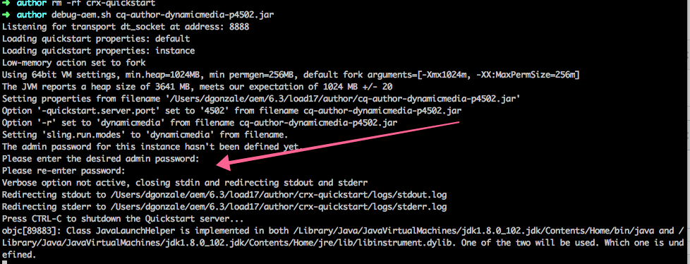

# 在安裝時設定管理員密碼{#configure-the-admin-password-on-installation}

>[!CAUTION]
>
>AEM 6.4已結束延伸支援，本檔案不再更新。 如需詳細資訊，請參閱 [技術支援期](https://helpx.adobe.com//tw/support/programs/eol-matrix.html). 尋找支援的版本 [此處](https://experienceleague.adobe.com/docs/).

## 概觀 {#overview}

自6.3版開始，AEM允許在安裝新執行個體時使用命令列設定管理員密碼。

若使用舊版AEM，管理員帳戶的密碼以及各種其他主控台的密碼必須在安裝後變更。

此功能增加了在安裝AEM實例期間為儲存庫和Servlet引擎設定新管理員密碼的功能，因此無需在安裝後手動操作。

>[!CAUTION]
>
>請注意，功能不涵蓋Felix Console，需要手動變更密碼。 如需詳細資訊，請參閱 [安全性檢查清單部分](/help/sites-administering/security-checklist.md#change-default-passwords-for-the-aem-and-osgi-console-admin-accounts).

## 如何使用它？ {#how-do-i-use-it}

如果您選擇通過命令行安裝AEM，而不是從檔案系統資源管理器中按兩下JAR，則此功能將自動觸發。

從命令行運行AEM實例的常規合成是：

```shell
java -jar aem6.3.jar
```

從命令列執行執行個體時，系統會顯示選項，讓您在安裝程式期間變更管理員密碼：



>[!NOTE]
>
>只有在安裝新AEM執行個體期間，才會顯示變更管理員密碼的提示。

## 使用 — nointeractive標籤 {#using-the-nointeractive-flag}

您也可以選擇從屬性檔案中指定密碼。 這需使用 `-nointeractive` 與 `-Dadmin.password.file` 系統屬性。

以下是範例：

```shell
java -Dadmin.password.file =/path/to/passwordfile.properties -jar aem6.3.jar -nointeractive
```

密碼 `passwordfile.properties` 檔案必須有下列格式：

```xml
admin.password = 12345678
```

>[!NOTE]
>
>如果您只使用 `-nointeractive` 參數(不含 `-Dadmin.password.file` 系統屬性， AEM將使用預設管理員密碼，而不要求您進行更改，實際上是從舊版複製行為。 此非互動式模式可用於使用安裝指令碼中的命令行進行自動安裝。
