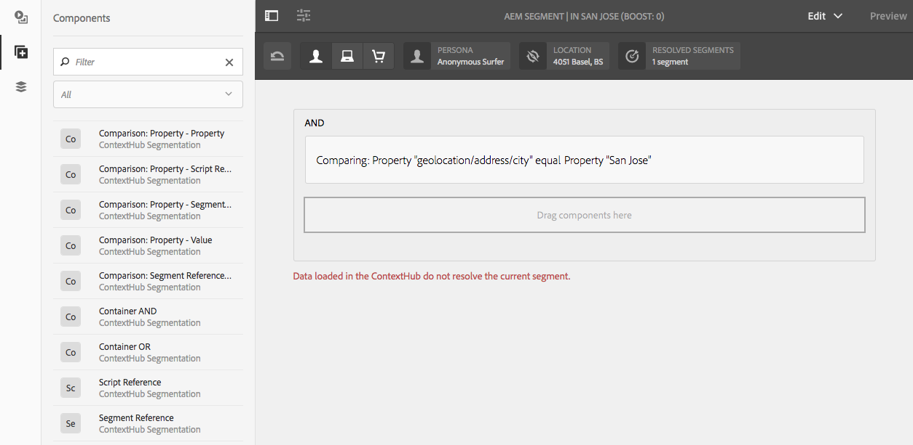

# 使用ContextHub{#configuring-segmentation-with-contexthub}設定區段

>[!NOTE]
>
>本節說明在使用ContextHub時設定區段。 如果您使用「用戶端內容」功能，請參閱[設定「用戶端內容」區段的相關檔案](/help/sites-administering/campaign-segmentation.md)。


區段是建立促銷活動時的主要考量。 如需細分運作方式和關鍵詞語的詳細資訊，請參閱[管理觀眾](/help/sites-authoring/managing-audiences.md)。

根據您已收集的網站訪客相關資訊以及您要達到的目標，您需要定義目標內容所需的區段和策略。

然後，這些區段會用來為訪客提供特定的目標內容。 此內容會保留在網站的[個人化](/help/sites-authoring/personalization.md)區段中。 [此處](/help/sites-authoring/activitylib.md) 定義的活動可包含在任何頁面上，並定義專業內容適用的訪客區段。

AEM可讓您輕鬆個人化使用者的體驗。 此外，還可讓您驗證區段定義的結果。

## 存取區段{#accessing-segments}

[Audiences](/help/sites-authoring/managing-audiences.md)主控台用來管理ContextHub或Client Context的區段，以及Adobe Target帳戶的觀眾。 本檔案涵蓋管理ContextHub的區段。 如需[用戶端內容區段](/help/sites-administering/campaign-segmentation.md)和Adobe Target區段，請參閱相關檔案。

若要存取區段，請在全域導覽中選取「**導覽>個人化>觀眾**」。


## 區段編輯器 {#segment-editor}

**區段編輯器**&#x200B;可讓您輕鬆修改區段。 若要編輯區段，請在[區段清單中選取區段](/help/sites-administering/segmentation.md#accessing-segments)，然後按一下&#x200B;**編輯**&#x200B;按鈕。



使用元件瀏覽器，您可新增&#x200B;**AND**&#x200B;和&#x200B;**OR**&#x200B;容器來定義區段邏輯，然後新增其他元件來比較屬性和值或參考指令碼和其他區段來定義選擇標準（請參閱[建立新區段](#creating-a-new-segment)），以定義確切的選取區段藍本。

當整個陳述式評估為true時，區段即已解決。 若有多個區段可適用，則也會使用&#x200B;**Boost**&#x200B;因子。 如需[boost系數的詳細資訊，請參閱[建立新區段](#creating-a-new-segment)。](/help/sites-administering/campaign-segmentation.md#boost-factor)

>[!CAUTION]
>
>段編輯器不檢查任何循環參照。 例如，區段A會參照另一個區段B，反過來參照區段A。您必須確定您的區段不包含任何循環反向連結。

### 容器{#containers}

下列容器是現成可用的，可讓您將比較和參考分組，以便進行布林值評估。 它們可從元件瀏覽器拖曳至編輯器。 如需詳細資訊，請參閱以下「使用AND和OR容器」一節。[](/help/sites-administering/segmentation.md#using-and-and-or-containers)

<table> 
 <tbody> 
  <tr> 
   <td>容器 AND<br /> </td> 
   <td>布林AND運算子<br /> </td> 
  </tr> 
  <tr> 
   <td>容器 OR<br /> </td> 
   <td>布林OR運算子</td> 
  </tr> 
 </tbody> 
</table>

### 比較{#comparisons}

下列區段比較是現成可用的，可用來評估區段屬性。 它們可從元件瀏覽器拖曳至編輯器。

<table> 
 <tbody> 
  <tr> 
   <td>Property-Value<br /> </td> 
   <td>將儲存的屬性與定義的值<br />進行比較 </td> 
  </tr> 
  <tr> 
   <td>屬性——屬性</td> 
   <td>將儲存的一個屬性與另一個屬性<br />進行比較 </td> 
  </tr> 
  <tr> 
   <td>屬性區段參考</td> 
   <td>將商店的屬性與另一個參考區段<br />比較 </td> 
  </tr> 
  <tr> 
   <td>屬性——指令碼參考</td> 
   <td>將儲存的屬性與指令碼的結果進行比較<br /> </td> 
  </tr> 
  <tr> 
   <td>區段參考指令碼參考</td> 
   <td>將參考的區段與指令碼的結果比較<br /> </td> 
  </tr> 
 </tbody> 
</table>

>[!NOTE]
>
>比較值時，如果未設定比較的資料類型（亦即設為自動偵測）,ContextHub的區段引擎將只會像javascript一樣比較值。 它不會將值轉換至其預期類型，而可能導致誤導結果。 例如：
>
>`null < 30 // will return true`
>
>因此，當[建立段](/help/sites-administering/segmentation.md#creating-a-new-segment)時，只要已知比較值的類型，您應選擇&#x200B;**資料類型**。 例如：
>
>在比較屬性`profile/age`時，您已知道比較類型為&#x200B;**number**，因此即使未設定`profile/age`，小於30的比較`profile/age`也會傳回&#x200B;**false**，如您所預期。

### 引用 {#references}

以下參考是現成可用的，可直接連結至指令碼或其他區段。 它們可從元件瀏覽器拖曳至編輯器。

<table> 
 <tbody> 
  <tr> 
   <td>區段引用<br /> </td> 
   <td>評估參考的區段</td> 
  </tr> 
  <tr> 
   <td>指令碼引用</td> 
   <td>評估參考的指令碼。 如需詳細資訊，請參閱以下章節<a href="/help/sites-administering/segmentation.md#using-script-references">使用指令碼參考</a>。</td> 
  </tr> 
 </tbody> 
</table>

## 建立新區段{#creating-a-new-segment}

要定義新段，請執行以下操作：

1. 在[存取區段](/help/sites-administering/segmentation.md#accessing-segments)後，按一下或點選「建立」按鈕並選取「建立ContextHub區段」**。**

   

1. 在&#x200B;**New ContextHub Segment**&#x200B;中，輸入區段的標題以及必要的提升值，然後點選或按一下「建立&#x200B;**a3/>」。**

   

   每個區段都有提升參數，用作加權系數。 數字越高，表示在多個區段有效的例項中，會優先選擇數字較低的區段。

   * 最小值：`0`
   * 最大值：`1000000`

1. 將比較或參考拖曳至區段編輯器，它將會出現在預設的AND容器中。
1. 連按兩下或點選新參考或區段的設定選項，以編輯特定參數。 在這個範例中，我們測試的是聖荷西的人。

   

   請盡量設定&#x200B;**資料類型**，以確保正確評估比較。 如需詳細資訊，請參閱[比較](/help/sites-administering/segmentation.md#comparisons)。

1. 按一下&#x200B;**確定**&#x200B;保存定義：
1. 視需要新增更多元件。 您可以使用容器元件來建立布林運算式，以用於AND和OR比較（請參閱下方的[使用AND和Or容器](/help/sites-administering/segmentation.md#using-and-and-or-containers)）。 使用區段編輯器，您可以刪除不再需要的元件，或將元件拖曳至陳述式中的新位置。

### 使用AND和OR容器{#using-and-and-or-containers}

使用AND和OR容器元件，您可以在AEM中建構複雜的區段。 在執行此動作時，請注意以下幾個基本要點：

* 定義的頂層永遠是最初建立的AND容器。 這無法變更，但對您的其餘區段定義沒有影響。
* 確保容器巢狀結構合理。 容器可以視為布林運算式的括弧。

以下範例用於選取在我們的主要年齡群組中被視為訪客的訪客：

男，30至59歲

或

女性，30歲到59歲

首先，將OR容器元件放置在預設的AND容器中。 在OR容器中，您新增兩個AND容器，而在這兩個容器中，您可新增屬性或參考元件。


### 使用指令碼引用{#using-script-references}

使用指令碼參考元件，可將區段屬性的評估委派給外部指令碼。 在正確設定指令碼後，它就可當成區段條件的任何其他元件。

#### 定義要引用的指令碼{#defining-a-script-to-reference}

1. 將檔案添加到`contexthub.segment-engine.scripts` clientlib。
1. 實作傳回值的函式。 例如：

   ```
   ContextHub.console.log(ContextHub.Shared.timestamp(), '[loading] contexthub.segment-engine.scripts - script.profile-info.js');
   
   (function() {
       'use strict';
   
       /**
        * Sample script returning profile information. Returns user info if data is available, false otherwise.
        *
        * @returns {Boolean}
        */
       var getProfileInfo = function() {
           /* let the SegmentEngine know when script should be re-run */
           this.dependOn(ContextHub.SegmentEngine.Property('profile/age'));
           this.dependOn(ContextHub.SegmentEngine.Property('profile/givenName'));
   
           /* variables */
           var name = ContextHub.get('profile/givenName');
           var age = ContextHub.get('profile/age');
   
           return name === 'Joe' && age === 123;
       };
   
       /* register function */
       ContextHub.SegmentEngine.ScriptManager.register('getProfileInfo', getProfileInfo);
   
   })();
   ```

1. 向`ContextHub.SegmentEngine.ScriptManager.register`註冊指令碼。

如果指令碼依賴於其他屬性，則指令碼應調用`this.dependOn()`。 例如，如果指令碼依賴`profile/age`:

```
this.dependOn(ContextHub.SegmentEngine.Property('profile/age'));
```

#### 引用指令碼{#referencing-a-script}

1. 建立ContextHub區段。
1. 將&#x200B;**指令碼參考**&#x200B;元件新增至區段的所需位置。
1. 開啟&#x200B;**指令碼引用**&#x200B;元件的編輯對話框。 如果[已正確設定](/help/sites-administering/segmentation.md#defining-a-script-to-reference)，則指令碼應可在&#x200B;**指令碼名稱**&#x200B;下拉式清單中使用。

## 測試區段{#testing-the-application-of-a-segment}的應用程式

一旦定義了區段，就可在&#x200B;**[ContextHub](/help/sites-authoring/ch-previewing.md)的協助下測試潛在結果。**

1. 預覽頁面
1. 按一下ContextHub圖示以顯示ContextHub工具列
1. 選擇符合您建立之群體的角色
1. ContextHub將解析所選角色的適用區段

例如，我們用來識別我們主要年齡組使用者的簡單區段定義，是根據使用者的年齡和性別而定的簡單區段定義。 載入符合這些條件的特定角色時，會顯示區段已成功解決：


或者，如果未解決：


>[!NOTE]
>
>所有特徵都會立即解決，不過大部分只會在頁面重新載入時變更。

此類測試也可在內容頁面上，並結合目標內容與相關的&#x200B;**活動**&#x200B;和&#x200B;**體驗**&#x200B;來執行。

如果您已使用上述主要年齡組區段範例設定活動和體驗，則可輕鬆使用活動測試區段。 如需設定活動的詳細資訊，請參閱製作目標內容的相關[檔案](/help/sites-authoring/content-targeting-touch.md)。

1. 在您已設定目標內容之頁面的編輯模式中，您可以看到內容是透過內容上的箭頭圖示來定位。

   

1. 切換至預覽模式並使用內容中樞，切換至不符合體驗所設定之區段的個人。

   

1. 切換至符合為體驗設定之區段的人物角色，並查看體驗會隨之變更。

   

## 使用您的區段{#using-your-segment}

區段可用來調整特定目標對象所檢視的實際內容。 如需觀眾和區段的詳細資訊，請參閱[管理觀眾](/help/sites-authoring/managing-audiences.md)，以及[編寫目標內容](/help/sites-authoring/content-targeting-touch.md)有關使用觀眾和區段來定位內容的詳細資訊。
