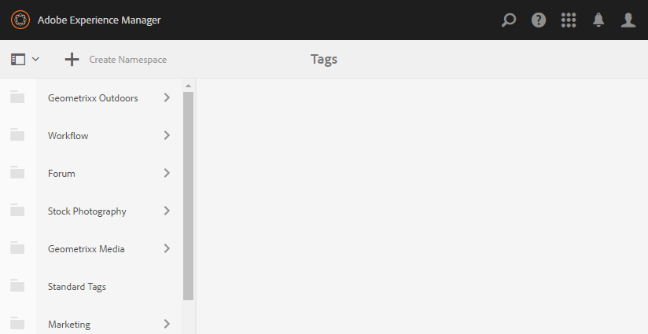

# 管理標籤{#administering-tags}

標籤是快速且簡單的網站內容分類方法。 它們可視為關鍵字或標籤（中繼資料），可讓搜尋結果更快速找到內容。

在Adobe Experience Manager(AEM)中，標籤可以是

* 頁面的內容節點(請參 [閱使用標籤](/help/sites-authoring/tags.md))

* 資產的中繼資料節點(請參閱「管 [理數位資產的中繼資料](/help/assets/metadata.md)」)

除了頁面和資產外，標籤也用於AEM Communities功能

* 使用者產生的內容(請參 [閱標籤UGC)](/help/communities/tag-ugc.md)

* 啟用資源(請參閱 [標籤啟用資源](/help/communities/functions.md#catalog-function))

## 標籤功能 {#tag-features}

AEM中標籤的部分功能包括：

* 標籤可分組為各種名稱空間。 這種層次結構允許建立分類。 這些分類在AEM中是全域性的。
* 新建立標籤的主要限制是，這些標籤在特定命名空間中必須是唯一的。
* 標籤的標題不應包含標籤路徑分隔字元（如果存在，也不會顯示）

   * 冒號(:)-分隔namespace標籤
   * 正斜線(/)-界限子標籤

* 標籤可由作者和網站訪客套用。 不論其建立者為何，在指派給頁面或搜尋時，都可使用所有形式的標籤供選取。
* 「標籤管理員」群組成員和具有修改權限的成員可以建立標籤並修改其分類 `/content/cq:tags`。

   * 包含子標籤的標籤稱為容器標籤
   * 非容器標籤的標籤稱為葉標籤
   * 標籤命名空間是葉標籤或容器標籤

* Search元件會使用標 [記](https://helpx.adobe.com/experience-manager/core-components/using/quick-search.html) ，以方便尋找內容。
* 標籤由 [Teaser元件使用](https://helpx.adobe.com/experience-manager/core-components/using/teaser.html)，可監視使用者的標籤雲以提供目標內容。
* 如果標籤是內容的重要方面

   * 請務必使用使用標籤的頁面來封裝標籤
   * 確定標籤 [權限](#setting-tag-permissions) ，啟用讀取存取

## 標籤控制台 {#tagging-console}

「標籤」控制台用於建立和管理標籤及其分類。 其中一個目標是避免使用許多與基本相同的標籤： 例如，頁面和頁面，鞋類和鞋類。

標籤的管理方式為：將標籤分組為命名空間、在建立新標籤之前檢閱現有標籤的使用情形，以及重新組織標籤，而不會中斷標籤與目前參考內容的連線。

要訪問標籤控制台：

* 在作者上
* 以管理權限登入
* 從全局導航

   * select **`Tools`**
   * select **`General`**
   * select **`Tagging`**

### 建立命名空間 {#creating-a-namespace}

若要建立新的命名空間，請選取 **`Create Namespace`** 圖示。

namespace本身是標籤，不需要包含任何子標籤。 但是，要繼續建立分類，請 [建立子標籤](#creating-tags)，子標籤可以是葉標籤或容器標籤。

 

* **Title***（必要）*命名空間的顯示標題。

* **名稱***（可選）*命名空間的名稱。 如果未指定，則從「標題」建立有效的節點名稱。 請參閱 [TagID](/help/sites-developing/framework.md#tagid)。

* **說明***（選用）*命名空間的說明。

在輸入所需資訊後

* select **Create**

### 標籤操作 {#operations-on-tags}

選擇命名空間或其他標籤可使用下列操作：

* [檢視屬性](#viewing-tag-properties)
* [引用](#showing-tag-references)
* [建立標記](#creating-tags)
* [編輯](#editing-tags)
* [移動](#moving-tags)
* [合併](#merging-tags)
* [發佈](#publishing-tags)
* [未發佈](#unpublishing-tags)
* [刪除](#deleting-tags)

當瀏覽器視窗不夠寬以顯示所有圖示時，最右邊的圖示會分組在圖示下方，在選取時 **`... More`** ，會顯示隱藏作業圖示的下拉式清單。

### 選擇命名空間標籤 {#selecting-a-namespace-tag}

首次選擇時，如果命名空間不包含任何標籤，則屬性會顯示在右側，否則會顯示子標籤。 選取的每個標籤都會顯示其所包含的標籤，或其屬性（如果沒有子標籤）。

要選擇操作的標籤，並且要進行多選，請僅選擇標題旁的表徵圖。 選取標題時，只會顯示屬性，或開啟標籤以顯示其內容。

 

### 檢視標籤屬性 {#viewing-tag-properties}

選取命名空間或其他標籤時，選取 **`View Properties`** 圖示會顯示有關上次編輯的時間 `name`，以及參考數目的資訊。 如果已發佈，則會顯示上次發佈的時間和發佈者的ID。 這些資訊會顯示在標籤欄左側的欄中。

### 顯示標籤引用 {#showing-tag-references}

選取命名空間或其他標籤時，選取**`References`**圖示會識別已套用標籤的內容。

初始顯示是套用的標籤計數。

通過選擇計數右側的箭頭，將列出參考名稱。

將滑鼠指標暫留在參照上時，參照的路徑會顯示為工具提示。

### 建立標籤 {#creating-tags}

當選取命名空間或其他標籤時（透過選取標題旁的圖示），可選取圖示來建立目前標籤的子標 **`Create Tag`** 記。

* **Title***（必要）*標籤的顯示標題。

* **名稱***（選用）*標籤的名稱。 如果未指定，則從「標題」建立有效的節點名稱。 請參閱 [TagID](/help/sites-developing/framework.md#tagid)。

* **說明***（選用）*標籤的說明。

在輸入所需資訊後

* select **Create**

### 編輯標籤 {#editing-tags}

當選取namespace或其他標籤時，可以變更標題、說明，並透過選取**`Edit`**圖示來提供標題的本地化。

進行編輯後，選擇「 **儲存**」。

如需有關新增語言翻譯的詳細資訊，請參閱「管理不同 [語言中的標籤」一節](#managing-tags-in-different-languages)。

### 移動標籤 {#moving-tags}

選取命名空間或其他標籤時，選取圖示將允許「標籤管理員」和「開發人員」將標籤移至新位置或重新命名，以清除分類。 **`Move`** 當選取的標籤是容器標籤時，移動標籤也會移動所有子標籤。

>[!NOTE]
>
>建議僅允許「作者」編 [輯標籤](#editing-tags) , `title`而不要移動或重新命名標籤。

* **路徑**

   *（唯讀）* ，選取標籤的目前路徑。

* **移至**&#x200B;瀏覽至要移動標籤的新路徑。

* **重新命名為**&#x200B;最初顯示當前 
`name`標籤上。 可以 `name`輸入新。

* 
* 選擇保 **存**

### 合併標籤 {#merging-tags}

當分類有重複項時，可使用合併標籤。 當標籤A合併到標籤B時，標籤A的所有頁面都將被標籤為標籤B，而標籤A不再可供作者使用。

當選取名稱空間或其他標籤時，選取**`Merge`**圖示將會開啟一個面板，其中可選取要合併的路徑。

* **路徑**

   *（唯讀）* ，選取要合併至其他標籤的標籤路徑。

* **合併到**&#x200B;瀏覽以選擇要合併到的標籤路徑。

>[!NOTE]
>
>合併後，原本選取的**路徑**將（幾乎）不再存在。
>
>當移動或合併參考標籤時，標籤不會實際刪除，因此可以維護參考。

### 發佈標籤 {#publishing-tags}

選取命名空間或其他標籤時，選取**`Publish`**圖示以在發佈環境中啟動標籤。 與頁面內容類似，只會發佈選取的標籤，不論它是否為容器標籤。

要發佈分類（命名空間和子標籤），最佳做法是建立命名空 [間的包](/help/sites-administering/package-manager.md) (請參見 [Taxonomy Root Node](/help/sites-developing/framework.md#taxonomy-root-node))。 請務必在建 [立套件前](#setting-tag-permissions) ，將權限套用至命名空間。

### 取消發佈標籤 {#unpublishing-tags}

選取命名空間或其他標籤時，選取**`Unpublish`**圖示會停用作者環境中的標籤，並將它從發佈環境中移除。 與操作類 `Delete`似，如果選取的標籤是容器標籤，則其所有子標籤都會在作者環境中停用，並從發佈環境中移除。

### 刪除標籤 {#deleting-tags}

當選取命名空間或其他標籤時，選取**`Delete`**圖示會從作者環境中永久移除標籤。 如果標籤已發佈，也會從發佈環境中移除。 如果選取的標籤是容器標籤，其所有子標籤也會移除。

## 設定標籤權限 {#setting-tag-permissions}

標籤權 [限是「安全」（依預設）](/help/sites-administering/production-ready.md); 此為發佈環境的最佳做法，要求明確允許標籤的讀取權限。 基本上，這是透過在作者上設定權限後建立「標籤命名空間」的套件，並在所有發佈例項上安裝此套件來完成。

* 在作者實例上

   * 以管理權限登入
   * 存取安 [全控制台](/help/sites-administering/security.md#accessing-user-administration-with-the-security-console),

      * 例如，瀏覽至http://localhost:4502/useradmin
   * 在左窗格中，選擇要授予其讀取權 [限的組](/help/sites-administering/security.md#permissions) （或用戶）
   * 在右窗格中，找到「標籤命名空間」的**路徑**

      * for example, `/content/cq:tags/mycommunity`
   * 在「讀 `checkbox`取」欄 **中選擇** 。
   * 選擇保 **存**

* 確保所有發佈例項都擁有相同的權限

   * 一種方法是在 [作者上建立](/help/sites-administering/package-manager.md#package-manager) namespace的套件

      * 在選 `Advanced` 項卡上，選 `AC Handling` 擇 `Overwrite`
   * 複製包

      * 從包管 `Replicate` 理器中選擇

## 管理不同語言的標籤 {#managing-tags-in-different-languages}

標 `title`簽的屬性可以翻譯成多種語言。 翻譯後，可以根 `title`據用戶語言或頁面語言顯示適當的標籤。

### 定義多種語言的標籤標題 {#defining-tag-titles-in-multiple-languages}

以下說明如何將標 `title`簽Animals從英 **文** 翻譯成德文和法文。

首先，在「 **Stock Photography** 」命名空間下選取標籤，然後選取**`Edit`**圖示(請參閱「  編輯標籤」區段)。

「編輯標籤」面板提供選擇標籤標題本地化語言的功能。

在選擇每種語言時，將出現一個文本輸入框，可在其中輸入翻譯的標題。

輸入所有翻譯後，選擇**保存**退出編輯模式。

一般而言，為標籤選擇的語言是從頁面語言（若有）取用。 當在其 [ 他情況下( `tag`](/help/sites-developing/building.md#tagging-on-the-client-side) 例如在表單或對話方塊中)使用介面工具集時，標籤語言會依據內容而定。

「標籤」控制台不使用頁面語言設定，而是使用用戶語言設定。 在「標籤」控制台中，對於「動物」標籤，在其用戶屬性中將語言設定為法語的用戶，將顯示「Animaux」。

要向對話框添加新語言，請參 [閱「編輯標籤」對話框添加新語言](/help/sites-developing/building.md#adding-a-new-language-to-the-edit-tag-dialog)。

>[!NOTE]
>
>標準頁面元件中的標籤雲和中繼關鍵字會根據頁面語 `titles`言（若有的話）使用本地化的標籤。

## 資源 {#resources}

* [為開發人員加上標籤](/help/sites-developing/tags.md)

   有關標籤框架以及在自定義應用程式中擴展和包括標籤的資訊。

* [傳統UI標籤控制台](/help/sites-administering/classic-console.md)

