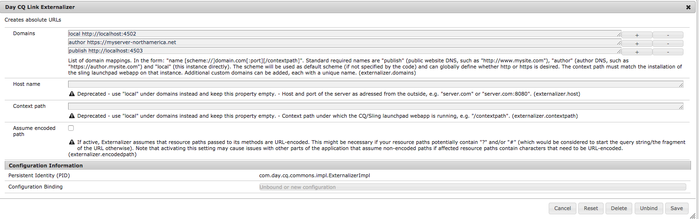

# 與Adobe Target整合的必要條件{#prerequisites-for-integrating-with-adobe-target}

作為AEM和Adobe Target](/help/sites-administering/target.md)整合的一部分，您需要向Adobe Target註冊、配置復寫代理，以及在發佈節點上保護活動設定。[

## 向Adobe Target註冊{#registering-with-adobe-target}

若要將AEM與Adobe Target整合，您必須具備有效的Adobe Target帳戶。 此帳戶至少必須具**核准**層級權限。 向Adobe Target註冊時，您會收到用戶端代碼。 您需要用戶端代碼和Adobe Target登入名稱及密碼，才能將AEM連線至Adobe Target。

用戶端代碼會在呼叫Adobe Target伺服器時識別Adobe Target客戶帳戶。

>[!NOTE]
>
>您的帳戶也必須由Target團隊啟用，才能使用整合。
>
>
>若非如此，請聯絡[Adobe Target客戶服務](https://docs.adobe.com/content/help/en/target/using/cmp-resources-and-contact-information.html)。

## 啟用目標複製代理{#enabling-the-target-replication-agent}

必須在製作執行個體上啟用測試和目標[復寫代理](/help/sites-deploying/replication.md)。 請注意，如果您使用[nosamplecontent](/help/sites-deploying/configure-runmodes.md#using-samplecontent-and-nosamplecontent)執行模式來安裝AEM，則此復寫代理預設不會啟用。 有關保護生產環境的詳細資訊，請參閱[安全檢查清單](/help/sites-administering/security-checklist.md)。

1. 在AEM首頁上，按一下或點選「**工具** > **部署** > **復寫**」。
1. 按一下或點選「**製作上的代理**」。
1. 按一下或點選&#x200B;**Test and Target(test and target)**&#x200B;復寫代理，然後按一下或點選&#x200B;**Edit**。
1. 選取「已啟用」選項，然後按一下或點選「**確定**」。

   >[!NOTE]
   >
   >配置Test和Target複製代理時，在&#x200B;**Transport**&#x200B;頁簽中，URI預設設定為&#x200B;**tnt:///**。 請勿將此URI替換為&#x200B;**https://admin.testandtarget.omniture.com**。
   >
   >請注意，如果您嘗試使用&#x200B;**tnt:///**&#x200B;測試連線，則會擲回錯誤。 這是預期的行為，因為此URI僅供內部使用，不應與&#x200B;**Test Connection**&#x200B;一起使用。

## 保護活動設定節點{#securing-the-activity-settings-node}

您必須保護發佈執行個體上的活動設定節點&#x200B;**cq:ActivitySettings**，使一般使用者無法存取該節點。 處理活動同步至Adobe Target的服務只應能存取活動設定節點。

**cq:ActivitySettings**&#x200B;節點可在CRXDE lite的`/content/campaigns/*nameofbrand*`* *下，位於活動jcr:content node;* *例如`/content/campaign/we-retail/master/myactivity/jcr:content/cq:ActivitySettings`下。 此節點僅在您定位元件後建立。

活動jcr:content下的&#x200B;**cq:ActivitySettings**&#x200B;節點受以下ACL保護：

* 拒絕所有人
* 允許「target-activity-authors」的jcr:read,rep:write（作者是此群組的現成成員）
* 允許&quot;targetservice&quot;的jcr:read,rep:write

這些設定可確保一般使用者沒有節點屬性的存取權。 在製作和發佈時使用相同的ACL。 如需詳細資訊，請參閱[使用者管理與安全性](/help/sites-administering/security.md) 。

## 配置AEM外置程式{#configuring-the-aem-externalizer}

在Adobe Target中編輯活動時，除非您變更AEM製作節點上的URL，否則URL會指向&#x200B;**localhost**。

要配置AEM外置程式：

1. 在&#x200B;**https://&lt;server>:&lt;port>/system/console/configMgr.**&#x200B;導覽至OSGi Web控制台
1. 找到&#x200B;**Day CQ Link Externalizer**&#x200B;並輸入製作節點的網域。

   
