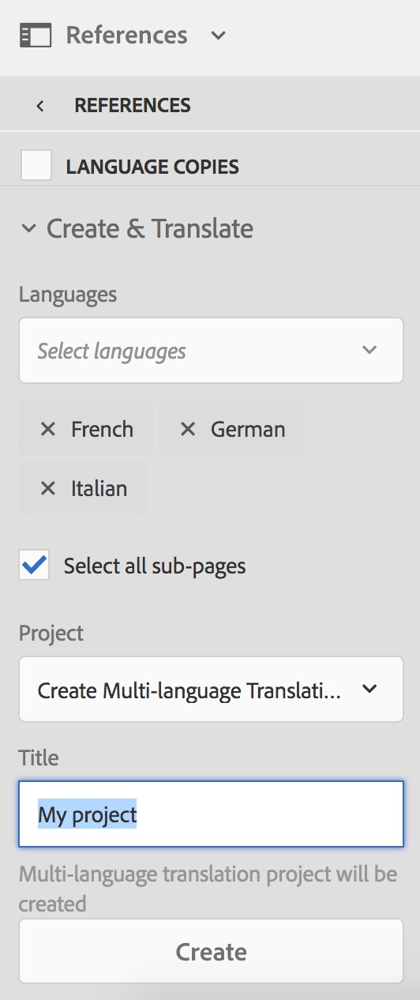
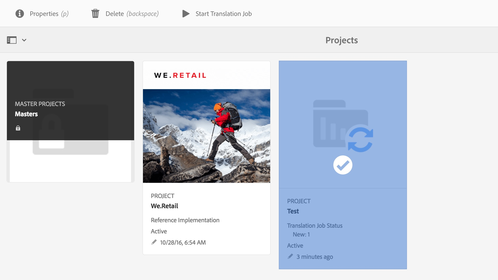
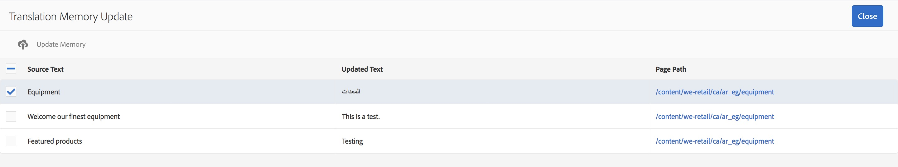

# 翻譯增強功能{#translation-enhancements}

>[!CAUTION]
>
>AEM 6.4已結束延伸支援，本檔案不再更新。 如需詳細資訊，請參閱 [技術支援期](https://helpx.adobe.com//tw/support/programs/eol-matrix.html). 尋找支援的版本 [此處](https://experienceleague.adobe.com/docs/).

本頁介紹AEM翻譯管理功能的增量增強和細分。

## 翻譯專案自動化 {#translation-project-automation}

已新增可改善翻譯專案生產力的選項，例如自動提升和刪除翻譯啟動，以及排程翻譯專案的循環執行。

1. 在翻譯專案中，按一下或點選 **翻譯摘要** 方塊。

   

1. 切換至 **進階** 標籤。 在底部，您可以選取 **自動促銷翻譯啟動**.

   

1. 您可以選擇在收到翻譯內容後，是否應自動升級和刪除翻譯啟動。

   

1. 若要選取翻譯專案的循環執行，請選取下拉式清單下方的頻率 **重複翻譯**. 循環項目執行將在指定時間間隔內自動建立和執行翻譯作業。

   

## 多語言翻譯專案 {#multilingual-translation-projects}

可以在翻譯專案中設定多種目標語言，以減少建立的翻譯專案總數。

1. 在您的翻譯專案中，按一下或點選 **翻譯摘要** 方塊。

   

1. 切換至 **進階** 標籤。 您可以在 **目標語言**.

   

1. 或者，如果您要透過Sites中的參考邊欄起始翻譯，請新增語言並選取 **建立多語言翻譯專案**.

   

1. 系統會在專案中針對每種目標語言建立翻譯工作。 您可以在專案內逐一啟動，或透過在「專案管理員」中全域執行專案，一次一次啟動。

   

## 翻譯記憶體更新 {#translation-memory-updates}

翻譯內容的手動編輯可以同步回翻譯管理系統(TMS)以訓練其翻譯記憶體。

1. 在Sites主控台中，在更新翻譯頁面中的文字內容後，選取 **更新翻譯記憶體**.

   

1. 清單視圖會並排顯示源的比較，以及已編輯的每個文本元件的翻譯。 選擇應同步到翻譯記憶庫的翻譯更新，然後選擇 **更新記憶體**.

   

   >[!NOTE]
   >
   >AEM會將選取的字串傳回翻譯管理系統。

## 多級語言副本 {#language-copies-on-multiple-levels}

現在，語言根可以分組在節點下，例如按區域分組，同時仍被識別為語言副本的根。

>[!CAUTION]
>
>只允許一個級別。 例如，下列項目不允許「es」頁面解析為語言副本：
>
>* `/content/we-retail/language-masters/en`
>* `/content/we-retail/language-masters/americas/central-america/es`
>
>此 `es` 不會偵測到語言副本，因為該副本是離開2個層級（美洲/中美洲）的 `en` 節點。

>[!NOTE]
>
>語言根可以有任何頁面名稱，而不只是語言的ISO代碼。 AEM一律會先檢查路徑和名稱，但如果頁面名稱未識別語言，AEM會檢查頁面的cq:language屬性以識別語言。

## 翻譯狀態報告 {#translation-status-reporting}

現在可以在「網站」清單檢視中選取屬性，顯示頁面是已翻譯、正在翻譯或尚未翻譯。 若要顯示：

1. 在Sites中，切換至 **清單檢視。**

   

1. 按一下或點選 **檢視設定**.

   

1. 檢查 **已翻譯** 核取方塊 **翻譯** 點選/按一下 **更新**.

   

您現在可以看到 **已翻譯** 欄，顯示頁面的翻譯狀態。

