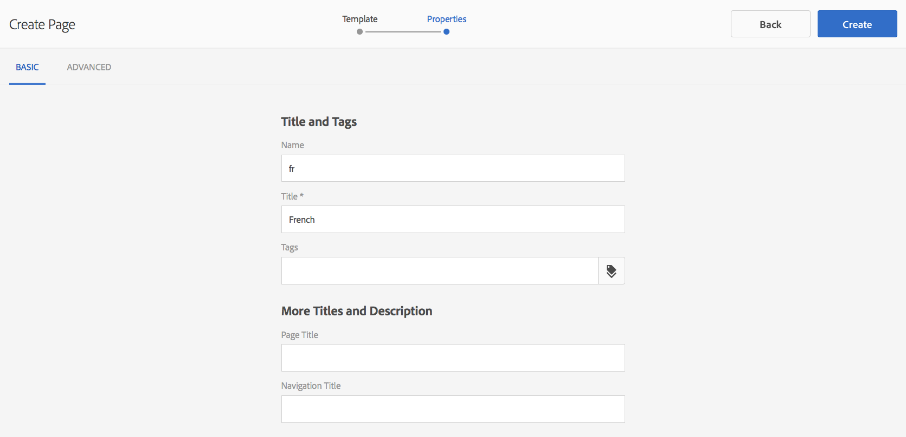

# 準備翻譯內容{#preparing-content-for-translation}

>[!CAUTION]
>
>AEM 6.4已結束延伸支援，本檔案不再更新。 如需詳細資訊，請參閱 [技術支援期](https://helpx.adobe.com//tw/support/programs/eol-matrix.html). 尋找支援的版本 [此處](https://experienceleague.adobe.com/docs/).

多語言網站通常提供多種語言的內容。 網站以一種語言編寫，然後翻譯成其他語言。 一般而言，多語言網站是由頁面的分支所組成，每個分支都包含不同語言的網站頁面。

範例Geometrixx示範網站包含數種語言分支，並使用下列結構：

```xml
/content
    |- geometrixx
             |- en
             |- fr
             |- de
             |- es
             |- it
             |- ja
             |- zh
```

網站的每個語言分支都稱為語言副本。 語言副本的根頁面（稱為語言根）可識別語言副本中內容的語言。 例如， `/content/geometrixx/fr` 是法文語言副本的語言根。 語言副本必須使用 [正確配置的語言根](/help/sites-administering/tc-prep.md#creating-a-language-root) 以便在執行源站點的翻譯時定位正確的語言。

您最初製作網站內容的語言副本是語言主版。 語言主版是翻譯成其他語言的源。

使用下列步驟準備您的網站以進行翻譯：

1. 建立語言主版的語言根。 例如，英文Geometrixx示範網站的語言根目錄為/content/geometrixx/en。 請根據 [建立語言根](/help/sites-administering/tc-prep.md#creating-a-language-root).
1. 編寫您的語言主版的內容。
1. 為網站建立每個語言副本的語言根目錄。 例如，Geometrixx範例網站的法文語言副本為/content/geometrixx/fr。

在準備翻譯內容後，您可以自動在語言副本和相關翻譯專案中建立遺漏的頁面。 (請參閱 [建立翻譯專案](/help/sites-administering/tc-manage.md).) 如需AEM中內容翻譯程式的概觀，請參閱 [轉譯多語言網站的內容](/help/sites-administering/translation.md).

## 建立語言根 {#creating-a-language-root}

建立語言根作為標識內容語言的語言副本的根頁。 建立語言根後，您可以建立包含語言副本的翻譯專案。

要建立語言根，請建立一個頁，並使用ISO語言代碼作為Name屬性的值。 語言代碼必須為以下格式之一：

* `<language-code>`支援的語言代碼是由ISO-639-1定義的雙字母代碼，例如 `en`.

* `<language-code>_<country-code>` 或 `<language-code>-<country-code>`支援的國家/地區代碼是ISO 3166定義的小寫或大寫雙字母代碼，例如 `en_US`, `en_us`, `en_GB`, `en-gb`.

您可以根據您為全域網站選擇的結構，使用任一格式。  例如，Geometrixx網站的法文語言副本的根頁面具有 `fr` 作為Name屬性。 請注意，Name屬性是作為儲存庫中頁面節點的名稱，因此會決定頁面的路徑。 (http://localhost:4502/content/geometrixx/fr.html)

下列程式使用觸控最佳化UI來建立網站的語言副本。 如需使用傳統UI的指示，請參閱 [使用傳統UI建立語言根](/help/sites-administering/tc-lroot-classic.md).

1. 導覽至網站。
1. 按一下或點選您要建立語言副本的網站。

   例如，若要建立Geometrixx Outdoors網站的語言副本，您可以按一下或點選「Geometrixx Outdoors網站」。

1. 按一下或點選「建立」，然後按一下或點選「建立頁面」。

   

1. 選取頁面範本，然後按一下或點選「下一步」。
1. 在「名稱」欄位中，以 `<language-code>` 或 `<language-code>_<country-code>`，例如 `en`, `en_US`, `en_us`, `en_GB`, `en_gb`. 輸入頁面標題。

   

1. 按一下或點選「建立」。 在確認對話方塊中，按一下或點選任一 **完成** 返回Sites控制台，或 **開啟** 以開啟語言副本。

## 看語言根的狀態 {#seeing-the-status-of-language-roots}

觸控最佳化UI提供「參考」面板，顯示已建立的語言根清單。


下列程式使用觸控最佳化UI來開啟頁面的「參考」面板。

1. 在Sites主控台中，選取網站的頁面，然後按一下或點選 **參考**.

   

1. 在「參考」面板中，按一下或點選 **語言副本**. 「語言副本」面板會顯示網站的語言副本。
