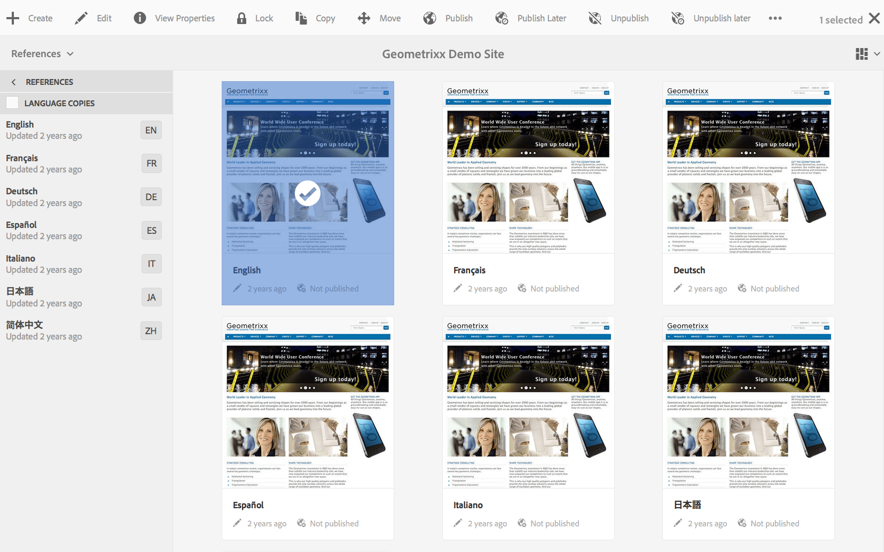

# 準備翻譯內容{#preparing-content-for-translation}

多語言網站通常提供多種語言的內容。 網站以一種語言編寫，然後翻譯成其他語言。 通常，多語言網站由頁面分支組成，其中每個分支包含不同語言的網站頁面。

範例Geometrixx示範網站包含數種語言分支，並使用下列結構：

```xml
/content
    |- geometrixx
             |- en
             |- fr
             |- de
             |- es
             |- it
             |- ja
             |- zh
```

網站的每個語言分支都稱為語言副本。 語言副本的根頁面（稱為語言根目錄）可識別語言副本中內容的語言。 例如，`/content/geometrixx/fr`是法文語言副本的語言根目錄。 語言副本必須使用[正確配置的語言root](/help/sites-administering/tc-prep.md#creating-a-language-root)，以便在執行源站點的翻譯時定位正確的語言。

您最初為其製作網站內容的語言副本是語言主版。 語言主版是翻譯成其他語言的源。

使用下列步驟來準備您的網站進行翻譯：

1. 建立您語言主版的語言根目錄。 例如，英文Geometrixx示範網站的語言根目錄為/content/geometrixx/tw。 確保根據[建立語言根目錄](/help/sites-administering/tc-prep.md#creating-a-language-root)中的資訊正確配置語言根目錄。
1. 編寫您的語言大師的內容。
1. 為您的網站建立每個語言副本的語言根目錄。 例如，Geometrixx範例網站的法文語言副本為/content/geometrixx/fr。

在準備翻譯內容後，您可以自動在語言副本和相關的翻譯項目中建立缺少的頁面。 （請參閱[建立翻譯項目](/help/sites-administering/tc-manage.md)。） 有關中的內容翻譯過程的概AEM述，請參閱[多語言網站的翻譯內容](/help/sites-administering/translation.md)。

## 建立語言根{#creating-a-language-root}

建立語言根目錄作為識別內容語言的語言副本的根頁面。 建立語言根目錄後，可以建立包含語言副本的翻譯項目。

要建立語言根目錄，請建立一個頁面，並使用ISO語言代碼作為「名稱」屬性的值。 語言代碼必須採用下列格式之一：

* `<language-code>`例如，支援的語言程式碼是由ISO-639-1所定義的雙字母程式碼 `en`。

* `<language-code>_<country-code>` 或 `<language-code>-<country-code>`者，支援的國家／地區代碼是ISO 3166定義的小寫或大寫雙字母代碼 `en_US`, `en_us`例如， `en_GB`、 `en-gb`。

您可以根據您為全域網站選擇的結構，使用任一格式。  例如，Geometrixx網站的法文語言副本的根頁面具有`fr`作為Name屬性。 請注意，Name屬性用作儲存庫中頁節點的名稱，因此確定了頁的路徑。 (http://localhost:4502/content/geometrixx/fr.html)

下列程式使用觸控最佳化的UI來建立網站的語言副本。 如需使用Classic UI的說明，請參閱[使用Classic UI](/help/sites-administering/tc-lroot-classic.md)建立語言根目錄。

1. 導覽至網站。
1. 按一下或點選您要建立語言副本的網站。

   例如，要建立Geometrixx Outdoors站點的語言副本，可按一下或點選Geometrixx Outdoors站點。

1. 按一下或點選「建立」，然後按一下或點選「建立頁面」。

   

1. 選取頁面範本，然後按一下或點選「下一步」。
1. 在「名稱」欄位中，以`<language-code>`或`<language-code>_<country-code>`格式輸入國家代碼，例如`en`、`en_US`、`en_us`、`en_GB`、`en_gb`。 輸入頁面的標題。

   

1. 按一下或點選「建立」。 在確認對話方塊中，按一下或點選&#x200B;**Done**&#x200B;以返回Sites主控台，或點選&#x200B;**Open**&#x200B;以開啟語言副本。

## 看語言根的狀態{#seeing-the-status-of-language-roots}

觸控最佳化UI提供「參考」面板，顯示已建立的語言根目錄清單。



下列程式使用觸控最佳化的UI來開啟頁面的「參考」面板。

1. 在「站點」控制台上，選擇站點的一個頁面，然後按一下或點選&#x200B;**References**。

   

1. 在參考面板中，按一下或點選&#x200B;**語言副本**。 「語言副本」面板顯示網站的語言副本。

