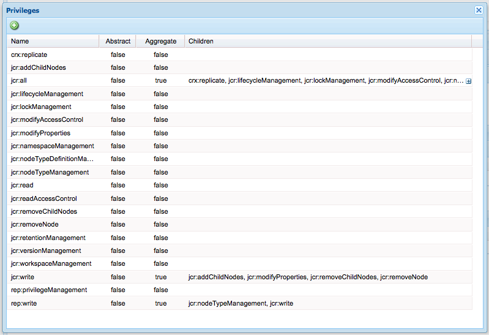

# 用戶、組和訪問權限管理{#user-group-and-access-rights-administration}

啟用對CRX儲存庫的訪問涉及以下幾個主題：

* [存取權](#how-access-rights-are-evaluated) -定義與評估這些權限的概念
* [使用者管理](#user-administration) -管理用於存取的個別帳戶
* [群組管理](#group-administration) -透過組成群組簡化使用者管理

* [訪問權限管理](#access-right-management) -定義策略，以控制這些用戶和組訪問資源的方式

基本要素包括：

**User** AccountsCRX根據使用者帳戶中的詳細資訊，識別並驗證使用者（由該人或其他應用程式），以驗證存取權。

在CRX中，每個使用者帳戶都是工作區中的節點。 CRX使用者帳戶具有下列屬性：

* 它代表CRX的一位使用者。
* 它包含用戶名和密碼。
* 適用於該工作區。
* 它不能有子用戶。 對於分層訪問權限，您應使用組。

* 您可以指定使用者帳戶的存取權限。

   不過，為簡化管理，我們建議您（在大部分情況下）將存取權指派給群組帳戶。 為每個個別使用者指派存取權限變得很難管理（只有一或兩個例項時，某些系統使用者例外）。

**Group** AccountsGroup帳戶是使用者和／或其他群組的集合。當指派給群組的存取權限變更自動套用至該群組中的所有使用者時，這些變更可用來簡化管理。 使用者不必屬於任何群組，但通常屬於數個群組。

在CRX中，組具有以下屬性：

* 它代表一組具有共同存取權限的使用者。 例如，作者或開發人員。
* 適用於該工作區。
* 它可以有成員；這些群組可以是個別使用者或其他群組。
* 通過成員關係可以實現分層分組。 不能將組直接放在儲存庫中的另一個組下方。

* 您可以定義所有群組成員的存取權限。

**Access** RightsCRX使用Access Rights來控制對儲存庫特定區域的訪問。

通過為儲存庫中的資源（節點或路徑）分配允許或拒絕訪問權限來完成此操作。 由於可以指派各種權限，因此必須評估這些權限，以決定哪一種組合適用於目前的請求。

CRX允許您配置用戶和組帳戶的訪問權限。 然後，評估的基本原則也適用於兩者。

## 評估訪問權限的方式{#how-access-rights-are-evaluated}

>[!NOTE]
>
>CRX實現了由JSR-283](https://docs.adobe.com/content/docs/en/spec/jcr/2.0/16_Access_Control_Management.html)定義的[訪問控制。
>
>CRX儲存庫的標準安裝配置為使用基於資源的訪問控制清單。 這是JSR-283訪問控制的一個可能實現以及Jackrabbit的一個實現。

### 主體與承擔者{#subjects-and-principals}

CRX在評估訪問權限時使用兩個關鍵概念：

* **principal**&#x200B;是具有訪問權限的實體。 承擔者包括：

   * 使用者帳戶。
   * 群組帳戶

      如果用戶帳戶屬於一個或多個，則其也與這些組承擔者中的每個組相關聯。

* **subject**&#x200B;用於表示請求的源。

   它用於合併該請求適用的訪問權限。 這些來自：

   * 用戶主體

      您直接指派給使用者帳戶的權限。

   * 與該用戶關聯的所有承擔者組

      分配給用戶所屬任何組的所有權限。
   然後，結果將用於允許或拒絕對所請求資源的訪問。

#### 編譯主題的訪問權限清單{#compiling-the-list-of-access-rights-for-a-subject}

在CRX中，主題取決於：

* 用戶主體
* 與該用戶關聯的所有組承擔者

適用於主題的訪問權限清單由以下內容構成：

* 您直接指派給使用者帳戶的權限
* 加上指派給使用者所屬任何群組的所有權限


>[!NOTE]
>
>* CRX編譯清單時，不會考慮任何使用者階層。
>* CRX僅在將群組納入為其他群組的成員時使用群組階層。 群組權限沒有自動繼承。
>* 您指定群組的順序不會影響存取權限。

>


### 解決請求和訪問權限{#resolving-request-and-access-rights}

當CRX處理請求時，它會將來自主題的訪問請求與儲存庫節點上的訪問控制清單進行比較：

因此，如果Linda請求更新以下儲存庫結構中的`/features`節點：


### 優先順序{#order-of-precedence}

CRX中的訪問權限評估如下：

* 用戶承擔者始終優先於組承擔者，而不考慮：

   * 他們在訪問控制清單中的順序
   * 在節點層次中的位置

* 對於給定的承擔者，在給定節點上最多存在1個拒絕和1個允許條目。 實作一律會清除冗餘項目，並確保允許和拒絕項目中未列出相同的權限。

>[!NOTE]
>
>此評估過程適用於標準CRX安裝的基於資源的訪問控制。

舉兩個使用者`aUser`為群組`aGroup`成員的範例：

```xml
   + parentNode
     + acl
       + ace: aUser - deny - write
     + childNode
       + acl
         + ace: aGroup - allow - write
       + grandChildNode
```

在上述情況下：

* `aUser` 未授予對的寫權限 `grandChildNode`。

```xml
   + parentNode
     + acl
       + ace: aUser - deny - write
     + childNode
       + acl
         + ace: aGroup - allow - write
         + ace: aUser - deny - write
       + grandChildNode
```

在本例中：

* `aUser` 未授予對的寫權限 `grandChildNode`。

* `aUser`的第二個ACE是冗餘的。

多個組承擔者的訪問權限將根據其順序進行評估，包括層次內和單個訪問控制清單中的順序。

### 最佳作法 {#best-practices}

下表列出一些建議和最佳實務：

<table> 
 <tbody> 
  <tr> 
   <td>建議……</td> 
   <td>原因...</td> 
  </tr> 
  <tr> 
   <td><i>使用群組</i></td> 
   <td><p>避免依使用者指派存取權限。 原因有幾：</p> 
    <ul> 
     <li>您的使用者比群組多，因此群組可簡化結構。</li> 
     <li>群組可協助提供所有帳戶的概觀。</li> 
     <li>對於群組，繼承更簡單。</li> 
     <li>使用者來來去。 群體是長期的。</li> 
    </ul> </td> 
  </tr> 
  <tr> 
   <td><i>積極</i></td> 
   <td><p>請始終使用「允許」語句來指定組承擔者的訪問權限（盡可能）。 避免使用Deny語句。</p> <p>評估組承擔者的順序是在層次和單個訪問控制清單中按順序進行的。</p> </td> 
  </tr> 
  <tr> 
   <td><i>保持簡單</i></td> 
   <td><p>在配置新安裝時投入一些時間和思考，將獲得很好的回報。</p> <p>套用清楚的結構可簡化持續的維護與管理，確保您目前的同事和／或未來的繼任者都能輕鬆瞭解正在實施的內容。</p> </td> 
  </tr> 
  <tr> 
   <td><i>測試</i></td> 
   <td>使用測試安裝來練習並確保您瞭解不同使用者和群組之間的關係。</td> 
  </tr> 
  <tr> 
   <td><i>預設使用者／群組</i></td> 
   <td>安裝後請立即更新預設使用者和群組，協助避免任何安全性問題。</td> 
  </tr> 
 </tbody> 
</table>

## 用戶管理{#user-administration}

標準對話框用於&#x200B;**用戶管理**。

您必須登入適當的工作區，然後您就可以從以下兩者存取對話方塊：

* CRX主控制台上的&#x200B;**用戶管理**&#x200B;連結
* CRX Explorer的&#x200B;**Security**&#x200B;菜單


**屬性**

* **帳**
戶的UserIDShort名稱，用於存取CRX。

* **承擔**
者名稱帳戶的全文名稱。

* **使**
用此帳戶訪問CRX時需要密碼。

* **ntlmhash**
自動為每個新帳戶指派，並在密碼變更時更新。

* 您可以定義名稱、類型和值，以新增屬性。 對每個新屬性按一下「儲存（綠色勾選符號）」。

**群組** 成員資格這會顯示帳戶所屬的所有群組。「繼承」(Inherited)清單示已繼承的成員資格是另一個組的成員資格的結果。

按一下GroupID（如果有）將開啟該群組的[群組管理](#group-administration)。

**模** 擬者使用模擬功能，使用者可以代表其他使用者工作。

這表示使用者帳戶可以指定其他帳戶（使用者或群組），以便與其帳戶一起運作。 換言之，如果允許user-B模擬使用者-A，則user-B可使用user-A的完整帳戶詳細資訊（包括ID、名稱和存取權限）採取動作。

這可讓模擬帳戶完成工作，就像使用其模擬的帳戶；例如，在缺勤期間或在短期內共用過多負荷。

如果某個帳戶冒充其他帳戶，就很難看到。 日誌檔案不包含事件上發生冒用的相關資訊。 因此，如果user-B模擬使用者- A所有事件看起來都像是使用者- A個人執行的。

### 建立用戶帳戶{#creating-a-user-account}

1. 開啟&#x200B;**用戶管理**&#x200B;對話框。
1. 按一下&#x200B;**建立用戶**。
1. 然後，您可以輸入「屬性：

   * **用** 作帳戶名稱的UserID。
   * **登** 入時需要密碼。
   * **「主** 要名稱」提供完整的文本名稱。
   * **中間** 路徑，可用於形成樹結構。

1. 按一下「儲存（綠色勾選符號）」。
1. 對話方塊將會展開，您可以：

   1. 配置&#x200B;**屬性**。
   1. 請參閱&#x200B;**群組成員資格**。
   1. 定義&#x200B;**Impersonators**。

>[!NOTE]
>
>在安裝中註冊新用戶時，有時會出現效能下降的情況，這些用戶的數量很多：
>
>* 個使用者
>* 具有多個成員的組

>


### 更新用戶帳戶{#updating-a-user-account}

1. 使用&#x200B;**User Administration**&#x200B;對話框開啟所有帳戶的清單視圖。

1. 瀏覽樹結構。
1. 按一下要開啟以進行編輯的必要帳戶。
1. 進行變更，然後按一下該項目的「儲存（綠色勾號）」。
1. 按一下&#x200B;**關閉**&#x200B;以完成，或按一下&#x200B;**清單……**&#x200B;以返回所有使用者帳戶的清單。

### 刪除用戶帳戶{#removing-a-user-account}

1. 使用&#x200B;**User Administration**&#x200B;對話框開啟所有帳戶的清單視圖。

1. 瀏覽樹結構。
1. 選擇所需帳戶，然後按一下&#x200B;**刪除用戶**;帳戶將立即刪除。

>[!NOTE]
>
>這會從儲存庫中刪除此承擔者的節點。
>
>未移除存取權限項目。 這確保了歷史的完整性。

### 定義屬性{#defining-properties}

您可以為新帳戶或現有帳戶定義&#x200B;**屬性**:

1. 開啟適當帳戶的&#x200B;**使用者管理**&#x200B;對話方塊。
1. 定義&#x200B;**Property**&#x200B;名稱。
1. 從下拉清單中選擇&#x200B;**類型**。
1. 定義&#x200B;**Value**。
1. 按一下新屬性的「儲存」（綠色按一下符號）。

可使用垃圾筒符號刪除現有屬性。

除了「密碼」外，屬性無法編輯，必須刪除並重新建立。

#### 更改密碼{#changing-the-password}

**Password**&#x200B;是一個特殊屬性，可通過按一下&#x200B;**Change Password**&#x200B;連結來更改。

您也可以從CRX檔案總管的&#x200B;**Security**&#x200B;功能表，將密碼變更為您自己的使用者帳戶。

### 定義模擬器{#defining-an-impersonator}

您可以為新帳戶或現有帳戶定義模擬器：

1. 開啟適當帳戶的&#x200B;**使用者管理**&#x200B;對話方塊。
1. 指定允許模擬該帳戶的帳戶。

   您可以使用瀏覽……來選擇現有帳戶。

1. 按一下新屬性的「儲存（綠色勾選符號）」。

## 群組管理{#group-administration}

標準對話框用於&#x200B;**組管理**。

您必須登入適當的工作區，然後您就可以從以下兩者存取對話方塊：

* CRX主控制台上的&#x200B;**組管理**&#x200B;連結
* CRX Explorer的&#x200B;**Security**&#x200B;菜單


**屬性**

* **群**
組帳戶的GroupIDShort名稱。

* **承擔**
者名稱群組帳戶的全文名稱。

* 您可以定義名稱、類型和值，以新增屬性。 對每個新屬性按一下「儲存（綠色勾選符號）」。
* **成**
員您可以添加用戶或其他組作為此組的成員。

**群組** 成員資格這會顯示目前群組帳戶所屬的所有群組。「繼承」(Inherited)清單示已繼承的成員資格是另一個組的成員資格的結果。

按一下GroupID會開啟該群組的對話方塊。

**成** 員列出屬於當前組的所有帳戶（用戶和／或組）。

**Inherited**&#x200B;欄會指出由於其他群組的成員資格而繼承的成員資格。

>[!NOTE]
>
>在任何「資產」檔案夾中，將「擁有者」、「編輯者」或「檢視器」角色指派給使用者時，會建立新群組。 對於定義角色的每個資料夾，組名的格式為`mac-default-<foldername>`。

### 建立群組帳戶{#creating-a-group-account}

1. 開啟&#x200B;**組管理**&#x200B;對話框。
1. 按一下「建立組」。****
1. 然後，您可以輸入「屬性：

   * **「主** 要名稱」提供完整的文本名稱。
   * **中間** 路徑，可用於形成樹結構。

1. 按一下「儲存（綠色勾選符號）」。
1. 對話方塊將會展開，您可以：

   1. 配置&#x200B;**屬性**。
   1. 請參閱&#x200B;**群組成員資格**。
   1. 管理&#x200B;**成員**。

### 更新組帳戶{#updating-a-group-account}

1. 使用&#x200B;**群組管理**&#x200B;對話方塊開啟所有帳戶的清單檢視。

1. 瀏覽樹結構。
1. 按一下要開啟以進行編輯的必要帳戶。
1. 進行變更，然後按一下該項目的「儲存（綠色勾號）」。
1. 按一下&#x200B;**關閉**&#x200B;以完成，或按一下&#x200B;**清單……**&#x200B;以返回所有群組帳戶的清單。

### 刪除組帳戶{#removing-a-group-account}

1. 使用&#x200B;**群組管理**&#x200B;對話方塊開啟所有帳戶的清單檢視。

1. 瀏覽樹結構。
1. 選擇所需帳戶並按一下&#x200B;**刪除組**;帳戶將立即刪除。

>[!NOTE]
>
>這會從儲存庫中刪除此承擔者的節點。
>
>未移除存取權限項目。 這確保了歷史的完整性。

### 定義屬性{#defining-properties-1}

您可以定義新帳戶或現有帳戶的屬性：

1. 開啟適當帳戶的&#x200B;**群組管理**&#x200B;對話方塊。
1. 定義&#x200B;**Property**&#x200B;名稱。
1. 從下拉清單中選擇&#x200B;**類型**。
1. 定義&#x200B;**Value**。
1. 按一下新屬性的「儲存（綠色勾選符號）」。

可使用垃圾筒符號刪除現有屬性。

### 成員 {#members}

您可以將成員添加到當前組：

1. 開啟適當帳戶的&#x200B;**群組管理**&#x200B;對話方塊。
1. 其中之一：

   * 輸入所需成員（用戶或組帳戶）的名稱。
   * 或者，使用&#x200B;**瀏覽……**&#x200B;以搜尋並選取您要新增的承擔者（使用者或群組帳戶）。

1. 按一下新屬性的「儲存（綠色勾選符號）」。

或者，刪除具有垃圾筒符號的現有成員。

## 訪問權限管理{#access-right-management}

使用CRXDE Lite的&#x200B;**訪問控制**&#x200B;頁籤，您可以定義訪問控制策略並分配相關權限。

例如，對於&#x200B;**Current Path**，請在左窗格中選擇所需資源，在右下窗格中選擇「訪問控制」頁籤：


策略按照以下方式分類：

* **適用的訪問控制**
策略可以應用這些策略。

   這些策略可用於建立本地策略。 一旦您選擇並新增適用的原則後，它就會變成本機原則。

* **本地訪問控制**
策略這些是您已應用的訪問控制策略。然後您就可以更新、訂購或移除這些項目。

   本地策略將覆蓋從父項繼承的所有策略。

* **有效訪問控**
制策略這些是訪問控制策略，現在對任何訪問請求都有效。它們顯示從本地策略和從父級繼承的任何策略派生的聚合策略。

### 策略選擇{#policy-selection}

可以為以下對象選擇策略：

* **當前**
路徑如上例所示，在儲存庫中選擇一個資源。將顯示此「當前路徑」的策略。

* **儲存庫**
選擇儲存庫級別訪問控制。例如，在設定 
`jcr:namespaceManagement` 權限，僅與儲存庫相關，而不與節點相關。

* **Principal**
A在儲存庫中註冊的承擔者。

   您可以鍵入&#x200B;**Principal**&#x200B;名稱，或按一下欄位右側的表徵圖以開啟「選擇承擔者&#x200B;**」對話框。**

   這可讓您&#x200B;**搜尋****使用者**&#x200B;或&#x200B;**群組**。 從結果清單中選擇所需的承擔者，然後按一下&#x200B;**OK**&#x200B;將值帶回上一個對話框。


>[!NOTE]
>
>為簡化管理，我們建議您將存取權限指派給群組帳戶，而非個別使用者帳戶。
>
>管理幾個群組比管理許多使用者帳戶更容易。

### 權限 {#privileges}

在添加訪問控制項時，可以選擇以下權限（有關完整詳細資訊，請參見[安全API](https://docs.adobe.com/docs/en/spec/javax.jcr/javadocs/jcr-2.0/javax/jcr/security/Privilege.html)）:

<table> 
 <tbody> 
  <tr> 
   <th><strong>權限名稱</strong></th> 
   <th><strong>它控制著……</strong></th> 
  </tr> 
  <tr> 
   <td><code>jcr:read</code></td> 
   <td>檢索節點並讀取其屬性及其值。</td> 
  </tr> 
  <tr> 
   <td><code>rep:write</code></td> 
   <td>這是jcr:write和jcr:nodeTypeManagement的Jackrabbit特定集合權限。<br /> </td> 
  </tr> 
  <tr> 
   <td><code>jcr:all</code></td> 
   <td>這是包含所有其他預先定義權限的匯總權限。</td> 
  </tr> 
  <tr> 
   <td><strong>進階</strong></td> 
   <td> </td> 
  </tr> 
  <tr> 
   <td><code>crx:replicate</code></td> 
   <td>執行節點複製。</td> 
  </tr> 
  <tr> 
   <td><code>jcr:addChildNodes</code></td> 
   <td>建立節點的子節點。</td> 
  </tr> 
  <tr> 
   <td><code>jcr:lifecycleManagement</code></td> 
   <td>在節點上執行生命週期操作。</td> 
  </tr> 
  <tr> 
   <td><code>jcr:lockManagement</code></td> 
   <td>鎖定和解鎖節點；刷新鎖。</td> 
  </tr> 
  <tr> 
   <td><code>jcr:modifyAccessControl</code></td> 
   <td>修改節點的訪問控制策略。</td> 
  </tr> 
  <tr> 
   <td><code>jcr:modifyProperties</code></td> 
   <td>建立、修改和刪除節點的屬性。</td> 
  </tr> 
  <tr> 
   <td><code>jcr:namespaceManagement</code></td> 
   <td>註冊、註銷和修改命名空間定義。</td> 
  </tr> 
  <tr> 
   <td><code>jcr:nodeTypeDefinitionManagement</code></td> 
   <td>將節點類型定義導入儲存庫。</td> 
  </tr> 
  <tr> 
   <td><code>jcr:nodeTypeManagement</code></td> 
   <td>添加和刪除混合節點類型，並更改節點的主節點類型。 這也包括對Node.addNode和XML導入方法的任何調用，其中明確指定了新節點的混合或主類型。</td> 
  </tr> 
  <tr> 
   <td><code>jcr:readAccessControl</code></td> 
   <td>閱讀節點的訪問控制策略。</td> 
  </tr> 
  <tr> 
   <td><code>jcr:removeChildNodes</code></td> 
   <td>刪除節點的子節點。</td> 
  </tr> 
  <tr> 
   <td><code>jcr:removeNode</code></td> 
   <td>刪除節點。</td> 
  </tr> 
  <tr> 
   <td><code>jcr:retentionManagement</code></td> 
   <td>在節點上執行保留期管理操作。</td> 
  </tr> 
  <tr> 
   <td><code>jcr:versionManagement</code></td> 
   <td>在節點上執行版本控制操作。</td> 
  </tr> 
  <tr> 
   <td><code>jcr:workspaceManagement</code></td> 
   <td>透過JCR API建立和刪除工作區。</td> 
  </tr> 
  <tr> 
   <td><code>jcr:write</code></td> 
   <td>這是一種聚合權限，包含：<br /> - jcr:modifyProperties<br /> - jcr:addChildNodes<br /> - jcr:removeNode<br /> - jcr:removeChildNodes</td> 
  </tr> 
  <tr> 
   <td><code>rep:privilegeManagement</code></td> 
   <td>註冊新權限。</td> 
  </tr> 
 </tbody> 
</table>

### 註冊新權限{#registering-new-privileges}

您也可以註冊新權限：

1. 從工具欄中選擇&#x200B;**工具**，然後選擇&#x200B;**權限**&#x200B;以顯示當前註冊的權限。

   

1. 使用&#x200B;**註冊權限**&#x200B;表徵圖(**+**)開啟對話框並定義新權限：

   

1. 按一下&#x200B;**確定**&#x200B;保存。 現在可以選擇此權限。

### 添加訪問控制條目{#adding-an-access-control-entry}

1. 選擇您的資源並開啟&#x200B;**訪問控制**&#x200B;頁籤。

1. 要添加新的&#x200B;**本地訪問控制策略**，請按一下&#x200B;**適用訪問控制策略**&#x200B;清單右側的&#x200B;**+**&#x200B;表徵圖：

   

1. 新條目出現在&#x200B;**本地訪問控制策略：**&#x200B;下

   

1. 按一下&#x200B;**+**&#x200B;圖示以新增項目：

   

   >[!NOTE]
   >
   >目前需要因應措施來指定空字串。
   >
   >為此，您需要使用「」。

1. 定義訪問控制策略，然後按一下&#x200B;**確定**&#x200B;保存。 您的新政策將：

   * 列在&#x200B;**本地訪問控制策略**&#x200B;下
   * 這些更改將反映在&#x200B;**有效訪問控制策略**&#x200B;中。

CRX將驗證您的選擇；對於給定的承擔者，在給定節點上存在（最多）1個拒絕和1個允許條目。 實作一律會清除冗餘項目，並確保允許和拒絕項目中未列出相同的權限。

### 排序本地訪問控制策略{#ordering-local-access-control-policies}

清單中的順序指示策略的應用順序。

1. 在&#x200B;**本地訪問控制策略**&#x200B;的表中，選擇所需條目並將其拖動到表中的新位置。

   

1. **Local**&#x200B;和&#x200B;**Effective Access Control Policy**&#x200B;的表中都顯示了這些更改。

### 刪除訪問控制策略{#removing-an-access-control-policy}

1. 在&#x200B;**本地訪問控制策略**&#x200B;的表中，按一下條目右側的紅色表徵圖(-)。

1. 該條目將從&#x200B;**Local**&#x200B;和&#x200B;**有效訪問控制策略**&#x200B;的兩個表中刪除。

### 測試訪問控制策略{#testing-an-access-control-policy}

1. 從CRXDE Lite工具欄中，選擇&#x200B;**工具**，然後選擇&#x200B;**測試訪問控制……**。

1. 右上方窗格會開啟新的對話方塊。 選擇要測試的&#x200B;**路徑**&#x200B;和／或&#x200B;**主體**。

1. 按一下&#x200B;**Test**&#x200B;以查看您所選取的結果：

   
