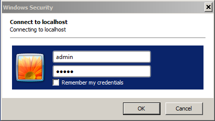

# WebDAV訪問{#webdav-access}

>[!CAUTION]
>
>AEM 6.4已結束延伸支援，本檔案不再更新。 如需詳細資訊，請參閱 [技術支援期](https://helpx.adobe.com//tw/support/programs/eol-matrix.html). 尋找支援的版本 [此處](https://experienceleague.adobe.com/docs/).

要通過WebDAV與KDE連接到AEM，請執行以下操作：

AEM提供WebDAV支援，讓您顯示及編輯存放庫內容。 通過WebDAV連接，您可以通過案頭直接訪問內容儲存庫。 通過WebDAV連接添加到儲存庫的文本和PDF檔案會自動建立全文索引，並可使用標準搜索介面和標準Java API進行搜索。

## 一般 {#general}

[每個作業系統的詳細說明](/help/sites-administering/webdav-access.md#connecting-via-webdav) 包含在本文檔中，但實際上是使用WebDAV協定連接到儲存庫，您將WebDAV客戶端指向以下位置：

```xml
http://localhost:4502
```


從作業系統層級連線時，此URL可讓WebDAV存取預設工作區( `crx.default`)。 雖然對使用者而言較簡單，但這並未賦予他們指定工作區名稱的額外彈性，您可使用其他功能來完成 [WebDAV URL](/help/sites-administering/webdav-access.md#webdav-urls).

AEM會依下列方式顯示存放庫內容：

* 類型的節點 `nt:folder` 會顯示為資料夾。 下方的節點 `nt:folder` 節點會顯示為資料夾內容。

* 類型的節點 `nt:file` 會顯示為檔案。 下方的節點 `nt:file` 節點不會顯示，但會形成檔案的內容。

使用WebDAV建立和編輯資料夾和檔案時，AEM會建立和編輯必要的 `nt:folder` 和 `nt:file` 節點。 如果您打算使用WebDAV來匯入和匯出內容，請嘗試使用 `nt:file` 和 `nt:folder` 節點類型。

>[!NOTE]
>
>在設定WebDAV之前，請檢查 [技術需求](/help/sites-deploying/technical-requirements.md#webdav-clients).

## WebDAV URL {#webdav-urls}

WebDAV伺服器的URL具有以下結構：

<table> 
 <colgroup>
  <col width="100" />
  <col width="100" />
  <col width="100" />
  <col width="100" />
  <col width="100" />
 </colgroup>
 <tbody>
  <tr>
   <td>
    <code>
     <strong>URL Component</strong>
    </code></td> 
   <td><code>https://&lt;host&gt;:&lt;port&gt;</code></td> 
   <td><code>/&lt;crx-webapp-path&gt;</code></td> 
   <td><code>/repository</code></td> 
   <td><code>/&lt;workspace&gt;</code></td> 
  </tr>
  <tr>
   <td>
    <code>
     <strong>Example</strong>
    </code></td> 
   <td><code>http://localhost:4502</code></td> 
   <td><code>/crx</code></td> 
   <td><code>/repository</code></td> 
   <td><code>/crx.default</code></td> 
  </tr>
  <tr>
   <td><strong>說明</strong></td> 
   <td>AEM運行的主機和埠</td> 
   <td>AEM存放庫網頁應用程式的路徑</td> 
   <td>WebDAV servlet映射到的路徑</td> 
   <td>工作區名稱</td> 
  </tr>
 </tbody>
</table>

通過更改路徑中的工作區元素，可以映射預設值以外的工作區( `crx.default`)。 例如，若要對應名為 `staging`，請使用下列URL:

```xml
http://localhost:4502/crx/repository/staging
```

## 通過WebDAV連接 {#connecting-via-webdav}

[如上所述](/help/sites-administering/webdav-access.md#general)，若要使用WebDAV協定連接到儲存庫，請將WebDAV客戶端指向您的儲存庫位置。 但是，根據您的作業系統，連接客戶端所涉及的步驟不同，可能需要配置作業系統。

提供了如何連接以下作業系統的說明：

* [Windows](/help/sites-administering/webdav-access.md#windows)
* [macOS](/help/sites-administering/webdav-access.md#macos)
* [Linux](/help/sites-administering/webdav-access.md#linux)

### Windows {#windows}

若要成功將Microsoft Windows 7（及更新版本）系統連接至未透過SSL保護的AEM執行個體，必須在Windows中明確啟用在不安全網路上建立基本驗證的選項。 這需要在WebClient的Windows註冊表中進行更改。

更新登錄表後，AEM執行個體即可對應為磁碟。

#### Windows 7及更高配置 {#windows-and-greater-configuration}

要更新註冊表以允許通過不安全的網路進行基本身份驗證，請執行以下操作：

1. 找到以下註冊表子項：

   ```xml
   HKEY_LOCAL_MACHINE\SYSTEM\CurrentControlSet\Services\WebClient\Parameters
   ```

1. 設定 `BasicAuthLevel` 註冊表項子項到 `2` 或更大。

   如果不存在，請新增子金鑰。

1. 必須重新啟動系統，註冊表更改才能生效。

請參閱 [Microsoft支援KB 841215](https://support.microsoft.com/default.aspx/kb/841215) 有關此註冊表更改的詳細資訊。

請參閱 [Microsoft支援KB 2445570](https://support.microsoft.com/kb/2445570) ，了解有關在Windows下提高WebDav客戶端的響應性的資訊。

>[!NOTE]
>
>Adobe建議您建立一個與儲存庫用戶具有相同憑據的Windows用戶，否則可能會遇到權限衝突。

#### Windows 8配置 {#windows-configuration}

對於Windows 8，您還需要更改註冊表項 [如Windows 7及更高版本所述](/help/sites-administering/webdav-access.md#windows-and-greater-configuration). 但是，您必須先啟用案頭體驗，才能查看登錄項。

若要啟用案頭體驗，請開啟 **伺服器管理員**，然後 **功能**，然後 **新增功能**，然後 **案頭體驗**.

重新啟動Windows 7及更高版本描述的註冊表項後，可用。 按照Windows 7及更高版本的說明修改它。

#### 在Windows中連接 {#connecting-in-windows}

要在Windows環境中通過WebDAV連接到AEM:

1. 開啟 **Windows資源管理器** 或 **檔案總管** 按一下 **電腦** 或 **這台電腦**.

   

1. 按一下 **映射網路驅動器** 啟動嚮導。
1. 輸入映射詳細資訊：

   * **驅動器**:選擇任何可用的信函
   * **資料夾**: `http://localhost:4502`
   * 檢查 **使用不同憑據連接**

   按一下「完成」

   

   >[!NOTE]
   >
   >如果AEM位於其他埠，請使用該埠號，而不是4502。 此外，如果您未在本機電腦上執行內容存放庫，請取代 `localhost` 或IP位址。

1. 輸入使用者名稱 `admin` 和密碼 `admin`. Adobe建議您使用預先設定的管理員帳戶進行測試。

   

1. 嚮導將關閉，並在Windows資源管理器或檔案資源管理器窗口中開啟新映射的驅動器。

   

Windows現在已經通過WebDAV將AEM映射為驅動器，您可以將其用作任何其他驅動器。

### macOS {#macos}

在macOS上透過WebDAV連線不需要設定步驟。 您只需連接到WebDAV伺服器。

1. 導覽至任何 **搜尋器** 按一下 **開始** 和 **連接到伺服器**&#x200B;或按下 **Command+k**.
1. 在 **連接到伺服器** 窗口，輸入AEM位置：

   * `http://localhost:4502`
   >[!NOTE]
   >
   >如果AEM位於其他埠，請使用該埠號，而不是4502。 此外，如果您未在本機電腦上執行內容存放庫，請取代 `localhost` 或IP位址。

1. 提示您進行身份驗證時，請輸入用戶名 `admin` 和密碼 `admin`. Adobe建議您使用預先設定的管理員帳戶進行測試。

macOS現在已透過WebDAV連線至AEM，而且您可以將其當成Mac上的任何其他資料夾使用。

### Linux {#linux}

在Linux上通過WebDAV進行連接不需要任何配置，但需要執行一些步驟來建立連接，這些步驟會根據您的案頭環境而有所不同。

#### 格諾梅 {#gnome}

要通過WebDAV與GNOME連接到AEM:

1. 在Nautilus（檔案資源管理器）中，選擇 **位置** 選取 **連接到伺服器**.
1. 在 **連接到伺服器** 窗口，在「服務類型」中選擇WebDAV(HTTP)。

1. 在 **伺服器**，輸入 `http://localhost:4502/crx/repository/crx.default`

   >[!NOTE]
   >
   >如果AEM位於其他埠，請使用該埠號，而不是4502。 此外，如果您未在本機電腦上執行內容存放庫，請取代 `localhost` 或IP位址。

1. 在 **資料夾**，輸入 `/dav`
1. 輸入使用者名稱 `admin`. Adobe建議您使用預先設定的管理員帳戶進行測試。
1. 將埠留空，然後為連接輸入任何名稱。
1. 按一下 **Connect**. AEM會提示您輸入密碼。
1. 輸入密碼 `admin` 按一下 **Connect**.

GNOME現在已將AEM裝入為卷，您可以像其他卷一樣使用它。

#### KDE {#kde}

1. 開啟「網路資料夾」嚮導。
1. 選擇 **WebFolder**(webdav)，然後按一下「下一步」。
1. 在 **名稱**，輸入連線名稱。
1. 在 **使用者**，輸入 `admin.` Adobe建議您使用預先設定的管理員帳戶。
1. 在 **伺服器**，輸入 `http://localhost:4502/crx/repository/crx.default`

   >[!NOTE]
   >
   >如果AEM位於其他埠，請使用該埠號，而不是4502。 此外，如果您未在本機電腦上執行內容存放庫，請取代 `localhost` 具有相應的伺服器名或IP地址

1. 在 **資料夾**，輸入 `dav`

1. 按一下 **保存並連接**.
1. 提示輸入密碼時，請輸入密碼 `admin` 按一下 **Connect**.

KDE現在已將AEM裝入為卷，您可以像使用任何其他卷一樣使用它。
