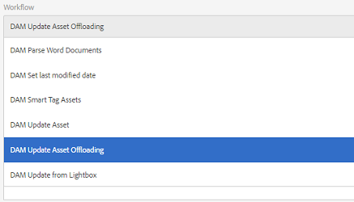

# 資產工作流卸載程式{#assets-workflow-offloader}

Assets工作流程卸載程式可讓您啟用Adobe Experience Manager(AEM)Assets的多個例項，以減少主要（領導）例項的處理負載。 處理負載分配在領導實例和您添加到的各種卸載程式（工作器）實例之間。 分配資產的處理負載可提高AEM Assets處理資產的效率和速度。 此外，它可協助分配專用資源以處理特定MIME類型的資產。 例如，您可以在拓撲中分配特定節點，以僅處理InDesign資產。

## 配置卸載器拓撲{#configure-offloader-topology}

使用Configuration Manager為領導實例添加URL，為領導實例上的連接請求添加卸載程式實例的主機名。

1. 點選/按一下AEM標誌，然後選擇&#x200B;**工具** > **操作** > **Web控制台**&#x200B;以開啟Configuration Manager。
1. 在Web控制台中，選擇&#x200B;**Sling** > **拓撲管理**。

   

1. 在「拓撲管理」頁面中，點選/按一下&#x200B;**Configure Discovery.Oak Service**&#x200B;連結。

   

1. 在「發現服務配置」頁的&#x200B;**拓撲連接器URL**&#x200B;欄位中，指定領導實例的連接器URL。

   

1. 在&#x200B;**拓撲連接器白名單**&#x200B;欄位中，指定允許與領導實例連接的卸載程式實例的IP地址或主機名。 點選/按一下&#x200B;**儲存**。

   

1. 要查看連接到領導實例的卸載程式實例，請轉至&#x200B;**工具** > **部署** > **拓撲**，然後點選/按一下群集視圖。

## 禁用卸載{#disable-offloading}

1. 點選/按一下AEM標誌，然後選擇&#x200B;**工具** > **部署** > **卸載**。 **卸載瀏覽器**&#x200B;頁面顯示主題以及可以使用主題的伺服器實例。

   

1. 在使用者互動以上傳或變更AEM資產的領導者例項上，停用&#x200B;*com/adobe/granite/workflow/offloading*&#x200B;主題。

   

## 在領導實例{#configure-workflow-launchers-on-the-leader-instance}上配置工作流啟動器

設定工作流程啟動器，以在領導執行個體上使用&#x200B;**DAM更新資產卸載**&#x200B;工作流程，而非&#x200B;**Dam更新資產**&#x200B;工作流程。

1. 點選/按一下AEM標誌，然後選擇「**工具** > **工作流** > **啟動器**」以開啟「**工作流啟動器**」控制台。

   

1. 找到事件類型分別為&#x200B;**已建立節點**&#x200B;和&#x200B;**已修改節點**&#x200B;的兩個啟動器配置，這兩個配置運行&#x200B;**DAM更新資產**&#x200B;工作流。
1. 對於每個配置，選中其前的複選框，然後點選/按一下工具欄中的&#x200B;**查看屬性**&#x200B;表徵圖以顯示&#x200B;**啟動器屬性**&#x200B;對話框。

   

1. 從&#x200B;**Workflow**&#x200B;清單中，選擇&#x200B;**DAM Update Asset Offloading**&#x200B;並點選/按一下&#x200B;**Save**。

   

1. 點選/按一下AEM標誌，然後選擇「**工具** > **工作流** > **模型**」以開啟「**工作流模型**」頁面。
1. 選取「**DAM更新資產卸載**」工作流程，然後從工具列點選/按一下「**編輯**」以顯示其詳細資訊。

   

1. 顯示&#x200B;**DAM工作流卸載**&#x200B;步驟的上下文菜單，然後選擇&#x200B;**編輯**。 驗證配置對話框的&#x200B;**Generic Arguments**&#x200B;頁簽的&#x200B;**Job Topic**&#x200B;欄位中的條目。

   

## 在卸載程式實例{#disable-the-workflow-launchers-on-the-offloader-instances}上禁用工作流啟動器

停用在領導執行個體上執行&#x200B;**DAM更新資產**&#x200B;工作流程的工作流程啟動器。

1. 點選/按一下AEM標誌，然後選擇「**工具** > **工作流** > **啟動器**」以開啟「**工作流啟動器**」控制台。

   

1. 找到事件類型分別為&#x200B;**已建立節點**&#x200B;和&#x200B;**已修改節點**&#x200B;的兩個啟動器配置，這兩個配置運行&#x200B;**DAM更新資產**&#x200B;工作流。
1. 對於每個配置，選中其前的複選框，然後點選/按一下工具欄中的&#x200B;**查看屬性**&#x200B;表徵圖以顯示&#x200B;**啟動器屬性**&#x200B;對話框。

   

1. 在**啟動**區段中，拖曳滑桿以停用工作流程啟動器，並點選/按一下&#x200B;**儲存**&#x200B;以停用它。

   

1. 在領導者例項上傳任何類型的影像資產。 驗證縮圖是否產生，並由已卸載執行個體移回資產。
