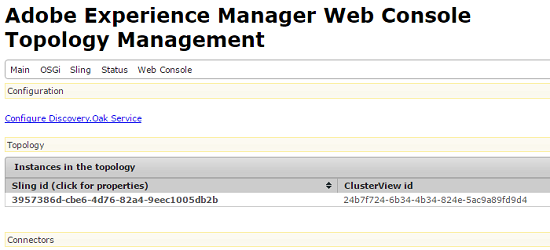
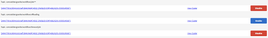

# Assets Workflow Offloader{#assets-workflow-offloader}

資產工作流程分離程式可讓您啟用多個Adobe Experience Manager(AEM)Assets例項，以降低主要（領導者）例項的處理負載。 處理負載分佈在領導實例和您添加到它的各種卸載程式（工作程式）實例之間。 分配資產的處理負載可提高AEM Assets處理資產的效率和速度。 此外，它還可協助分配專用資源，以處理特定MIME類型的資產。 例如，您可以在拓撲中分配特定節點，以僅處理InDesign資產。

## 配置卸載器拓撲{#configure-offloader-topology}

使用「配置管理器」(Configuration Manager)為引線實例添加URL，並為引線實例上的連接請求添加卸載程式實例的主機名。

1. 點選／按一下AEM標誌，然後選擇「工具」**>>「操作」**>>「Web控制台」**以開啟「設定管理員」。******
1. 在Web控制台中，選擇&#x200B;**Sling** > **拓撲管理**。

   

1. 在「拓撲管理」頁中，點選／按一下&#x200B;**Configure Discovery.Oak Service**&#x200B;連結。

   

1. 在「發現服務配置」頁中，在&#x200B;**拓撲連接器URL**&#x200B;欄位中指定引導實例的連接器URL。

   

1. 在&#x200B;**拓撲連接器白名單**&#x200B;欄位中，指定允許與引線實例連接的卸載程式實例的IP地址或主機名。 點選／按一下&#x200B;**儲存**。

   

1. 要查看連接到引線實例的卸載程式實例，請轉至&#x200B;**工具** > **部署** > **拓撲**&#x200B;並點選／按一下群集視圖。

## 禁用卸載{#disable-offloading}

1. 點選／按一下AEM標誌，然後選擇「工具&#x200B;**** > **部署** > **卸載**」。 **卸載瀏覽器**&#x200B;頁顯示主題和可使用主題的伺服器實例。

   

1. 在使用者互動以上傳或變更AEM資產的領導者例項上，停用&#x200B;*com/adobe/granite/workflow/offloading*&#x200B;主題。

   

## 在引線實例{#configure-workflow-launchers-on-the-leader-instance}上配置工作流啟動程式

設定工作流程啟動程式，以便在領導者例項上使用&#x200B;**DAM更新資產卸載**&#x200B;工作流程，而非&#x200B;**Dam更新資產**&#x200B;工作流程。

1. 點選／按一下AEM標誌，然後選擇&#x200B;**工具** > **Workflow** > **啟動器**&#x200B;以開啟&#x200B;**Workflow Hartizers**&#x200B;主控台。

   

1. 找出事件類型分別為&#x200B;**Node Created**&#x200B;和&#x200B;**Node Modified**&#x200B;的兩個啟動器配置，它們運行&#x200B;**DAM Update Asset**&#x200B;工作流。
1. 對於每個配置，選擇前面的複選框，然後從工具欄中點選／按一下「查看屬性」表徵圖以顯示「**啟動器屬性」對話框。******

   

1. 從&#x200B;**Workflow**&#x200B;清單中，選擇&#x200B;**DAM Update Asset Offloading**&#x200B;並點選／按一下&#x200B;**Save**。

   

1. 點選／按一下AEM標誌，然後選擇「工具&#x200B;**** > **工作流程** > **模型**」以開啟「工作流程模型&#x200B;****」頁面。
1. 選擇&#x200B;**DAM更新資產卸載**&#x200B;工作流程，並從工具列點選／按一下&#x200B;**編輯**&#x200B;以顯示其詳細資訊。

   

1. 顯示&#x200B;**DAM工作流卸載**&#x200B;步驟的上下文菜單，然後選擇&#x200B;**編輯**。 驗證配置對話框&#x200B;**通用參數**&#x200B;頁籤的&#x200B;**作業主題**&#x200B;欄位中的條目。

   

## 在卸載器實例{#disable-the-workflow-launchers-on-the-offloader-instances}上禁用工作流啟動器

禁用在引線實例上運行&#x200B;**DAM Update Asset**&#x200B;工作流的工作流啟動程式。

1. 點選／按一下AEM標誌，然後選擇&#x200B;**工具** > **Workflow** > **啟動器**&#x200B;以開啟&#x200B;**Workflow Hartizers**&#x200B;主控台。

   

1. 找出事件類型分別為&#x200B;**Node Created**&#x200B;和&#x200B;**Node Modified**&#x200B;的兩個啟動器配置，它們運行&#x200B;**DAM Update Asset**&#x200B;工作流。
1. 對於每個配置，選擇前面的複選框，然後從工具欄中點選／按一下「查看屬性」表徵圖以顯示「**啟動器屬性」對話框。******

   

1. 在**Activate **節中，拖動滑塊以禁用工作流啟動程式，並點選／按一下「保存」以禁用它。****

   

1. 在引線實例上傳任何類型的影像資產。 驗證已卸載實例為資產生成並移植回的縮略圖。

