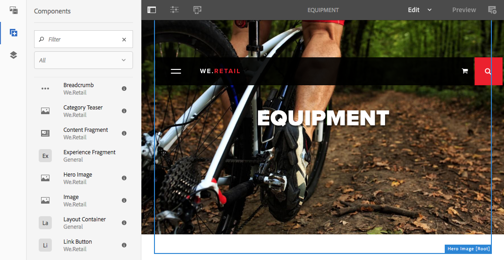
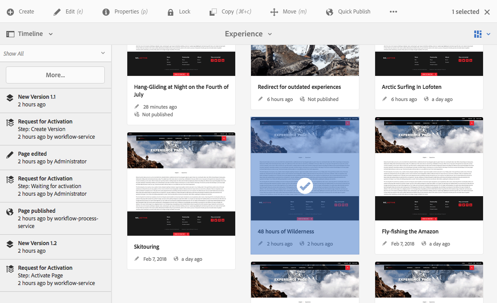
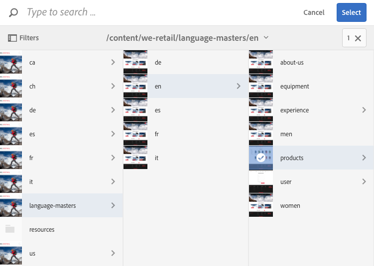
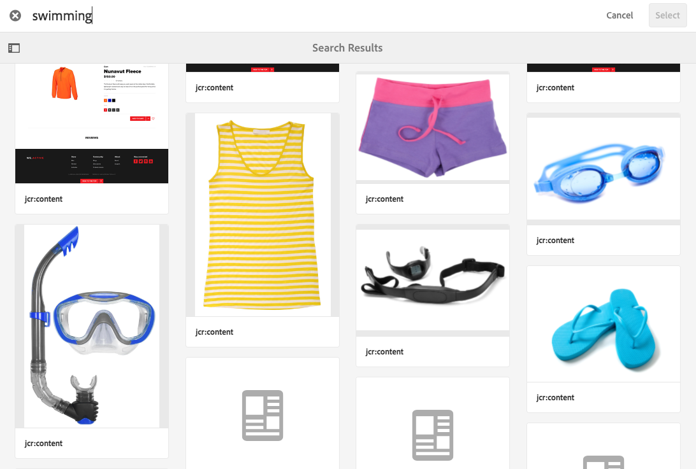

# 製作環境與工具{#authoring-the-environment-and-tools}

AEM的製作環境提供多種機制來組織和編輯您的內容。 提供的工具可從各種控制台和頁面編輯器中存取。

## 管理您的網站 {#managing-your-site}

The **Sites** console allows you to navigate and manage your website, using the header bar, toolbar, action icons (applicable for the selected resource), breadcrumbs and when selected, secondary rails (for example, timeline and references).

例如，卡片檢視：

## 編輯頁面內容 {#editing-page-content}

您可以使用頁面編輯器編輯頁面。 例如：

`http://localhost:4502/editor.html/content/we-retail/us/en/equipment.html`

>[!NOTE]
>
>當您第一次開啟頁面進行編輯時，一連串的投影片會提供您功能指南。
>
>您可以視需要略過導覽，並隨時從「頁面資訊」選單中選 **取** 。

## 存取說明 {#accessing-help}

編輯頁面時，可 **從** :

* 頁面 [**資訊選擇&#x200B;**](/help/sites-authoring/editing-page-properties.md#page-properties)器； 這將顯示介紹性投影片（如您第一次存取編輯器時所顯示）。
* 特定 [元件的](/help/sites-authoring/editing-content.md#edit-configure-copy-cut-delete-paste) 「設定」對話方塊(使用 表徵圖); 這會顯示內容相關的說明。

控制台 [提供更多與幫助相關的資源](/help/sites-authoring/basic-handling.md#accessing-help)。

## 元件瀏覽器 {#components-browser}

元件瀏覽器會顯示目前頁面上可用的所有元件。 這些內容可拖曳至適當位置，然後進行編輯以新增內容。

元件瀏覽器是側面板中的標籤(連同資產 [瀏覽器](/help/sites-authoring/author-environment-tools.md#assets-browser)[和內容樹](/help/sites-authoring/author-environment-tools.md#content-tree))。要開啟 (或關閉) 側面板，請使用工具欄左上角的表徵圖：

當開啟側面板時，該面板將從左側滑動開啟(如果需要，請選 **擇「元件** 」(Components)頁籤)。 開啟時，您可以瀏覽頁面的所有可用元件。

實際外觀和處理方式取決於您使用的設備類型：

>[!NOTE]
>
>當寬度小於1024px時檢測到移動設備。 此外，小型案頭視窗也可能適用。

* **行動裝置（例如iPad）**

   元件瀏覽器完全涵蓋正在編輯的頁面。

   若要將元件新增至頁面，並按住所需的元件並向右移動——元件瀏覽器會關閉，再次顯示頁面——您可在此處放置元件。

   

* **案頭裝置**

   元件瀏覽器在窗口的左側開啟。

   若要將元件新增至您的頁面，請按一下所需元件，並將其拖曳至所需位置。

   

   元件由

   * 元件名稱
   * 元件群組（以灰色顯示）
   * 圖示或縮寫

      * 標準元件的圖示為單色。
      * 縮寫始終是元件名稱的前兩個字元。

   在「元件」瀏覽器的頂端工具列中，您可以：

   * 依名稱篩選元件。
   * 使用下拉式選取範圍，將顯示限制在特定群組。

   如需元件的詳細說明，您可以在「元件」瀏覽器中按一下或點選元件旁的資訊圖示(如果 有 )。

   

   如需更多有關可用元件的資訊，請參閱元 [件主控台](/help/sites-authoring/default-components-console.md)。

## 資產瀏覽器 {#assets-browser}

資產瀏覽器會顯示目前頁面上可直接使用的所有資產。

The assets browser is a tab within the side panel along with the [components browse](/help/sites-authoring/author-environment-tools.md#components-browser)r and [content tree](/help/sites-authoring/author-environment-tools.md#content-tree). 要開啟或關閉側面板，請使用工具欄左上角的表徵圖：

當您開啟側面板時，它會從左側滑動開啟。 視需要選 **取「資** 產」標籤。

當資產瀏覽器開啟時，您可以瀏覽頁面的所有可用資產。 視需要使用無限捲動來展開清單。

若要將資產新增至頁面，請選取並拖曳至所需位置。 這可以是：

* 適當類型的現有元件。

   * 例如，您可以將文字影像的資產拖曳至影像元件上。

* 段 [落系統中](/help/sites-authoring/editing-content.md#component-placeholder) 的佔位符，用於建立適當類型的新元件。

   * 例如，您可以將類型影像的資產拖曳至圖形系統，以建立影像元件。

>[!NOTE]
>
>這適用於特定資產和元件類型。 如需詳 [細資訊，請參閱使用資產瀏覽器插入元件](/help/sites-authoring/editing-content.md#inserting-a-component-using-the-assets-browser) 。

從資產瀏覽器的頂端工具列，您可以依下列方式篩選資產：

* 名稱
* 路徑
* 資產類型，例如影像、手稿、檔案、影片、頁面、段落和產品
* 資產特性，例如方向（縱向、橫向、正方形）和樣式（彩色、單色、灰階）

   * 僅適用於特定資產類型

實際外觀和處理方式取決於您使用的設備類型：

>[!NOTE]
>
>當移動設備寬度小於1024px時，檢測到移動設備； 例如，也可在小型案頭視窗上。

* **行動裝置，例如iPad**

   資產瀏覽器會完全涵蓋正在編輯的頁面。

   若要將資產新增至頁面並按住必要的資產，然後將其向右移動——資產瀏覽器會關閉以再次顯示頁面，您可在其中將資產新增至所需元件。

   

* **案頭裝置**

   資產瀏覽器會在視窗左側開啟。

   若要將資產新增至頁面，請按一下所需資產，然後拖曳至所需元件或位置。

   

如果您需要快速變更資產，可以按一下資產名稱旁的編輯圖示，直接從資 [產瀏覽器啟動資產編輯器](/help/assets/managing-assets-touch-ui.md) 。

## 內容樹 {#content-tree}

「內 **容樹」** (Content Tree)概述了階層中頁面上的所有元件，讓您一目瞭然地瞭解頁面的構成方式。

「內容樹」是側面板中的標籤（連同元件和資產瀏覽器）。 要開啟 (或關閉) 側面板，請使用工具欄左上角的表徵圖：

當您開啟側面板時，它會滑開（從左側）。 如有必要， **請選取「內容樹** 」索引標籤。 當開啟時，您可以看到頁面或範本的樹狀檢視表示，以便更輕鬆地瞭解其內容的階層式結構。 此外，在複雜的頁面上，可更輕鬆地在頁面的元件之間跳轉。

頁面可輕鬆由許多相同類型的元件組成，因此元件樹會在元件類型名稱（黑色）後顯示描述性文字（灰色）。 描述性文字來自元件的常用屬性，例如標題或文字。

元件類型將以用戶語言顯示，而元件說明文本則來自頁面語言。

按一下元件旁邊的雪佛龍將折疊或展開該級別。

按一下元件會在頁面編輯器中反白顯示元件。

如果您在樹狀結構中按一下的元件是可編輯的，則名稱右側會出現扳手圖示。 按一下此表徵圖將直接啟動元件的編輯對話框。

>[!NOTE]
>
>如果您在行動裝置上編輯頁面（如果瀏覽器寬度小於1024像素），則無法使用「內容樹」。

## 片段——關聯的內容瀏覽器 {#fragments-associated-content-browser}

如果您的頁面包含內容片段，您也可以存取關聯 [內容的瀏覽器](/help/sites-authoring/content-fragments.md#using-associated-content)。

## 引用 {#references}

**參考** ：顯示與選定頁面的連接：

* BluePrint
* 啟動
* 即時副本
* 語言副本
* 使用參照元件
* 產品頁面的參考（來自「商務——產品」主控台）

開啟必要的主控台，然後導覽至所需資源，並使用下列方式開 **啟「參考** 」:

[選擇所需資源](/help/sites-authoring/basic-handling.md#viewing-and-selecting-resources) ，以顯示與該資源相關的參考類型清單：

選擇適當的參考類型以瞭解詳細資訊。 在某些情況下，當您選擇特定參照時，可以執行其他操作，包括：

* Reference元件的例項（例如，導覽至referencing/referenced頁面）
* [產品頁面的參考](/help/sites-administering/generic.md#showing-product-references) （可從Commerce-Products主控台取得）
* [啟動](/help/sites-authoring/launches.md)
* [「即時副本](/help/sites-administering/msm.md) 」會顯示所有基於所選資源的即時副本的路徑。
* [Blueprint](/help/sites-administering/msm-best-practices.md)
* [語言版本](/help/sites-administering/tc-manage.md#creating-translation-projects-using-the-references-panel)

例如，可以在「參照」(Reference)元件中修正損壞的參照：

## 事件——時間軸 {#events-timeline}

對於適當的資源(例如，來自 **Sites** console的頁面，或來自 **Assets** [console的資產)，時間軸可用來顯示任何選取項目上的最近活動](/help/sites-authoring/basic-handling.md#timeline)。

開啟必要的主控台，然後導覽至所需資源並開啟時 **間軸**，使用：

[選擇所需資源](/help/sites-authoring/basic-handling.md#viewing-and-selecting-resources)，然後選擇「 **Show All** or **Activitys** 」（顯示全部或活動），以列出選定資源上的任何最近操作：

## 頁面資訊 {#page-information}

「頁面資訊 (均衡器圖示) 」會開啟一個功能表，其中也提供上次編輯和上次發佈的詳細資訊。根據頁面（及其網站）的特性，可能有更多或更少的選項可用：

* [開啟屬性](/help/sites-authoring/editing-page-properties.md)
* [轉出頁面](/help/sites-administering/msm.md#msm-from-the-ui)
* [啟動工作流程](/help/sites-authoring/workflows-applying.md#starting-a-workflow-from-the-page-editor)
* [鎖定頁面](/help/sites-authoring/editing-content.md#locking-a-page)
* [發佈頁面](/help/sites-authoring/publishing-pages.md#publishing-pages)
* [取消發佈頁面](/help/sites-authoring/publishing-pages.md#unpublishing-pages)
* [以已發佈狀態檢視](/help/sites-authoring/editing-content.md#view-as-published)
* [在 Admin 中檢視](/help/sites-authoring/basic-handling.md#viewing-and-selecting-resources)
* [說明](/help/sites-authoring/basic-handling.md#accessing-help)

例如，在適當時，「頁 **面資訊** 」也有下列選項：

* [促銷啟動](/help/sites-authoring/launches-promoting.md) （如果頁面是啟動）。
* [編輯範本](/help/sites-authoring/templates.md) (如果頁面是以可編輯的範本 [為基礎)](/help/sites-authoring/templates.md#editable-and-static-templates)

* [如果管理員已啟用](/help/sites-authoring/select-ui.md#switching-to-classic-ui-when-editing-a-page) 此選項，請在Classic UI [中開啟](/help/sites-administering/enable-classic-ui-editor.md)

此外，頁面 **資訊** (Page Information)可在適當時提供分析和建議的存取權。

## 頁面模式 {#page-modes}

編輯頁面時有多種模式，允許執行不同的動作：

* [編輯](/help/sites-authoring/editing-content.md) -編輯頁面內容時使用的模式。
* [版面](/help/sites-authoring/responsive-layout.md) -可讓您根據裝置建立和編輯互動式版面（如果頁面是以版面容器為基礎）

* [支架](/help/sites-authoring/scaffolding.md) -協助您建立大量共用相同結構但內容不同的頁面。
* [開發人員](/help/sites-developing/developer-mode.md) -可讓您執行各種動作（需要權限）。 這些檢查包括檢查頁面及其元件的技術詳細資訊。

* [Design](/help/sites-authoring/default-components-designmode.md) —— 允許您啟用／停用要用於頁面的元件，以及設定元件的設計(如果頁面是以靜態範本 [為基礎](/help/sites-authoring/templates.md#editable-and-static-templates))。

* [定位](/help/sites-authoring/content-targeting-touch.md) -透過跨所有通道的定位和測量，提高內容相關性。
* [Activity Map](/help/sites-authoring/pa-using.md) —— 顯示頁面的Analytics資料。

* [時間彎曲](/help/sites-authoring/working-with-page-versions.md#timewarp) -可讓您在特定時間點檢視頁面狀態。
* [即時副本狀態](/help/sites-authoring/editing-content.md#live-copy-status) -允許快速概述即時副本狀態以及哪些元件是／未繼承的。
* [預覽](/help/sites-authoring/editing-content.md#previewing-pages) -用於檢視頁面在發佈環境中的顯示效果； 或在內容中使用連結進行導覽。

* [Annotate](/help/sites-authoring/annotations.md) —— 用於在頁面上添加或查看批注。

您可以使用右上角的圖示來存取這些圖示。 實際圖示會變更，以反映您目前使用的模式：

>[!NOTE]
>
>* 根據頁面的特性，某些模式可能無法使用。
>* 存取某些模式需要適當的權限／權限。
>* 由於空間限制，行動裝置無法使用開發人員模式。
>* 有一個鍵 [盤](/help/sites-authoring/page-authoring-keyboard-shortcuts.md) ( `Ctrl-Shift-M`可切換 **)，在「預覽」和目前選取的模式之間切換(例如，「編輯」、「排版**********」等)。

>

## 路徑選擇 {#path-selection}

通常在編寫時，需要選擇其他資源，例如定義到其他頁面或資源的連結或選擇映像。 若要輕鬆選取路徑，路 [徑欄位提供](/help/sites-authoring/author-environment-tools.md#path-fields) 「自動完成」，而路徑 [瀏覽器則提供更強穩的選](/help/sites-authoring/author-environment-tools.md#path-browser) 擇功能。

### 路徑欄位 {#path-fields}

這裡用來說明的範例是影像元件。 如需使用和編輯元件的詳細資訊，請參閱「 [頁面編寫元件」](/help/sites-authoring/default-components.md)。

路徑欄位現在具有自動完成和前瞻功能，讓尋找資源變得更輕鬆。 只要開始在路徑欄位中輸入，AEM就會在您輸入時提供相符的路徑。

按一下路徑 **欄位中的「開啟選擇對話框** 」按鈕可開啟路 [徑瀏覽器](/help/sites-authoring/author-environment-tools.md#path-browser) ，以允許更詳細的選擇選項。

### 路徑瀏覽器 {#path-browser}

路徑瀏覽器的組織方式與網 [站主控台的欄檢視](/help/sites-authoring/basic-handling.md#column-view) ，可讓您更詳細地選擇資源。

在選取資源後，對話 **框右上方** 的「選擇」按鈕就會變為活動狀態。 按一下或點選以確認選取範圍，或 **取消** 以中止。

如果上下文允許選擇多個資源，則選擇資源也會激活「選擇  」按鈕，但也會向窗口的右上角添加選定資源的計數。按一下 數字旁 的X，取消選取全部。

網路導覽路徑可用來快速跳至資源階層。

您隨時都可以使用對話方塊頂端的搜尋欄位。

按一下搜尋欄位中的X，以清除搜尋。

若要縮小搜尋範圍，您可以顯示篩選選項並根據特定路徑篩選結果。

## 鍵盤快速鍵 {#keyboard-shortcuts}

您可 [使用各種鍵盤](/help/sites-authoring/page-authoring-keyboard-shortcuts.md) 快速鍵。
