# 基本處理 {#basic-handling}

>[!CAUTION]
>
>AEM 6.4已結束延伸支援，本檔案不再更新。 如需詳細資訊，請參閱 [技術支援期](https://helpx.adobe.com//tw/support/programs/eol-matrix.html). 尋找支援的版本 [此處](https://experienceleague.adobe.com/docs/).

>[!NOTE]
>
>* 本頁旨在概述使用AEM製作環境時的基本處理方式。 它會使用 **網站** 控制台作為基礎。
>
>* 並非所有主控台都提供某些功能，某些主控台可能提供其他功能。 有關個別主控台及其相關功能的特定資訊，將在其他頁面上詳細說明。
>* AEM提供鍵盤快速鍵。 尤其是 [使用主控台](/help/sites-authoring/keyboard-shortcuts.md) 和 [編輯頁面](/help/sites-authoring/page-authoring-keyboard-shortcuts.md).
>

## 快速入門 {#getting-started}

### 觸控式UI {#a-touch-enabled-ui}

AEM使用者介面已啟用觸控功能。 觸控式介面可讓您使用觸控功能，透過點選、觸控並按住和滑動等手勢與軟體互動。 這與傳統的案頭介面操作滑鼠操作（如按一下、按兩下、按一下右鍵和滑鼠）的方式不同。 由於只需要手勢，觸控式UI在行動平板電腦裝置上可完全運作，且桌上型電腦仍具備完整功能。

### 第一步 {#first-steps}

登入後，立即到達 [導覽面板](/help/sites-authoring/basic-handling.md#global-navigation). 以下章節將更詳細地討論此問題。

按一下其中一個選項會開啟個別主控台。 為了充分了解AEM的基本使用，本檔案以 **網站** 控制台。

按一下或點選 **網站** 開始使用。

### 產品導覽 {#product-navigation}

每當使用者首次存取主控台時，就會啟動產品導覽教學課程。 點選或點進需要一分鐘的時間，即可取得AEM基本處理方式的完整概觀。

按一下或點選 **明白！** 前往概觀的下一頁。 按一下或點選 **關閉** 或按一下或點選「概觀」對話方塊外部以關閉。

除非您勾選選項，否則下次存取主控台時，概觀會重新啟動 **不再顯示此內容**.

## 全域導覽 {#global-navigation}

您可以使用全域導覽面板，在主控台之間導覽。 當您按一下或點選畫面左上角的Adobe Experience Manager連結，就會以全螢幕下拉式清單觸發。

您可以按一下或點選以關閉全域導覽面板 **關閉** 返回您之前的位置。

>[!NOTE]
>
>首次登入時，畫面會顯示 **導覽** 中。

全域導覽有兩個面板，由螢幕左邊界的圖示表示：

* **導覽**  — 用羅盤表示
* **工具**  — 用錘子表示

以下說明這些面板上可用的選項。

1. 導覽面板：

   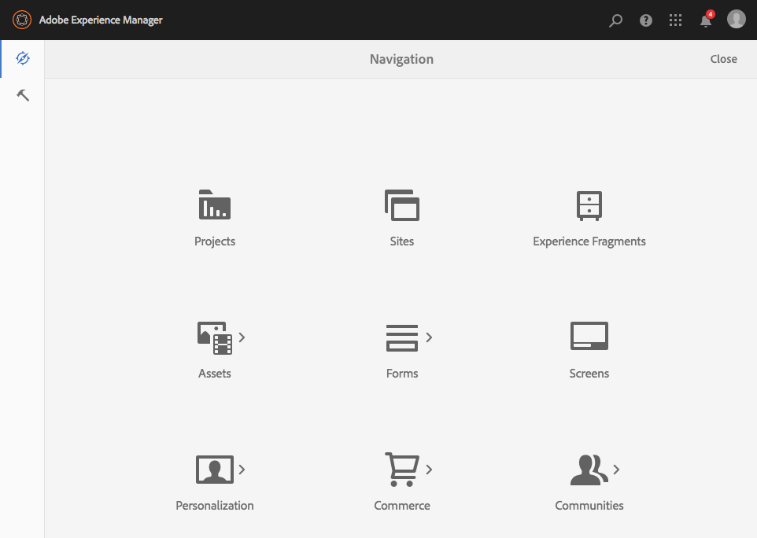

   在導覽中，可用的主控台包括：

<table> 
 <tbody>
  <tr>
   <td><strong>主控台</strong></td> 
   <td><strong>用途</strong></td> 
  </tr>
  <tr>
   <td>資產  </td> 
   <td>這些主控台可讓您匯入 <a href="/help/assets/assets.md">管理數位資產</a> 例如影像、視頻、文檔和音頻檔案。 然後，在相同AEM例項上執行的任何網站都可以使用這些資產。 </td> 
  </tr>
  <tr>
   <td>社群</td> 
   <td>此主控台可讓您建立和管理 <a href="/help/communities/sites-console.md">社群網站</a> for <a href="/help/communities/overview.md#engagement-community">參與</a> 和 <a href="/help/communities/overview.md#enablement-community">啟用</a>.</td> 
  </tr>
  <tr>
   <td>商務</td> 
   <td>這可讓您管理與您的 <a href="/help/sites-administering/ecommerce.md">商務</a> 網站。</td> 
  </tr>
  <tr>
   <td>體驗片段</td> 
   <td>安 <a href="/help/sites-authoring/experience-fragments.md">體驗片段</a> 是獨立體驗，可跨管道重複使用，且有變數，可避免重複複製和貼上體驗或體驗的部分所帶來的麻煩。</td> 
  </tr>
  <tr>
   <td>Forms</td> 
   <td>此主控台可讓您建立、管理和處理 <a href="/help/forms/using/introduction-aem-forms.md">表單與檔案</a>&gt;。</td> 
  </tr>
  <tr>
   <td>個人化</td> 
   <td>此主控台提供 <a href="/help/sites-authoring/personalization.md">製作目標內容及呈現個人化體驗的工具架構</a>.</td> 
  </tr>
  <tr>
   <td>專案</td> 
   <td>此 <a href="/help/sites-authoring/touch-ui-managing-projects.md">專案主控台可讓您直接存取您的專案</a>. 專案是虛擬控制面板。 它們可用來建立團隊，然後讓該團隊存取資源、工作流程和任務，讓人們能夠按照共同的目標工作。   </td> 
  </tr>
  <tr>
   <td>Sites</td> 
   <td>網站主控台可讓您 <a href="/help/sites-authoring/author-environment-tools.md">建立、檢視和管理網站</a> 在AEM執行個體上執行。 您可以透過這些主控台建立、編輯、複製、移動和刪除網站頁面、啟動工作流程及發佈頁面。  </td> 
  </tr>
 </tbody>
</table>

1. 在「工具」面板中，側面板中的每個選項都包含一系列子菜單。 此 [工具主控台](/help/sites-administering/tools-consoles.md) 此處提供存取多種專用工具和主控台的功能，可協助您管理網站、數位資產和內容存放庫的其他方面。

   

## 標頭 {#the-header}

 標頭會始終顯示在畫面頂端。雖然無論您位於系統中的哪個位置，標題中的大多數選項都保持不變，但有些選項是內容專屬的。

* [全域導覽](#global-navigation)

   選取 **Adobe Experience Manager** 在主控台之間導覽的連結。

   

* [搜尋](/help/sites-authoring/search.md)

   

   您也可以使用 [快捷鍵](/help/sites-authoring/keyboard-shortcuts.md) `/` （正斜線），從任何主控台叫用搜尋。

* [說明](#accessing-help)

   

* [Marketing Cloud解決方案](https://www.adobe.com/marketing-cloud.html)

   

* [通知](/help/sites-authoring/inbox.md)

   

   此圖示將標有目前已分配的未完成通知數目。

   >[!NOTE]
   >
   >現成可用的AEM會預先載入指派給管理員使用者群組的管理工作。 請參閱 [收件匣 — 現成可用的管理工作](/help/sites-authoring/inbox.md#out-of-the-box-administrative-tasks) 以取得詳細資訊。

* [使用者屬性](/help/sites-authoring/user-properties.md)

   

* [邊欄選取器](/help/sites-authoring/basic-handling.md#rail-selector)

   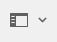

   顯示的選項取決於您目前的主控台。 例如，在 **網站** 您只能選取內容（預設）、時間軸、參照或篩選端面板。

   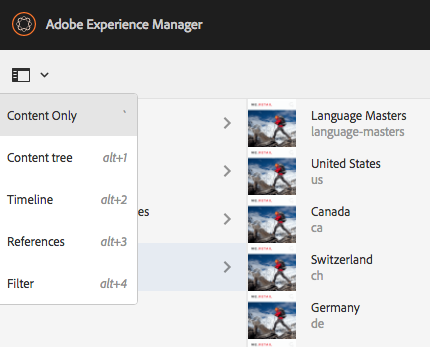

* 階層連結

   

   瀏覽路徑標示位於邊欄的中間，一律會顯示目前所選項目的說明，可讓您在特定主控台中導覽。 在Sites Console中，您可以瀏覽網站的各個層級。

   只需按一下階層連結文字，即可顯示下拉式清單，列出目前所選項目的階層等級。 按一下某個條目以跳轉到該位置。

   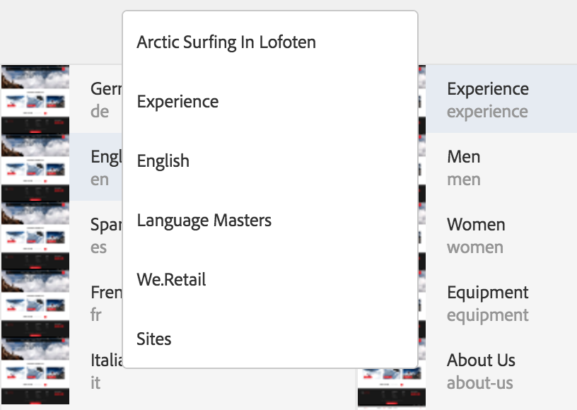

* 選擇Analytics時段

   

   這僅適用於清單檢視。 請參閱 [清單檢視](#list-view) 以取得更多資訊。

* **建立** 按鈕

   

   按一下後，所顯示的選項就適合主控台/內容。

* [檢視](/help/sites-authoring/basic-handling.md#viewing-and-selecting-resources)

   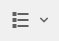

   您可以在欄檢視、卡片檢視、清單檢視和檢視設定之間切換。

   

## 存取說明 {#accessing-help}

提供多種說明資源：

* **控制台工具欄**

   視您的位置而定， **說明** 圖示會開啟適當的資源：

   

* **導覽**

   第一次瀏覽系統時， [一系列幻燈片介紹AEM導航](/help/sites-authoring/basic-handling.md#product-navigation).

* **頁面編輯器**

   第一次編輯頁面時，會有一系列投影片導入頁面編輯器。

   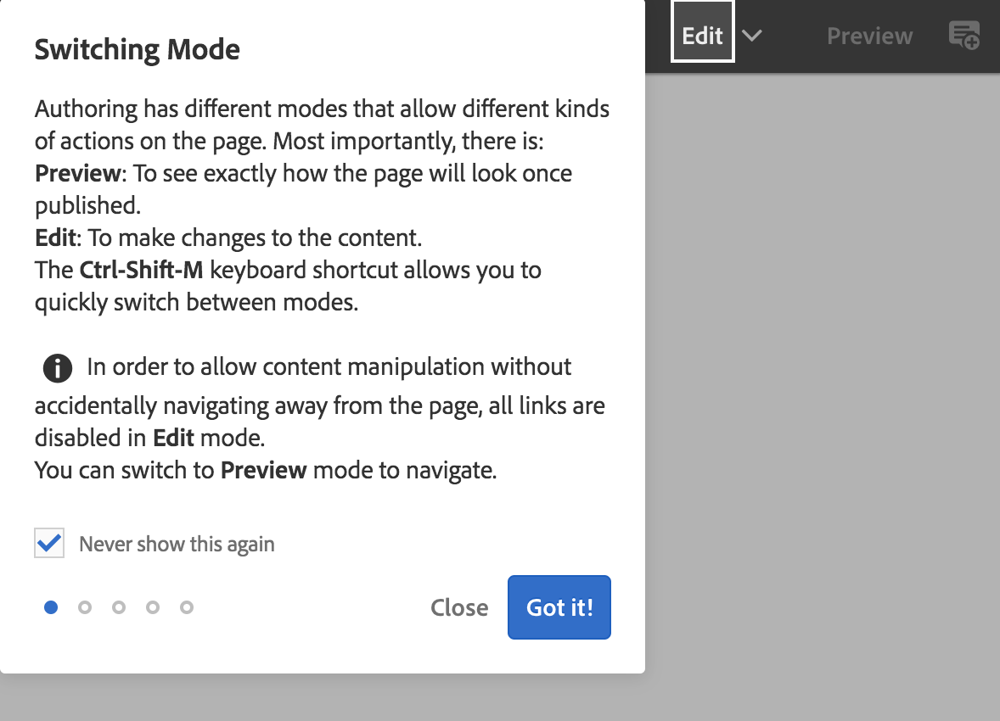

   如您所需導覽此概觀 [產品導覽概觀](/help/sites-authoring/basic-handling.md#product-navigation) 首次存取任何主控台時。

   從 [**頁面資訊** 您可以選擇的功能表 **說明**](/help/sites-authoring/author-environment-tools.md#accessing-help) 以隨時再次顯示。

* **工具主控台**

   從 **工具** 您也可以存取外部主控台 **資源**:

   * **檔案**
檢視Web體驗管理檔案

   * **開發人員資源**
開發人員資源和下載
   >[!NOTE]
   >
   >您可以隨時使用快捷鍵來存取可用快捷鍵的概觀 `?` （問號）。
   >
   >如需所有鍵盤快速鍵的概觀，請參閱下列檔案：
   >
   >* [編輯頁面的鍵盤快速鍵](/help/sites-authoring/page-authoring-keyboard-shortcuts.md)
   >* [控制台的鍵盤快速鍵](/help/sites-authoring/keyboard-shortcuts.md)

## 動作工具列 {#actions-toolbar}

每當選取資源（例如頁面或資產）時，工具列中就會有說明文字的圖示來指出各種動作。 這些動作取決於：

* 當前控制台。
* 目前的內容。
* 無論您是否在 [選擇模式](#viewing-and-selecting-resources).

工具列中可用的動作會變更，以反映您可以對選取的特定項目採取的動作。

您 [選擇資源](/help/sites-authoring/basic-handling.md#viewing-and-selecting-resources) 取決於視圖。

由於某些視窗的空間限制，工具列可能會很快變得比可用的空間長。發生此情況時，會出現其他選項。按一下或點選省略號(三個點或…… ****)會開啟一個下拉式選取器，其中包含所有剩餘的動作。例如，在Sites主控台中選取頁面 **後** :

>[!NOTE]
>
>可用的個別圖示會記錄在適當的主控台/功能/情境中。

## 快速動作 {#quick-actions}

在 [卡片檢視](#quick-actions) 某些動作可作為快速動作圖示，也可在工具列上使用。 一次只有一個項目可使用快速操作表徵圖，無需預選。

當您移動資源卡（案頭設備）時，將顯示快速操作。 可用的快速動作取決於主控台和內容。 例如，以下是 **網站** 主控台：

## 檢視和選擇資源 {#viewing-and-selecting-resources}

檢視、導覽和選取在所有檢視中的概念上都相同，但處理方式的變異很小，取決於您使用的檢視。

您可以使用任何可用檢視來檢視、導覽及選取（以利進一步動作）您的資源，每個檢視都可由右上角的圖示選取：

* [欄檢視](#column-view)
* [卡片檢視](#card-view)

* [清單檢視](#list-view)

>[!NOTE]
>
>依預設，AEM Assets不會在UI中以縮圖的形式顯示資產的原始轉譯。 如果您是管理員，可以使用覆蓋來設定AEM Assets，將原始轉譯顯示為縮圖。

### 選擇資源 {#selecting-resources}

選取特定資源取決於檢視與裝置的組合：

<table> 
 <tbody>
  <tr>
   <td> </td> 
   <td>選擇</td> 
   <td>取消選取</td> 
  </tr>
  <tr>
   <td>欄檢視  </td> 
   <td>
    <ul> 
     <li>案頭：  按一下縮圖</li> 
     <li>行動裝置：  點選縮圖</li> 
    </ul> </td> 
   <td>
    <ul> 
     <li>案頭：  按一下縮圖</li> 
     <li>行動裝置：  點選縮圖</li> 
    </ul> </td> 
  </tr>
  <tr>
   <td>卡片檢視  </td> 
   <td>
    <ul> 
     <li>案頭：  滑鼠，然後使用勾號快速動作</li> 
     <li>行動裝置：  點選並按住卡片</li> 
    </ul> </td> 
   <td>
    <ul> 
     <li>案頭：  按一下資訊卡</li> 
     <li>行動裝置：  點選卡片</li> 
    </ul> </td> 
  </tr>
  <tr>
   <td>清單檢視</td> 
   <td>
    <ul> 
     <li>案頭：  按一下縮圖</li> 
     <li>行動裝置：  點選縮圖</li> 
    </ul> </td> 
   <td>
    <ul> 
     <li>案頭：  按一下縮圖</li> 
     <li>行動裝置：  點選縮圖</li> 
    </ul> </td> 
  </tr>
 </tbody>
</table>

#### 取消選取全部 {#deselecting-all}

在所有情況下，當您選取項目時，所選項目的計數會顯示在工具列的右上角。

您可以按一下或點選計數旁的X，以取消選取所有項目並退出選取模式。

在所有檢視中，如果您使用桌上型電腦裝置，點選鍵盤上的逸出即可偵測所有項目。

#### 選取範例 {#selecting-example}

1. 例如，在卡片檢視中：

   

1. 選取資源後，頂端的標題會由 [動作工具列](#actions-toolbar) 提供對當前適用於所選資源的操作的訪問。

   要退出選擇模式，請選擇 **X** 右上角。

### 欄檢視 {#column-view}

列視圖允許通過一系列級聯列對內容樹進行可視導航。 此檢視可讓您視覺化並周遊網站的樹狀結構。

在最左邊的列中選擇一個資源將在右側的列中顯示子資源。 接著，在右側欄中選取資源後，會將子資源顯示在另一欄的右側，依此類推。

* 您可以點選或按一下資源名稱或資源名稱右側的>形，以在樹狀結構中上下導覽。

   * 點選或按一下時，資源名稱和>形箭號會醒目提示。

   

   * 已點按/已點按資源的子項會顯示在已點按/已點按資源右側的欄中。
   * 如果您點選或按一下沒有子項的資源名稱，其詳細資訊將顯示在最終欄中。

* 點選或按一下縮圖會選取資源。

   * 選取後，勾選記號將覆蓋在縮圖上，且資源名稱也會反白顯示。
   * 所選資源的詳細資訊將顯示在最終列中。

   

   在欄檢視中選取頁面時，選取的頁面會連同下列詳細資料一起顯示在最終欄中：

   * 頁面標題
   * 頁面名稱（頁面URL的一部分）
   * 頁面所依據的範本
   * 上次修改日期
   * 上次修改頁面的用戶
   * 頁面語言
   * 發佈狀態

### 卡片檢視 {#card-view}

* 卡片視圖顯示當前級別上每個項目的資訊卡。 這些功能提供下列資訊：

   * 頁面內容的視覺表示法。
   * 頁面標題。
   * 重要日期（例如上次編輯、上次發佈）。
   * 如果頁面已鎖定、隱藏或是Live Copy的一部分。
   * 如果適用，則需要您在工作流程中採取動作。

      * 表示所需操作的標籤可能與 [收件匣](/help/sites-authoring/inbox.md).

* [快速動作](#quick-actions) 也可在此檢視中使用，例如選取項目和常用動作，例如編輯。

   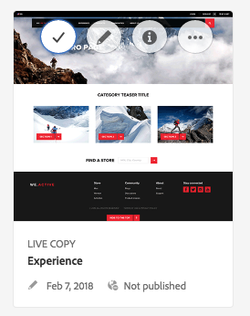

* 您可以點選/按一下資訊卡（小心以避免快速動作），或使用 [標題中的階層連結](/help/sites-authoring/basic-handling.md#the-header).

### 清單檢視 {#list-view}

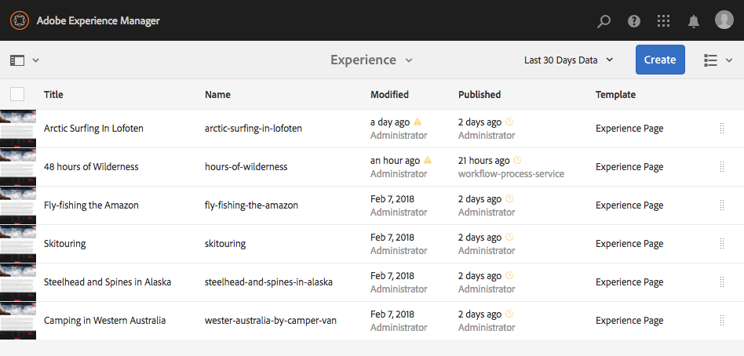

* 清單視圖列出當前級別上每個資源的資訊。
* 您可以點選/按一下資源名稱，然後使用 [標題中的階層連結](/help/sites-authoring/basic-handling.md#the-header).

* 若要輕鬆選取清單中的所有項目，請使用清單左上角的核取方塊。

   

   * 選取清單中的所有項目時，此核取方塊隨即顯示為已勾選。

      * 按一下或點選核取方塊，取消選取全部。
   * 只選取某些項目時，會以減號顯示。

      * 按一下或點選核取方塊以選取全部。
      * 再按一下或點選核取方塊，取消選取全部。

* 使用「視圖」按鈕下的**View Settings **選項選擇要顯示的列。 下列欄可供顯示：

   * **名稱**  — 頁面名稱，這在多語言編寫環境中很有用，因為它是頁面URL的一部分，不會變更（不論語言為何）
   * **已修改**  — 上次修改日期和上次由用戶修改
   * **已發佈**  — 發佈狀態
   * **範本**  — 頁面所依據的範本
   * **頁面分析**
   * **不重複訪客**
   * **頁面逗留時間**

   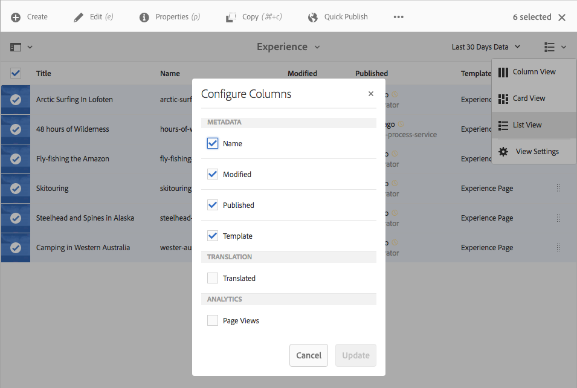

   依預設， **名稱** 欄即會顯示，這是頁面URL的一部分。 在某些情況下，作者可能需要存取使用不同語言的頁面，如果作者不知道頁面的語言，則檢視頁面名稱（通常不會改變）可能有很大幫助。

* 使用清單中每個項目最右邊的點狀垂直條來變更項目順序。

>[!NOTE]
>
>更改訂單只在具有 `jcr:primaryType` 值為 `sling:OrderedFolder`.

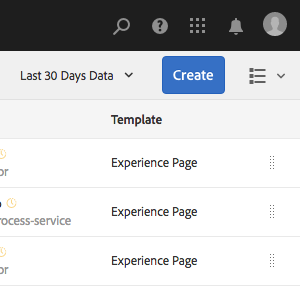

按一下或點選垂直選取列，然後將項目拖曳至清單中的新位置。

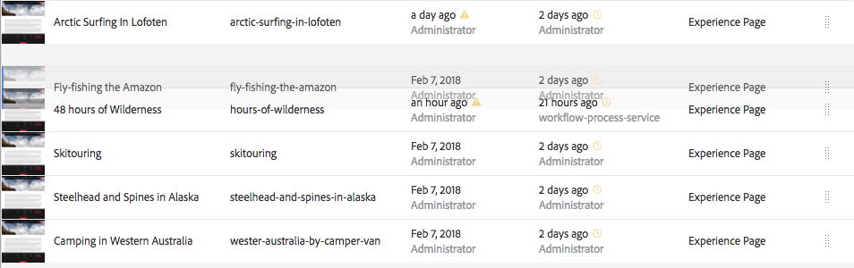

* 您可以使用「檢視設定」對話方塊顯示適當的欄，以顯示Analytics資料。

   您可以使用標題右側的篩選選項來篩選過去30、90或365天的Anylitics資料。

   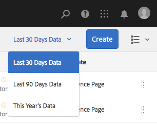

## 邊欄選擇器 {#rail-selector}

此 **邊欄選取器** 在視窗左上角，並根據您目前的主控台顯示選項。

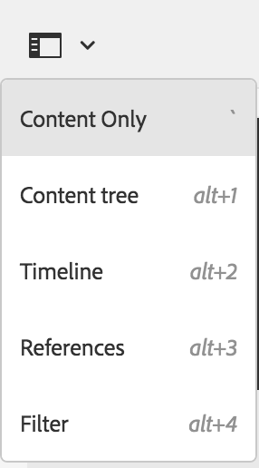

例如，在Sites中，您只能選取內容（預設值）、內容樹、時間軸、參照或篩選端面板。

如果僅選取內容，則只會顯示邊欄圖示。 選取任何其他選項時，選項名稱會出現在邊欄圖示旁。

>[!NOTE]
>
>[鍵盤快速鍵](/help/sites-authoring/keyboard-shortcuts.md) 可快速切換邊欄顯示選項。

### 內容樹 {#content-tree}

內容樹可用來快速導覽側面板內的網站階層，並檢視目前資料夾中頁面的詳細資訊。

使用內容樹側面板結合清單視圖或卡片視圖，用戶可以輕鬆查看項目的分層結構，使用內容樹側面板輕鬆瀏覽內容結構，並在清單視圖中查看詳細的頁面資訊。

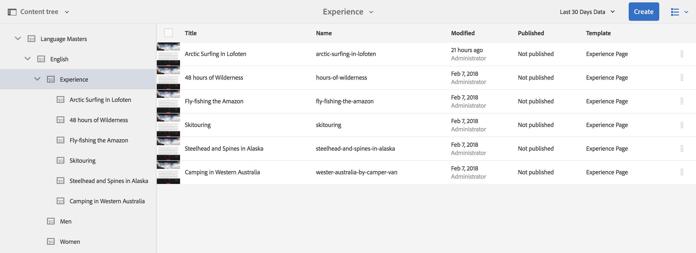

>[!NOTE]
>
>選取階層檢視中的項目後，即可使用方向鍵來快速導覽階層。
>
>請參閱 [鍵盤快捷鍵](/help/sites-authoring/keyboard-shortcuts.md) 以取得更多資訊。

### 時間軸 {#timeline}

時間軸可用於查看和/或啟動在所選資源上發生的事件。 若要開啟時間軸欄，請使用邊欄選取器：

時間軸欄可讓您：

* 檢視與選取項目相關的各種事件。

   * 可從下拉式清單中選取事件類型：

      * [評論](#TimelineAddingandViewingComments)
      * 註解
      * 活動
      * [Launch](/help/sites-authoring/launches.md)
      * [版本](/help/sites-authoring/working-with-page-versions.md)
      * [工作流程](/help/sites-authoring/workflows-applying.md)

         * 除 [暫時性工作流程](/help/sites-developing/workflows.md#transient-workflows) 因為沒有為這些
      * 和全部顯示

* [新增/檢視有關所選項目的註解。](#TimelineAddingandViewingComments)「注 **釋** 」方塊會顯示在事件清單的底部。鍵入注釋後跟Return將註冊注釋。當選取「注 **釋** 」或「 **全部顯示** 」時顯示。

* 特定主控台有其他功能。 例如，在Sites Console中，您可以：

   * [儲存版本](/help/sites-authoring/working-with-page-versions.md).
   * [啟動工作流程](/help/sites-authoring/workflows-applying.md).

這些選項可透過 **註解** 欄位。

### 引用 {#references}

**參考** 顯示與所選資源的任何連接。 例如，在 **網站** 主控台 [參照](/help/sites-authoring/author-environment-tools.md#references) 頁面顯示：

* [Launch](/help/sites-authoring/launches.md#launches-in-references-sites-console)
* [即時副本](/help/sites-administering/msm-livecopy-overview.md)
* [語言副本](/help/sites-administering/tc-prep.md#seeing-the-status-of-language-roots)
* 內容參考（例如參考元件借入和/或借出的內容）

### 篩選 {#filter}

這會開啟類似以下的面板： [搜尋](/help/sites-authoring/search.md) 已設定適當的位置篩選器，可讓您進一步篩選您要檢視的內容。

