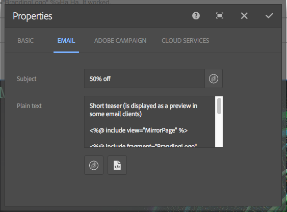

# 使用Adobe Campaign Classic和Adobe Campaign Standard{#working-with-adobe-campaign-classic-and-adobe-campaign-standard}

您可以在AEM中建立電子郵件內容，並在Adobe Campaign電子郵件中處理。 要做到這一點，您必須：

1. 從Adobe Campaign特定範本在AEM中建立新的電子報。
1. 在編輯內容以存取所有功能之前，請選取[Adobe Campaign服務](#selecting-the-adobe-campaign-cloud-service-and-template)。
1. 編輯內容。
1. 驗證內容。

然後，您就可在Adobe Campaign中將內容與傳送同步。 本檔案將詳細說明。

另請參閱[在AEM](/help/sites-authoring/adobe-campaign-forms.md)中建立Adobe Campaign Forms。

>[!NOTE]
>
>您必須先將AEM設定為與[Adobe Campaign](/help/sites-administering/campaignonpremise.md)或[Adobe Campaign Standard](/help/sites-administering/campaignstandard.md)整合，才能使用此功能。

## 透過Adobe Campaign傳送電子郵件內容{#sending-email-content-via-adobe-campaign}

在您設定AEM和Adobe Campaign後，您可以直接在AEM中建立電子郵件傳送內容，然後在Adobe Campaign中處理它。

當您在AEM中建立Adobe Campaign內容時，您必須先連結至Adobe Campaign服務，才能編輯內容以存取所有功能。

可能有兩種情況：

* 內容可與Adobe Campaign的傳送同步。 這可讓您在傳送中使用AEM內容。
* （僅限Adobe Campaign Classic）內容可直接傳送至Adobe Campaign，而Adobe Campaign會自動產生新的電子郵件傳送。 此模式有其限制。

本檔案將詳細說明。

### 建立新的電子郵件內容{#creating-new-email-content}

>[!NOTE]
>
>新增電子郵件範本時，請務必在&#x200B;**/content/campaigns**&#x200B;下加入範本，讓範本可供使用。

#### 建立新的電子郵件內容{#creating-new-email-content-1}

1. 在AEM中，依序選取&#x200B;**Sites**&#x200B;和&#x200B;**Campaigns**，然後瀏覽至管理電子郵件促銷活動的位置。 在下列範例中，路徑為&#x200B;**Sites** > **Campaigns** > **Geometrixx Outdoors** > **Email Campaigns**。

   >[!NOTE]
   >
   >[電子郵件範例僅在Geometrixx中提供](/help/sites-developing/we-retail.md)。請從Package Share下載範例Geometrixx內容。

   

1. 選擇&#x200B;**建立**，然後選擇&#x200B;**建立頁**。
1. 選取您要連線至的Adobe Campaign特定範本之一，然後按一下「下一步」。 ****&#x200B;預設提供3個範本：

   * **Adobe Campaign Classic電子郵件**:可讓您先將內容新增至預先定義的範本（兩欄），再將其傳送至Adobe Campaign Classic進行傳送。
   * **Adobe Campaign Standard電子郵件**:可讓您先將內容新增至預先定義的範本（兩欄），再將其傳送至Adobe Campaign Standard進行傳送。

1. 填寫&#x200B;**Title**&#x200B;和&#x200B;**Description**，然後按一下&#x200B;**Create**。 標題會用作電子報／電子郵件的主題，除非您在編輯電子郵件時覆寫它。

### 選擇Adobe Campaign雲端服務和範本{#selecting-the-adobe-campaign-cloud-service-and-template}

若要與Adobe Campaign整合，您必須將Adobe Campaign雲端服務新增至頁面。 如此可讓您存取個人化和其他Adobe Campaign資訊。

此外，您也可能需要選取Adobe Campaign範本，並變更主題，並為不會以HTML檢視電子郵件的使用者新增純文字內容。

您可以從&#x200B;**Sites**&#x200B;標籤或建立後從電子郵件／電子報內選擇雲端服務。

建議您從&#x200B;**Sites**&#x200B;標籤選擇雲端服務。 從電子郵件／電子報選取雲端服務需要因應措施。

從&#x200B;**Sites**&#x200B;頁面：

1. 在AEM中，選取電子郵件頁面，然後按一下「檢視屬性」**。**

   

1. 選擇&#x200B;**編輯**，然後選擇&#x200B;**雲端服務**&#x200B;標籤並向下捲動至底部，然後按一下+號新增設定，然後選擇&#x200B;**Adobe Campaign**。

   

1. 從下拉式清單中選取符合您Adobe Campaign例項的設定，然後按一下「儲存&#x200B;**」確認。**
1. 您可以按一下** Adobe Campaign**標籤，檢視電子郵件已套用至範本。 如果您想要選取其他範本，可以在編輯時從電子郵件中存取該範本。

   如果您想要套用預設郵件範本以外的特定電子郵件傳送範本（來自Adobe Campaign），請在&#x200B;**Properties**&#x200B;中，選取&#x200B;**Adobe Campaign**&#x200B;標籤。 在相關的Adobe Campaign例項中輸入電子郵件傳送範本的內部名稱。

   您選取的範本會決定哪些個人化欄位可從Adobe Campaign使用。

   

在製作電子報／電子郵件中，由於版面問題，您可能無法在&#x200B;**頁面屬性**&#x200B;中選取Adobe Campaign雲端服務設定。 您可使用以下說明的解決方法：

1. 在AEM中，選取電子郵件頁面，然後按一下「編輯」**。**&#x200B;按一下&#x200B;**開啟屬性**。

   

1. 選擇&#x200B;**雲端服務**，然後按一下&#x200B;**+**&#x200B;新增設定。 選擇任何可見配置（不重要）。 按一下或點選&#x200B;**+**&#x200B;符號以新增其他設定，然後選取&#x200B;**Adobe Campaign**。

   >[!NOTE]
   >
   >或者，您也可以選擇&#x200B;**Sites**&#x200B;標籤中的&#x200B;**檢視屬性**&#x200B;來選擇雲端服務。

1. 從下拉式清單中選取符合您Adobe Campaign例項的設定，刪除您建立的第一個非Adobe Campaign的設定，然後按一下核取記號進行確認。
1. 繼續上一步驟的步驟4，選擇範本並新增純文字。

### 編輯電子郵件內容{#editing-email-content}

若要編輯電子郵件內容：

1. 開啟電子郵件，依預設您會進入編輯模式。

   

1. 如果您想要變更電子郵件的主旨或為不會以HTML檢視電子郵件的使用者新增純文字，請選取&#x200B;**Email**&#x200B;並新增主旨和文字。 選擇頁面圖示，從HTML自動生成純文字檔案版本。 完成後，按一下核取標籤。

   您可以使用Adobe Campaign個人化欄位來個人化電子報。 若要新增個人化欄位，請按一下顯示Adobe Campaign標誌的按鈕，以開啟個人化欄位選擇器。 然後，您可以從本電子報的所有欄位中選擇。

   >[!NOTE]
   >
   >如果編輯器中屬性中的個人化欄位呈灰色，請重新檢查您的設定。

   

1. 開啟畫面左側的元件面板，並從下拉式選單中選取&#x200B;**Adobe Campaign Newsletter**&#x200B;以尋找這些元件。

   

1. 將元件直接拖曳至頁面上，並據以加以編輯。 例如，您可以拖曳&#x200B;**文字與個人化（促銷活動）**&#x200B;元件並新增個人化文字。

   

   如需每個元件的詳細說明，請參閱[Adobe Campaign元件](/help/sites-authoring/adobe-campaign-components.md)。

   

### 插入個人化{#inserting-personalization}

編輯內容時，您可以插入：

* Adobe Campaign內容欄位。 這些欄位可插入文字中，並根據收件者的資料（例如名字、姓氏或目標維度的任何資料）進行調整。
* Adobe Campaign個人化會封鎖。 這些是預先定義的內容區塊，與收件者的資料無關，例如品牌標誌或鏡像頁面連結。

如需促銷活動元件的完整說明，請參閱[Adobe促銷活動元件](/help/sites-authoring/adobe-campaign-components.md)。

>[!NOTE]
>
>* 只會考慮Adobe Campaign **Profiles**&#x200B;定位維度的欄位。
>* 從&#x200B;**Sites**&#x200B;檢視屬性時，您無法存取Adobe Campaign內容欄位。 您可以在編輯時直接從電子郵件存取這些內容。

>

要插入個人化，請：

1. 將新的&#x200B;**Newsletter** > **文字與個人化（促銷活動）**&#x200B;元件拖曳至頁面上，以插入它。

   

1. 按一下「鉛筆」圖示以開啟元件。 就地編輯器隨即開啟。

   

   >[!NOTE]
   >
   >**針對Adobe Campaign Standard:**
   >
   >* 可用的上下文欄位對應至Adobe Campaign中的&#x200B;**Profiles**&#x200B;定位維度。
   >* 請參閱[將AEM頁面連結至Adobe Campaign電子郵件](#linking-an-aem-page-to-an-adobe-campaign-email-adobe-campaign-standard)。

   >
   >**對於Adobe Campaign Classic:**
   >
   >* 可用的上下文欄位會從Adobe Campaign **nms:seedMember**&#x200B;架構動態復原。 目標擴充功能資料會從包含與內容同步傳送的工作流程中動態復原。 （請參閱「同步化在AEM中建立的內容與Adobe Campaign[的傳送」一節）。](#synchronizing-content-created-in-aem-with-a-delivery-from-adobe-campaign-classic)
      >
      >
   * 若要新增或隱藏個人化元素，請參閱[管理個人化欄位和區塊](/help/sites-administering/campaignonpremise.md#managing-personalization-fields-and-blocks)。
   >* **重要**:所有種子表欄位也必須位於收件人表（或相應的聯繫人表）中。

1. 輸入以插入文字。 按一下Adobe Campaign元件並選取它們，即可插入內容欄位或個人化區塊。 完成後，選擇複選標籤。

   

   在插入內容欄位或個人化區塊後，您可以預覽電子報並測試欄位。 請參閱[預覽電子報](#previewing-a-newsletter)。

### 預覽電子報{#previewing-a-newsletter}

您可以預覽電子報的外觀，也可以預覽個人化。

1. 在電子報開啟時，按一下AEM右上角的「預覽」。 **** AEM會顯示使用者收到電子報時的外觀。

   

   >[!NOTE]
   >
   >如果您使用Adobe Campaign Standard並使用範例範本，則顯示初始內容的兩個個人化區塊- **&quot;&lt;%@ include view=&quot;MirrorPage&quot; %>&quot;**&#x200B;和&#x200B;**&quot;&lt;%@ include view=&quot;UnsubscriptionLink&quot; %>&quot;** —— 會在傳送期間匯入內容時擲回錯誤。 您可以使用個人化區塊選擇器選取對應的區塊，來調整這些區塊。

1. 若要預覽個人化，請按一下／點選工具列中的對應圖示，以開啟ContextHub。 個人化欄位標籤現在會由所選角色的種子資料取代。 瞭解變數在ContextHub中切換角色時如何調整。

   

1. 您可以檢視來自Adobe Campaign的種子資料，這些資料與目前選取的角色相關聯。 若要這麼做，請按一下／點選ContextHub列中的Adobe Campaign模組。 這將開啟一個對話框，顯示當前配置檔案的所有種子資料。 同樣地，當切換至不同的角色時，資料會適應。

   

### 在AEM {#approving-content-in-aem}中核准內容

內容完成後，您可以開始核准程式。 前往工具箱的&#x200B;**Workflow**&#x200B;標籤，並選取「核准Adobe Campaign **」工作流程。**

這個現成可用的工作流程包含兩個步驟：修訂然後批准，或修訂然後拒絕。 不過，此工作流程可以延伸並適應更複雜的程式。

若要核准Adobe Campaign的內容，請選取&#x200B;**Workflow**&#x200B;並選取&#x200B;**Approve for Adobe Campaign**，然後按一下&#x200B;**Start Workflow**，以套用工作流程。 執行步驟並核准內容。 您也可以在最後一個工作流程步驟中選擇&#x200B;**拒絕**，而非&#x200B;**批准**&#x200B;來拒絕內容。

內容核准後，就會在Adobe Campaign中顯示為核准。 然後可傳送電子郵件。

在Adobe Campaign Standard中：

在Adobe Campaign Classic中：

>[!NOTE]
未核准的內容可與Adobe Campaign中的傳送同步，但無法執行傳送。 只能透過促銷活動傳送傳送已核准的內容。

## 將AEM與Adobe Campaign Standard和Adobe Campaign Classic {#linking-aem-with-adobe-campaign-standard-and-adobe-campaign-classic}連結

AEM與Adobe Campaign的連結或同步方式取決於您是使用訂閱型Adobe Campaign Standard或內部部署型Adobe Campaign Classic。

如需Adobe Campaign解決方案的相關指示，請參閱下列章節：

* [將AEM頁面連結至Adobe Campaign電子郵件(Adobe Campaign Standard)](#linking-an-aem-page-to-an-adobe-campaign-email-adobe-campaign-standard)
* [將在AEM中建立的內容與從Adobe Campaign Classic傳送同步化](#synchronizing-content-created-in-aem-with-a-delivery-from-adobe-campaign-classic)

### 將AEM頁面連結至Adobe Campaign電子郵件(Adobe Campaign Standard){#linking-an-aem-page-to-an-adobe-campaign-email-adobe-campaign-standard}

Adobe Campaign Standard可讓您以下列方式復原並連結在AEM中建立的內容：

* 電子郵件。
* 電子郵件範本。

如此，您就可以傳送內容。 您可以查看電子報是否透過頁面上顯示的程式碼連結至單一傳送。

>[!NOTE]
如果電子報連結至數個傳送，則會顯示連結的傳送次數（但不會顯示每個ID）。

若要連結在AEM中建立的頁面與Adobe Campaign寄送的電子郵件：

1. 根據AEM專用的電子郵件範本建立新電子郵件。 如需詳細資訊，請參閱[在Adobe Campaign Standard中建立電子郵件。](https://helpx.adobe.com/campaign/standard/channels/using/creating-an-email.html)

   

1. 從傳送控制面板開啟&#x200B;**Content**&#x200B;區塊。

   

1. 在工具列中選取「**連結Adobe Experience Manager內容**」，以存取AEM中可用的內容清單。

   >[!NOTE]
   如果動作列中未顯示「與Adobe Experience Manager **連結」選項，請檢查電子郵件屬性中的「**&#x200B;內容編輯模式&#x200B;**」已正確設定為「** Adobe Experience Manager **」。**

   

1. 選擇您要在電子郵件中使用的內容。

   此清單指定：

   * AEM中的內容標籤。
   * AEM中內容的核准狀態。 如果內容未獲核准，您可以同步內容，但必須在傳送前先加以核准。 不過，您可以執行某些操作，例如傳送校樣或預覽測試。
   * 上次修改內容的日期。
   * 任何已連結至傳送的內容。

   >[!NOTE]
   依預設，已與傳送同步的內容會隱藏。 不過，您可以顯示並使用它。 例如，如果您想將內容當做數個傳送的範本。

   當電子郵件連結至AEM內容時，無法在Adobe Campaign中編輯內容。

1. 從其儀表板指定電子郵件的其他參數（觀眾、執行排程）。
1. 執行電子郵件傳送。 在傳送分析期間，會擷取最新版本的AEM內容。

   >[!NOTE]
   如果內容在連結至電子郵件時在AEM中更新，則在分析期間會在Adobe Campaign中自動更新。 您也可以使用內容動作列的「重新整理Adobe Experience Manager內容&#x200B;**」手動執行同步。**
   您可以使用&#x200B;**從內容動作列刪除包含Adobe Experience Manager內容**&#x200B;的連結，來取消電子郵件與AEM內容之間的連結。 只有內容已連結至傳送時，此按鈕才可用。 若要將不同的內容與傳送連結，您必須先刪除目前的內容連結，才能建立新連結。
   刪除連結時，本機內容會保留並變成可在Adobe Campaign中編輯。 如果您在修改內容後再次連結內容，所有變更都將遺失。

### 將在AEM中建立的內容與Adobe Campaign Classic {#synchronizing-content-created-in-aem-with-a-delivery-from-adobe-campaign-classic}的傳送同步化

Adobe Campaign可讓您將在AEM中建立的內容復原並同步化至：

* 促銷活動傳送
* 促銷活動工作流程中的傳送活動
* 循環傳送
* 持續傳送
* 訊息中心傳送
* 傳送範本

在AEM中，如果電子報連結至單一傳送，傳送代碼會顯示在頁面上。

>[!NOTE]
如果電子報連結至數個傳送，則會顯示連結的傳送次數（但不會顯示每個ID）。

>[!NOTE]
AEM 6.1中不建議使用「工作流程」步驟&#x200B;**「發佈至Adobe Campaign**。此步驟是AEM 6.0與Adobe Campaign整合的一部分，不再需要。

若要將在AEM中建立的內容與Adobe Campaign的傳送同步化：

1. 選擇「使用AEM內容(mailAEMContent)**電子郵件傳送」傳送範本，以建立傳送或新增傳送活動至促銷活動工作流程。**

   

1. 在工具列中選取「同步化」**，以存取AEM中可用的內容清單。**

   >[!NOTE]
   如果傳送的工具列中未顯示&#x200B;**Synchronize**&#x200B;選項，請選取&#x200B;**Properties** > **Advanced**，檢查&#x200B;**內容編輯模式**&#x200B;欄位是否已正確設定。****

   

1. 選取您要與傳送同步的內容。

   此清單指定：

   * AEM中的內容標籤。
   * AEM中內容的核准狀態。 如果內容未獲核准，您可以同步內容，但必須在傳送前先加以核准。 不過，您可以執行某些操作，例如傳送BAT或預覽測試。
   * 內容上次修改的日期。
   * 任何已連結至傳送的內容。

   >[!NOTE]
   依預設，已與傳送同步的內容會隱藏。 不過，您可以顯示並使用它。 例如，如果您想將內容當做數個傳送的範本。

   

1. 指定傳送的其他參數（目標等）
1. 視需要，在Adobe Campaign中啟動傳送核准程式。 除了Adobe Campaign中設定的核准（預算、目標等）外，AEM中的內容核准也是必要的。 只有在AEM中已核准內容時，才能在Adobe Campaign中核准內容。
1. 執行傳送。 在傳送分析期間，會復原AEM內容的最新版本。

   >[!NOTE]
   * 傳送和內容同步後，Adobe Campaign中的傳送內容會變成唯讀。 無法再修改電子郵件主旨及其內容。
   * 如果內容在連結至Adobe Campaign中的傳送時在AEM中更新，則會在傳送分析期間自動在傳送中更新內容。 也可以使用&#x200B;**Refresh content now**&#x200B;按鈕手動執行同步。
   * 您可以使用&#x200B;**取消同步**&#x200B;按鈕取消傳送與AEM內容之間的同步。 只有在內容已與傳送同步時，才可使用此功能。 若要將不同的內容與傳送同步，您必須先取消目前的內容同步，才能建立新的連結。
   * 如果取消同步化本機內容，則會保留在Adobe Campaign中，並變成可編輯。 如果您在修改內容後重新同步內容，將會丟失所有更改。
   * 對於循環和連續的傳送，每次執行傳送時，都會停止與AEM內容的同步。

