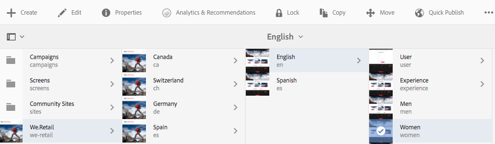

# 分析頁面效能{#analyzing-page-performance}

>[!CAUTION]
>
>AEM 6.4已結束延伸支援，本檔案不再更新。 如需詳細資訊，請參閱 [技術支援期](https://helpx.adobe.com//tw/support/programs/eol-matrix.html). 尋找支援的版本 [此處](https://experienceleague.adobe.com/docs/).

開啟 [內容分析](/help/sites-authoring/content-insights.md) 頁面，分析您所編寫頁面的效能。 設定報表時段以集中分析。

## 開啟頁面適用的Analytics和Recommendations {#opening-analytics-and-recommendations-for-a-page}

請依照下列程式查看頁面的Analytics和Recommendations:

1. 導覽至您要分析的頁面。
1. 在工具列中，按一下或點選 **Analytics和Recommendations**.

   >[!NOTE]
   >
   >頁面的Analytics和Recommendations，只有在您已將AEM設為 [整合Adobe Analytics](/help/sites-administering/adobeanalytics-connect.md).

   

## 變更報告時段 {#changing-the-reporting-period}

變更分析報表的下列時間相關方面：

* 要報告的時段。
* 資料的粒度。

用於變更報表時間相關方面的工具會顯示在「內容分析」頁面頂端。 

### 變更報告時段 {#changing-the-reporting-period-1}

變更「內容分析」頁面的報表時段，將您對頁面活動的分析聚焦於特定時段。 當您變更報告時段時，報告會自動重新整理。 該時間範圍的著色區域代表報告時段。 該時間範圍的日期會從左到右增加。

若要變更「內容分析」頁面的報表時段：

1. 如果時間範圍未出現在頁面頂端，請按一下或點選「切換時間範圍」圖示。

   

1. 若要變更報告時段的開始日期，請將顯示在著色區域左側的圓圈拖曳至所需的開始日期。

   如果看不到著色區域的左側，請使用捲動條將其顯示在視圖中。

1. 若要變更報告時段的結束日期，請將顯示在著色區域右側的圓圈拖曳至所需的結束日期。

### 變更報告時段的粒度 {#changing-the-granularity-of-the-reporting-period}

變更每個資料點在報表中跨越的時間長度。 例如，選取「周」粒度時，「檢視」報表上的每個資料點代表一週的檢視次數。

粒度會影響依時間繪製資料的報表，例如「檢視」和「頁面平均參與分鐘數」報表。 粒度也會影響時間範圍的規模。

1. 如果粒度控制項未出現，請按一下或點選「切換粒度」圖示。

   

1. 按一下或點選所需的粒度。 選取後，報表會自動更新以反映詳細程度。

## 指派SEO Recommendations的工作 {#assigning-tasks-for-seo-recommendations}

使用SEO Recommendations報表來建立改善搜尋引擎頁面可見度的工作。 對於報表中沒有核取記號的每個建議，您可以建立指派給使用者的任務，以執行所需的工作。

SEO建議的狀態會指出任務建立但尚未完成的時間。

建立後，該任務將顯示在用戶的「任務」清單中。 有關任務的資訊，請參閱 [使用任務](/help/sites-authoring/task-content.md).

請依照下列程式為SEO建議建立任務。

1. 按一下或點選SEO建議的資訊圖示。

   

1. 按一下資訊表徵圖旁出現的帶圓圈三角形表徵圖。

   

1. 填寫顯示的表單欄位，然後點選「建立」：

   * 專案：選擇要在其中建立任務的項目。
   * 名稱：標識任務的名稱。 預設名稱為SEO建議的標題。
   * 指派給：選擇要分配任務的用戶。 開始鍵入用戶名以篩選清單。
   * 說明：完成任務所需的活動的說明。 預設說明是SEO建議隨附的資訊。
   * 任務優先順序：任務的優先順序。
   * 到期日：任務的完成日期。

1. 按一下或點選「完成」以關閉「已建立任務」訊息。

>[!NOTE]
>
>所建立的任務也包含SEO建議所套用之頁面的路徑。
