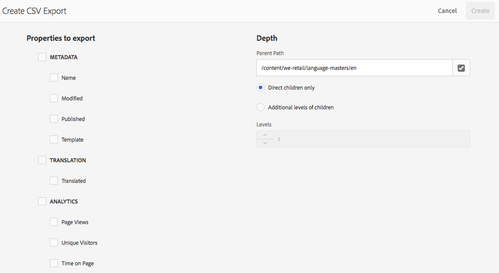

# 匯出為 CSV{#export-to-csv}

**「建立CSV匯出** 」可讓您將有關頁面的資訊匯出至本機系統上的CSV檔案。

* 下載的檔案稱為 `export.csv`
* 內容取決於您選擇的屬性。
* 可定義路徑和導出深度。

>[!NOTE]
>
>使用瀏覽器的下載功能和預設目標。

「建 立CSV匯出 」精靈可讓您選擇：

* 要匯出的屬性

   * 中繼資料

      * 修改時間
      * 已發佈
   * 分析

      * 頁面檢視
      * 獨特訪客
      * 頁面逗留時間

* 深度

   * 父路徑
   * 僅導向子項
   * 其他層級的子項
   * 層級

產生的 `export.csv` 檔案可在Excel或任何其他相容應用程式中開啟。

瀏覽Sites **(List view)時，可使** 用「建立 **** CSV匯出」選項： 它是「建立」( **Create** )下拉菜單的選項：

若要建立CSV匯出：

1. 開啟 **Sites** Console，視需要導覽至所需位置。
1. From the toolbar, select **Create** then **CSV Export** to open the wizard:

   

1. 選擇要導出的必需屬性。
1. 選擇 **建立**。

