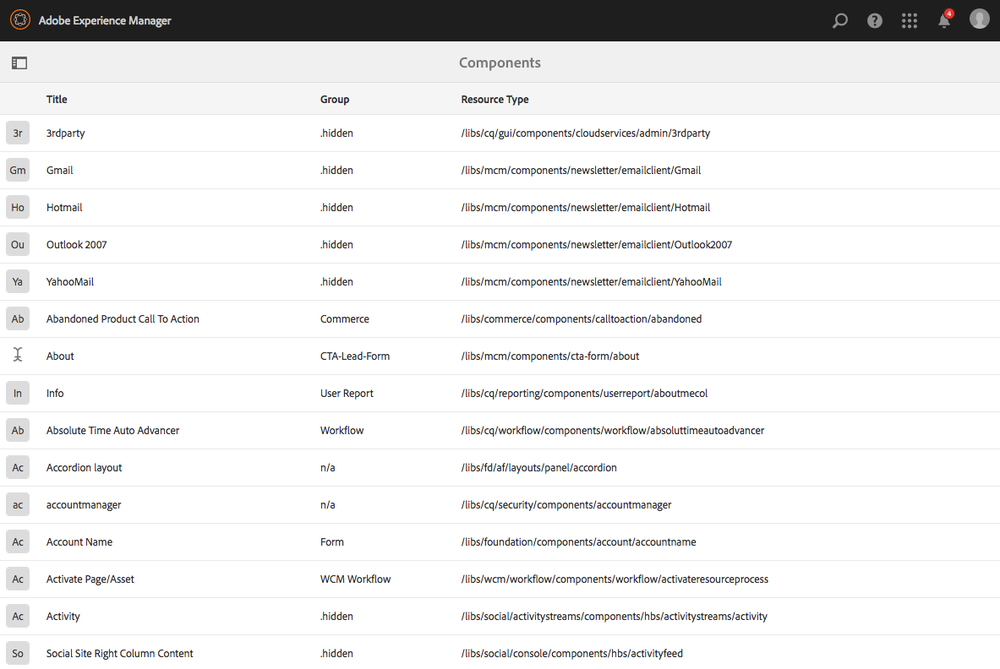

# 元件主控台{#components-console}

「元件」控制台允許您瀏覽為實例定義的所有元件，並查看每個元件的鍵資訊。

It can be accessed from **Tools** -> **General** -> **Components**. 在主控台中，卡片和清單檢視可供使用。由於沒有元件的樹結構，因此列視圖不可用。

>[!NOTE]
>
>「元件控制台」顯示系統中的所有元件。 「元 [件瀏覽器](/help/sites-authoring/author-environment-tools.md#components-browser) 」顯示作者可使用的元件，並隱藏以句點( `.`)開頭的元件群組。

## 搜尋 {#search-features}

使用「 **僅內容****** 」圖示 (左上角)，您可以開啟「搜尋」面板以搜尋和/或篩選元件：

## 元件詳細資訊 {#component-details}

要查看有關特定元件的詳細資訊，請點選／按一下所需資源。 三個標籤提供：

* **屬性**

   

   在「屬性」標籤上，您可以：

   * 查看元件的常規屬性。
   * 檢視元件 [的圖示或縮寫定義方式](/help/sites-developing/components-basics.md#component-icon-in-touch-ui) 。

      * 按一下圖示的來源後，您就會前往該元件。
   * 查看組 **件的資源類** 型 **和資源超級類型** （如果已定義）。

      * 按一下「資源超級類型」(Resource Super Type)將帶您進入該元件。
   >[!NOTE]
   >
   >由於 `/apps` 在執行時期無法編輯元件主控台，因此是唯讀的。

* **原則**

   

* **即時使用情況**

   

   >[!CAUTION]
   >
   >由於為此視圖收集的資訊的性質，可能需要一段時間才能進行整理／顯示。

* **文件**

   如果開發人員已 [提供元件的檔案](/help/sites-developing/developing-components.md#documenting-your-component)，則會顯示在「檔案」 **標籤上** 。 如果沒有可用的文檔，則不 **會顯示** 「文檔」頁籤。

   

