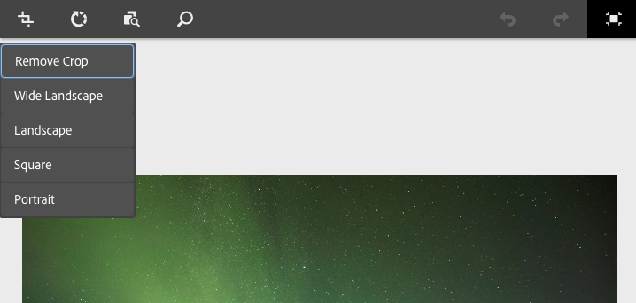

# 編輯頁面內容{#editing-page-content}

建立您的頁面後（新增或作為啟動或即時副本的一部分），您就可以編輯內容以進行所需的更新。

使用可拖曳至 [頁面的元件](/help/sites-authoring/default-components-console.md) （適合內容類型）來新增內容。 然後，您就可以就地編輯、移動或刪除這些項目。

>[!NOTE]
>
>您的帳戶需要 [適當的存取權](/help/sites-administering/security.md)[限和](/help/sites-administering/security.md#permissions) 權限，才能編輯頁面。
>
>如果您遇到任何問題，我們建議您與系統管理員聯繫。

>[!NOTE]
>
>如果您的頁面和／或範本已正確設定，則可在編輯時使 [用互動式版](/help/sites-authoring/responsive-layout.md) 面。

>[!NOTE]
>
>在「編 **輯** 」模式下，您的內容中的連結是可見的，但是無 **法存取**。 如果您 [想要使用內容中的連結來導覽](#previewing-pages) ，請使用「預覽」模式。

## 頁面工具列 {#page-toolbar}

頁面工具列提供對適當功能的存取，視頁面設定而定。

工具列提供多種選項的存取權。 根據您目前的上下文和設定，某些選項可能無法使用。

* **切換側面板**

   這會開啟／關閉側面板，此面板會保 [存「資產瀏覽器](/help/sites-authoring/author-environment-tools.md#assets-browser)」、「元 [件瀏覽器](/help/sites-authoring/author-environment-tools.md#components-browser)」和「 [內容樹」](/help/sites-authoring/author-environment-tools.md#content-tree)。

   

* **頁面資訊**

   提供對「頁面資 [訊](/help/sites-authoring/author-environment-tools.md#page-information) 」選單的存取，包括頁面詳細資料和可在頁面上執行的動作，包括檢視和編輯頁面資訊、檢視頁面屬性，以及發佈／取消發佈頁面。

   

* **模擬器**

   切換模 [擬器工具列](/help/sites-authoring/responsive-layout.md#selecting-a-device-to-emulate)，該工具列用於模擬其他裝置上頁面的外觀和感覺。 這會在版面模式中自動切換。

   

* **ContextHub**

   開啟上 [下文中心](/help/sites-authoring/ch-previewing.md)。 僅在「預覽」模式中可用。

   

* **頁面標題**

   這純粹是資訊性的。

   

* **模式選擇器**

   顯示目前 [模式](/help/sites-authoring/author-environment-tools.md#page-modes) ，並可讓您選取其他模式，例如編輯、版面、時間彎曲或定位。

   

* **預覽**

   啟用 [預覽模式](/help/sites-authoring/editing-content.md#preview-mode)。 如此會顯示發佈時的頁面。

   

* **注釋**

   可讓您在檢 [視頁面](/help/sites-authoring/annotations.md) 時，新增註解至頁面。 在第一個注釋之後，表徵圖將切換到一個數字，指示頁面上的注釋數。

   

### 狀態通知 {#status-notification}

如果頁面是工作流程或 [多個工作流程](/help/sites-authoring/workflows.md) ，則編輯頁面時，此資訊會顯示在畫面頂端的通知列中。

>[!NOTE]
>
>狀態列僅對具有適當權限的用戶帳戶可見。

通知會列出針對頁面執行的工作流程。 如果用戶參與當前工作流步驟，則還可 [以選擇影響工作流狀態](/help/sites-authoring/workflows-participating.md) ，並獲取有關工作流的詳細資訊，例如：

* **完成** -開啟「完 **成工作項** 」對話框

* **委派** -開啟「完 **整工作項目」對話**

* **查看詳細資訊** -開啟工作流 **的** 「詳細資訊」窗口

從「通知」收件匣參與工作流程時，透過通知列完成和委派工 [作流程步驟](/help/sites-authoring/workflows-participating.md) ，其運作方式相同。

如果頁面受多個工作流程的約束，則通知的右端會顯示工作流程數目，並附上箭頭按鈕，讓您捲動整個工作流程。

## 元件預留位置 {#component-placeholder}

元件預留位置是指示器，可顯示當您放置元件時元件的位置——位於目前暫留在元件上方。

* 將新元件新增至頁面時（從元件瀏覽器拖曳）:

   

* 移動現有元件時：

   

## 插入元件 {#inserting-a-component}

### 從元件瀏覽器插入元件 {#inserting-a-component-from-the-components-browser}

您可以使用元件瀏覽器來新增 [元件](/help/sites-authoring/author-environment-tools.md#components-browser)。 元 [件預留位置](#component-placeholder) (Component placeholder)顯示元件的位置：

1. 請確定您的頁面處於「編 [**輯&#x200B;**」模式](/help/sites-authoring/author-environment-tools.md#page-modes)。
1. 開啟元 [件瀏覽器](/help/sites-authoring/author-environment-tools.md#components-browser)。
1. 將所需元件拖曳至 [所需位置](#component-placeholder)。

1. [編輯元件](#edit-configure-copy-cut-delete-paste) 。

>[!NOTE]
>
>在行動裝置上，元件瀏覽器會填滿整個螢幕。 當您開始拖曳元件後，瀏覽器會關閉以再次顯示頁面，好讓您放置元件。

### 從段落系統中插入元件 {#inserting-a-component-from-the-paragraph-system}

可以使用段落系統的「將元件拖 **曳到此處** 」框添加新元件：

1. 請確定您的頁面處於「編 [**輯&#x200B;**」模式](/help/sites-authoring/author-environment-tools.md#page-modes)。
1. 從段落系統中選擇和添加新元件有兩種方法：

   * Select the **Insert Component** option (+) from either the toolbar of an existing component or the **Drag components here** box.

   

   * 如果您使用桌上型裝置，可以按兩下「拖曳元件至 **此處** 」方塊。

   The **Insert New Component** dialog will open to allow you to select your required component:

   

1. 所選元件將添加到頁面底部。 [視需要編輯元件](#edit-content) 。

### 使用資產瀏覽器插入元件 {#inserting-a-component-using-the-assets-browser}

您也可以從資產瀏覽器拖曳資產，將新元件新增至 [頁面](/help/sites-authoring/author-environment-tools.md#assets-browser)。 這會自動建立適當類型的新元件（並包含資產）。

這適用於下列資產類型（有些將依賴頁面／段落系統）:

<table> 
 <tbody>
  <tr>
   <th>資產類型</th> 
   <th>合成元件類型</th> 
  </tr>
  <tr>
   <td>影像</td> 
   <td>影像</td> 
  </tr>
  <tr>
   <td>文件</td> 
   <td>下載</td> 
  </tr>
  <tr>
   <td>產品</td> 
   <td>產品</td> 
  </tr>
  <tr>
   <td>影片</td> 
   <td>閃光燈</td> 
  </tr>
  <tr>
   <td>內容片段</td> 
   <td>內容片段  </td> 
  </tr>
 </tbody>
</table>

>[!NOTE]
>
>此行為可針對您的安裝進行設定。 如需 [詳細資訊，請參閱設定段落系統，讓拖曳資產可建立元件例項](/help/sites-developing/developing-components.md#configuring-a-paragraph-system-so-that-dragging-an-asset-creates-a-component-instance) 。

要通過拖動上述資產類型之一來建立元件，請執行以下操作：

1. 請確定您的頁面處於「編 [**輯&#x200B;**」模式](/help/sites-authoring/author-environment-tools.md#page-modes)。
1. 開啟資 [產瀏覽器](/help/sites-authoring/author-environment-tools.md#assets-browser)。
1. 將所需資產拖曳至所需位置。 元件 [預留位置](#component-placeholder) ，會顯示元件的位置。

   將在所需位置建立一個適合資產類型的元件——它將包含選定的資產。

1. [視需要編輯元件](#edit-content) 。

>[!NOTE]
>
>在行動裝置上，資產瀏覽器會填滿整個螢幕。 當您開始拖曳資產後，瀏覽器會關閉以再次顯示頁面，好讓您放置資產。

如果瀏覽資產時發現您需要快速變更資產，可以按一下資產名稱旁的編輯圖示，直接從瀏覽器啟動 [資產編輯器](/help/assets/managing-assets-touch-ui.md) 。

## 編輯／設定／複製／剪下／刪除／貼上 {#edit-configure-copy-cut-delete-paste}

選取元件將會開啟工具列。 這可讓您存取可在元件上執行的各種動作。

使用者可使用的實際動作會視需要顯示，並非所有動作都可在此處說明。

* **編輯**

   [根據元件類型](/help/sites-authoring/default-components.md) ，這將允許您 [編輯元件的內容](#edit-content)。 通常會提供工具列。

   

* **設定**

   [根據元件類型](/help/sites-authoring/default-components.md) ，這將允許您編輯和配置元件的屬性。 通常會開啟對話方塊。

   

* **複製**

   這會將元件複製到剪貼簿。 貼上動作後，原始元件將保留。

   

* **剪下**

   這會將元件複製到剪貼簿。 貼上動作後，原始元件將會移除。

   

* **刪除**

   這會從含有您確認的頁面刪除元件。

   

* **插入元件**

   這會開啟對話方塊， [以新增元件](/help/sites-authoring/editing-content.md#inserting-a-component-from-the-paragraph-system)。

   

* **貼上**

   這會將元件從剪貼簿貼到頁面。 原稿是否保留，取決於您是使用復本還是剪下。

   * 您可以貼到相同的頁面或不同的頁面。
   * 貼上的項目會貼至您選取貼上動作的項目上方。
   * 只有剪貼簿上有內容時，才會顯示「平移」動作。

   

   >[!NOTE]
   >
   >如果您貼到在剪下／復製作業之前已開啟的其他頁面，您必須重新整理頁面，才能查看貼上的內容。

* **群組**

   這可讓您一次選取多個元件。 在案頭裝置上，您也可以使用 **Control+Click** 或 **Command+Click**。

   

* **父代**

   允許您選擇所選元件的父元件。

   

* **配置**

   這允許您修改選 [定組](/help/sites-authoring/editing-content.md#edit-component-layout) 件的佈局。 這僅適用於選取的元件，而不會啟動整個 [頁面的](/help/sites-authoring/author-environment-tools.md#page-modes) 「版面」模式。

   

* **轉換為體驗片段變數**

   這可讓您從選取的元件 [建立新的體驗片段](/help/sites-authoring/experience-fragments.md) ，或將其新增至現有的體驗片段。

   

## Edit (Content) {#edit-content}

在元件中新增和／或編輯內容有兩種方法：

* 開啟元 [件對話方塊進行編輯](#component-edit-dialog)。
* [從資產瀏覽器拖放資產](#inserting-a-component-using-the-assets-browser) ，以直接新增內容。

### 元件編輯對話框 {#component-edit-dialog}

您可以使用元件工具列的「編輯 (鉛筆) 」圖示， [開啟元件以編輯內容](#edit-configure-copy-cut-delete-paste)。

確切的編輯選項將取決於元件。 對於某些元 [件，所有動作只能在全螢幕模式下使用](#edit-content-full-screen-mode)。 例如：

* [文字元件](/help/sites-authoring/rich-text-editor.md)

   

* 影像元件

   

   >[!NOTE]
   >
   >編輯無法用於空的影像元件。
   >
   >
   >您必須 [先拖曳或上傳影像（使用設定）](/help/sites-authoring/default-components-foundation.md#image) ，才能開始編輯影像。

* 影像元件——全螢幕

   [進入影像元件的全螢幕模式](/help/sites-authoring/editing-content.md#edit-content-full-screen-mode) ，可讓您有更多空間編輯影像，並顯示額外的編輯選項，例如「啟動地圖」和「重設縮放」 ********。此外，全螢幕還允許選取裁切預設集。

   

* 由多個基本元件(例如 [Text &amp; Image foundation元件)構建的元件](/help/sites-authoring/default-components-foundation.md#text-image)，首先會要求您確認您要的編輯選項集：

   

### 將資產拖放至元件 {#drag-and-drop-assets-into-component}

對於特定元件類型，您可以直接將資產從資產瀏覽器拖放至元件中，以更新內容：

| 資產類型 | 元件類型 |
|---|---|
| 影像 | 影像 |
| 文件 | 下載 |
| 產品 | 產品 |
| 影片 | 閃光燈 |
| 內容片段 | 內容片段 |

## 編輯（內容）全螢幕模式 {#edit-content-full-screen-mode}

對於所有元件，全屏模式可以通過（並退出）訪問：

例如， **Text元件** :

>[!NOTE]
>
>對於某些元件，全螢幕模式會提供比基本就地編輯器更多的選項。

## 移動元件 {#moving-a-component}

要移動段落元件，請執行以下操作：

1. 選擇要使用點選並按住或按一下並按住移動的段落。
1. 將段落拖曳至新位置。 AEM會指出可將段落存放在何處。 將它拖放至您所要的位置。

   

1. 您的段落會被移動。

>[!NOTE]
>
>也可以使用「剪 [下並貼上](/help/sites-authoring/editing-content.md#edit-configure-copy-cut-delete-paste) 」(Cut and Paste)移動元件。

## 編輯元件配置 {#edit-component-layout}

您可以選取元件的 [Layout](/help/sites-authoring/responsive-layout.md)****  (配置) 動作，以變更元件的配置，並節省時間，而不需離開編輯模式，而不需重複從編輯切換到配置模式來調整元件。

1. 在站點控 **制台的** 「編輯」模式下，選擇元件會顯示元件的工具欄。

   

   按一下或點選「 **版面** 」動作，以調整元件的版面。

   

1. 選取「版面」動作後：

   * 元件顯示的調整大小控制點。
   * 模擬器工具欄顯示在螢幕頂部。
   * 元件工具列上會顯示版面動作，而非標準編輯動作。

   

   您現在可以像在版面模式中一樣修改元件的 [版面](/help/sites-authoring/responsive-layout.md#defining-layouts-layout-mode)。

1. 在進行必要的版面變更後，按一下元件動作選單中的 **Close** （關閉）按鈕，以停止修改元件的版面。 元件的工具欄返回其正常編輯狀態。

   

>[!NOTE]
>
>「佈局」(Layout)操作的範圍僅限於所選元件。 例如，如果編輯某個元件的佈局，然後按一下另一個元件，則新選元件的標準編輯工具欄（而非佈局工具欄）將顯示，並且重新調整控制滑塊和模擬器工具欄將消失。
>
>如果您需要編輯頁面的整體版面配置，並影響多個元件，請切換至版 [面模式](/help/sites-authoring/responsive-layout.md)。

## 繼承的元件 {#inherited-components}

繼承的元件可以是各種情況的產品，包括：

* [多網站管理](/help/sites-administering/msm.md)
* [啟動](/help/sites-authoring/launches.md) （根據即時副本）。
* 特定元件，例如Geometrixx內的繼承段落系統。

您可以取消（然後重新啟用）繼承。 視元件而定，這可從以下網址取得：

* **即時副本**

   元件工具列（如果元件位於即時副本或啟動的頁面上）。 例如：

   

   「取消繼承」(Cancel Inheritance)選項可用：

   

   或者，如果已取消，則重新啟用繼承：

   

   Blueprint或即時副本來源中也提供「轉出」動作：

   

* **繼承的段落制度**

   配置對話框。 例如，與繼承段落系統一樣：

   

## 編輯頁面範本 {#editing-the-page-template}

如果頁面基於可編輯的模板 [，則可以通過在「頁面資訊」菜單中選擇「編輯」模板來輕鬆切換到](/help/sites-authoring/templates.md#editable-and-static-templates)模板編輯器 ****。

如果頁面是以靜態范 [本為基礎](/help/sites-authoring/templates.md#editable-and-static-templates)，您可以使用工具列上的頁面模式選擇器，切換至「設計」模式  ，以啟用／停用要在頁面上使用的元件。

在「欄檢視」或「清單檢視」中選取頁面時，您可輕鬆查看該頁 [面所依據](/help/sites-authoring/basic-handling.md#column-view)[的範本](/help/sites-authoring/basic-handling.md#list-view)。

## 即時副本狀態 {#live-copy-status}

「即 [時副本狀態」頁面模式](/help/sites-authoring/author-environment-tools.md#page-modes) ，可讓您快速概述即時副本狀態，以及哪些元件已繼承／未繼承：

* 綠色邊框： 繼承
* 粉色邊框： 繼承已取消

例如：

## 添加註釋 {#adding-annotations}

[註解](/help/sites-authoring/annotations.md) ，可讓審核者和其他作者提供您內容的意見回應。 它們通常用於審閱和驗證目的。

## 預覽頁面 {#previewing-pages}

預覽頁面有兩個選項：

* [預覽模式](#preview-mode) -快速就地預覽

* [檢視為已發佈](#view-as-published) -在新標籤中開啟頁面的完整預覽

>[!NOTE]
>
>* 內容中的連結是可見的，但在「編輯」模式中無法存取。
>* 如果您想使用連結進行導覽，請使用其中一個預覽選項。
>* 使用鍵 [盤快速鍵](/help/sites-authoring/keyboard-shortcuts.md)`Ctrl-Shift-M` ，在預覽和上次選取的模式之間切換。

>

>[!NOTE]
>
>WCM模式Cookie已針對這兩個選項設定。

### 預覽模式 {#preview-mode}

在編輯內容時，您可以使用預覽模式來預覽 [頁面](/help/sites-authoring/author-environment-tools.md#page-modes)。 此模式：

* 隱藏各種編輯機制，讓您快速檢視頁面在發佈時的顯示方式。
* 可讓您使用連結進行導覽。
* 不 **會重新整** 理頁面內容。

編寫時，預覽模式可使用頁面編輯器右上角的表徵圖：

### 以已發佈狀態檢視 {#view-as-published}

「頁 **面資訊」功能表中** ，提供「檢視為已發 [布」選項](/help/sites-authoring/author-environment-tools.md#page-information) 。 如此會在新標籤中開啟頁面，重新整理內容，並完全顯示頁面在發佈環境中的顯示效果。

## 鎖定頁面 {#locking-a-page}

AEM可讓您鎖定頁面，讓其他人無法修改內容。 當您對特定頁面進行大量編輯或需要將頁面凍結一段時間時，這項功能會很有用。

頁面可從以下任一位置鎖定：

* **Sites** Console

   1. 選擇具有選擇模 [式的頁面](/help/sites-authoring/basic-handling.md#viewing-and-selecting-resources)。
   1. 選擇鎖定表徵圖。

   

* **頁面編輯器**

   1. 選取「頁 **面資訊** 」圖示以開啟功能表。
   1. Select the **Lock Page** option.

鎖定後，控制台視圖資訊將更新，編輯鎖定符號時，工具欄中將顯示該資訊。

>[!CAUTION]
>
>在模擬使用者時，可 [以鎖定頁面](/help/sites-administering/security.md#impersonating-another-user)。 不過，以此方式鎖定的頁面只能由模擬或管理員使用者解除鎖定。
>
>無法模擬鎖定頁面的使用者來解除鎖定頁面。

## 解除鎖定頁面 {#unlocking-a-page}

解除鎖定頁面與鎖定頁 [面非常相似](#locking-a-page)。 鎖定頁面後，鎖定選項將被解鎖操作替換。

「頁面資訊」功能表 **會列出** 「解除鎖定」為選項，而網站主控台中的「鎖定」圖示會以「解除鎖定」圖示 **** 取代。

>[!CAUTION]
>
>在模擬使用者時，可 [以鎖定頁面](/help/sites-administering/security.md#impersonating-another-user)。 不過，以此方式鎖定的頁面只能由模擬或管理員使用者解除鎖定。
>
>無法模擬鎖定頁面的使用者來解除鎖定頁面。

## 復原和重做頁面編輯 {#undoing-and-redoing-page-edits}

下列圖示可讓您還原或重做動作。 如果適用，這些項目會顯示在工具列中：

>[!NOTE]
>
>也可 [以使用鍵](/help/sites-authoring/page-authoring-keyboard-shortcuts.md)`Ctrl-Z` 盤快速鍵來還原頁面編輯動作。
>
>鍵盤快速鍵 `Ctrl-Y` 也可用於重做頁面編輯動作。

>[!NOTE]
>
>如需  復原和重做頁面編輯時可能做到的完整詳細資訊，請參閱復原和重做頁面編輯——理論。

## 還原和重做頁面編輯——理論 {#undoing-and-redoing-page-edits-the-theory}

>[!NOTE]
>
>系統管理員可 [以根據實例的要求配置「撤消／重做](/help/sites-administering/config-undo.md) 」功能的各個方面。

AEM會儲存您執行之動作的記錄和執行動作的順序，如此您就可以依執行動作的順序還原多個動作，並視需要重做以重新套用一或多個動作。

如果選取內容頁面上的元素（例如文字元件），則還原和重做命令會套用至選取的項目。

撤消和重做命令的行為與其他軟體程式中類似。 在您決定內容時，使用命令來還原網頁的最近狀態。 例如，如果將文本段落移動到頁面上的不同位置，則可以使用撤消命令將段落移回。 如果您接著決定先前的位置較佳，請使用redo命令來「復原」。

>[!NOTE]
>
>您可以：
>
>* 只要您自使用還原後未進行頁面編輯，就可重做動作。
>* 最多可還原20個編輯動作（預設設定）。
>* 此外，您也可 [以使用鍵盤快速鍵](/help/sites-authoring/page-authoring-keyboard-shortcuts.md) ，來還原和重做。

>

您可以對下列類型的頁面變更使用還原和重做：

* 新增、編輯、移除和移動段落
* 就地編輯段落內容
* 在頁面中複製、剪下和貼上項目

表單元件演算的表單欄位，不代表在編寫頁面時指定值。 因此，撤消和重做命令不會影響您對這些類型元件的值所做的更改。 例如，您無法撤消在下拉清單中選擇值。

>[!NOTE]
>
>還原和重做檔案和影像的變更需要特殊權限。

>[!NOTE]
>
>檔案和影像的變更記錄至少會持續10小時。 但是，在此之後，不保證會取消變更。 您的管理員可以變更預設時間10小時。

