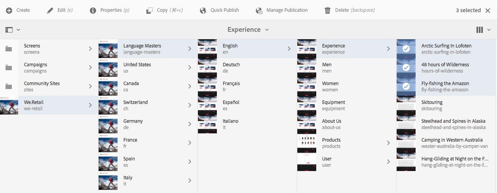
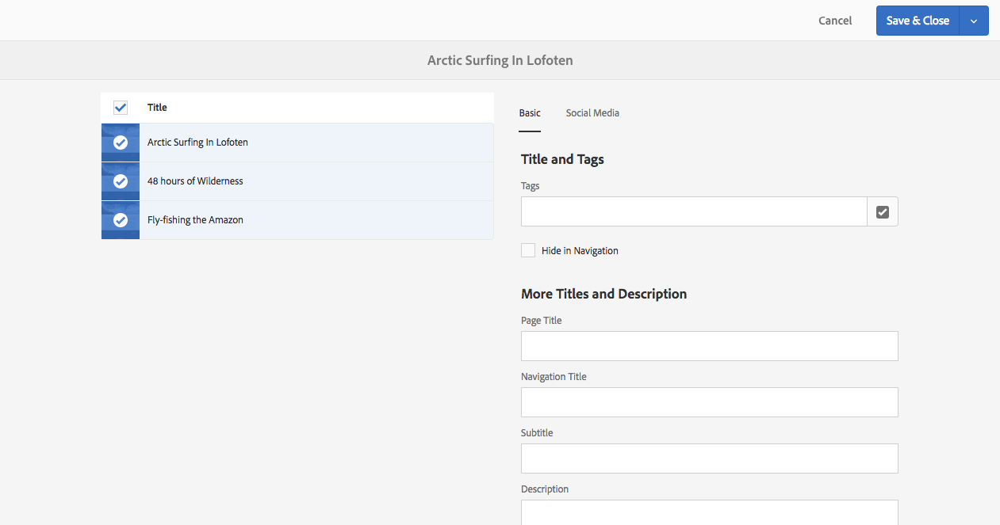

# 編輯頁面屬性{#editing-page-properties}

您可以定義頁面的必要屬性。 這些項目可能會因頁面性質而異。 例如，某些頁面可能連線至即時副本，而其他頁面則未連線，且即時副本資訊將可視情況提供。

## 頁面內容 {#page-properties}

屬性分佈在多個索引標籤之間。

### 基本 {#basic}

* **標題**

   頁面標題會顯示在各種位置中。 例如， **Websites**&#x200B;索引標籤清單和&#x200B;**Sites**&#x200B;卡片/清單檢視。

   這是必要欄位。

* **標記**

   您可以在此更新選取方塊中的清單，以從頁面新增或移除標籤：

   * 選取標籤後，標籤會列在選取方塊下方。 您可以使用x從此清單中移除標籤。
   * 您可以在空白的選取方塊中輸入名稱，以輸入全新的標籤。

      * 當您點擊Enter時，將會建立新標籤。
      * 接著，新標籤會在右側以小星號顯示，指出為新標籤。
   * 透過下拉式功能，您可以從現有標籤中選取。
   * 將滑鼠移至選取方塊中的標籤項目上時，會顯示x，可用來移除此頁面的標籤。

   如需標籤的詳細資訊，請參閱[使用標籤](/help/sites-authoring/tags.md)。

* **於導覽中隱藏**

   指出頁面在所產生網站的頁面導覽中是否顯示或隱藏。

* **品牌化**

   在每個頁面標題附加品牌概要資訊，借此在頁面間套用一致的品牌識別。 若要使用此功能，需使用2.14.0版或更新版本的[核心元件。](https://experienceleague.adobe.com/docs/experience-manager-core-components/using/introduction.html?lang=zh-Hant)

   * **覆寫**  — 勾選以定義此頁面上的品牌概要資訊。
      * 值將由任何子頁繼承，除非它們也設定了其&#x200B;**Override**&#x200B;值。
   * **覆寫值**  — 要附加至頁面標題的品牌概要文字。
      * 此值會附加在垂直號字元（如「循環托斯卡納」）之後的頁面標題 |始終為WKND做好準備&quot;

* **頁面標題**

   要在頁面上使用的標題。 通常用於標題元件。 如果空白，則將使用&#x200B;**Title**。

* **導覽標題**

   您可以指定個別標題以用於導覽（例如，如果您想要更精簡的標題）。 如果空白，則將使用&#x200B;**Title**。

* **子標題**

   用於頁面的副標題。

* **說明**

   您對頁面的說明、其用途，或您要新增的任何其他詳細資訊。

* **開啟時間**

   啟動已發佈頁面的日期和時間。 發佈後，此頁面將保持休眠狀態，直到指定的時間。

   對於您要立即發佈的頁面，請將這些欄位保留空白（一般情況）。

* **關閉時間**

   已發佈頁面停用的時間。

   再次將這些欄位保留為空白以立即執行動作。

* **虛名 URL**

   可讓您輸入此頁面的虛名URL，以便您擁有較短和/或更具表達力的URL。

   例如，若虛名URL設為w `elcome`，設為網站h `ttp://example.com,`的路徑/ `v1.0/startpage`所識別的頁面，則h `ttp://example.com/welcome`將為h `ttp://example.com/content/v1.0/startpage`的虛名URL

   >[!CAUTION]
   >
   >虛名 URL:
   >
   >* 必須是唯一的，因此您應注意，值尚未被其他頁面使用。
   >* 不支援規則運算式模式。

* **重新導向虛名 URL**

   指出您是否希望頁面使用虛名URL。

### 進階 {#advanced}

* **語言**

   頁面語言。

* **重新導向**

   指定此頁面應自動重新導向的頁面。

* **設計**

   指定要用於此頁面的[design](/help/sites-developing/designer.md)。

* **別名**

   指定要與此頁面一起使用的別名。

   * 例如，如果為頁面`/content/wknd/us/en/magazine/members-only`定義別名`private`，則此頁面也可透過`/content/wknd/us/en/magazine/private`存取。
   * 建立別名會在頁面節點上設定`sling:alias`屬性，這只會影響資源，而非存放庫路徑。
   * 無法發佈編輯器中由別名存取的頁面。 [編輯](/help/sites-authoring/publishing-pages.md) 器中的發佈選項僅適用於透過其實際路徑存取的頁面。
   * 如需詳細資訊，請參閱SEO和URL管理最佳實務](/help/managing/seo-and-url-management.md#localized-page-names)下的「本地化頁面名稱」[

* **允許的範本**

   [定義此子分支中可](/help/sites-authoring/templates.md#enabling-and-allowing-a-template-template-author) 用的範本清單。

* **驗證需求**

   啟用（或停用）驗證的使用以存取頁面。

   此處可以設定驗證要求以及指定的登錄頁。 頁面的封閉使用者群組是在&#x200B;**[Permissions](/help/sites-authoring/editing-page-properties.md#permissions)**&#x200B;標籤上定義。

   >[!CAUTION]
   >
   >**[Permissions](/help/sites-authoring/editing-page-properties.md#permissions)**&#x200B;標籤允許根據`granite:AuthenticationRequired` mixin的存在編輯CUG配置。 如果使用已棄用的CUG設定來設定頁面權限，則根據存在cq:cugEnabled屬性，在&#x200B;**Authentication Requirement**&#x200B;下會顯示警告訊息，且該選項將不可編輯，也不可編輯[Permissions](/help/sites-authoring/editing-page-properties.md#permissions)。
   >
   >
   >在這種情況下，必須在[傳統UI](/help/sites-classic-ui-authoring/classic-page-author-edit-page-properties.md)中編輯CUG權限。

* **登入頁面**

   用於登入的頁面。

* **匯出設定**

   指定匯出設定。

### 縮圖 {#thumbnail}

1. **頁面縮圖**

   顯示頁面縮圖影像。 您可以：

   * **產生預覽**

      產生頁面的預覽以作為縮圖。

   * **上傳影像**

      上傳影像以作為縮圖。

### 社交媒體 {#social-media}

* **社交媒體分享**

   定義頁面上可用的共用選項。 顯示[共用核心元件](https://helpx.adobe.com/experience-manager/core-components/using/sharing.html)的可用選項。

   * **啟用Facebook的使用者共用**
   * **啟用Pinterest的使用者共用**
   * **偏好的XF變**
異定義用於產生頁面中繼資料的體驗片段變異

### 雲端服務 {#cloud-services}

* **雲端服務**

   定義[雲端服務](/help/sites-developing/extending-cloud-config.md)的屬性。

### 個性化 {#personalization}

* **個性化**

   選擇[品牌以指定目標定位的範圍](/help/sites-authoring/personalization.md)。

### 權限 {#permissions}

* **權限**

   在此索引標籤中，您可以：

   * [新增權限](/help/sites-administering/user-group-ac-admin.md)
   * [編輯已關閉的使用者群組](/help/sites-administering/cug.md#applying-your-closed-user-group-to-content-pages)
   * 檢視[有效權限](/help/sites-administering/user-group-ac-admin.md)

   >[!CAUTION]
   >
   >**Permissions**&#x200B;標籤允許根據`granite:AuthenticationRequired` mixin的存在編輯CUG配置。 如果使用已棄用的CUG配置來配置頁面權限，則會根據`cq:cugEnabled`屬性的存在情況顯示警告消息，並且CUG權限將不可編輯， [Advanced](/help/sites-authoring/editing-page-properties.md#advanced)頁簽上的Authentication Requirement也不可編輯。
   >
   >
   >在這種情況下，必須在[傳統UI](/help/sites-classic-ui-authoring/classic-page-author-edit-page-properties.md)中編輯CUG權限。

   >[!NOTE]
   >
   >「權限」索引標籤不允許建立空的CUG群組，這作為拒絕每位使用者存取的簡單方式非常有用。 必須使用CRX Explorer才能執行此操作。 有關詳細資訊，請參閱文檔[用戶、組和訪問權限管理](/help/sites-administering/user-group-ac-admin.md)。

### Blueprint {#blueprint}

* **Blueprint**

   在[多網站管理](/help/sites-administering/msm.md)中定義Blueprint頁面的屬性。 控制修改將傳播至即時副本的情況。

### 即時副本 {#live-copy}

* **即時副本**

   為[多網站管理](/help/sites-administering/msm.md)內的Live Copy頁面定義屬性。 控制從Blueprint傳播修改的情況。

### 網站結構 {#site-structure}

* 提供提供全網站功能之頁面的連結，例如&#x200B;**註冊頁面**、**離線頁面**&#x200B;等。

## 編輯頁面屬性 {#editing-page-properties-2}

您可以定義頁面屬性：

* 從&#x200B;**Sites**&#x200B;控制台：

   * [建立新頁面](/help/sites-authoring/managing-pages.md#creating-a-new-page) （屬性的子集）
   * 按一下或點選&#x200B;**屬性**

      * 針對單一頁面
      * 對於多個頁面（只有屬性的子集可供集體編輯）

* 從頁面編輯器：

   * 使用 **頁面資訊** (接著 **開啟屬性**)

### 從Sites Console — 單頁 {#from-the-sites-console-single-page}

按一下或點選&#x200B;**屬性**&#x200B;以定義頁面屬性：

1. 使用&#x200B;**Sites**&#x200B;控制台，導覽至您要檢視及編輯屬性之頁面的位置。

1. 使用下列任一項，為所需頁面選取&#x200B;**屬性**&#x200B;選項：

   * [快速動作](/help/sites-authoring/basic-handling.md#quick-actions)
   * [選擇模式](/help/sites-authoring/basic-handling.md#viewing-and-selecting-resources)

   頁面屬性將會使用適當的標籤來顯示。

1. 視需要檢視或編輯屬性。

1. 然後使用&#x200B;**Save**&#x200B;保存更新，然後使用&#x200B;**Close**&#x200B;返回控制台。

### 編輯頁面時 {#when-editing-a-page}

編輯頁面時，您可以使用&#x200B;**頁面資訊**&#x200B;來定義頁面屬性：

1. 開啟要編輯其屬性的頁面。

1. 選擇&#x200B;**頁面資訊**&#x200B;表徵圖以開啟選擇菜單：

   

1. 選擇&#x200B;**開啟屬性** ，將開啟一個對話框，允許您按相應頁簽排序來編輯屬性。 工具列右側也提供下列按鈕：

   * **取消**
   * **儲存並關閉**

1. 使用&#x200B;**儲存並關閉**&#x200B;按鈕來儲存變更。

### 從Sites Console — 多個頁面 {#from-the-sites-console-multiple-pages}

從Sites **** Console中，您可以選取數個頁面，然後使用 **View Properties**  (檢視屬性) 來檢視和/或編輯頁面屬性。這稱為頁面屬性的大量編輯。

>[!NOTE]
>
>資產也提供大量屬性編輯功能。 這非常相似，但有幾點不同。 如需詳細資訊，請參閱[編輯多個資產的屬性](/help/assets/managing-multiple-assets.md)。
>
>還有[批量編輯器](/help/sites-administering/bulk-editor.md)，它允許您使用GQL（Google查詢語言）從多個頁面搜索內容，然後在將更改保存到原始頁面之前直接在批量編輯器中編輯內容。

您可以選取多個頁面，以透過各種方法進行大量編輯，包括：

* 瀏覽&#x200B;**Sites**&#x200B;主控台時
* 使用&#x200B;**Search**&#x200B;找出一組頁面後

選取頁面，然後按一下或點選「**屬性**」選項後，會顯示大量屬性：

您只能批量編輯以下頁面：

* 共用相同的資源類型
* 不屬於LiveCopy

   * 如果任何頁面位於即時副本中，則在開啟屬性時會顯示訊息。

輸入「大量編輯」後，您可以：

* **檢視**

   檢視多個頁面的「頁面屬性」時，您會看到：

   * 受影響頁面的清單

      * 您可以視需要選取/取消選取
   * 索引標籤

      * 如同檢視單一頁面的屬性時，屬性會依索引標籤排序。
   * 屬性的子集

      * 所有選取頁面上皆可使用，且明確定義為可用於大量編輯的屬性，則會顯示。
      * 如果您將頁面選取範圍縮小為一個頁面，則所有屬性都會顯示。
   * 具有公用值的公用屬性

      * 「視圖」模式中只顯示具有公共值的屬性。
      * 當欄位為多值時（例如「標籤」），只有&#x200B;*all*&#x200B;為共同值時，才會顯示值。 如果只有部分是常見的，則只會在編輯時顯示。

   當不存在具有公用值的屬性時，將顯示一條消息。

* **編輯**

   編輯多個頁面的頁面屬性時：

   * 您可以更新可用欄位中的值。

      * 當您選取&#x200B;**Done**&#x200B;時，新值將套用至所有選取的頁面。
      * 當欄位為多值時（例如「標籤」），您可以附加新值或移除通用值。
   * 在不同頁面上共有但值不同的欄位，將會以特殊值（例如文字`<Mixed Entries>`）表示。 編輯此類欄位時應謹慎處理，以防止資料遺失。

>[!NOTE]
>
>頁面元件可設定為指定可用於大量編輯的欄位。 請參閱[設定頁面以大量編輯頁面屬性](/help/sites-developing/bulk-editing.md)。
