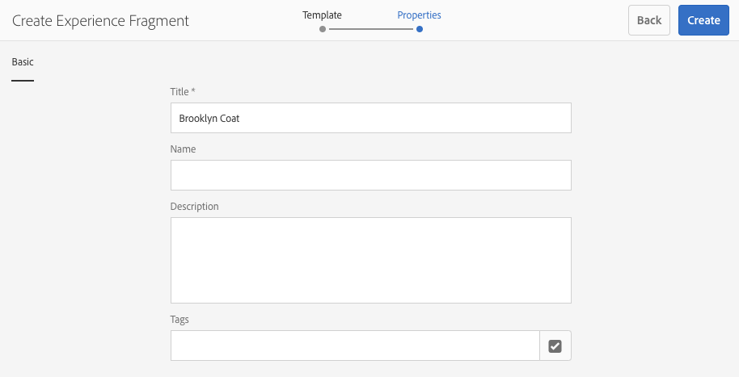

# 體驗片段{#experience-fragments}

>[!CAUTION]
>
>AEM 6.4已結束延伸支援，本檔案不再更新。 如需詳細資訊，請參閱 [技術支援期](https://helpx.adobe.com//tw/support/programs/eol-matrix.html). 尋找支援的版本 [此處](https://experienceleague.adobe.com/docs/).

體驗片段是一或多個元件的群組，包括可在頁面中參照的內容和版面。 它們可包含任何元件。

體驗片段：

* 是體驗（頁面）的一部分。
* 可用於多個頁面。
* 以範本為基礎（僅可編輯），以定義結構和元件。
* 由段落系統中的一個或多個元件（具有佈局）組成。
* 可包含其他體驗片段。
* 可與其他元件（包括其他體驗片段）結合，以形成完整的頁面（體驗）。
* 可能有不同的變數，可能會共用內容和/或元件。
* 可劃分為可跨片段的多個變數使用的建立區塊。

您可以使用體驗片段：

* 如果作者想要重複使用頁面的部分（體驗的片段），則需要複製並貼上該片段。 建立和維護這些複製/貼上體驗非常耗時，且容易發生使用者錯誤。 體驗片段不需要複製/貼上。
* 支援無頭式CMS使用案例。 作者只想使用AEM進行製作，而不想提供給客戶。 協力廠商系統/接觸點會使用該體驗，然後傳送給使用者。

>[!NOTE]
>
>體驗片段的寫入存取權要求使用者帳戶須在群組中註冊：
>
>`experience-fragments-editors`
>
>如果您遇到任何問題，請與系統管理員聯繫。

## 何時該使用體驗片段？ {#when-should-you-use-experience-fragments}

該使用體驗片段的情況：

* 每當您想要重複使用體驗時。

   * 將透過相同或類似內容重複使用的體驗

* 當您使用AEM作為協力廠商的內容傳遞平台時。

   * 任何想使用AEM作為內容傳遞平台的解決方案
   * 將內容嵌入第三方接觸點

* 如果您的體驗有不同的變體或轉譯。

   * 管道或內容特定變數
   * 對群組有意義的體驗（例如跨管道具有不同體驗的促銷活動）

* 使用全通路商務時。

   * 大規模分享社交媒體頻道上與商務相關的內容
   * 將接觸點設為交易式

## 組織您的體驗片段 {#organizing-your-experience-fragments}

建議您：
* 使用資料夾來組織您的體驗片段，

* [在這些資料夾上配置允許的模板](#configure-allowed-templates-folder).

建立資料夾可讓您：

* 為您的體驗片段建立有意義的結構；例如，根據分類

   >[!NOTE]
   >
   >不需要將體驗片段的結構與網站的頁面結構對齊。

* [在資料夾層級分配允許的範本](#configure-allowed-templates-folder)

   >[!NOTE]
   >
   >您可以使用 [範本編輯器](/help/sites-authoring/templates.md) 來建立自己的範本。

下列範例顯示根據 `Contributors`. 使用的結構也說明如何使用其他功能，例如多網站管理（包括語言副本）。

>[!CAUTION]
>
>以下螢幕截圖是使用Adobe Experience Manager as a Cloud Service從WKND網站擷取的。

## 建立和設定體驗片段的資料夾 {#creating-and-configuring-a-folder-for-your-experience-fragments}

若要建立和設定體驗片段的資料夾，建議您：

1. [建立資料夾](/help/sites-authoring/managing-pages.md#creating-a-new-folder).

1. [設定該資料夾允許的體驗片段範本](#configure-allowed-templates-folder).

>[!NOTE]
>
>您也可以設定 [允許的執行個體範本](#configure-allowed-templates-instance)，但此方法 **not** 建議使用，因為升級時可能會覆寫值。

### 為資料夾配置允許的模板 {#configure-allowed-templates-folder}

>[!NOTE]
>
>這是指定 **[!UICONTROL 允許的範本]**，因為升級時不會覆寫值。

1. 導覽至所需 **[!UICONTROL 體驗片段]** 檔案夾。

1. 選取資料夾，然後 **[!UICONTROL 屬性]**.

1. 指定用於擷取 **[!UICONTROL 允許的範本]** 欄位。

   例如：
   `/conf/(.*)/settings/wcm/templates/experience-fragment(.*)?`

   

1. 選擇 **[!UICONTROL 儲存並關閉]**.

### 為執行個體設定允許的範本 {#configure-allowed-templates-instance}

>[!CAUTION]
>
>不建議變更 **[!UICONTROL 允許的範本]** 此方法會覆寫指定的範本，因為升級時可能會覆寫指定的範本。
>
>請使用此對話框僅供參考。

1. 導覽至所需 **[!UICONTROL 體驗片段]** 控制台。

1. 選擇 **[!UICONTROL 配置選項]**:

   

1. 在 **[!UICONTROL 設定體驗片段]** 對話框：

   

1. 選取&#x200B;**[!UICONTROL 儲存]**。

## 建立體驗片段 {#creating-an-experience-fragment}

若要建立體驗片段：

1. 選擇 **[!UICONTROL 體驗片段]** 中。

   

1. 導覽至所需資料夾，然後選取 **[!UICONTROL 建立]**.

1. 選擇 **[!UICONTROL 體驗片段]** 開啟 **[!UICONTROL 建立體驗片段]** 嚮導。

   依次選擇所需 **[!UICONTROL 的範本]**、下 **[!UICONTROL 一步]**:

   

1. 輸入 **[!UICONTROL 體驗]**&#x200B;片段的屬性。

   A **[!UICONTROL 標題]** 為必填。 若 **[!UICONTROL 名稱]** 保留為空白，則會從中衍生 **[!UICONTROL 標題]**.

   

1. 按一下&#x200B;**[!UICONTROL 建立]**。

   將顯示一條消息。 選取:

   * **[!UICONTROL 完成]** 返回控制台
   * **[!UICONTROL 開啟]** 開啟片段編輯器

## 編輯體驗片段 {#editing-your-experience-fragment}

體驗片段編輯器提供與一般頁面編輯器類似的功能。 請參閱 [編輯頁面內容](/help/sites-authoring/editing-content.md) 以取得如何使用它的詳細資訊。

以下范常式式說明如何為產品建立預告：

1. 拖放 **[!UICONTROL 類別預告]** 從 [元件瀏覽器](/help/sites-authoring/author-environment-tools.md#components-browser).

   

1. 選擇 **[[!UICONTROL 設定]](/help/sites-authoring/editing-content.md#edit-configure-copy-cut-delete-paste)** （從元件工具欄）。
1. 新增資 **[!UICONTROL 產]** ，並視需要 **[!UICONTROL 定義屬性]** 。
1. 使用確認定義 **[!UICONTROL 完成]** （勾選圖示）。
1. 視需要新增更多元件。

## 建立體驗片段變異 {#creating-an-experience-fragment-variation}

您可以根據您的需求建立體驗片段的變體：

1. 開啟您的片段 [編輯](/help/sites-authoring/experience-fragments.md#editing-your-experience-fragment).
1. 開啟 **[!UICONTROL 變異]** 標籤。

   

1. **建立** 可讓您建立：

   * **[!UICONTROL 變異]**
   * **[!UICONTROL 變數為 live-copy]**.

1. 定義所需的屬性：

   * **[!UICONTROL 範本]**
   * **[!UICONTROL 標題]**
   * **[!UICONTROL 名稱]**;若保留為空白，則從標題衍生
   * **[!UICONTROL 說明]**
   * **[!UICONTROL 變數標記]**

   

1. 確認為 **[!UICONTROL 完成]** （勾選圖示），新變數會顯示在面板中：

   

## 使用您的體驗片段 {#using-your-experience-fragment}

編寫頁面時，您現在可以使用體驗片段：

1. 開啟任何頁面進行編輯。

   例如： [http://localhost:4502/editor.html/content/we-retail/language-masters/en/products/men.html](http://localhost:4502/editor.html/content/we-retail/language-masters/en/products/men.html)

1. 從「元件」瀏覽器拖曳元件至頁面段落系統，建立體驗片段元件的例項：

   

1. 將實際的體驗片段新增至元件例項；其中之一：

   * 從「資產瀏覽器」拖曳所需片段，並拖放至元件
   * 選擇 **[!UICONTROL 設定]** 從元件工具列中，並指定要使用的片段，請使用確認 **完成** （滴答）

   

   >[!NOTE]
   >
   >在元件工具列中，編輯作為在片段編輯器中開啟片段的捷徑。

## 建置區塊 {#building-blocks}

您可以選取一或多個元件，以建立要在片段內回收的建置區塊：

### 建立建置區塊 {#creating-a-building-block}

要建立新的構建塊：

1. 在體驗片段編輯器中，選取您要重新使用的元件：

   

1. 從元件工具欄中，選擇 **[!UICONTROL 轉換為建置區塊]**:

   

   例如：

   

1. 輸入建置塊的名 **[!UICONTROL 稱]**，並使用 **[!UICONTROL Convert確認]**:

   

1. 建 **立區塊** (Building Block)將顯示在頁籤中，並可在段落系統中選擇：

   

### 管理建置區塊 {#managing-a-building-block}

您的建置區塊會顯示在 **[!UICONTROL 建置區塊]** 標籤。 對於每個區塊，可使用下列動作：

* 前往主版:在新標籤中開啟主變數
* 重新命名
* 刪除

### 使用建置區塊 {#using-a-building-block}

您可以將建置區塊拖曳至任何片段的段落系統，如同任何元件。

## 純HTML轉譯 {#the-plain-html-rendition}

使用 `.plain.` 選取器，您可以存取純HTML轉譯。

這可從瀏覽器取得，但其主要用途是允許其他應用程式（例如協力廠商網頁應用程式、自訂行動實作）僅使用URL直接存取體驗片段的內容。

純HTML格式副本會將通訊協定、主機和內容路徑新增至以下路徑：

* 類型： `src`, `href`，或 `action`

* 或結尾為： `-src`，或 `-href`

例如：

`.../brooklyn-coat/master.plain.html`

>[!NOTE]
>
>連結一律會參考發佈例項。 協力廠商會使用這些連結，因此系統一律會從發佈例項呼叫連結，而非作者。

## 匯出體驗片段 {#exporting-experience-fragments}

依預設，體驗片段會以HTML格式傳送。 AEM和協力廠商管道皆可使用。

若要匯出至Adobe Target，請使用HTML。 請參閱 [Target與體驗片段整合](/help/sites-administering/experience-fragments-target.md) 以取得完整資訊。
