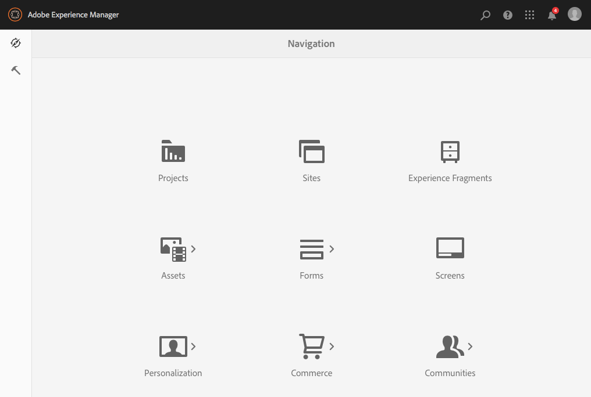

# 體驗片段{#experience-fragments}

「體驗片段」是一組或多個元件，包括可在頁面中參考的內容和版面。 它們可包含任何元件。

體驗片段：

* 是體驗（頁面）的一部分。
* 可跨多頁使用。
* 以範本（僅可編輯）為基礎，以定義結構和元件。
* 由段落系統中具有版面的一個或多個元件組成。
* 可以包含其他體驗片段。
* 可與其他元件（包括其他體驗片段）結合，以形成完整頁面（體驗）。
* 可以有不同的變化，這些變化可能會共用內容和／或元件。
* 可以細分為建置區塊，以便用於多種片段變化。

您可以使用體驗片段：

* 如果作者想要重複使用頁面的部分（體驗的片段），則必須複製並貼上該片段。 建立和維護這些複製／貼上體驗不但耗時，而且容易發生使用者錯誤。 體驗片段可免除複製／貼上的需求。
* 支援無頭CMS使用案例。 作者只想使用AEM來製作內容，但不想將內容傳送給客戶。 協力廠商系統／觸點會使用該體驗，然後傳送給使用者。

>[!NOTE]
>
>體驗片段的寫入存取權要求使用者帳戶必須註冊在群組中：
>
>`experience-fragments-editors`
>
>如果您遇到任何問題，請聯絡您的系統管理員。

## 何時應使用體驗片段？{#when-should-you-use-experience-fragments}

應使用體驗片段：

* 無論何時您想要重複使用體驗。

   * 可重複使用相同或類似內容的體驗

* 當您將AEM當做協力廠商的內容傳送平台時。

   * 任何想要使用AEM做為內容傳送平台的解決方案
   * 將內容內嵌至協力廠商觸點

* 如果您有「體驗」，但有不同的變化或轉譯。

   * 頻道或內容特定變化
   * 對群組有意義的體驗（例如跨通道具有不同體驗的促銷活動）

* 當您使用全通道商務時。

   * 在社交媒體頻道上大規模分享商務相關內容
   * 讓觸點成為交易性

## 組織您的體驗片段{#organizing-your-experience-fragments}

建議您：
* 使用資料夾來組織您的體驗片段，

* [在這些資料夾上設定允許的範本](#configure-allowed-templates-folder)。

建立資料夾允許您：

* 為您的體驗片段建立有意義的結構；例如，根據分類

   >[!NOTE]
   >
   >您不需要將體驗片段的結構與網站的頁面結構對齊。

* [在資料夾級別分配允許的模板](#configure-allowed-templates-folder)

   >[!NOTE]
   >
   >您可以使用[範本編輯器](/help/sites-authoring/templates.md)來建立您自己的範本。

下列範例顯示根據`Contributors`結構化的體驗片段。 使用的結構也說明如何使用其他功能，例如多網站管理（包括語言副本）。

>[!CAUTION]
>
>以下螢幕擷取是從WKND網站使用Adobe Experience Manager做為雲端服務擷取的。

## 為體驗片段建立和設定資料夾{#creating-and-configuring-a-folder-for-your-experience-fragments}

若要建立並設定您的體驗片段資料夾，建議您：

1. [建立資料夾](/help/sites-authoring/managing-pages.md#creating-a-new-folder)。

1. [設定該資料夾允許的體驗片段範本](#configure-allowed-templates-folder)。

>[!NOTE]
>
>您也可以為實例](#configure-allowed-templates-instance)配置[允許的模板，但建議使用&#x200B;**not**&#x200B;方法，因為升級時可能會覆寫值。

### 配置資料夾{#configure-allowed-templates-folder}的允許模板

>[!NOTE]
>
>這是指定&#x200B;**[!UICONTROL 允許範本]**&#x200B;的建議方法，因為升級時不會覆寫值。

1. 導覽至所需的&#x200B;**[!UICONTROL 體驗片段]**&#x200B;資料夾。

1. 選擇資料夾，然後選擇&#x200B;**[!UICONTROL 屬性]**。

1. 在&#x200B;**[!UICONTROL 允許的範本]**&#x200B;欄位中，指定擷取所需範本的規則運算式。

   例如：
   `/conf/(.*)/settings/wcm/templates/experience-fragment(.*)?`

   

1. 選擇&#x200B;**[!UICONTROL 保存並關閉]**。

### 配置實例{#configure-allowed-templates-instance}的允許模板

>[!CAUTION]
>
>不建議使用此方法更改&#x200B;**[!UICONTROL 允許的模板]**，因為在升級時可能會覆蓋指定的模板。
>
>請僅供參考之用。

1. 導覽至所需的&#x200B;**[!UICONTROL 體驗片段]**&#x200B;主控台。

1. 選擇&#x200B;**[!UICONTROL 配置選項]**:

   

1. 在&#x200B;**[!UICONTROL 設定體驗片段]**&#x200B;對話方塊中指定所需範本：

   

1. 選擇&#x200B;**[!UICONTROL 保存]**。

## 建立體驗片段{#creating-an-experience-fragment}

若要建立體驗片段：

1. 從「全域導覽」中選擇「體驗片段」。****

   

1. 導航到所需資料夾並選擇&#x200B;**[!UICONTROL 建立]**。

1. 選擇&#x200B;**[!UICONTROL 體驗片段]**&#x200B;以開啟&#x200B;**[!UICONTROL 建立體驗片段]**&#x200B;精靈。

   依次選擇所需 **[!UICONTROL 的範本]**、下 **[!UICONTROL 一步]**:

   

1. 輸入 **[!UICONTROL 體驗]**&#x200B;片段的屬性。

   **[!UICONTROL Title]**&#x200B;是必填的。 如果&#x200B;**[!UICONTROL Name]**&#x200B;保留為空白，則它將從&#x200B;**[!UICONTROL Title]**&#x200B;派生。

   

1. 按一下&#x200B;**[!UICONTROL 建立]**。

   將顯示一條消息。 選取:

   * **** Doneto返回控制台
   * **[!UICONTROL 打]** 開片段編輯器

## 編輯體驗片段{#editing-your-experience-fragment}

體驗片段編輯器提供與一般頁面編輯器類似的功能。 如需如何使用頁面內容的詳細資訊，請參閱[編輯頁面內容](/help/sites-authoring/editing-content.md)。

以下示例過程說明如何為產品建立摘要：

1. 從[元件瀏覽器](/help/sites-authoring/author-environment-tools.md#components-browser)拖放&#x200B;**[!UICONTROL 類別摘要]**。

   

1. 從元件工具欄中選擇&#x200B;**[[!UICONTROL Configure]](/help/sites-authoring/editing-content.md#edit-configure-copy-cut-delete-paste)**。
1. 新增資 **[!UICONTROL 產]** ，並視需要 **[!UICONTROL 定義屬性]** 。
1. 使用&#x200B;**[!UICONTROL Done]**（勾選圖示）確認定義。
1. 視需要新增更多元件。

## 建立體驗片段變數{#creating-an-experience-fragment-variation}

您可以根據您的需求，建立不同的體驗片段：

1. 開啟[編輯](/help/sites-authoring/experience-fragments.md#editing-your-experience-fragment)的片段。
1. 開啟&#x200B;**[!UICONTROL Valuations]**&#x200B;標籤。

   

1. **Create** 可讓您建立：

   * **[!UICONTROL 變異]**
   * **[!UICONTROL 變數為 live-copy]**.

1. 定義所需屬性：

   * **[!UICONTROL 範本]**
   * **[!UICONTROL 標題]**
   * **[!UICONTROL 名稱]**;如果保留空白，則會從「標題」衍生
   * **[!UICONTROL 說明]**
   * **[!UICONTROL 變數標記]**

   

1. 使用&#x200B;**[!UICONTROL Done]**（勾選圖示）確認，新變數將會顯示在面板中：

   

## 使用體驗片段{#using-your-experience-fragment}

您現在可以在編寫頁面時使用體驗片段：

1. 開啟任何頁面進行編輯。

   例如：[http://localhost:4502/editor.html/content/we-retail/language-masters/en/products/men.html](http://localhost:4502/editor.html/content/we-retail/language-masters/en/products/men.html)

1. 將元件從「元件」瀏覽器拖曳至頁面段落系統，以建立「體驗片段」元件的例項：

   

1. 將實際的體驗片段新增至元件例項；其中：

   * 從「資產瀏覽器」拖曳必要片段至元件
   * 從元件工具欄中選擇&#x200B;**[!UICONTROL 配置]**&#x200B;並指定要使用的片段，使用&#x200B;**Done**（勾選）確認

   

   >[!NOTE]
   >
   >在元件工具列中，編輯會以捷徑方式在片段編輯器中開啟片段。

## 建置區塊 {#building-blocks}

您可以選取一或多個元件，以建立要在片段內回收的建置區塊：

### 建立構建塊{#creating-a-building-block}

要建立新的構建塊：

1. 在「體驗片段」編輯器中，選取您要重複使用的元件：

   

1. 從元件工具欄中，選擇&#x200B;**[!UICONTROL 轉換到構建塊]**:

   

   例如：

   

1. 輸入建置塊的名 **[!UICONTROL 稱]**，並使用 **[!UICONTROL Convert確認]**:

   

1. 建 **立區塊** (Building Block)將顯示在頁籤中，並可在段落系統中選擇：

   

### 管理構建塊{#managing-a-building-block}

您的構建塊在&#x200B;**[!UICONTROL 構建塊]**&#x200B;頁籤中可見。 對於每個塊，可以執行以下操作：

* 前往主版:在新標籤中開啟主變數
* 重新命名
* 刪除

### 使用構建塊{#using-a-building-block}

您可以將構建塊拖動到任何片段的段落系統，如同任何元件。

## 純HTML轉譯{#the-plain-html-rendition}

使用URL中的`.plain.`選擇器，您可以存取純HTML轉譯。

這可從瀏覽器取得，但其主要用途是允許其他應用程式（例如協力廠商網頁應用程式、自訂行動裝置實作）僅使用URL直接存取體驗片段的內容。

純HTML轉譯會將通訊協定、主機和內容路徑新增至下列路徑：

* 類型：`src`、`href`或`action`

* 或結尾為：`-src`或`-href`

例如：

`.../brooklyn-coat/master.plain.html`

>[!NOTE]
>
>連結一律會參照發佈例項。 這些連結會由協力廠商使用，因此一律會從發佈例項呼叫連結，而非作者。

## 匯出體驗片段{#exporting-experience-fragments}

依預設，體驗片段會以HTML格式傳送。 AEM和協力廠商管道都可使用此功能。

若要匯出至Adobe Target，請使用HTML。 如需完整資訊，請參閱[與體驗片段整合的目標](/help/sites-administering/experience-fragments-target.md)。

