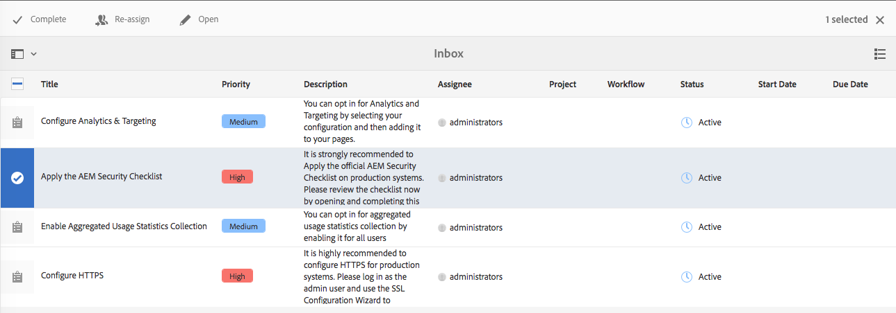

# 您的收件匣{#your-inbox}

>[!CAUTION]
>
>AEM 6.4已結束延伸支援，本檔案不再更新。 如需詳細資訊，請參閱 [技術支援期](https://helpx.adobe.com//tw/support/programs/eol-matrix.html). 尋找支援的版本 [此處](https://experienceleague.adobe.com/docs/).

您可以從AEM的各個區域收到通知，包括工作流程和專案；例如，關於：

* 任務:

   * 這些也可以在AEM UI內的各個時間點建立，例如在 **專案**,
   * 這些可以是工作流程的產品 **建立任務** 或 **建立項目任務** 步驟。

* 工作流程:

   * 代表您需要對頁面內容執行之動作的工作項目；

      * 這些是工作流程的產品 **參與者** 步驟
   * 失敗項目，以允許管理員重試失敗的步驟。

您會在自己的收件匣中收到這些通知，您可在此檢視並採取行動。

>[!NOTE]
>
>現成可用的AEM會預先載入指派給管理員使用者群組的管理工作。 請參閱 [現成可用的管理任務](#out-of-the-box-administrative-tasks) 以取得詳細資訊。

>[!NOTE]
>
>有關項目類型的詳細資訊，另請參閱：
>
>* [專案](/help/sites-authoring/touch-ui-managing-projects.md)
>* [項目 — 使用任務](/help/sites-authoring/task-content.md)
>* [工作流程](/help/sites-authoring/workflows.md)
>* [Forms](/help/forms/home.md)
>

## 標題中的收件匣 {#inbox-in-the-header}

從任何主控台中，收件匣中目前的項目數會顯示在標題中。 也可以開啟指示器以提供對需要操作的頁面的快速訪問，或訪問收件箱：

>[!NOTE]
>
>某些動作也會顯示在 [適當資源的卡片檢視](/help/sites-authoring/basic-handling.md#card-view).

## 現成可用的管理任務  {#out-of-the-box-administrative-tasks}

現成可用的AEM會預先載入指派給管理員使用者群組的四個工作。

* [設定分析和定位](/help/sites-administering/opt-in.md)
* [套用 AEM 安全檢查清單](/help/sites-administering/security-checklist.md)
* 啟用彙總使用狀況統計資料的收集
* [設定 HTTPS](/help/sites-administering/ssl-by-default.md)

## 開啟收件匣 {#opening-the-inbox}

若要開啟AEM通知收件匣：

1. 按一下/點選工具列中的指示器。

1. 選擇「 **全部查看**」。「 **AEM收件匣** 」將會開啟。收件匣會顯示工作流程、專案和工作中的項目。
1. 預設視圖是「列 [表視圖](#inbox-list-view)」，但您也可以切換到「日 [歷視圖」](#inbox-calendar-view)。這是使用檢視選取器 (工具列，右上方) 完成。

   對於這兩個檢視，您也可以定義 [檢視設定](#inbox-view-settings);可用的選項取決於當前視圖。

   

>[!NOTE]
>
>收件箱作為控制台運行，因此，在您完成 [後，使用全局導航](/help/sites-authoring/basic-handling.md#global-navigation) 或搜索導航到其他位置。

### 收件箱 — 清單視圖 {#inbox-list-view}

此檢視會列出所有項目，以及主要相關資訊：

### 收件箱 — 日曆視圖 {#inbox-calendar-view}

此視圖會根據項目在日曆中的位置和您選擇的精確視圖顯示項目：

您可以：

* 選擇特定視圖； **時間表**, **欄**, **清單**

* 指定要根據 **排程**; **全部**, **已規劃**, **進行中**, **即將到期**, **過期**

* 深入查看有關物料的詳細資訊
* 選取要聚焦檢視的日期範圍：

### 收件匣 — 檢視設定 {#inbox-view-settings}

對於兩個檢視（清單和日曆），您可以定義設定：

* **日曆檢視**

   針對 **日曆檢視** 您可以設定：

   * **分組依據**
   * **排程** 或無 ****
   * **卡片大小**

   

* **清單檢視**

   針對 **清單檢視** 您可以配置排序機制：

   * **排序**
   * **排序順序**

   

## 對項目採取操作 {#taking-action-on-an-item}

1. 要對項目執行操作，請為相應項目選擇縮圖。 適用於該項目的動作圖示會顯示在工具列中：

   

   這些動作適合項目，包括：

   * **完成** 行動；例如，任務或工作流項。
   * **重新指派**/**委派** 項目。
   * **開啟** 物品；根據項目類型，此動作可以：

      * 顯示項目屬性
      * 開啟適當的控制面板或精靈以執行進一步動作
      * 開啟相關檔案
   * **後退** 改為上一步。
   * 檢視工作流程的裝載。
   * 從項目建立專案。

   >[!NOTE]
   >
   >如需進一步詳細資訊，請參閱：
   >
   >* 工作流程項目 —  [參與工作流程](/help/sites-authoring/workflows-participating.md)

1. 根據所選項目，將啟動操作；例如：

   * 將開啟與動作相適合的對話方塊。
   * 將啟動操作嚮導。
   * 檔案頁面將會開啟。

   例如， **重新指派** 將開啟對話方塊：

   

   根據是否開啟了對話框、嚮導和文檔頁，您可以：

   * 確認適當的動作；例如重新指派。
   * 取消動作。
   * 後箭；例如，如果操作嚮導或文檔頁面已開啟，則可以返回「收件箱」。

## 建立任務 {#creating-a-task}

從收件箱中，您可以建立任務：

1. 選擇 **建立**，然後 **任務**.
1. 填妥 **基本** 和 **進階** 標籤；只有 **標題** 為必填項目，其他所有項目則為選用項目：

   * **基本**:

      * **標題**
      * **專案**
      * **被指派者**
      * **內容**;與裝載類似，這是從任務到儲存庫中某個位置的參考
      * **說明**
      * **任務優先順序**
      * **開始日期**
      * **到期日期**

   

   * **進階**

      * **名稱**:這將用來形成URL;若空白，則會以 **標題**.

   

1. 選擇 **提交**.

## 建立專案 {#creating-a-project}

對於某些任務，您可以建立 [專案](/help/sites-authoring/projects.md) 基於該任務：

1. 點選/按一下縮圖，以選取適當的任務。

   >[!NOTE]
   >
   >僅使用 **建立** 選項 **收件匣** 可用來建立專案。
   >
   >無法使用工作項目（來自工作流程）來建立專案。

1. 從工 **具列選擇** 「建立專案」以開啟精靈。
1. 選取適當的範本，然後 **下一個**.
1. 指定所需的屬性：

   * **基本**

      * **標題**
      * **說明**
      * **開始日期**
      * **到期日期**
      * **使用者** 和角色
   * **進階**

      * **名稱**
   >[!NOTE]
   >
   >請參閱 [建立專案](/help/sites-authoring/touch-ui-managing-projects.md#creating-a-project) 以取得完整資訊。

1. 選擇 **建立** 以確認動作。

## 篩選AEM收件匣中的項目 {#filtering-items-in-the-aem-inbox}

您可以篩選列出的項目：

1. 開啟 **AEM收件匣**.

1. 開啟篩選選擇器：

   

1. 您可以根據一系列條件來篩選列出的項目，其中許多條件可以細化；例如：

   

   >[!NOTE]
   >
   >使用 [檢視設定](#inbox-view-settings) 您也可以在使用 [清單檢視](#inbox-list-view).
