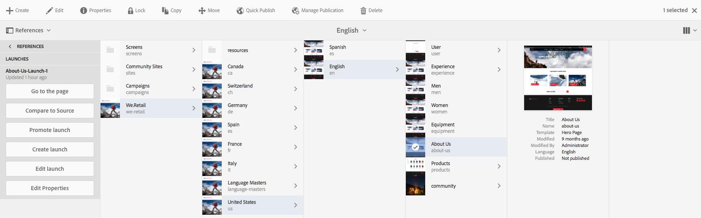
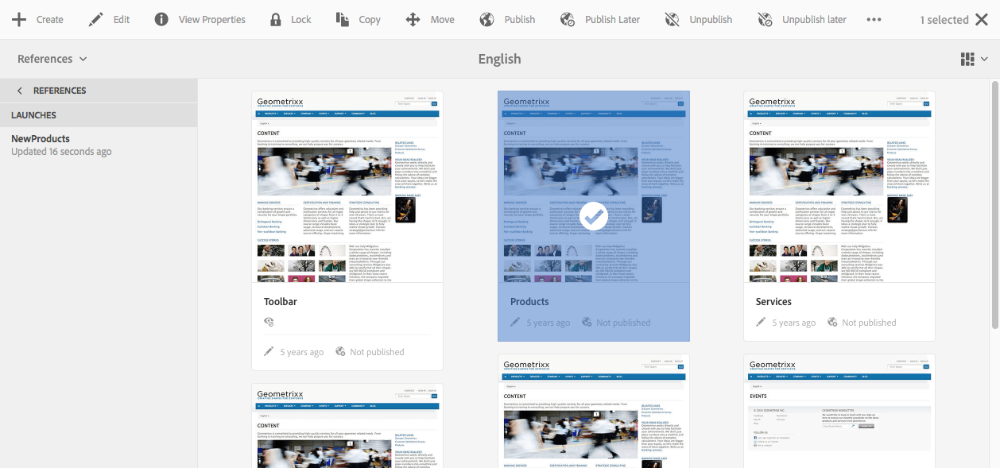

# 編輯 Launch{#editing-launches}

>[!CAUTION]
>
>AEM 6.4已結束延伸支援，本檔案不再更新。 如需詳細資訊，請參閱 [技術支援期](https://helpx.adobe.com//tw/support/programs/eol-matrix.html). 尋找支援的版本 [此處](https://experienceleague.adobe.com/docs/).

## 編輯啟動頁面 {#editing-launch-pages}

為頁面（或一組頁面）建立啟動後，您可以編輯頁面啟動復本中的內容。

1. 存取 [從參考啟動（Sites主控台）](/help/sites-authoring/launches.md#launches-in-references-sites-console) 以顯示可用動作。
1. 選擇 **前往頁面** 以開啟頁面進行編輯。

### 編輯受即時副本約束的啟動頁面 {#editing-launch-pages-subject-to-a-live-copy}

如果您的啟動是以 [即時副本](/help/sites-administering/msm.md) 然後您會：

* 編輯元件（內容和/或屬性）時，請參閱鎖定符號（小型掛鎖）。
* 請參閱 **Live Copy** 標籤 **頁面屬性**

livecopy可用來將來源 *分支的內容*** 同步到啟動分支 (以便讓啟動與來源中所做的變更保持最新)。

您可以使用編輯標準即時副本的相同方式進行變更；例如：

* 按一下關閉的掛鎖將中斷此同步，並允許您對啟動中的內容進行新更新。 解除鎖定（開啟掛鎖）後，源分支內相同位置所做的任何更改將不會覆蓋您的更改。
* **暫停** (和 **繼續**)特定頁面的繼承。

請參閱 [變更即時副本內容](/help/sites-administering/msm-livecopy.md#changing-live-copy-content) 以取得更多資訊。

## 比較Launch頁面與其來源頁面 {#comparing-a-launch-page-to-its-source-page}

若要追蹤您所做的變更，您可以在「參考」中檢視啟動 **** ，並比較啟動頁面與其來源頁面：

1. 在 **網站** 主控台， [導覽至啟動的來源頁面，並加以選取](/help/sites-authoring/basic-handling.md#viewing-and-selecting-resources).
1. 開啟 **[參考](/help/sites-authoring/basic-handling.md#references)** 面板和選取 **啟動**.
1. 然後選取您的特定啟動 **與來源比較**:

   

1. 兩個頁面（啟動和來源）將並排開啟。

   如需使用此功能的完整資訊，請參閱 [頁面差異](/help/sites-authoring/page-diff.md).

## 變更使用的來源頁面 {#changing-the-source-pages-used}

您隨時可以在啟動的來源頁面範圍中新增或移除頁面：

1. 存取啟動，並從以下任一項選取：

   * the [啟動主控台](/help/sites-authoring/launches.md#the-launches-console):

      * 選取&#x200B;**編輯**。
   * [參考（網站控制台）](/help/sites-authoring/launches.md#launches-in-references-sites-console) 顯示可用操作：

      * 選擇 **編輯啟動**.

   將顯示源頁面。

1. 進行必要的變更，然後使用「儲存」 **確認**。

   >[!NOTE]
   >
   >若要將頁面新增至啟動，這些頁面必須位於通用語言根目錄下；即在單一網站內。

## 編輯Launch設定 {#editing-a-launch-configuration}

您可以隨時編輯啟動的屬性：

1. 存取啟動，並從以下任一項選取：

   * the [啟動主控台](/help/sites-authoring/launches.md#the-launches-console):

      * 選擇 **屬性**.
   * [參考（網站控制台）](/help/sites-authoring/launches.md#launches-in-references-sites-console) 顯示可用操作：

      * 選擇 **編輯屬性**.

   詳情將顯示。

1. 進行必要的變更，然後使用「儲存」 **確認**。

   如需 [「啟動日期」和「生產就緒」欄位的用途和互動相關資訊，請參閱「啟動——事件順序」](/help/sites-authoring/launches.md#launches-the-order-of-events) (Launches - Order of Events ******** )。

## 探索頁面的啟動狀態 {#discovering-the-launch-status-of-a-page}

從「參考」索引標籤選取特定啟動時，會顯示狀態(請參閱 [參考中的啟動（網站主控台）](/help/sites-authoring/launches.md#launches-in-references-sites-console))。

