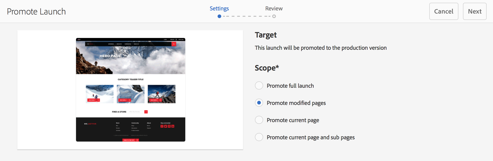

# 提升啟動{#promoting-launches}

發佈前，您需要促銷啟動頁面，將內容移回來源（生產）。 升級啟動頁面時，來源頁面的對應頁面會以升級頁面的內容取代。 升級啟動頁面時可使用下列選項：

* 是僅促銷目前頁面還是整個啟動。
* 是否提升目前頁面的子頁面。
* 是要促銷完整啟動，還是只促銷已變更的頁面。

>[!NOTE]
>
>將啟動頁面提升至目標(**Production**)後，您可以將&#x200B;**Production**&#x200B;頁面以實體形式啟動（以加快處理速度）。 將頁面新增至工作流程套件，並將它當成啟動頁面套件之工作流程的裝載。 您必須先建立工作流程套件，才能升級啟動。 請參閱[使用AEM Workflow](#processing-promoted-pages-using-aem-workflow)處理提升的頁面。

>[!CAUTION]
>
>單一啟動無法同時提升。 這表示同一次啟動時，兩個提升動作可能會導致錯誤- `Launch could not be promoted`（以及記錄檔中的衝突錯誤）。

>[!CAUTION]
>
>在促銷&#x200B;*modified*&#x200B;頁面的啟動時，會考慮來源和啟動分支中的修改。

## 升級啟動頁面{#promoting-launch-pages}

>[!NOTE]
>
>這包括在只有一個啟動層級時，促銷啟動頁面的手動動作。 請參閱：
>
>* [在結構中](#promoting-a-nested-launch) 有多個啟動時，提升巢狀啟動。
>* [啟動——事件順序，以取](/help/sites-authoring/launches.md#launches-the-order-of-events) 得有關自動促銷和發佈的詳細資訊。

>

您可以從&#x200B;**Sites**&#x200B;主控台或&#x200B;**Launches**&#x200B;主控台升級啟動：

1. 開啟:

   * **Sites**&#x200B;控制台：

      1. 開啟[參考邊欄](/help/sites-authoring/author-environment-tools.md#references)，然後使用[選擇模式](/help/sites-authoring/basic-handling.md)選取所需的來源頁面（或選取並開啟參考邊欄，順序不重要）。 將顯示所有引用。

      1. 選擇&#x200B;**啟動**(例如啟動(1))以顯示特定啟動的清單。
      1. 選取特定的啟動以顯示可用的動作。
      1. 選擇&#x200B;**Promote launch**&#x200B;以開啟嚮導。
   * **啟動**&#x200B;控制台：

      1. 選取您的啟動（點選／按一下縮圖）。
      1. 選擇&#x200B;**Promote**。

1. 在第一個步驟中，您可以指定：

   * **提升完整啟動項**
   * **提升已修改頁面**
   * **升級目前頁面**
   * **升級目前頁面與子頁面**

   例如，當選擇僅提升修改的頁時：

   

   >[!NOTE]
   >
   >這涵蓋單次啟動，如果您已巢狀啟動，請參閱[提升巢狀啟動](#promoting-a-nested-launch)。

1. 選擇&#x200B;**Next**&#x200B;繼續。
1. 您可以檢閱要升級的頁面，這些會視您選擇的頁面範圍而定：

   

1. 選擇&#x200B;**Promote**。

## 在編輯{#promoting-launch-pages-when-editing}時提升啟動頁面

當您編輯啟動頁面時，**Promote Launch**&#x200B;動作也可從&#x200B;**Page Information**&#x200B;取得。 這將開啟嚮導以收集所需資訊。

>[!NOTE]
>
>這適用於單一和[巢狀啟動](#promoting-a-nested-launch)。

## 提升巢狀啟動{#promoting-a-nested-launch}

建立巢狀啟動後，您可將它升級回任何來源，包括根來源（生產）。

1. 與[建立巢狀啟動](/help/sites-authoring/launches-creating.md#creating-a-nested-launch)一樣，請導覽至&#x200B;**啟動**&#x200B;主控台或&#x200B;**參考**&#x200B;導軌並選取所需啟動。
1. 選擇&#x200B;**Promote launch**&#x200B;以開啟嚮導。

1. 輸入所需的詳細資訊：

   * **提升目標**

      您可促銷至任何來源。

   * **范**
圍您可在此處選擇是升級整個啟動，還是僅升級實際已編輯的頁面。如果是後者，則可以選擇包含／排除子頁面。 預設配置是僅提升當前頁面的頁面更改：

      * **提升完整啟動項**
      * **提升已修改頁面**
      * **升級目前頁面**
      * **升級目前頁面與子頁面**

   

1. 選擇&#x200B;**Next**。
1. 在選擇&#x200B;**Promote**&#x200B;之前，請查看升級詳細資訊：

   

   >[!NOTE]
   >
   >列出的頁面將取決於&#x200B;**Scope**&#x200B;定義的頁面，可能取決於實際已編輯的頁面。

1. 您的變更將會在&#x200B;**Launches**&#x200B;主控台中提升並反映：

   

## 使用AEM工作流程處理提升頁面 {#processing-promoted-pages-using-aem-workflow}

使用工作流程模型，對提升的啟動頁面執行大量處理：

1. 建立工作流程套件。
1. 當作者促銷「啟動」頁面時，會將其儲存在工作流程套件中。
1. 使用套件作為裝載，啟動工作流程模型。

要在升級頁時自動啟動工作流，請[為包節點配置工作流啟動程式](/help/sites-administering/workflows-starting.md#workflows-launchers)。

例如，當作者促銷「啟動」頁面時，您可以自動產生頁面啟動請求。 設定工作流程啟動程式，以在修改封裝節點時啟動「請求啟動」工作流程。

