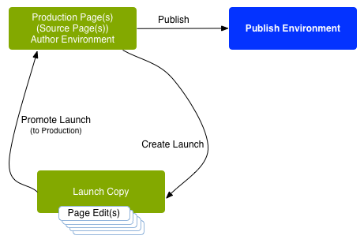

# Launch 概觀{#launches}

>[!CAUTION]
>
>AEM 6.4已結束延伸支援，本檔案不再更新。 如需詳細資訊，請參閱 [技術支援期](https://helpx.adobe.com//tw/support/programs/eol-matrix.html). 尋找支援的版本 [此處](https://experienceleague.adobe.com/docs/).

Launches 可讓您有效率地開發未來版本的內容。

建立 Launch 可讓您完成變更以供未來發佈 (同時維護目前的頁面)。在編輯和更新您的 Launch 頁面後，您將它們提升回來源，然後啟動來源頁面 (頂層)。提升功能會將 Launch 內容複製回來源頁面，可以手動或自動完成 (視建立和編輯 Launch 時設定的欄位)。

例如，您的線上商店的季節性產品頁面每季更新一次，以便特色產品符合目前季節。為準備下一季的更新，您可以建立一個相應網頁的 Launch。在整個季度中，以下變更會累積在 Launch 副本中：

* 因正常維護工作而產生的來源頁面變更。這些變更會自動複製到 Launch 頁面中。
* 直接在 Launch 頁面上執行的編輯，為下一季做準備。

下一季到來時，您提升 Launch 頁面，以便您可以發佈來源頁面 (包含更新的內容)。您可以提升所有頁面，也可僅提升您修改過的頁面。

Launches 也可以：

* 為多個根分支建立。雖然您可以為整個網站建立 Launch (並在其中進行變更)，但這可能是不切實際的，因為需要複製整個網站。當涉及數百甚至數千頁時，複製動作和之後提升工作所需的比較作業，會影響系統要求和效能。
* 巢狀 (Launch 中有 Launch) 可讓您在現有 Launch 中建立 Launch，如此作者可以利用已完成的變更，而不用對每個 Launch 重複進行相同的變更。

本節說明如何建立、編輯和促銷（如有需要，還有） [刪除](/help/sites-authoring/launches-creating.md#deleting-a-launch))從Sites Console中啟動頁面，或 [啟動主控台](#the-launches-console):

* [建立 Launch](/help/sites-authoring/launches-creating.md)
* [編輯 Launch](/help/sites-authoring/launches-editing.md)
* [提升 Launch](/help/sites-authoring/launches-promoting.md)

## Launch - 事件順序 {#launches-the-order-of-events}

Launches 可讓您有效率地為一或多個已啟動網頁的未來版本開發內容。

Launches 可讓您：

* 建立來源頁面的副本：

   * 副本是您的 Launch。
   * 頂層來源頁面稱為&#x200B;**生產**。

      * 來源頁面可以取自多個 (獨立的) 分支。
   >[!CAUTION]
   >
   >傳統UI中無法為啟動提供多個來源分支。

   

* 編輯 Launch 設定：

   * 在 Launch 中新增或移除頁面和/或分支。
   * 編輯 Launch 屬性；例如&#x200B;**標題**、**Launch 日期**、**生產就緒**&#x200B;標幟。

* 您可以手動或自動提升和發佈內容：

   * 手動：

      * 當準備好發佈時，將 Launch 內容推回 **Target** (來源頁面)。
      * 從來源頁面 (推回後) 發佈內容。
      * 提升所有頁面，或僅提升修改後的頁面。
   * 自動 - 這涉及以下項目：

      * **Launch** (**上線**) **日期**&#x200B;欄位：這可在建立或編輯 Launch 時設定。
      * **生產就緒**&#x200B;標幟：這只能在編輯 Launch 時設定。
      * 如果&#x200B;**生產就緒**&#x200B;標幟已設定，Launch 將於 **Launch** (**上線**) **日期**&#x200B;自動提升至生產頁面。提升後，生產頁面會自動發佈。

         如果未設定日期，則該標幟將無效。

* 並行更新來源頁面和 Launch 頁面：

   * 對來源頁面的變更會自動實作在 Launch 副本 (如果設定為繼承，即為 Live Copy)。
   * 可以在不中斷這些自動更新或來源頁面的情況下，對 Launch 副本進行變更。

   

* [建立巢狀 Launch](/help/sites-authoring/launches-creating.md#creating-a-nested-launch) - Launch 中的 Launch：

   * 來源是現有的 Launch。
   * 您可以[將巢狀 Launch](/help/sites-authoring/launches-promoting.md#promoting-a-nested-launch) 提升到任何目標，這可以是父 Launch 或頂層來源頁面 (生產)。

   

   >[!CAUTION]
   >
   >刪除 Launch 將移除 Launch 本身和所有子系巢狀 Launch。

>[!NOTE]
>
>建立和編輯 Launch 需要 `/content/launches` 的存取權 - 與預設群組 `content-authors` 相同。
>
>如果您遇到任何問題，請聯絡您的系統管理員。

### Launches 主控台 {#the-launches-console}

Launches 主控台可提供您 Launch 的概觀，並允許您對列出的 Launch 執行動作。主控台可透過以下方式存取：

* **工具**&#x200B;主控台：**工具**、**Sites**、**Launches**。

* 或直接搭配 [http://localhost:4502/libs/launches/content/launches.html](http://localhost:4502/libs/launches/content/launches.html)

## Launches 在參考內 (Sites 主控台) {#launches-in-references-sites-console}

1. 在 **Sites** 主控台中，導覽至 Launch 來源。
1. 開啟&#x200B;**參考**&#x200B;邊欄並選取來源頁面。
1. 選擇 **啟動**，則會列出現有的launch:

   

1. 點選/按一下適當的 Launch，將顯示可用動作清單：

   
