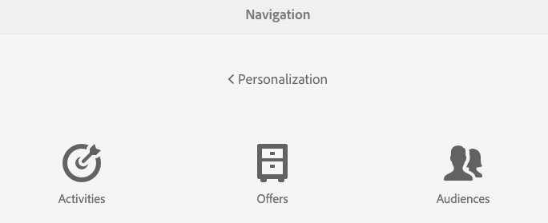

# 管理對象{#managing-audiences}

Audiences Console可讓您建立、組織和管理Adobe Target帳戶的對象，或管理ContextHub或用戶端內容的區段：

* 新增對象 — Adobe Target對象或ContextHub區段。
* 管理對象。

對象，稱為 *區段* 在ContextHub和用戶端內容中，是由特定條件定義的訪客類別，然後由條件決定可以看到鎖定活動的訪客。 當您鎖定活動時，您可以直接在鎖定目標程式中選取對象，或在對象主控台中建立新對象。

在受眾主控台中，受眾會依品牌組織。

對象可在「鎖定目標」模式中使用 [製作目標內容](/help/sites-authoring/content-targeting-touch.md)，您也可以在其中建立對象(但您需要在對象控制台中建立Adobe Target對象)。 您在鎖定目標模式中建立的對象會顯示在對象控制台中。

對象會以標籤顯示，說明定義的對象類型：

* CH - ContextHub區段
* CC — 用戶端內容區段
* AT -Adobe Target受眾

## 在Audiences Console中建立ContextHub區段 {#creating-a-contexthub-segment-in-the-audiences-console}

您可以在「對象」控制台或鎖定目標程式期間建立ContextHub區段。

若要在「對象」控制台中建立ContextHub區段：

1. 在導覽主控台中，按一下或點選 **個人化**. 按一下或點選 **對象**.
1. 點選或按一下 **建立ContextHub區段**.

   

1. 在 **新的ContextHub區段** 對話框，輸入標題並調整提示並按一下 **建立**. 您的新ContextHub區段會顯示在對象清單中。

   >[!NOTE]
   >
   >您可以點選或按一下「已修改」來排序已修改的清單， **以依遞減順序排序** ，以查看任何新建立的對象。

如需使用ContextHub建立區段的詳細資訊，請參閱 [使用ContextHub設定區段](/help/sites-administering/segmentation.md) 檔案。

## 使用Audience Console建立Adobe Target對象 {#creating-an-adobe-target-audience-using-the-audience-console}

您可以使用Audiences Console直接在AEM中建立Adobe Target對象。

對象由可決定要納入目標活動的規則定義。 對象定義可包含多個規則，每個規則可包含多個參數。

使用多個規則時，這些規則會以布林運算子AND結合，這表示任何潛在對象成員都必須符合要包含在活動中的所有已定義條件。 例如，如果您定義作業系統規則和瀏覽器規則，則活動中只會包含同時使用已定義作業系統和已定義瀏覽器的訪客。

>[!NOTE]
>
>如果您在「建 **立」功能表中未看到****** 「建立目標對象」，則您沒有建立對象的必要權限。您需要下的寫入權限 **/etc/segmentation** 來建立對象。 群組內容作者預設具有寫入權限。

若要建立Adobe Target對象：

1. 在導覽主控台中，按一下或點選 **個人化**. 按一下或點選 **對象**.

   

1. 在「對象」主控台中，點選或按一下 **建立** 然後 **建立目標對象**.

   

1. 在 **Adobe Target設定** 對話框，選擇目標配置，然後點選或按一下 **確定**.
1. 在「規則#1」區域中，點選或按一下屬性類型，然後在可用的欄位中輸入任何屬性資訊。 完成後，選取屬性右側的勾選記號以儲存。 請參閱 [屬性及其選項](#attributes-and-their-options) ，了解所有屬性的資訊。
1. 按一 **下「新增規則** 」以新增其他規則。視需要輸入任意數量的規則。規則會與布林運算子AND結合，這表示對象必須符合每個規則的所有要求才能符合活動的資格。
1. 點選或按一下 **下一個**.
1. 輸入對象的名稱，然後點選或按一下 **儲存**.
1. 點選或按一下 **儲存**. 您的對象會列在對象清單中。

### 屬性及其選項 {#attributes-and-their-options}

您可以為下列每個屬性建立定位規則：

| **屬性** | **說明** | **如需詳細資訊，請參閱** |
|---|---|---|
| **行動** | 根據參數(例如行動裝置、裝置類型、裝置廠商、畫面維度（依像素）等)來鎖定行動裝置。 | 請參閱 [行動檔案](https://experienceleague.adobe.com/docs/target/using/audiences/create-audiences/categories-audiences/mobile.html) 在Adobe Target。 |
| **自訂** | 自訂參數為mbox參數。 如果您將任何mbox參數傳遞至mbox，或使用targetPageParams函式，這些參數會顯示在此以供對象使用。 | 請參閱 [自訂參數檔案](https://experienceleague.adobe.com/docs/target/using/audiences/create-audiences/categories-audiences/custom-parameters.html) 在Adobe Target。 |
| **OS** | 您可以鎖定使用特定作業系統的訪客。 | 目標使用Linux、Macintosh或Windows的使用者。 |
| **網站頁面** | 定位位於特定頁面或具有特定mbox參數的訪客。 | 請參閱 [網頁檔案](https://experienceleague.adobe.com/docs/target/using/audiences/create-audiences/categories-audiences/site-pages.html) 在Adobe Target。 |
| **瀏覽器** | 您可以鎖定造訪您的頁面時使用特定瀏覽器或特定瀏覽器選項的使用者。 | 請參閱 [瀏覽器選項檔案](https://experienceleague.adobe.com/docs/target/using/audiences/create-audiences/categories-audiences/browser.html)在Adobe Target。 |
| **訪客設定檔** | 符合特定設定檔參數的Target訪客。 | 請參閱 [訪客資料檔案](https://experienceleague.adobe.com/docs/target/using/audiences/visitor-profiles/visitor-profile.html) 在Adobe Target。 |
| **流量來源** | 根據參照至您網站的搜尋引擎或著陸頁面來定位訪客。 | 請參閱 [流量來源檔案](https://experienceleague.adobe.com/docs/target/using/audiences/create-audiences/categories-audiences/traffic-sources.html) 在Adobe Target。 |

## 在受眾主控台中修改受眾 {#modifying-an-audience-in-the-audiences-console}

>[!NOTE]
>
>您只能編輯在您所編輯之相同AEM例項中建立的Adobe Target對象。 無法編輯在不同AEM環境中建立的Target對象。

您可以從「對象」主控台編輯任何ContextHub或用戶端內容對象。 您可以編輯Adobe Target對象，但只能編輯在AEM中建立的對象：

1. 在導覽主控台中，按一下或點選 **個人化**. 按一下或點選 **對象**.
1. 點選或按一下您要編輯的ContextHub或用戶端內容區段旁的圖示，然後點選或按一下 **編輯**.
1. 在區段編輯器中進行任何編輯。 請參閱 [用戶端內容](/help/sites-administering/campaign-segmentation.md) 或 [ContextHub](/help/sites-administering/contexthub-config.md) 檔案。
