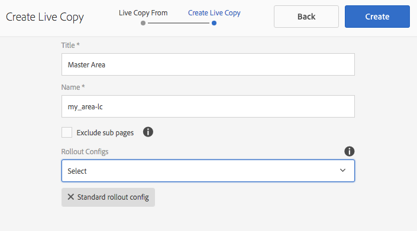

# 在多個網站中使用目標內容{#working-with-targeted-content-in-multisites}

如果您需要管理目標內容，例如網站間的活動、體驗和優惠，您可以運用AEM針對目標內容的內建多網站支援。

>[!NOTE]
>
>使用多網站支援來處理目標內容是一項進階功能。 若要使用此功能，您應熟悉 [Multi Site Manager](/help/sites-administering/msm.md) ，以及 [Adobe Target與AEM的整合](/help/sites-administering/target.md) 。

本檔案說明下列內容：

* 提供AEM針對目標內容的多網站支援的簡短概述。
* 說明如何連結網站（在單一品牌中）的一些可能使用情形。
* 提供行銷人員使用此功能的範例逐步說明。
* 有關如何針對目標內容實作多網站支援的詳細說明。

若要設定網站分享個人化內容的方式，您必須執行下列步驟：

1. [建立新區域](#creating-new-areas) , [或建立新區域做為即時副本](#creating-new-areas)。 區域包括頁面區域可用的所 *有活* 動；即，元件所在頁面上的位置。 建立新區域會建立空白區域，而建立新區域作為即時副本可讓您跨網站結構繼承內容。

1. [將您的網站或頁面連結](#linking-sites-to-an-area) 至某個區域。

您可以隨時暫停或恢復繼承。 此外，如果您不想暫停繼承，也可以建立本機體驗。 依預設，除非您另有指定，否則所有頁面都會使用「主版區域」。

## 針對目標內容提供多網站支援簡介 {#introduction-to-multisite-support-for-targeted-content}

您可立即使用針對目標內容的多網站支援，並可讓您將透過MSM管理的主版頁面中的目標內容推送至本機即時副本，或讓您管理此類內容的全域和本機修改。

您可在「區域」中管 **理此項**。 區域區隔了不同網站中使用的目標內容（活動、體驗和選件），並提供以MSM為基礎的機制，以建立和管理目標內容的繼承以及網站繼承。 這可避免您必須在繼承的網站中重新建立目標內容，就像6.2之前的AEM所要求的一樣。

在區域中，只有連結至該區域的活動會推送至即時副本。 預設情況下，主區域被選中。 建立其他區域後，您可以將這些區域連結至您的網站或頁面，以指出推送哪些目標內容。

網站或即時副本連結，連結至包含該網站或即時副本上必須提供之活動的區域。 依預設，網站或即時副本連結會連結至主版區域，但您也可以連結主版區域以外的其他區域。

>[!NOTE]
>
>對目標內容使用多網站支援時，您應注意下列事項：
>
>* 當您使用推出或即時復本時，需要MSM授權。
>* 當您使用同步至Adobe Target時，需要Adobe Target授權。
>

## 使用案例 {#use-cases}

您可以根據使用案例，以多種方式設定目標內容的多網站支援。 本節將說明在理論上如何搭配一個品牌運作。 此外，在范 [例中：根據地理位置定位內容](#example-targeting-content-based-on-geography)，您可以看到在多個網站中定位內容的實際應用程式。

目標內容會包住所謂的區域，以定義網站或頁面的範圍。 這些區域是在品牌層級定義的。 一個品牌可以包含多個區域。 品牌間的區域可以不同。 雖然一個品牌可能只包含主要區域，因此可以跨所有品牌共用，但另一個品牌可能包含多個品牌（例如，依地區區分）。 因此，品牌不需要鏡像它們之間的區域集。

透過針對目標內容的多網站支援，例如，您可以擁有兩個（或多個）網站，其中一 **個品牌** ，具備下列其中一個品牌：

* 一組完 *全不同* 的目標內容——在其中一個中編輯目標內容不會影響另一個。 連結至不同區域的網站會讀取和寫入至其自己設定的區域。 例如：

   * 網站A連結至區域X
   * 網站B連結至區域Y

* 一 *組共用* 、定位的內容——其中一組編輯對兩個網站都有直接影響；您可以讓兩個網站參照相同區域來設定此設定。 連結至相同區域的網站會共用此區域內的目標內容。 例如：

   * 網站A連結至區域X
   * 網站B連結至區域X

* 透過MSM從其他網站繼 *承* 的一組明確的目標內容——內容可從主版到即時副本單向推出。 例如：

   * 網站A連結至區域X
   * 網站B連結至區域Y（區域X的即時副本）

您也可以在 **一個網站** ，使用多個品牌，其複雜度可能比此範例更高。

>[!NOTE]
>
>如需此功能的詳細技術資訊，請參 [閱定位內容的多網站管理結構](/help/sites-authoring/technical-multisite-targeted.md)。

## 範例：根據地理位置定位內容 {#example-targeting-content-based-on-geography}

針對目標內容使用多網站可讓您分享、推展或隔離個人化內容。 為了更好地說明如何使用此功能，請考慮您想要根據地理位置控制如何推展定位內容的藍本，如下列藍本：

根據地理位置，相同網站有四個版本：

* 美 **國網站** 位於左上角，是主網站。 在此範例中，它會在「定位」模式中開啟。
* 此網站的另外三個版本 **為加拿大**、大 **不列顛**、 **澳大利亞**，都是即時副本。 這些網站在「預覽」模式中開啟。

每個網站都會分享地理區域的個人化內容：

* 加拿大與美國共用主區域。
* 大不列顛與歐洲地區相連，並繼承了主要地區。
* 由於澳大利亞位於南半球，季節性產品不適用，因此它擁有自己的個性化內容。

在北半球，我們創造了一個冬季活動，但在男性觀眾中，北美的行銷人員希望冬季有不同的形象，所以他／她在美國網站做了修改。

重新整理索引標籤後，加拿大網站會變更為新影像，而我們不會採取任何動作。 因為它和美國有共同的主區域。 在大不列顛和澳大利亞的網站中，影像不會改變。

行銷人員想要將這些變更推展至歐洲地區，並點選或按一 [下「轉出頁面](/help/sites-administering/msm-livecopy.md) 」來推 **出即時副本**。 重新整理索引標籤後，大不列顛網站會有新的影像，因為歐洲區域會繼承主區域（在推出後）。

澳洲網站的影像保持不變，這是所需的行為，因為澳洲是夏天，行銷人員不想變更該內容。 澳大利亞的網站不會改變，因為它不與任何其他地區共用某個區域，也不是其他地區的即時拷貝。 行銷人員不必擔心澳洲網站的目標內容會被覆寫。

此外，對於區域是主區域即時副本的大不列顛，您可以通過活動名稱旁邊的綠色指示符查看繼承狀態。 如果活動繼承，則除非暫停或分離即時副本，否則無法修改活動。

您可以隨時暫停繼承或完全分離繼承。 您也可以隨時新增只能用於該體驗的本機體驗，而不會暫停繼承。

>[!NOTE]
>
>如需此功能的詳細技術資訊，請參 [閱定位內容的多網站管理結構](/help/sites-authoring/technical-multisite-targeted.md)。

### 建立新區域與建立新區域為即時副本 {#creating-a-new-area-versus-creating-a-new-area-as-livecopy}

在AEM中，您可以選擇建立新區域或建立新區域做為即時副本。 建立新區域，將活動和屬於這些活動的任何項目（例如選件、體驗等）分組。 當您想要建立完全不同的目標內容集或想要共用一組目標內容時，可建立新區域。

但是，如果您在兩個站點之間通過MSM設定了繼承，則可能希望繼承活動。 在這種情況下，您會建立新區域作為即時副本，其中Y是X的即時副本，因此也會繼承所有活動。

>[!NOTE]
>
>當頁面是連結至連結至連結至頁面藍圖之區域的即時副本的即時副本時，預設轉出會觸發後續的目標內容推出。

例如，在下圖中，有四個站點共用主體區域（以及該區域中的所有活動），一個站點具有區域，該區域是區域的即時副本，因此在推出時會共用活動，而另一個站點完全獨立（因此需要區域作為活動）。

若要在AEM中達成此目標，您應執行下列動作：

* 網站A連結至主版區域——不需建立區域。 AEM預設會選取「主版區域」。 網站A和B共用活動等。
* 網站B連結至主版區域——不需建立區域。 AEM預設會選取「主版區域」。 網站A和B共用活動等。
* 「繼承區域」的網站C連結，此為「主版區域——建立區域為即時副本」的即時副本，您可在此根據主版區域建立即時副本。 轉出後，繼承區域繼承主區域中的活動。
* 網站D連結至其專屬的隔離區域——建立區域，您可在其中建立全新的區域，但尚未定義任何活動。 隔離區域不會與任何其他站點共用活動。

## 建立新區域 {#creating-new-areas}

區域可以跨越活動和優惠。 在其中一個區域（例如活動）中建立區域後，您也可以在另一個區域（例如選件）中使用。

>[!NOTE]
>
>當您點選或按一下品牌名稱，直到您建立其他區域為止，預設會收合名為「主版區域」 **的** 「預設區域」。然後，當您在「活動」或「選件」控制台中選 **取品牌** 時，您會看到「 **區域****** 」控制台。

要建立新區域：

1. 導覽至「 **個人化** >活動 **** 」或「選 **件** 」，然後導覽至您的品牌。
1. 點選或按一下「 **建立區域**」。

   

1. 按一下「 **區域** 」圖示，然後按一 **下「下一步**」。
1. 在「標 **題** 」欄位中，輸入新區域的名稱。 （可選）選擇標籤。
1. 點選或按一下「 **建立**」。

   AEM會重新導向至品牌視窗，其中會列出任何已建立的區域。 如果主版區域以外還有其他區域，則您可以直接在品牌主控台中建立區域。

   

## 將區域建立為即時副本 {#creating-areas-as-live-copies}

您可以將區域建立為即時副本，以便跨網站結構繼承目標內容。

要將區域建立為活動副本：

1. 導覽至「 **個人化** >活動 **** 」或「 **選件** 」，然後導覽至您的品牌。
1. 點選或按一 **下「建立區域為即時副本」**。

   

1. 選取您要製作即時副本的區域，然後按一下「下一 **步」**。

   

1. 在「名 **稱** 」欄位中，輸入即時副本的名稱。依預設，會包含子頁面；選中「排除子頁 **面」核取方塊** ，以排除它們。

   

1. 在「轉 **出設定** 」下拉式功能表中，選取適當的設定。

   如需 [每個選項的說明](/help/sites-administering/msm-sync.md#installed-rollout-configurations) ，請參閱安裝的轉出設定。

   如需 [即時副本的詳細資訊，請參閱建立和同步即時副本](/help/sites-administering/msm-livecopy.md) 。

   >[!NOTE]
   >
   >將頁面展示至即時副本，且為「藍圖」頁面設定的區域也是為「頁面即時副本」設定的區域的「藍圖」時，LiveAction **personalizationContentRovlot** 會觸發同步subRovolt，這是 **Standard轉出設定的一部分**。

1. 點選或按一下「 **建立**」。

   AEM會重新導向至品牌視窗，其中會列出任何已建立的區域。 如果除了「主版區域」以外還有其他區域，則您可以直接從品牌視窗建立區域。

   

## 將網站連結至區域 {#linking-sites-to-an-area}

您可以將區域連結至頁面或網站。 所有子頁面都會繼承區域，除非這些頁面由子頁面上的對應覆蓋。 不過，一般而言，您是在網站層級連結。

當您連結時，只有來自選取區域的活動、體驗和選件可供使用。 這可防止意外混淆獨立管理的內容。 如果未設定其他區域，則會使用每個品牌的主區域。

>[!NOTE]
>
>參照相同區域的頁面或網站使用相 *同* 、體驗和選件的共用活動集。 編輯由多個網站共用的活動、體驗或選件會影響所有網站。

若要將網站連結至區域：

1. 導覽至您要連結至某個區域的網站（或頁面）。
1. 選取網站或頁面，然後點選或按一下「檢 **視屬性」**。
1. 點選或按一下「個 **人化** 」標籤。
1. 在「品 **牌** 」選單中，選取您要連結區域的品牌。 在您選取品牌後，「區域參考」選單中會提供可 **用區域** 。

   

1. 從「區域參考」( **Area Reference** )下拉式選單中選取區域，然後點選或按一下「 **儲存」(Save)**。

   

## 分離即時副本或暫停目標內容的繼承 {#detaching-live-copy-or-suspending-inheritance-of-targeted-content}

您可能想要暫停或分離目標內容的繼承。 暫停或分離即時副本會依活動執行。 例如，您可能想要修改活動中的體驗，但如果該活動仍連結至繼承的複製，則無法修改體驗或任何活動的屬性。

暫停即時副本會暫時中斷繼承，但您日後可以還原繼承。 分離即時副本會永久中斷繼承。

您可以在活動中還原目標內容的繼承，以暫停或分離其繼承。 如果頁面或網站連結至即時副本區域，您可以檢視活動的繼承狀態。

從另一個網站繼承的活動在活動名稱旁標示為綠色。 暫停的繼承標籤為紅色，而本地建立的活動沒有表徵圖。

>[!NOTE]
>
>* 您只能暫停或分離活動中的即時副本。
>* 您不需要暫停或分離即時副本來擴充繼承的活動。 您隨時都可以為 **該活動** ，建立新的本機體驗和選件。 如果要修改現有活動，則需要暫停繼承。
>

### 暫停繼承 {#suspending-inheritance}

要暫停或分離活動中目標內容的繼承，請執行以下操作：

1. 導覽至您要分離或暫停繼承的頁面，然後點選或按一下模式下拉式選單中的 **Targeting** 。
1. 如果您的頁面已連結至即時副本的區域，您會看到繼承狀態。 點選或按一下「 **開始定位**」。
1. 若要暫停活動，請執行下列其中一項作業：

   1. 選取活動的元素，例如對象。 AEM會自動顯示「暫停即時副本」確認方塊。 （您可以在整個「定位」程式中點選或按一下任何元素，暫停即時副本。）
   1. Select **Suspend Live Copy** from the drop-down menu in the toolbar.
   

1. 點選或按一 **下「暫停** 」以暫停活動。 暫停的活動會以紅色標示。

   

### 中斷繼承 {#breaking-inheritance}

要中斷活動中目標內容的繼承：

1. 導覽至您要從主版中分離即時副本的頁面，然後點選或按一下模式下拉式選單中的 **Targeting** 。
1. 如果您的頁面已連結至即時副本的區域，您會看到繼承狀態。 點選或按一下「 **開始定位**」。
1. 從工 **具列的下拉式選單中選取「分離即時副本** 」。AEM會確認您要分離即時副本。
1. 點選或按一 **下「分離** 」，將即時副本從活動中分離。 分離後，不再顯示關於繼承的下拉式功能表。 活動現在是本機活動。

   

## 恢復目標內容的繼承 {#restoring-inheritance-of-targeted-content}

如果您已暫停活動中目標內容的繼承，則可隨時加以復原。 但是，如果已分離了即時副本，則無法恢復繼承。

要恢復活動中目標內容的繼承：

1. 導覽至您要復原繼承並點選的頁面，或在模式下拉式選單中按一 **下** 「定位」。
1. 點選或按一下「 **開始定位**」。
1. 從工 **具列的下拉式選單選取「繼續即時副本** 」。

   

1. 點選或按一 **下「繼續** 」，確認您要繼續即時副本繼承。 如果繼續繼承，則對當前活動所做的任何修改都將丟失。

## 刪除區域 {#deleting-areas}

刪除區域時，會刪除該區域中的所有活動。 AEM會先警告您，然後您才能刪除區域。 如果您確實刪除了網站所連結的區域，此品牌的對應會自動重新對應至主版區域。

要刪除區域：

1. Navigate to **Personalization** > **Activities** or **Offers** and then your brand.
1. 點選或按一下您要刪除之區域旁的圖示。
1. 點選或按一 **下「刪除** 」，並確認您要刪除該區域。

