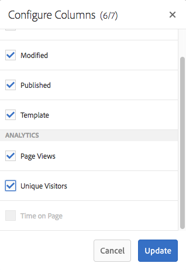

# 查看頁面分析資料{#seeing-page-analytics-data}

使用頁面分析資料來評估頁面內容的有效性。

## 從控制台{#analytics-visible-from-the-console}可見的分析

頁面分析資料會顯示在Sites主控台的[清單檢視](/help/sites-authoring/basic-handling.md#list-view)中。 當頁面以清單格式顯示時，預設會提供下列欄：

* 頁面檢視
* 不重複訪客
* 頁面逗留時間

每欄會顯示目前報告期間的值，也指出值自上一個報告期間以來是否增加或減少。 您看到的資料會每12小時更新一次。

>[!NOTE]
>
>要更改更新期間，請[配置導入間隔](/help/sites-administering/adobeanalytics-connect.md#configuring-the-import-interval)。

1. 開啟&#x200B;**Sites**&#x200B;主控台；例如[http://localhost:4502/sites.html/content](http://localhost:4502/sites.html/content)
1. 在工具列的最右側（右上角），按一下或點選圖示以選取&#x200B;**清單檢視**（顯示的圖示取決於[目前檢視](/help/sites-authoring/basic-handling.md#viewing-and-selecting-resources)）。

1. 同樣地，在工具列的最右側（右上角），按一下或點選圖示，然後選取「**檢視設定**」。 將會開啟&#x200B;**配置列**&#x200B;對話框。 進行任何需要的更改，並使用&#x200B;**Update**&#x200B;確認。

   

### 選擇報告期{#selecting-the-reporting-period}

選取Analytics資料會出現在Sites Console的報表時段：

* 最近 30 天的資料
* 最近 90 天的資料
* 今年的資料

目前的報告時段會顯示在Sites Console的工具列上（頂端工具列的右側）。 使用下拉式清單來選取所需的報告期間。\

### 配置可用資料列{#configuring-available-data-columns}

分析管理員使用者群組的成員可以設定Sites Console，讓作者看到額外的Analytics欄。

>[!NOTE]
>
>當頁面樹狀結構包含與不同Adobe Analytics雲端設定相關聯的子項時，您無法為頁面設定可用的資料欄。

1. 在「清單檢視」中，使用檢視選取器（工具列右側），選取「檢視設定」**，然後選取「A** dd自訂Analytics資料」**。**

   

1. 在Sites控制台中，選取您要公開給作者的量度，然後按一下&#x200B;**Add**。

   顯示的欄會從Adobe Analytics中擷取。

   

### 從網站開啟內容分析{#opening-content-insights-from-sites}

從Sites主控台開啟[內容分析](/help/sites-authoring/content-insights.md)以進一步調查頁面有效性。

1. 在Sites Console中，選取您要查看「內容分析」的頁面。
1. 在工具列上，按一下Analytics和Recommendations圖示。

   

## 從頁面編輯器(Activity Map){#analytics-visible-from-the-page-editor-activity-map}中可見的分析

>[!CAUTION]
>
>由於 Adobe Analytics API 中的安全性變更，AEM 中包含的 Activity Map 版本已無法再使用。
>
>現在應該使用Adobe Analytics](https://docs.adobe.com/content/help/zh-Hant/analytics/analyze/activity-map/getting-started/get-started-users/activitymap-install.html)提供的[ActivityMap外掛程式。
